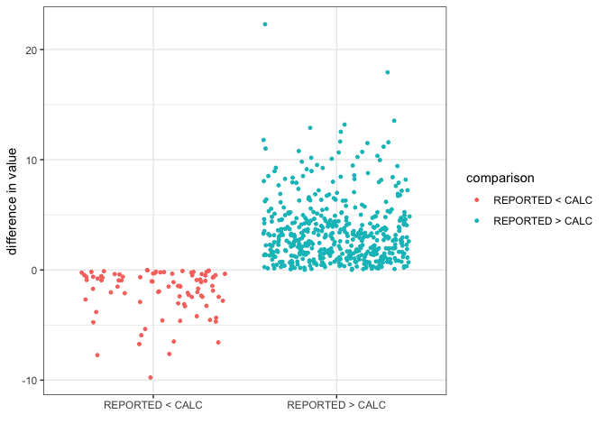

Analysis of Fishing Landings dataset - alternate dataset
================
Author: Emma Strand; <emma_strand@uri.edu>

## Prior Scripts

QC:
<https://github.com/emmastrand/Kenya_SamakiSalama/blob/main/FishLandings/scripts/QC.md>

## <a name="data"></a> **Reading in datafiles**

``` r
library(plyr)
library(dplyr)
library(tidyverse)
library(ggplot2)
library(readxl)
library(lubridate)
library(Hmisc)
library(writexl)
library(naniar)
library(Rmisc)
library(stats)
library(lme4)
library(car)
library(forcats)
library(ggstatsplot)
library(ggridges)
library(ggbreak)
library(emmeans)
```

## Read in the data frame that is the output of the QC script.

Summary information so far: 741 total surveys, 591 unmodified traps, 150
modified traps.

``` r
# read in excel file
## 2,156 rows x 30 variables (this should match the final version of QC script)
data <- read.csv("alternate fishing/alternate_fishing.csv") %>% #read in excel file 
  dplyr::select(-X)

# creating new columns with month year and date
## survey ID is master identifier that is based on `date_collected_dd_mm_yyyy` column 
data <- data %>% 
  separate(date_collected_dd_mm_yyyy, c("year", "month", "day"), remove = FALSE) 

#changing this column to numeric instead of a character (needed for next fxn)
data$month <- as.numeric(data$month) 
#changing numeric months to month names
data$month <- month.abb[data$month] 

# changing levels of month (important for figures later on); only first three letter of month 
data$month <- factor(data$month, levels=c("Jan", "Feb","Mar","Apr","May",
                                          "Jul", "Aug", "Sep", "Oct", "Nov", "Dec"))

data <- data %>%
  mutate(household_group = case_when(
    BMU == "KANAMAI" ~ "Control",
    BMU == "KURUWITU" ~ "Social marketing",
    BMU == "TAKAUNGU" ~ "Social marketing"))
```

**Control households**  
- KANAMAI (141 surveys): November 2021 and January - May 2022 - Gear
used: Spearguns - Units of data: Per single fisherman / household

**Social marketing households**  
- KURUWITU (382 surveys): July - December 2021 and January - May 2022  
- TAKAUNGU (105 surveys): January - May 2022  
- Gear used: Both used spearguns and TAKAUNGU used monofilament - Units
of data: Per single fisherman / household

### Read in the Group 3

``` r
##737 rows 
group3 <- read.csv("output/pertrap_final_df.csv", header=TRUE) %>% dplyr::select(-X) %>% 
  mutate(total_catch_per_fisherman = (CPUE*total_traps_collected)/`No..of.fishers.in.crew`,
        Total_Biomass_kg_per_fisherman = (calculated_biomass_pertrap*total_traps_collected)/`No..of.fishers.in.crew`,
        Total_value_KES_per_fisherman = (KSHpertrap*total_traps_collected)/`No..of.fishers.in.crew`,
        Calcium_mg_per_fisherman = (pertrap_Calcium*total_traps_collected)/`No..of.fishers.in.crew`,
        Iron_mg_per_fisherman = (pertrap_Iron*total_traps_collected)/`No..of.fishers.in.crew`,
        Omega3_g_per_fisherman = (pertrap_Omega3*total_traps_collected)/`No..of.fishers.in.crew`,
        Protein_g_per_fisherman = (pertrap_Protein*total_traps_collected)/`No..of.fishers.in.crew`,
        VitaminA_ug_per_fisherman = (pertrap_VitaminA*total_traps_collected)/`No..of.fishers.in.crew`,
        Selenium_ug_per_fisherman = (pertrap_Selenium*total_traps_collected)/`No..of.fishers.in.crew`,
        Zinc_mg_per_fisherman = (pertrap_Zinc*total_traps_collected)/`No..of.fishers.in.crew`)

##741 rows
length_data <- read.csv("output/length_persurvey.csv") %>% dplyr::select(survey_id, trap_type, median_length)

##737 rows -- should match the initial group3 dataframe 
group3 <- left_join(group3, length_data, by = c("survey_id", "trap_type"))

### will merge these data with group 1 and 2 at the end of this script 
```

## Check ranges and add filters

63 unique species total:  
- 40 of those found in KANAMAI  
- 56 of those found in KURUWITU  
- 32 of those found in TAKAUNGU

``` r
hist(data$total_biomass_kg) ## 0.25 26.00
```

<!-- -->

``` r
hist(data$take_home_weight_kg, na.rm = TRUE) ## 0-4
```

    ## Warning in plot.window(xlim, ylim, "", ...): "na.rm" is not a graphical
    ## parameter

    ## Warning in title(main = main, sub = sub, xlab = xlab, ylab = ylab, ...):
    ## "na.rm" is not a graphical parameter

    ## Warning in axis(1, ...): "na.rm" is not a graphical parameter

    ## Warning in axis(2, at = yt, ...): "na.rm" is not a graphical parameter

<!-- -->

``` r
hist(data$total_value_KES) ## 40 - 4800 
```

<!-- -->

``` r
hist(data$take_home_value_KES, na.rm = TRUE) ## 0-600 
```

    ## Warning in plot.window(xlim, ylim, "", ...): "na.rm" is not a graphical
    ## parameter

    ## Warning in title(main = main, sub = sub, xlab = xlab, ylab = ylab, ...):
    ## "na.rm" is not a graphical parameter

    ## Warning in axis(1, ...): "na.rm" is not a graphical parameter

    ## Warning in axis(2, at = yt, ...): "na.rm" is not a graphical parameter

<!-- -->

``` r
range(data$`No..of.fishers.in.crew`) ## 1-3 people 
```

    ## [1] 1 3

``` r
hist(data$number_of_fish) ## 1 - 19 fish 
```

<!-- -->

``` r
#unique(data$scientific_name) ## 63 fish 
#data %>% subset(BMU == "TAKAUNGU") %>% dplyr::select(scientific_name) %>% distinct()
```

## Calculating median length

``` r
data <- data %>% 
  mutate(median_length = case_when(
    length_corrected == "0-10" ~ 5,
    length_corrected == "11-15" ~ 13,
    length_corrected == "16-20" ~ 18,
    length_corrected == "21-25" ~ 23,
    length_corrected == "26-30" ~ 28,
    length_corrected == "31-35" ~ 33,
    length_corrected == "36-40" ~ 38,
    length_corrected == "41-45" ~ 43,
    length_corrected == "46-50" ~ 48,
    length_corrected == "51-60" ~ 55.5,
    length_corrected == "61-70" ~ 65.5,
    length_corrected == "71-80" ~ 75.5,
    length_corrected == "81-90" ~ 85.5,
    length_corrected == ">90" ~ 100 ### circle back to what value to use here
  )) 

hist(data$median_length) ## majority fall within 10-40 cm 
```

<!-- -->

## Loading Galligan and FishBase dataset

Most species in the list above have metadata below.

``` r
fishbase_lifehistory <- read_excel("data/fishbase.xlsx", sheet = "life history") %>% #read in excel file 
  select(scientific_name, Lm, Lmax) %>% dplyr::rename(Lmat_fishbase = Lm) %>% dplyr::rename(Lmax_fishbase = Lmax) 

# rows that appear in species_list but not fishbase_lifehistory
## checking which fish I still need Fishbase information for (44 species)
# dplyr::setdiff(species_list, fishbase_lifehistory) %>% write.csv("data/add_fishbase_info.csv")

fishbase_biomass <- read_excel("data/fishbase.xlsx", sheet = "biomass") %>%
  dplyr::select(scientific_name, a, b)

fishbase <- full_join(fishbase_lifehistory, fishbase_biomass, by = "scientific_name")

galligan <- read.csv("data/SpeciesData_GatedTraps_Galligan_edited.csv", header=TRUE, sep = ",") %>%
  dplyr::rename(scientific_name = Species) #%>% dplyr::select(., scientific_name)
# dplyr::setdiff(species_list, galligan) 
### 11 fish found in our dataset that are not found in Galligan dataset 
## these won't be included in the nutrient or revenue analysis
## I think this is OK b/c all species have 113 or lower than 40 total catch

metadata <- full_join(fishbase, galligan, by = "scientific_name")

### PRE MERGE DATA = 2,156 X 34
### POST MERGE DATA = 2,156 X 82 
data2 <- left_join(data, metadata, by = "scientific_name")
```

## Calculating total biomass

W=aL^b

W = Biomass  
L = Length (in our case, median length)  
a = (taken from fishbase) b = (taken from fishbase)

Read in data from fishbase. These units are in cm and grams.

<https://www.fishbase.de/manual/English/FishbaseThe_LENGTH_WEIGHT_table.htm>

``` r
### Switching to data3 which will filter out those fish with no nutrient or a and b values 
data2 <- data2 %>%  
  ## mutating a and b column to be numeric; this will create NAs b/c not all fish had a and b valueus in fishbase
  mutate_at(c('a', 'b'), as.numeric) %>%
  mutate(W_g = (a*(median_length^b))*number_of_fish,
         W_kg = W_g/1000) %>%
  group_by(survey_id) %>%
  filter(!is.na(W_kg)) %>%
  mutate(calculated_total_biomass = sum(W_kg)) %>% 
  ungroup()
```

    ## Warning: There were 2 warnings in `mutate()`.
    ## The first warning was:
    ## ℹ In argument: `a = .Primitive("as.double")(a)`.
    ## Caused by warning:
    ## ! NAs introduced by coercion
    ## ℹ Run `dplyr::last_dplyr_warnings()` to see the 1 remaining warning.

``` r
range(data2$calculated_total_biomass) ## 0.001832111 kg - 18.201910245 kg
```

    ## [1]  0.001832111 18.201910245

### Comparing reported vs. calculated

``` r
data2 %>% 
  select(survey_id, total_biomass_kg, calculated_total_biomass) %>%
  distinct() %>% na.omit() %>%
  mutate(comparison = if_else(total_biomass_kg > calculated_total_biomass, "REPORTED > CALC", "REPORTED < CALC"),
         difference = total_biomass_kg-calculated_total_biomass) %>%
  ggplot(., aes(x=comparison, y=difference)) + theme_bw() +
  geom_jitter(aes(color=comparison), size=1) + xlab("") + ylab("difference in value")
```

<!-- -->

## Calculating take home kg/%

``` r
takehome <- data2 %>% dplyr::group_by(survey_id, destination) %>%   
  mutate(kg_perdestination = sum(W_kg)) %>% ungroup() %>% 
  dplyr::select(survey_id, BMU, household_group, destination, kg_perdestination) %>%
  distinct() %>% spread(destination, kg_perdestination) %>%
  mutate_all(., ~replace_na(.,0)) %>% dplyr::select(survey_id, BMU, household_group, HOME) %>%
  dplyr::rename(TakeHome_kg = HOME)
```

## Calculating trophic level

``` r
data2_trophic_level <- data2 %>% group_by(survey_id) %>%
  tidyr::uncount(., number_of_fish, .remove = TRUE) %>%
  mutate(mean.trophic = mean(TrophLevel, na.rm = TRUE)) %>% dplyr::select(survey_id, mean.trophic) %>% distinct()

data2 <- data2 %>% left_join(., data2_trophic_level, by = "survey_id")
```

## Calculating herbivore/carnivore presence

``` r
diet <- data2 %>% group_by(survey_id, Diet) %>%
  mutate(countper_diet = n()) %>% ungroup() %>%
  select(survey_id, BMU, household_group, Diet, countper_diet) %>% distinct() %>%
  group_by(survey_id) %>% spread(Diet, countper_diet) %>% dplyr::select(-`<NA>`) %>%
  mutate_all(., ~replace_na(.,0)) %>%
  mutate(total = sum(c(Carnivorous, `Herbivorous detritivorous`, `Macroalgal herbivorous`,
                        `Mobile Inverts`, `Omnivorous`, `Planktivorous`))) %>%
  mutate(Carnivorous = Carnivorous/total*100,
         `Herbivorous detritivorous` = `Herbivorous detritivorous`/total*100,
         `Macroalgal herbivorous` = `Macroalgal herbivorous`/total*100,
         `Mobile Inverts` = `Mobile Inverts`/total*100,
         `Omnivorous` = `Omnivorous`/total*100,
         `Planktivorous` = `Planktivorous`/total*100,
         Carnivorous_total = Carnivorous+`Mobile Inverts`) %>% 
  dplyr::select(-total, -Carnivorous, -`Mobile Inverts`) %>%
  dplyr::rename(Diet_percent_Herbivorous_Detritivorous = `Herbivorous detritivorous`) %>%
  dplyr::rename(Diet_percent_Herbivorous_Macroalgal = `Macroalgal herbivorous`) %>%
  dplyr::rename(Diet_percent_Omnivorous = Omnivorous) %>%
  dplyr::rename(Diet_percent_Planktivorous = Planktivorous) %>%
  dplyr::rename(Diet_percent_Carnivorous = Carnivorous_total)
```

    ## `mutate_all()` ignored the following grouping variables:
    ## • Column `survey_id`
    ## ℹ Use `mutate_at(df, vars(-group_cols()), myoperation)` to silence the message.

``` r
head(diet)
```

    ## # A tibble: 6 × 8
    ## # Groups:   survey_id [6]
    ##   survey_id  BMU   household_group Diet_percent_Herbivo…¹ Diet_percent_Herbivo…²
    ##   <chr>      <chr> <chr>                            <dbl>                  <dbl>
    ## 1 2021-07-2… KURU… Social marketi…                   66.7                      0
    ## 2 2021-07-2… KURU… Social marketi…                   42.9                      0
    ## 3 2021-07-2… KURU… Social marketi…                    0                        0
    ## 4 2021-07-2… KURU… Social marketi…                   66.7                      0
    ## 5 2021-07-2… KURU… Social marketi…                   20                        0
    ## 6 2021-07-2… KURU… Social marketi…                   50                        0
    ## # ℹ abbreviated names: ¹​Diet_percent_Herbivorous_Detritivorous,
    ## #   ²​Diet_percent_Herbivorous_Macroalgal
    ## # ℹ 3 more variables: Diet_percent_Omnivorous <dbl>,
    ## #   Diet_percent_Planktivorous <dbl>, Diet_percent_Carnivorous <dbl>

## Calculating average length (cm)

``` r
data2_length <- data2 %>% group_by(survey_id) %>%
  tidyr::uncount(., number_of_fish, .remove = TRUE) %>%
  mutate(mean_length = mean(median_length), na.rm=TRUE) %>% dplyr::select(survey_id, mean_length) %>% distinct()

data2 <- data2 %>% left_join(., data2_length, by = "survey_id")
```

## Calculating average value (KES)

``` r
data2 <- data2 %>% 
  mutate(KSHperspp = Price_KSHPerkg*W_kg) %>%
  group_by(survey_id) %>%
  filter(!is.na(W_kg)) %>%
  mutate(calculated_total_value = sum(KSHperspp, na.rm=TRUE)) %>% 
  ungroup()
```

## Calculating average catch

``` r
data2 <- data2 %>%
  group_by(survey_id) %>%
  mutate(total_catch_per_fisherman = sum(number_of_fish))
```

## Calculating species richness

``` r
data2 <- data2 %>%
  ## still grouped by survey id from above
  mutate(richness = n_distinct(scientific_name))
```

## Calculating nutrient information

``` r
data2 <- data2 %>%
  mutate(spp_Calcium = (W_g/100)*Calcium_mgPer100g,
         spp_Iron = (W_g/100)*Iron_mgPer100g,
         spp_Omega3 = (W_g/100)*Omega3_gPer100g,
         spp_Protein = (W_g/100)*Protein_gPer100g,
         spp_VitaminA = (W_g/100)*VitaminA_ugPer100g,
         spp_Selenium = (W_g/100)*Selenium_ugPer100g,
         spp_Zinc = (W_g/100)*Zinc_mgPer100g) %>%
  ### still grouped by survey id from above 
  mutate(Calcium_mg_per_fisherman = sum(spp_Calcium, na.rm = TRUE),
         Iron_mg_per_fisherman = sum(spp_Iron, na.rm = TRUE),
         Omega3_g_per_fisherman = sum(spp_Omega3, na.rm = TRUE),
         Protein_g_per_fisherman = sum(spp_Protein, na.rm = TRUE),
         VitaminA_ug_per_fisherman = sum(spp_VitaminA, na.rm = TRUE),
         Selenium_ug_per_fisherman = sum(spp_Selenium, na.rm = TRUE),
         Zinc_mg_per_fisherman = sum(spp_Zinc, na.rm = TRUE)) %>% ungroup()
```

## Summary and include Group 3

``` r
group_1_2 <- data2 %>% 
  dplyr::select(survey_id, year, month, day, BMU, household_group, calculated_total_biomass, mean.trophic,
                richness, total_catch_per_fisherman, calculated_total_value, mean_length, Calcium_mg_per_fisherman,
                Iron_mg_per_fisherman, Omega3_g_per_fisherman, Protein_g_per_fisherman, 
                VitaminA_ug_per_fisherman, Selenium_ug_per_fisherman,
                Zinc_mg_per_fisherman) %>%
  distinct() %>% 
  dplyr::rename(Total_Biomass_kg_per_fisherman = calculated_total_biomass) %>%
  dplyr::rename(Avg_Trophic_Level = mean.trophic) %>%
  dplyr::rename(Total_value_KES_per_fisherman = calculated_total_value) %>%
  dplyr::rename(Mean_length_cm = mean_length) %>%
  left_join(., takehome, c("survey_id", "BMU", "household_group")) %>%
  left_join(., diet, by = c("survey_id", "BMU", "household_group")) %>% ungroup() %>%
  ### subset to months of interest 
  subset(month == "Apr" | month == "May")

head(group_1_2)
```

    ## # A tibble: 6 × 25
    ##   survey_id       year  month day   BMU   household_group Total_Biomass_kg_per…¹
    ##   <chr>           <chr> <fct> <chr> <chr> <chr>                            <dbl>
    ## 1 2022-04-29 23:… 2022  Apr   29    KANA… Control                         1.25  
    ## 2 2022-04-03 12:… 2022  Apr   03    TAKA… Social marketi…                 0.0721
    ## 3 2022-04-03 11:… 2022  Apr   03    TAKA… Social marketi…                 0.939 
    ## 4 2022-05-03 12:… 2022  May   03    TAKA… Social marketi…                 1.23  
    ## 5 2022-05-03 09:… 2022  May   03    TAKA… Social marketi…                 1.57  
    ## 6 2022-04-03 12:… 2022  Apr   03    KANA… Control                         2.24  
    ## # ℹ abbreviated name: ¹​Total_Biomass_kg_per_fisherman
    ## # ℹ 18 more variables: Avg_Trophic_Level <dbl>, richness <int>,
    ## #   total_catch_per_fisherman <int>, Total_value_KES_per_fisherman <dbl>,
    ## #   Mean_length_cm <dbl>, Calcium_mg_per_fisherman <dbl>,
    ## #   Iron_mg_per_fisherman <dbl>, Omega3_g_per_fisherman <dbl>,
    ## #   Protein_g_per_fisherman <dbl>, VitaminA_ug_per_fisherman <dbl>,
    ## #   Selenium_ug_per_fisherman <dbl>, Zinc_mg_per_fisherman <dbl>, …

``` r
### 161 surveys total for April and May combined 2022 
## Control = 41 surveys 
## Social marketing = 120 surveys 
```

### Subsetting group 3’s data

``` r
diet_group3 <- read.csv("output/group3_diet.csv", header=TRUE) %>% dplyr::select(-X)
takehome_group3 <- read.csv("output/takehome_kg.csv", header=TRUE) %>% dplyr::select(-X) %>%
  dplyr::rename(TakeHome_kg = HOME)

## PRE FILTER = 737 surveys 
## POST FILTER 228 surveys
group3 <- group3 %>% 
  subset(month == "Apr" | month == "May") %>%
  subset(year == "2022") %>%
  dplyr::select(survey_id, BMU, trap_type, total_traps_collected, year, month, day, `No..of.fishers.in.crew`,
                richness, total_catch_per_fisherman, Total_Biomass_kg_per_fisherman, Total_value_KES_per_fisherman,
                Calcium_mg_per_fisherman, Iron_mg_per_fisherman, Omega3_g_per_fisherman, Protein_g_per_fisherman,
                VitaminA_ug_per_fisherman, Selenium_ug_per_fisherman, Zinc_mg_per_fisherman, mean.trophic, median_length) %>%
  mutate(household_group = case_when(
    trap_type == "Control" ~ "Social Marketing + Traps: Control",
    trap_type == "Experimental" ~ "Social Marketing + Traps: Experimental"
  )) %>% 
  dplyr::rename(No_fishermen = `No..of.fishers.in.crew`) %>%
  dplyr::rename(Mean_length_cm = median_length) %>%
  dplyr::rename(Avg_Trophic_Level = mean.trophic) 

group3 <- group3 %>% 
  left_join(., diet_group3, by = c("survey_id", "trap_type", "BMU")) %>%
  left_join(., takehome_group3, by = c("survey_id", "trap_type"))


group3 %>% subset(trap_type == "Experimental")
```

    ##                               survey_id     BMU    trap_type
    ## 2  2022-04-04 12:37:00 SS/MAY/SB/027/FF MAYUNGU Experimental
    ## 3  2022-04-04 12:51:00 SS/MAY/SB/035/FF MAYUNGU Experimental
    ## 8  2022-04-07 12:52:00 SS/MAY/SB/015/FF MAYUNGU Experimental
    ## 9  2022-04-07 12:58:00 SS/MAY/SB/070/FF MAYUNGU Experimental
    ## 10 2022-04-07 12:57:00 SS/MAY/SB/082/FF MAYUNGU Experimental
    ## 11 2022-04-07 12:53:00 SS/MAY/SB/058/FF MAYUNGU Experimental
    ## 12 2022-04-11 12:54:00 SS/MAY/SB/082/FF MAYUNGU Experimental
    ## 13 2022-04-11 12:52:00 SS/MAY/SB/070/FF MAYUNGU Experimental
    ## 14 2022-04-11 12:57:00 SS/MAY/SB/025/FF MAYUNGU Experimental
    ## 16 2022-04-14 12:59:00 SS/MAY/SB/028/FF MAYUNGU Experimental
    ## 17 2022-04-09 13:04:00 SS/MAY/SB/028/FF MAYUNGU Experimental
    ## 18 2022-04-21 12:52:00 SS/MAY/SB/035/FF MAYUNGU Experimental
    ## 19 2022-04-18 12:43:00 SS/MAY/SB/065/FF MAYUNGU Experimental
    ## 20 2022-04-21 12:43:00 SS/MAY/SB/042/FF MAYUNGU Experimental
    ## 21 2022-04-21 12:50:00 SS/MAY/SB/033/FF MAYUNGU Experimental
    ## 22 2022-04-21 13:22:00 SS/MAY/SB/028/FF MAYUNGU Experimental
    ## 24 2022-04-04 15:30:00 SS/UYO/SB/100/FF  UYOMBO Experimental
    ## 26 2022-04-06 16:30:00 SS/UYO/SB/092/FF  UYOMBO Experimental
    ## 27 2022-04-14 09:00:00 SS/UYO/SB/089/FF  UYOMBO Experimental
    ## 28 2022-04-18 11:00:00 SS/UYO/SB/085/FF  UYOMBO Experimental
    ## 29 2022-04-18 11:00:00 SS/UYO/SB/091/FF  UYOMBO Experimental
    ## 31 2022-04-18 11:00:00 SS/UYO/SB/100/FF  UYOMBO Experimental
    ## 33 2022-04-19 11:30:00 SS/UYO/SB/100/FF  UYOMBO Experimental
    ## 35 2022-04-19 11:30:00 SS/UYO/SB/092/FF  UYOMBO Experimental
    ## 42 2022-04-25 07:00:00 SS/UYO/SB/088/FF  UYOMBO Experimental
    ## 43 2022-04-25 07:00:00 SS/UYO/SB/100/FF  UYOMBO Experimental
    ## 44 2022-04-26 07:30:00 SS/UYO/SB/100/FF  UYOMBO Experimental
    ## 51 2022-04-26 07:30:00 SS/UYO/SB/092/FF  UYOMBO Experimental
    ## 52 2022-04-26 07:30:00 SS/UYO/SB/088/FF  UYOMBO Experimental
    ## 53 2022-04-26 07:30:00 SS/UYO/SB/071/FF  UYOMBO Experimental
    ## 54 2022-04-27 08:00:00 SS/UYO/SB/088/FF  UYOMBO Experimental
    ## 56 2022-04-01 12:58:00 SS/MAY/SB/030/FF MAYUNGU Experimental
    ## 57 2022-04-01 12:57:00 SS/MAY/SB/015/FF MAYUNGU Experimental
    ## 58 2022-04-01 12:59:00 SS/MAY/SB/028/FF MAYUNGU Experimental
    ## 59 2022-04-04 12:57:00 SS/MAY/SB/017/FF MAYUNGU Experimental
    ## 60 2022-04-27 08:00:00 SS/UYO/SB/092/FF  UYOMBO Experimental
    ## 63 2022-04-07 12:55:00 SS/MAY/SB/065/FF MAYUNGU Experimental
    ## 64 2022-04-25 07:00:00 SS/UYO/SB/091/FF  UYOMBO Experimental
    ## 70 2022-04-20 00:05:00 SS/UYO/SB/085/FF  UYOMBO Experimental
    ##    total_traps_collected year month day No_fishermen richness
    ## 2                      8 2022   Apr   4            2        1
    ## 3                      4 2022   Apr   4            1        2
    ## 8                     12 2022   Apr   7            3        2
    ## 9                     16 2022   Apr   7            4        3
    ## 10                    12 2022   Apr   7            3        1
    ## 11                    12 2022   Apr   7            3        2
    ## 12                    12 2022   Apr  11            3        1
    ## 13                    16 2022   Apr  11            4        2
    ## 14                    12 2022   Apr  11            3        2
    ## 16                    16 2022   Apr  14            4        3
    ## 17                    16 2022   Apr   9            4        3
    ## 18                     4 2022   Apr  21            1        3
    ## 19                    16 2022   Apr  18            2        3
    ## 20                     4 2022   Apr  21            1        2
    ## 21                     4 2022   Apr  21            1        1
    ## 22                    16 2022   Apr  21            4        2
    ## 24                     4 2022   Apr   4            2        1
    ## 26                     3 2022   Apr   6            1        2
    ## 27                     8 2022   Apr  14            2        2
    ## 28                     8 2022   Apr  18            2        1
    ## 29                     4 2022   Apr  18            2        3
    ## 31                     4 2022   Apr  18            2        1
    ## 33                     4 2022   Apr  19            2        1
    ## 35                     3 2022   Apr  19            1        1
    ## 42                     4 2022   Apr  25            2        4
    ## 43                     4 2022   Apr  25            2        1
    ## 44                     4 2022   Apr  26            2        2
    ## 51                     3 2022   Apr  26            1        1
    ## 52                     4 2022   Apr  26            2        4
    ## 53                     6 2022   Apr  26            2        1
    ## 54                     4 2022   Apr  27            2        5
    ## 56                    12 2022   Apr   1            3        1
    ## 57                    12 2022   Apr   1            3        1
    ## 58                    16 2022   Apr   1            4        1
    ## 59                    12 2022   Apr   4            6        2
    ## 60                     3 2022   Apr  27            1        1
    ## 63                     8 2022   Apr   7            2        1
    ## 64                     4 2022   Apr  25            2        1
    ## 70                     8 2022   Apr  20            1        4
    ##    total_catch_per_fisherman Total_Biomass_kg_per_fisherman
    ## 2                  15.000000                      5.5431810
    ## 3                  18.000000                     12.0135181
    ## 8                   4.666667                      1.6706559
    ## 9                   8.500000                      5.2674908
    ## 10                  7.666667                      4.0274865
    ## 11                  7.333333                      4.0393245
    ## 12                  6.000000                      2.6200462
    ## 13                  6.250000                      3.3969349
    ## 14                  7.666667                      2.7842839
    ## 16                  5.000000                      2.4285801
    ## 17                 13.250000                      3.5920081
    ## 18                 24.000000                     13.1089329
    ## 19                 31.500000                     10.6362195
    ## 20                 17.000000                      7.0338642
    ## 21                 23.000000                      8.9727910
    ## 22                  8.250000                      2.4334558
    ## 24                 13.000000                      2.9392083
    ## 26                 19.000000                      4.3052774
    ## 27                 10.500000                      2.9560566
    ## 28                 14.500000                      3.0529122
    ## 29                 11.000000                      1.9690455
    ## 31                  6.500000                      1.0647313
    ## 33                  7.000000                      1.1466337
    ## 35                 19.000000                      4.0377151
    ## 42                  6.500000                      1.3102702
    ## 43                  0.500000                      0.2183372
    ## 44                 15.500000                      2.6840561
    ## 51                 23.000000                      4.9331532
    ## 52                  4.000000                      1.9065538
    ## 53                  9.000000                      2.2676637
    ## 54                 10.500000                      5.2911824
    ## 56                  7.333333                      3.1861285
    ## 57                 11.000000                      3.8238685
    ## 58                  7.750000                      3.7908807
    ## 59                  5.833333                      3.8077090
    ## 60                  7.000000                      1.8407015
    ## 63                 14.500000                      6.9497330
    ## 64                  4.000000                      0.8865752
    ## 70                 16.000000                      3.8483550
    ##    Total_value_KES_per_fisherman Calcium_mg_per_fisherman Iron_mg_per_fisherman
    ## 2                     1108.63621               2424.60892             51.553737
    ## 3                     1926.07594               4037.69077             88.515471
    ## 8                      304.56931                663.31096             10.959327
    ## 9                      960.63786               2249.49582             43.729126
    ## 10                     805.49729               1761.63823             37.457189
    ## 11                     784.48721               1722.90685             34.950813
    ## 12                     524.00925               1146.01840             24.367448
    ## 13                     679.38698               1424.20386             30.577986
    ## 14                     534.68538               1167.27627             22.461105
    ## 16                     404.96495                917.94193             21.207020
    ## 17                     641.27761               1586.28980             31.624389
    ## 18                    2529.48210               5551.58970            110.634928
    ## 19                    2107.89644               4608.18576             95.924517
    ## 20                    1387.21174               3058.68077             62.740331
    ## 21                    1794.55820               3924.73365             83.450442
    ## 22                     475.60547               1039.11288             20.915176
    ## 24                     587.84166               1285.62114             27.335779
    ## 26                     853.05503               1880.50340             39.284277
    ## 27                     584.76217               1278.27800             26.493656
    ## 28                     610.58244               1335.35565             28.393269
    ## 29                     393.80910                924.38309             16.799970
    ## 31                     212.94625                465.71759              9.902414
    ## 33                     229.32673                501.54202             10.664138
    ## 35                     807.54303               1766.11229             37.552319
    ## 42                     262.05403                647.68236             11.297448
    ## 43                      43.66744                 95.50153              2.030621
    ## 44                     536.81123               1136.84417             24.350653
    ## 51                     986.63064               2157.78038             45.880241
    ## 52                     370.51519                514.99956             14.664459
    ## 53                     453.53274                991.88492             21.090153
    ## 54                     974.15588               1213.06608             39.802087
    ## 56                     637.22571               1393.62500             29.632233
    ## 57                     764.77370               1672.57493             35.563462
    ## 58                     758.17614               1658.14595             35.256663
    ## 59                     663.44775               1525.87562             35.210284
    ## 60                     368.14030                805.12999             17.119239
    ## 63                    1389.94660               3039.84021             64.635216
    ## 64                     177.31504                387.79143              8.245494
    ## 70                     717.23417               1590.47209             28.498930
    ##    Omega3_g_per_fisherman Protein_g_per_fisherman VitaminA_ug_per_fisherman
    ## 2              15.2633018              1008.78577                1495.67709
    ## 3              22.9693167              2239.56199                2826.74982
    ## 8               3.4694886               304.79941                1977.74224
    ## 9              12.0724343               974.95672                1834.82211
    ## 10             11.0897950               732.94937                1086.70801
    ## 11             10.3307491               743.92633                1394.34282
    ## 12              7.2143695               476.81383                 706.94843
    ## 13              8.7723815               625.21798                 921.50662
    ## 14              6.8185711               507.27448                1896.48429
    ## 16              5.3893210               441.11613                 604.74538
    ## 17              8.2302353               657.84698                 911.65247
    ## 18             32.8728496              2412.69208                5595.63274
    ## 19             28.5471047              1936.15030                3869.25101
    ## 20             19.1912722              1274.73417                3203.89703
    ## 21             24.7068273              1632.92951                2421.06434
    ## 22              6.2765720               443.14262                1229.21246
    ## 24              8.0931911               534.89711                 793.06566
    ## 26             11.5854615               786.82533                1219.03714
    ## 27              7.8929105               538.12954                1130.73026
    ## 28              8.4062779               555.58972                 823.74557
    ## 29              5.5347148               356.08970                 954.56562
    ## 31              2.9317669               193.76703                 287.28886
    ## 33              3.1572874               208.67219                 309.38800
    ## 35             11.1179599               734.81085                1089.46794
    ## 42              3.6890554               237.76059                 698.88030
    ## 43              0.6011975                39.73449                  58.91237
    ## 44              7.0400783               492.69742                 727.19691
    ## 51             13.5835733               897.76876                1331.07762
    ## 52              5.4905333               351.48833                1300.99984
    ## 53              6.2440745               412.68486                 611.86756
    ## 54             15.7479285               956.67715                3265.78368
    ## 56              8.7730928               579.83333                 859.69039
    ## 57             10.5291273               695.89358                1031.76722
    ## 58             10.4382945               689.89024                1022.86636
    ## 59              9.1475119               686.21775                 977.39435
    ## 60              5.0684223               334.98337                 496.66339
    ## 63             19.1362813              1264.75966                1875.19699
    ## 64              2.4412092               161.34498                 239.21827
    ## 70              8.6540585               707.05282                3135.63488
    ##    Selenium_ug_per_fisherman Zinc_mg_per_fisherman Avg_Trophic_Level
    ## 2                 1171.72946             94.545212          2.000000
    ## 3                 4114.72570            170.135905          2.040000
    ## 8                  663.16157             19.920185          2.750000
    ## 9                 1288.28477             86.593714          2.497500
    ## 10                 851.33870             68.693330          2.000000
    ## 11                 967.38005             64.491641          2.663333
    ## 12                 553.83097             44.687847          2.000000
    ## 13                 812.68620             59.232933          2.476667
    ## 14                 821.05895             41.058053          2.500000
    ## 16                 602.68181             45.490768          2.040000
    ## 17                 765.32190             65.744381          2.000000
    ## 18                3344.12233            203.945800          2.872500
    ## 19                2451.20327            175.800795          2.214286
    ## 20                1679.76221            115.032968          2.375000
    ## 21                1896.68775            153.041083          2.000000
    ## 22                 630.64463             38.289810          2.500000
    ## 24                 621.29614             50.131517          2.000000
    ## 26                 956.37104             71.930157          2.497500
    ## 27                 692.48972             48.548238          2.500000
    ## 28                 645.33111             52.070865          2.000000
    ## 29                 612.52038             29.835271          2.616667
    ## 31                 225.06517             18.160194          2.000000
    ## 33                 242.37787             19.557132          2.000000
    ## 35                 853.50086             68.867791          2.000000
    ## 42                 475.42330             20.540347          2.820000
    ## 43                  46.15258              3.723987          2.000000
    ## 44                 624.44217             46.560331          2.476667
    ## 51                1042.78047             84.140498          2.000000
    ## 52                 533.88404             21.624672          3.158000
    ## 53                 479.34360             38.677565          2.000000
    ## 54                1753.96882             62.999065          2.940000
    ## 56                 673.49066             54.343020          2.000000
    ## 57                 808.29750             65.220395          2.000000
    ## 58                 801.32447             64.657751          2.000000
    ## 59                 810.94553             75.632971          2.000000
    ## 60                 389.09142             31.395243          2.000000
    ## 63                1469.04942            118.535544          2.000000
    ## 64                 187.40616             15.121541          2.000000
    ## 70                1298.81445             51.835618          2.698000
    ##    Mean_length_cm                        household_group
    ## 2        30.66667 Social Marketing + Traps: Experimental
    ## 3        35.77778 Social Marketing + Traps: Experimental
    ## 8        29.42857 Social Marketing + Traps: Experimental
    ## 9        35.05882 Social Marketing + Traps: Experimental
    ## 10       35.17391 Social Marketing + Traps: Experimental
    ## 11       34.81818 Social Marketing + Traps: Experimental
    ## 12       33.00000 Social Marketing + Traps: Experimental
    ## 13       35.00000 Social Marketing + Traps: Experimental
    ## 14       30.17391 Social Marketing + Traps: Experimental
    ## 16       32.25000 Social Marketing + Traps: Experimental
    ## 17       27.52830 Social Marketing + Traps: Experimental
    ## 18       34.66667 Social Marketing + Traps: Experimental
    ## 19       29.90476 Social Marketing + Traps: Experimental
    ## 20       31.82353 Social Marketing + Traps: Experimental
    ## 21       31.26087 Social Marketing + Traps: Experimental
    ## 22       27.54545 Social Marketing + Traps: Experimental
    ## 24       25.69231 Social Marketing + Traps: Experimental
    ## 26       25.63158 Social Marketing + Traps: Experimental
    ## 27       28.00000 Social Marketing + Traps: Experimental
    ## 28       24.89655 Social Marketing + Traps: Experimental
    ## 29       25.72727 Social Marketing + Traps: Experimental
    ## 31       23.00000 Social Marketing + Traps: Experimental
    ## 33       23.00000 Social Marketing + Traps: Experimental
    ## 35       25.10526 Social Marketing + Traps: Experimental
    ## 42       25.69231 Social Marketing + Traps: Experimental
    ## 43       33.00000 Social Marketing + Traps: Experimental
    ## 44       23.16129 Social Marketing + Traps: Experimental
    ## 51       24.95652 Social Marketing + Traps: Experimental
    ## 52       29.87500 Social Marketing + Traps: Experimental
    ## 53       26.61111 Social Marketing + Traps: Experimental
    ## 54       30.38095 Social Marketing + Traps: Experimental
    ## 56       32.09091 Social Marketing + Traps: Experimental
    ## 57       29.21212 Social Marketing + Traps: Experimental
    ## 58       33.80645 Social Marketing + Traps: Experimental
    ## 59       36.28571 Social Marketing + Traps: Experimental
    ## 60       27.28571 Social Marketing + Traps: Experimental
    ## 63       33.68966 Social Marketing + Traps: Experimental
    ## 64       25.50000 Social Marketing + Traps: Experimental
    ## 70       26.43750 Social Marketing + Traps: Experimental
    ##    Diet_percent_Herbivorous_Detritivorous Diet_percent_Herbivorous_Macroalgal
    ## 2                               100.00000                                   0
    ## 3                                66.66667                                   0
    ## 8                                50.00000                                   0
    ## 9                                75.00000                                   0
    ## 10                              100.00000                                   0
    ## 11                               66.66667                                   0
    ## 12                              100.00000                                   0
    ## 13                               66.66667                                   0
    ## 14                               66.66667                                   0
    ## 16                               33.33333                                   0
    ## 17                              100.00000                                   0
    ## 18                               50.00000                                   0
    ## 19                               85.71429                                   0
    ## 20                               75.00000                                   0
    ## 21                              100.00000                                   0
    ## 22                               66.66667                                   0
    ## 24                              100.00000                                   0
    ## 26                               75.00000                                   0
    ## 27                               66.66667                                   0
    ## 28                              100.00000                                   0
    ## 29                               66.66667                                   0
    ## 31                              100.00000                                   0
    ## 33                              100.00000                                   0
    ## 35                              100.00000                                   0
    ## 42                               50.00000                                   0
    ## 43                              100.00000                                   0
    ## 44                               66.66667                                   0
    ## 51                              100.00000                                   0
    ## 52                               40.00000                                   0
    ## 53                              100.00000                                   0
    ## 54                               37.50000                                   0
    ## 56                              100.00000                                   0
    ## 57                              100.00000                                   0
    ## 58                              100.00000                                   0
    ## 59                               66.66667                                   0
    ## 60                              100.00000                                   0
    ## 63                              100.00000                                   0
    ## 64                              100.00000                                   0
    ## 70                               60.00000                                   0
    ##    Diet_percent_Omnivorous Diet_percent_Planktivorous Diet_percent_Carnivorous
    ## 2                  0.00000                    0.00000                  0.00000
    ## 3                  0.00000                   33.33333                  0.00000
    ## 8                  0.00000                    0.00000                 50.00000
    ## 9                  0.00000                    0.00000                 25.00000
    ## 10                 0.00000                    0.00000                  0.00000
    ## 11                 0.00000                    0.00000                 33.33333
    ## 12                 0.00000                    0.00000                  0.00000
    ## 13                 0.00000                    0.00000                 33.33333
    ## 14                 0.00000                    0.00000                 33.33333
    ## 16                33.33333                   33.33333                  0.00000
    ## 17                 0.00000                    0.00000                  0.00000
    ## 18                 0.00000                    0.00000                 50.00000
    ## 19                 0.00000                    0.00000                 14.28571
    ## 20                 0.00000                    0.00000                 25.00000
    ## 21                 0.00000                    0.00000                  0.00000
    ## 22                 0.00000                    0.00000                 33.33333
    ## 24                 0.00000                    0.00000                  0.00000
    ## 26                 0.00000                    0.00000                 25.00000
    ## 27                 0.00000                    0.00000                 33.33333
    ## 28                 0.00000                    0.00000                  0.00000
    ## 29                 0.00000                    0.00000                 33.33333
    ## 31                 0.00000                    0.00000                  0.00000
    ## 33                 0.00000                    0.00000                  0.00000
    ## 35                 0.00000                    0.00000                  0.00000
    ## 42                 0.00000                    0.00000                 50.00000
    ## 43                 0.00000                    0.00000                  0.00000
    ## 44                 0.00000                    0.00000                 33.33333
    ## 51                 0.00000                    0.00000                  0.00000
    ## 52                 0.00000                    0.00000                 60.00000
    ## 53                 0.00000                    0.00000                  0.00000
    ## 54                12.50000                    0.00000                 50.00000
    ## 56                 0.00000                    0.00000                  0.00000
    ## 57                 0.00000                    0.00000                  0.00000
    ## 58                 0.00000                    0.00000                  0.00000
    ## 59                33.33333                    0.00000                  0.00000
    ## 60                 0.00000                    0.00000                  0.00000
    ## 63                 0.00000                    0.00000                  0.00000
    ## 64                 0.00000                    0.00000                  0.00000
    ## 70                 0.00000                    0.00000                 40.00000
    ##    TakeHome_kg
    ## 2           NA
    ## 3           NA
    ## 8           NA
    ## 9           NA
    ## 10          NA
    ## 11          NA
    ## 12          NA
    ## 13          NA
    ## 14          NA
    ## 16          NA
    ## 17          NA
    ## 18          NA
    ## 19          NA
    ## 20          NA
    ## 21          NA
    ## 22          NA
    ## 24   1.9656577
    ## 26   0.6914255
    ## 27   0.8384483
    ## 28   0.8190240
    ## 29          NA
    ## 31   2.1294625
    ## 33   2.2932673
    ## 35   0.8190240
    ## 42          NA
    ## 43          NA
    ## 44   1.9656577
    ## 51   1.3104385
    ## 52          NA
    ## 53   0.8190240
    ## 54   2.1020152
    ## 56          NA
    ## 57          NA
    ## 58          NA
    ## 59          NA
    ## 60          NA
    ## 63          NA
    ## 64          NA
    ## 70          NA

``` r
## 73 surveys 
## 34 control and 39 experimental 
## 41 group 1 control

group3$year <- as.character(group3$year)
group3$day <- as.character(group3$day)

summary <- full_join(group_1_2, group3) %>% filter(Calcium_mg_per_fisherman > 0)
```

    ## Joining with `by = join_by(survey_id, year, month, day, BMU, household_group,
    ## Total_Biomass_kg_per_fisherman, Avg_Trophic_Level, richness,
    ## total_catch_per_fisherman, Total_value_KES_per_fisherman, Mean_length_cm,
    ## Calcium_mg_per_fisherman, Iron_mg_per_fisherman, Omega3_g_per_fisherman,
    ## Protein_g_per_fisherman, VitaminA_ug_per_fisherman, Selenium_ug_per_fisherman,
    ## Zinc_mg_per_fisherman, TakeHome_kg, Diet_percent_Herbivorous_Detritivorous,
    ## Diet_percent_Herbivorous_Macroalgal, Diet_percent_Omnivorous,
    ## Diet_percent_Planktivorous, Diet_percent_Carnivorous)`

``` r
## 232 rows (234 before filter fxn) 

summary %>% write.csv("alternate fishing/household_groups_finaldf.csv")

### Group 1 = 41 
### Group 2 = 118
### Group 3 = 73; 34 control and 39 experimental 
```

### Data exploration

``` r
summary2 <- summary %>%
  gather("measurement", "value", 7:25)

plot <- summary2 %>%
  ggplot(., aes(x=household_group, y=value, color=household_group)) + 
  geom_boxplot(outlier.shape = NA) + 
  geom_jitter(size=0.5, alpha=0.5, width=0.2) +
  facet_wrap(~measurement, scales = "free") + 
  theme_classic() + ylab("") + xlab("") +
  theme(strip.text = element_text(face = "bold"),
        axis.text.x=element_blank())

ggsave(file="alternate fishing/metrics.png", plot, width = 17, height = 12, units = c("in"))
```

    ## Warning: Removed 48 rows containing non-finite values (`stat_boxplot()`).

    ## Warning: Removed 48 rows containing missing values (`geom_point()`).

``` r
summary_stats <- summarySE(summary2, measurevar = c("value"), 
                           groupvars = c("household_group", "measurement"), na.rm = TRUE)

plot2 <- summary_stats %>%
  ggplot(., aes(x=household_group, y=value, color=household_group)) + 
  geom_errorbar(aes(x=household_group, y=value, ymin=value-se, ymax=value+se), 
                position=position_dodge(0.3), alpha=0.9, size=0.75, width=0.2) + 
  geom_point(size=3, position=position_dodge(0.3)) +
  facet_wrap(~factor(measurement, levels=c('Diet_percent_Carnivorous', 
                                           'Diet_percent_Herbivorous_Detritivorous', 
                                           'Diet_percent_Herbivorous_Macroalgal',
                                           'Diet_percent_Omnivorous',
                                           'Diet_percent_Planktivorous',
                                           'Iron_mg_per_fisherman',
                                           'Calcium_mg_per_fisherman',
                                           'Omega3_g_per_fisherman',
                                           'Protein_g_per_fisherman',
                                           'Selenium_ug_per_fisherman',
                                           'VitaminA_ug_per_fisherman',
                                           'Zinc_mg_per_fisherman',
                                           'Avg_Trophic_Level',
                                           'Mean_length_cm',
                                           'total_catch_per_fisherman',
                                           'richness',
                                           'Total_Biomass_kg_per_fisherman',
                                           'TakeHome_kg',
                                           'Total_value_KES_per_fisherman')), 
             labeller = as_labeller(c(Diet_percent_Carnivorous = "% of catch: Carnivorous",
                                      Diet_percent_Herbivorous_Detritivorous = "% of catch: Herbivorous Detritivorou",
                                      Diet_percent_Herbivorous_Macroalgal = "% of catch: Herbivorous Macroalgal",
                                      Diet_percent_Omnivorous = "% of catch: Omnivorous",
                                      Diet_percent_Planktivorous = "% of catch: Planktivorous",
                                      Iron_mg_per_fisherman = "Iron Content (mg) fisherman^-1",
                                      Calcium_mg_per_fisherman = "Calcium Content (mg) fisherman^-1",
                                      Omega3_g_per_fisherman = "Omega3 Content (g) fisherman^-1",
                                      Protein_g_per_fisherman = "Protein Content (g) fisherman^-1",
                                      Selenium_ug_per_fisherman = "Selenium Content (ug) fisherman^-1",
                                      VitaminA_ug_per_fisherman = "VitaminA Content (ug) fisherman^-1",
                                      Zinc_mg_per_fisherman = "Zinc Content (mg) fisherman^-1",
                                      Avg_Trophic_Level = "Trophic Level",
                                      Mean_length_cm = "Length (cm)",
                                      total_catch_per_fisherman = "Catch: # of fish fisherman^-1",
                                      richness = "# of unique species survey^-1",
                                      Total_Biomass_kg_per_fisherman = "Biomass (kg) fisherman^-1",
                                      TakeHome_kg = "Biomass (kg) taken home fisherman^-1",
                                      Total_value_KES_per_fisherman = "Value (KES) fisherman^-1")),
             scales = "free", strip.position = 'left') +
  ylab(NULL) + 
  xlab("") +
  theme(strip.background = element_blank(),
        strip.placement='outside',
        strip.text = element_text(face = "bold", size=10),
        axis.text.x=element_blank(),
        panel.background = element_rect(fill = 'white', color = 'black')) + 
  scale_color_manual(values = c("#53C936", "#E78818", "#48B5B7", "#185AE7")) +
  labs(color = "Household Group")
```

    ## Warning: Using `size` aesthetic for lines was deprecated in ggplot2 3.4.0.
    ## ℹ Please use `linewidth` instead.
    ## This warning is displayed once every 8 hours.
    ## Call `lifecycle::last_lifecycle_warnings()` to see where this warning was
    ## generated.

``` r
ggsave(file="alternate fishing/metrics2.png", plot2, width = 19, height = 12, units = c("in"))
```
