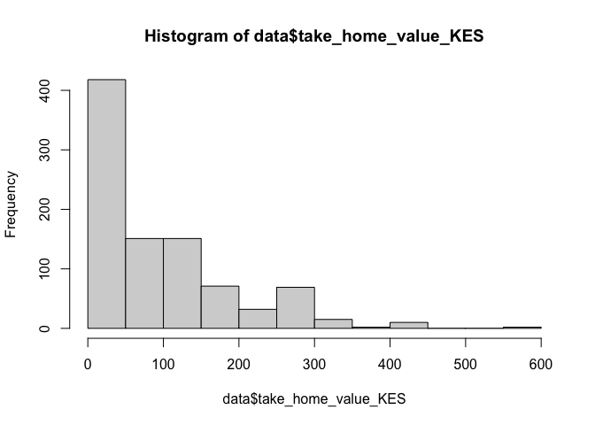
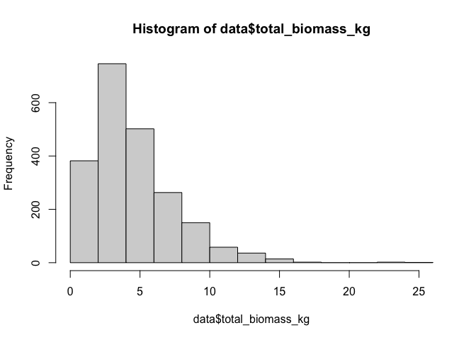
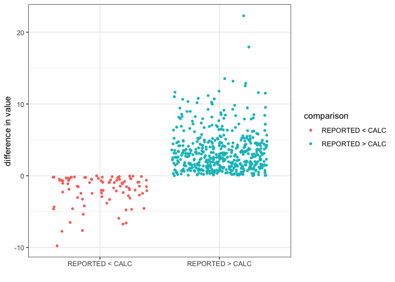
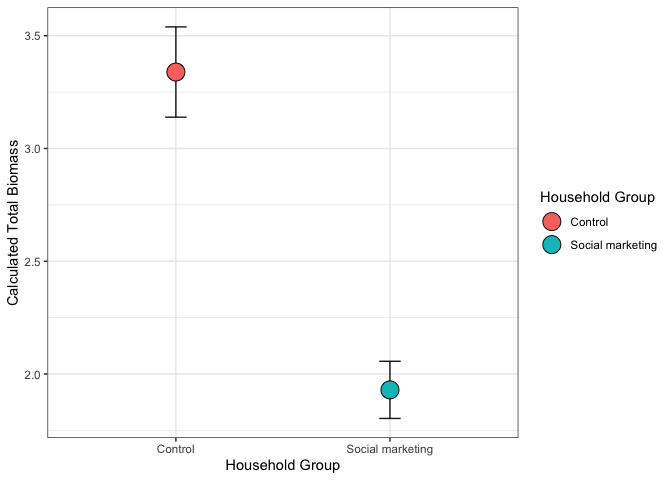
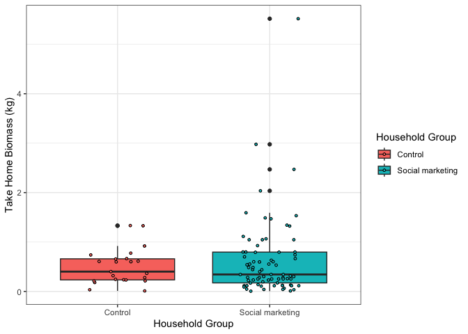
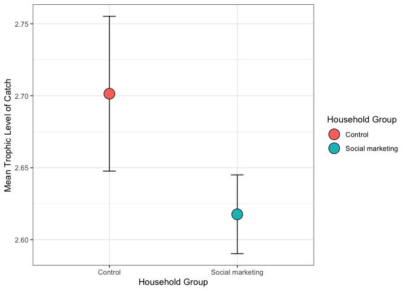

Analysis of Fishing Landings dataset - alternate dataset
================
Author: Emma Strand; <emma_strand@uri.edu>

## Prior Scripts

QC:
<https://github.com/emmastrand/Kenya_SamakiSalama/blob/main/FishLandings/scripts/QC.md>

## <a name="data"></a> **Reading in datafiles**

``` r
library(plyr)
library(dplyr)
library(tidyverse)
library(ggplot2)
library(readxl)
library(lubridate)
library(Hmisc)
library(writexl)
library(naniar)
library(Rmisc)
library(stats)
library(lme4)
library(car)
library(forcats)
library(ggstatsplot)
library(ggridges)
library(ggbreak)
library(emmeans)
```

## Read in the data frame that is the output of the QC script.

Summary information so far: 741 total surveys, 591 unmodified traps, 150
modified traps.

``` r
# read in excel file
## 2,156 rows x 30 variables (this should match the final version of QC script)
data <- read.csv("alternate fishing/alternate_fishing.csv") %>% #read in excel file 
  dplyr::select(-X)

# creating new columns with month year and date
## survey ID is master identifier that is based on `date_collected_dd_mm_yyyy` column 
data <- data %>% 
  separate(date_collected_dd_mm_yyyy, c("year", "month", "day"), remove = FALSE) 

#changing this column to numeric instead of a character (needed for next fxn)
data$month <- as.numeric(data$month) 
#changing numeric months to month names
data$month <- month.abb[data$month] 

# changing levels of month (important for figures later on); only first three letter of month 
data$month <- factor(data$month, levels=c("Jan", "Feb","Mar","Apr","May",
                                          "Jul", "Aug", "Sep", "Oct", "Nov", "Dec"))

data <- data %>%
  mutate(household_group = case_when(
    BMU == "KANAMAI" ~ "Control",
    BMU == "KURUWITU" ~ "Social marketing",
    BMU == "TAKAUNGU" ~ "Social marketing"))
```

**Control households**  
- KANAMAI (141 surveys): November 2021 and January - May 2022 - Gear
used: Spearguns - Units of data: Per single fisherman / household

**Social marketing households**  
- KURUWITU (382 surveys): July - December 2021 and January - May 2022  
- TAKAUNGU (105 surveys): January - May 2022  
- Gear used: Both used spearguns and TAKAUNGU used monofilament - Units
of data: Per single fisherman / household

## Check ranges and add filters

63 unique species total:  
- 40 of those found in KANAMAI  
- 56 of those found in KURUWITU  
- 32 of those found in TAKAUNGU

``` r
hist(data$total_biomass_kg) ## 0.25 26.00
```

<!-- -->

``` r
hist(data$take_home_weight_kg, na.rm = TRUE) ## 0-4
```

    ## Warning in plot.window(xlim, ylim, "", ...): "na.rm" is not a graphical
    ## parameter

    ## Warning in title(main = main, sub = sub, xlab = xlab, ylab = ylab, ...):
    ## "na.rm" is not a graphical parameter

    ## Warning in axis(1, ...): "na.rm" is not a graphical parameter

    ## Warning in axis(2, at = yt, ...): "na.rm" is not a graphical parameter

<!-- -->

``` r
hist(data$total_value_KES) ## 40 - 4800 
```

<!-- -->

``` r
hist(data$take_home_value_KES, na.rm = TRUE) ## 0-600 
```

    ## Warning in plot.window(xlim, ylim, "", ...): "na.rm" is not a graphical
    ## parameter

    ## Warning in title(main = main, sub = sub, xlab = xlab, ylab = ylab, ...):
    ## "na.rm" is not a graphical parameter

    ## Warning in axis(1, ...): "na.rm" is not a graphical parameter

    ## Warning in axis(2, at = yt, ...): "na.rm" is not a graphical parameter

<!-- -->

``` r
range(data$`No..of.fishers.in.crew`) ## 1-3 people 
```

    ## [1] 1 3

``` r
hist(data$number_of_fish) ## 1 - 19 fish 
```

<!-- -->

``` r
#unique(data$scientific_name) ## 63 fish 
#data %>% subset(BMU == "TAKAUNGU") %>% dplyr::select(scientific_name) %>% distinct()
```

## Calculating median length

``` r
data <- data %>% 
  mutate(median_length = case_when(
    length_corrected == "0-10" ~ 5,
    length_corrected == "11-15" ~ 13,
    length_corrected == "16-20" ~ 18,
    length_corrected == "21-25" ~ 23,
    length_corrected == "26-30" ~ 28,
    length_corrected == "31-35" ~ 33,
    length_corrected == "36-40" ~ 38,
    length_corrected == "41-45" ~ 43,
    length_corrected == "46-50" ~ 48,
    length_corrected == "51-60" ~ 55.5,
    length_corrected == "61-70" ~ 65.5,
    length_corrected == "71-80" ~ 75.5,
    length_corrected == "81-90" ~ 85.5,
    length_corrected == ">90" ~ 100 ### circle back to what value to use here
  )) 

hist(data$median_length) ## majority fall within 10-40 cm 
```

<!-- -->

## Loading Galligan and FishBase dataset

Most species in the list above have metadata below.

``` r
fishbase_lifehistory <- read_excel("data/fishbase.xlsx", sheet = "life history") %>% #read in excel file 
  select(scientific_name, Lm, Lmax) %>% dplyr::rename(Lmat_fishbase = Lm) %>% dplyr::rename(Lmax_fishbase = Lmax) 

# rows that appear in species_list but not fishbase_lifehistory
## checking which fish I still need Fishbase information for (44 species)
# dplyr::setdiff(species_list, fishbase_lifehistory) %>% write.csv("data/add_fishbase_info.csv")

fishbase_biomass <- read_excel("data/fishbase.xlsx", sheet = "biomass") %>%
  dplyr::select(scientific_name, a, b)

fishbase <- full_join(fishbase_lifehistory, fishbase_biomass, by = "scientific_name")

galligan <- read.csv("data/SpeciesData_GatedTraps_Galligan_edited.csv", header=TRUE, sep = ",") %>%
  dplyr::rename(scientific_name = Species) #%>% dplyr::select(., scientific_name)
# dplyr::setdiff(species_list, galligan) 
### 11 fish found in our dataset that are not found in Galligan dataset 
## these won't be included in the nutrient or revenue analysis
## I think this is OK b/c all species have 113 or lower than 40 total catch

metadata <- full_join(fishbase, galligan, by = "scientific_name")

### PRE MERGE DATA = 2,156 X 34
### POST MERGE DATA = 2,156 X 82 
data2 <- left_join(data, metadata, by = "scientific_name")
```

## Calculating total biomass

W=aL^b

W = Biomass  
L = Length (in our case, median length)  
a = (taken from fishbase) b = (taken from fishbase)

Read in data from fishbase. These units are in cm and grams.

<https://www.fishbase.de/manual/English/FishbaseThe_LENGTH_WEIGHT_table.htm>

``` r
### Switching to data3 which will filter out those fish with no nutrient or a and b values 
data2 <- data2 %>%  
  ## mutating a and b column to be numeric; this will create NAs b/c not all fish had a and b valueus in fishbase
  mutate_at(c('a', 'b'), as.numeric) %>%
  mutate(W_g = (a*(median_length^b))*number_of_fish,
         W_kg = W_g/1000) %>%
  group_by(survey_id) %>%
  filter(!is.na(W_kg)) %>%
  mutate(calculated_total_biomass = sum(W_kg)) %>% 
  ungroup()
```

    ## Warning: There were 2 warnings in `mutate()`.
    ## The first warning was:
    ## ℹ In argument: `a = .Primitive("as.double")(a)`.
    ## Caused by warning:
    ## ! NAs introduced by coercion
    ## ℹ Run `dplyr::last_dplyr_warnings()` to see the 1 remaining warning.

``` r
range(data2$calculated_total_biomass) ## 0.001832111 kg - 18.201910245 kg
```

    ## [1]  0.001832111 18.201910245

### Comparing reported vs. calculated

``` r
data2 %>% 
  select(survey_id, total_biomass_kg, calculated_total_biomass) %>%
  distinct() %>% na.omit() %>%
  mutate(comparison = if_else(total_biomass_kg > calculated_total_biomass, "REPORTED > CALC", "REPORTED < CALC"),
         difference = total_biomass_kg-calculated_total_biomass) %>%
  ggplot(., aes(x=comparison, y=difference)) + theme_bw() +
  geom_jitter(aes(color=comparison), size=1) + xlab("") + ylab("difference in value")
```

<!-- -->

### Statistics on the above.

``` r
data2_yield <- data2 %>% 
  dplyr::select(survey_id, household_group, total_biomass_kg, calculated_total_biomass) %>% distinct()

Control_yield <- data2_yield %>% subset(household_group == "Control") ## 131 data points
Social_yield <- data2_yield %>% subset(household_group == "Social marketing") ## 448 data points 

### TOTAL BIOMASS KG 
var.test(Control_yield$total_biomass_kg, Social_yield$total_biomass_kg) 
```

    ## 
    ##  F test to compare two variances
    ## 
    ## data:  Control_yield$total_biomass_kg and Social_yield$total_biomass_kg
    ## F = 0.50029, num df = 130, denom df = 447, p-value = 5.004e-06
    ## alternative hypothesis: true ratio of variances is not equal to 1
    ## 95 percent confidence interval:
    ##  0.3832593 0.6671560
    ## sample estimates:
    ## ratio of variances 
    ##          0.5002933

``` r
## p-value = 5.004e-06; ratio = 0.5002933
t.test(total_biomass_kg~household_group, data = data2_yield, var.equal = FALSE)
```

    ## 
    ##  Welch Two Sample t-test
    ## 
    ## data:  total_biomass_kg by household_group
    ## t = -3.2375, df = 296.88, p-value = 0.001342
    ## alternative hypothesis: true difference in means between group Control and group Social marketing is not equal to 0
    ## 95 percent confidence interval:
    ##  -1.3858249 -0.3379767
    ## sample estimates:
    ##          mean in group Control mean in group Social marketing 
    ##                       4.143244                       5.005145

``` r
## p-value = 0.001342

### TOTAL CALCULATED BIOMASS 
var.test(Control_yield$calculated_total_biomass, Social_yield$calculated_total_biomass) 
```

    ## 
    ##  F test to compare two variances
    ## 
    ## data:  Control_yield$calculated_total_biomass and Social_yield$calculated_total_biomass
    ## F = 0.7299, num df = 130, denom df = 447, p-value = 0.0323
    ## alternative hypothesis: true ratio of variances is not equal to 1
    ## 95 percent confidence interval:
    ##  0.5591564 0.9733478
    ## sample estimates:
    ## ratio of variances 
    ##          0.7299033

``` r
## p-value = 0.0323; ratio = 0.7299033
t.test(calculated_total_biomass~household_group, data = data2_yield, var.equal = FALSE)
```

    ## 
    ##  Welch Two Sample t-test
    ## 
    ## data:  calculated_total_biomass by household_group
    ## t = 5.9488, df = 243.65, p-value = 9.33e-09
    ## alternative hypothesis: true difference in means between group Control and group Social marketing is not equal to 0
    ## 95 percent confidence interval:
    ##  0.9426821 1.8759867
    ## sample estimates:
    ##          mean in group Control mean in group Social marketing 
    ##                       3.338951                       1.929617

``` r
## p-value = 9.33e-09
```

### Figures

``` r
calculated_yield_stats <- summarySE(data2_yield, measurevar = c("calculated_total_biomass"), groupvars = c("household_group"))
total_biomass_stats2 <- summarySE(data2_yield, measurevar = c("total_biomass_kg"), groupvars = c("household_group"))

calculated_yield_stats %>%
  ggplot(., aes(x=household_group, y=calculated_total_biomass, fill=household_group, group=household_group)) + theme_bw() +
  geom_errorbar(aes(x=household_group, y=calculated_total_biomass, 
                    ymin=calculated_total_biomass-se, ymax=calculated_total_biomass+se), 
                position=position_dodge(0.3), alpha=0.9, size=0.5, width=0.1) +  
  geom_point(size=6, shape=21, position=position_dodge(0.3)) + ylab("Calculated Total Biomass") +
  xlab("Household Group") + labs(fill="Household Group")
```

    ## Warning: Using `size` aesthetic for lines was deprecated in ggplot2 3.4.0.
    ## ℹ Please use `linewidth` instead.
    ## This warning is displayed once every 8 hours.
    ## Call `lifecycle::last_lifecycle_warnings()` to see where this warning was
    ## generated.

<!-- -->

``` r
# 
# total_biomass_stats2 %>%
#   ggplot(., aes(x=household_group, y=total_biomass_kg, fill=household_group, group=household_group)) + theme_bw() +
#   geom_errorbar(aes(x=household_group, y=total_biomass_kg, 
#                     ymin=total_biomass_kg-se, ymax=total_biomass_kg+se), 
#                 position=position_dodge(0.3), alpha=0.9, size=0.5, width=0.1) +  
#   #scale_y_break(c(1.1, 1.75)) + ylim(0.9,2.4) +
#   geom_point(size=3, shape=21, position=position_dodge(0.3)) 
```

## Calculating take home kg/%

``` r
takehome <- data2 %>% dplyr::group_by(survey_id, destination) %>%   
  mutate(kg_perdestination = sum(W_kg)) %>% ungroup() %>% 
  dplyr::select(survey_id, BMU, household_group, destination, kg_perdestination) %>%
  distinct() %>% spread(destination, kg_perdestination) %>%
  mutate_all(., ~replace_na(.,0)) %>% dplyr::select(survey_id, BMU, household_group, HOME) %>%
  dplyr::rename(TakeHome_kg = HOME)
```

### Statistics on the above.

``` r
data2_takehome <- takehome %>% 
  dplyr::select(survey_id, household_group, TakeHome_kg) %>% distinct() %>% 
  filter(TakeHome_kg > 0) ##99 total observations #23 control #76 marketing

Control_takehome <- data2_takehome %>% subset(household_group == "Control") ## 131 total data points
Social_takehome <- data2_takehome %>% subset(household_group == "Social marketing") ## 448 total data points 

### TOTAL BIOMASS KG 
var.test(Control_takehome$TakeHome_kg, Social_takehome$TakeHome_kg) 
```

    ## 
    ##  F test to compare two variances
    ## 
    ## data:  Control_takehome$TakeHome_kg and Social_takehome$TakeHome_kg
    ## F = 0.19813, num df = 22, denom df = 75, p-value = 8.383e-05
    ## alternative hypothesis: true ratio of variances is not equal to 1
    ## 95 percent confidence interval:
    ##  0.1064070 0.4195543
    ## sample estimates:
    ## ratio of variances 
    ##           0.198125

``` r
## p-value = 8.383e-05; ratio = 0.198125
t.test(TakeHome_kg~household_group, data = data2_takehome, var.equal = FALSE)
```

    ## 
    ##  Welch Two Sample t-test
    ## 
    ## data:  TakeHome_kg by household_group
    ## t = -1.0852, df = 83.436, p-value = 0.2809
    ## alternative hypothesis: true difference in means between group Control and group Social marketing is not equal to 0
    ## 95 percent confidence interval:
    ##  -0.3649962  0.1072851
    ## sample estimates:
    ##          mean in group Control mean in group Social marketing 
    ##                      0.5026935                      0.6315491

``` r
## p-value = 0.2809
```

### Figures

``` r
#data2_takehome_nozero <- data2_takehome %>% filter(TakeHome_kg > 0) ##99 total observations #23 control #76 marketing

TakeHome_stats <- summarySE(data2_takehome, measurevar = c("TakeHome_kg"), groupvars = c("household_group"), 
                           na.rm = TRUE)
#TakeHome_stats %>%
data2_takehome %>%
  ggplot(., aes(x=household_group, y=TakeHome_kg, fill=household_group, group=household_group)) + theme_bw() +
  # geom_errorbar(aes(x=household_group, y=TakeHome_kg,
  #                   ymin=TakeHome_kg-se, ymax=TakeHome_kg+se),
  #               position=position_dodge(0.3), alpha=0.9, size=0.5, width=0.1) +
  #geom_point(size=6, shape=21, position=position_dodge(0.3)) + 
  geom_boxplot() + 
  geom_jitter(size=1, shape=21, width = 0.2) + 
  ylab("Take Home Biomass (kg)") +
  xlab("Household Group") + labs(fill="Household Group")
```

<!-- -->

## Calculating trophic level

``` r
data2 <- data2 %>% group_by(survey_id) %>%
  mutate(mean.trophic = mean(TrophLevel, na.rm = TRUE))
```

### Statistics on the above.

``` r
data2_trophic <- data2 %>% 
  dplyr::select(survey_id, household_group, mean.trophic) %>% distinct()

Control_trophic <- data2_trophic %>% subset(household_group == "Control") ## 131 data points
Social_trophic <- data2_trophic %>% subset(household_group == "Social marketing") ## 448 data points 

### TOTAL BIOMASS KG 
var.test(Control_trophic$mean.trophic, Social_trophic$mean.trophic) 
```

    ## 
    ##  F test to compare two variances
    ## 
    ## data:  Control_trophic$mean.trophic and Social_trophic$mean.trophic
    ## F = 1.13, num df = 128, denom df = 440, p-value = 0.3708
    ## alternative hypothesis: true ratio of variances is not equal to 1
    ## 95 percent confidence interval:
    ##  0.8638884 1.5103812
    ## sample estimates:
    ## ratio of variances 
    ##           1.129964

``` r
## p-value = 0.3708; ratio = 1.129964
t.test(mean.trophic~household_group, data = data2_trophic, var.equal = TRUE)
```

    ## 
    ##  Two Sample t-test
    ## 
    ## data:  mean.trophic by household_group
    ## t = 1.4352, df = 568, p-value = 0.1518
    ## alternative hypothesis: true difference in means between group Control and group Social marketing is not equal to 0
    ## 95 percent confidence interval:
    ##  -0.03087412  0.19842476
    ## sample estimates:
    ##          mean in group Control mean in group Social marketing 
    ##                       2.701450                       2.617674

``` r
## p-value = 0.1518
```

### Figures

``` r
trophic_stats <- summarySE(data2_trophic, measurevar = c("mean.trophic"), groupvars = c("household_group"), 
                           na.rm = TRUE)

trophic_stats %>%
  ggplot(., aes(x=household_group, y=mean.trophic, fill=household_group, group=household_group)) + theme_bw() +
  geom_errorbar(aes(x=household_group, y=mean.trophic, 
                    ymin=mean.trophic-se, ymax=mean.trophic+se), 
                position=position_dodge(0.3), alpha=0.9, size=0.5, width=0.1) +  
  geom_point(size=6, shape=21, position=position_dodge(0.3)) + 
  ylab("Mean Trophic Level of Catch") +
  xlab("Household Group") + labs(fill="Household Group")
```

<!-- -->

## Calculating herbivore/carnivore presence

``` r
diet <- data2 %>% group_by(survey_id, Diet) %>%
  mutate(countper_diet = n()) %>% ungroup() %>%
  select(survey_id, BMU, household_group, Diet, countper_diet) %>% distinct() %>%
  group_by(survey_id) %>% spread(Diet, countper_diet) %>% dplyr::select(-`<NA>`) %>%
  mutate_all(., ~replace_na(.,0)) %>%
  mutate(total = sum(c(Carnivorous, `Herbivorous detritivorous`, `Macroalgal herbivorous`,
                        `Mobile Inverts`, `Omnivorous`, `Planktivorous`))) %>%
  mutate(Carnivorous = Carnivorous/total*100,
         `Herbivorous detritivorous` = `Herbivorous detritivorous`/total*100,
         `Macroalgal herbivorous` = `Macroalgal herbivorous`/total*100,
         `Mobile Inverts` = `Mobile Inverts`/total*100,
         `Omnivorous` = `Omnivorous`/total*100,
         `Planktivorous` = `Planktivorous`/total*100) %>% dplyr::select(-total)
```

    ## `mutate_all()` ignored the following grouping variables:
    ## • Column `survey_id`
    ## ℹ Use `mutate_at(df, vars(-group_cols()), myoperation)` to silence the message.

``` r
head(diet)
```

    ## # A tibble: 6 × 9
    ## # Groups:   survey_id [6]
    ##   survey_id             BMU   household_group Carnivorous Herbivorous detritiv…¹
    ##   <chr>                 <chr> <chr>                 <dbl>                  <dbl>
    ## 1 2021-07-23 11:30:00 … KURU… Social marketi…         0                     66.7
    ## 2 2021-07-23 11:30:00 … KURU… Social marketi…         0                     42.9
    ## 3 2021-07-23 11:30:00 … KURU… Social marketi…         0                      0  
    ## 4 2021-07-23 11:30:00 … KURU… Social marketi…        16.7                   66.7
    ## 5 2021-07-23 12:00:00 … KURU… Social marketi…        20                     20  
    ## 6 2021-07-24 11:30:00 … KURU… Social marketi…         0                     50  
    ## # ℹ abbreviated name: ¹​`Herbivorous detritivorous`
    ## # ℹ 4 more variables: `Macroalgal herbivorous` <dbl>, `Mobile Inverts` <dbl>,
    ## #   Omnivorous <dbl>, Planktivorous <dbl>

## Summary

``` r
summary <- data2 %>% 
  dplyr::select(survey_id, BMU, household_group, calculated_total_biomass, mean.trophic) %>%
  distinct() %>% dplyr::rename(Total_Biomass_kg = calculated_total_biomass) %>%
  dplyr::rename(Avg_Trophic_Level = mean.trophic) %>%
  left_join(., takehome, c("survey_id", "BMU", "household_group")) %>%
  left_join(., diet, by = c("survey_id", "BMU", "household_group")) 

head(summary)
```

    ## # A tibble: 6 × 12
    ## # Groups:   survey_id [6]
    ##   survey_id BMU   household_group Total_Biomass_kg Avg_Trophic_Level TakeHome_kg
    ##   <chr>     <chr> <chr>                      <dbl>             <dbl>       <dbl>
    ## 1 2021-07-… KURU… Social marketi…            1.84               3.00       0.443
    ## 2 2021-07-… KURU… Social marketi…            1.69               2.97       0    
    ## 3 2021-07-… KURU… Social marketi…            1.84               3.29       0    
    ## 4 2021-07-… KURU… Social marketi…            0.796              3.85       0    
    ## 5 2021-07-… KURU… Social marketi…            3.59               2.79       0    
    ## 6 2021-07-… KURU… Social marketi…            4.11               2.82       0    
    ## # ℹ 6 more variables: Carnivorous <dbl>, `Herbivorous detritivorous` <dbl>,
    ## #   `Macroalgal herbivorous` <dbl>, `Mobile Inverts` <dbl>, Omnivorous <dbl>,
    ## #   Planktivorous <dbl>
