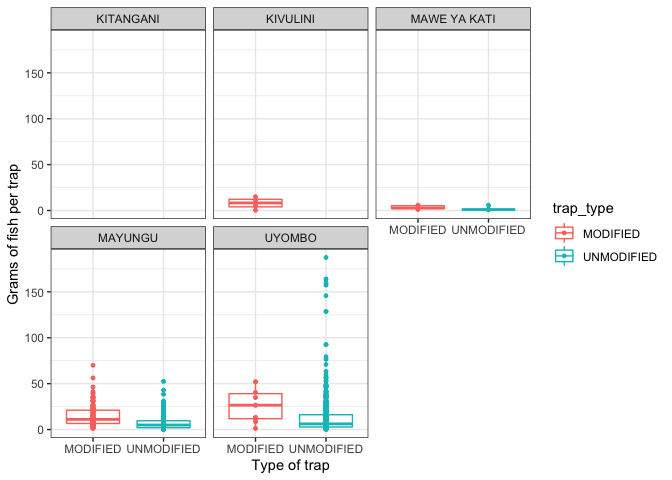

Analysis of Fishing Landings dataset
================
Author: Emma Strand; <emma_strand@uri.edu>

## Goal

1.  Total catch per unit effort between modified and traditional traps.
    It would be great to see this as grams captured per trap set.  
2.  Species catch per unit effort between modified and traditional
    traps. Take the top 3-5 species and run \#1 for them separately.  
3.  Total mature fish catch per unit effort between modified and
    traditional traps. This will have to be for the top 3-5 species
    separately. Go to Fishbase and find the length at first maturity for
    that particular species, then assign each fish a “mature” or
    “immature” status in the data and calculate.  
4.  Average length of catch versus length at first maturity (Lmat). Take
    the difference for each fish in the data against its length at first
    maturity and then calculate a weighted value for modified versus
    traditional traps where a value above 0 represents a fish above Lmat
    and a value below represents a fish below Lmat.  
5.  Length frequency of top 3-5 species in modified versus traditional
    (different colors) with Lmat etc. indicators pulled from Fishbase.

## Contents

-   [**Reading in datafiles**](#data)  
-   [**Total catch (grams) per unit effort (trap set)**](#catch_effort)

## <a name="data"></a> **Reading in datafiles**

``` r
library(plyr)
library(dplyr)
library(tidyverse)
library(ggplot2)
library(readxl)
library(lubridate)
library(Hmisc)
library(writexl)
library(naniar)
library(Rmisc)
library(stats)
```

Read in the data frame that is the output of the QC script.

``` r
# read in excel file
data <- read_excel("data/Fishlandings-cleaned-21052022-May.xlsx") 
```

## <a name="catch_effort"></a> **Total catch (grams) per unit effort (trap set)**

Grouping by fisher\_id but this might be effective to group by
enumerator once I have correct list of names. There are 3 boat trips
recorded with the exact same fish data that are under 3 different fisher
ID names but all the same enumerator.. come back to this in QC.

Goal: grams captured per trap set.

``` r
modified_trap_df <- data %>% unite(survey_id, Operation_date, fisher_id, sep = " ", remove = FALSE) %>%
  dplyr::group_by(survey_id) %>% 
  mutate(total_catch = sum(number_of_fish),
         grams_per_trap = total_weight_kg/total_traps_collected) %>%
  dplyr::ungroup(survey_id) %>%
  subset(trap_type == "MODIFIED" | trap_type == "UNMODIFIED") %>%
  select(survey_id, enumerator, trap_type, `No. of fishers in crew`, total_catch, grams_per_trap) %>%
  distinct()
```

### Plotting figures.

``` r
# basic total catch 
modified_trap_df %>% 
  ggplot(aes(x=trap_type, y=total_catch, color=trap_type)) +
  geom_boxplot(aes(color=trap_type), outlier.size = 0, lwd=0.5) +
    geom_point(aes(fill=trap_type), pch = 21, size=1) +
  theme_bw() + 
  ylab("Total catch") + xlab("Type of trap") +
  theme(axis.text.x = element_text(vjust = 1.1)) #Set the text angle
```

    ## Warning: Removed 6 rows containing non-finite values (stat_boxplot).

    ## Warning: Removed 6 rows containing missing values (geom_point).

<!-- -->

``` r
# basic grams per trap plot with no other variables 
modified_trap_df %>% 
  ggplot(aes(x=trap_type, y=grams_per_trap, color=trap_type)) + 
  geom_boxplot(aes(color=trap_type), outlier.size = 0, lwd=0.5) +
    geom_point(aes(fill=trap_type), pch = 21, size=1) +
  theme_bw() + 
  ylab("Grams of fish per trap") + xlab("Type of trap") +
  theme(axis.text.x = element_text(vjust = 1.1)) #Set the text angle
```

    ## Warning: Removed 32 rows containing non-finite values (stat_boxplot).

    ## Warning: Removed 32 rows containing missing values (geom_point).

<!-- -->

``` r
# visually seeing if this differs by fisherman 
modified_trap_df %>% 
  ggplot(aes(x=trap_type, y=grams_per_trap, color=trap_type)) + 
  facet_wrap(~enumerator) +
  geom_boxplot(aes(color=trap_type), outlier.size = 0, lwd=0.5) +
    geom_point(aes(fill=trap_type), pch = 21, size=1) +
  theme_bw() + 
  ylab("Grams of fish per trap") + xlab("Type of trap") +
  theme(axis.text.x = element_text(vjust = 1.1)) #Set the text angle
```

    ## Warning: Removed 32 rows containing non-finite values (stat_boxplot).
    ## Removed 32 rows containing missing values (geom_point).

<!-- -->

``` r
# if this differs by 
modified_trap_df %>% 
  ggplot(aes(x=total_catch, y=grams_per_trap, color=trap_type)) +
  theme_bw() + 
  geom_smooth(aes(fill=trap_type), method="loess", se=TRUE, fullrange=TRUE, level=0.95, color="black") +
  geom_point(aes(fill=trap_type), pch = 21, size=1)
```

    ## `geom_smooth()` using formula 'y ~ x'

    ## Warning: Removed 38 rows containing non-finite values (stat_smooth).

    ## Warning: Removed 64 rows containing missing values (geom_smooth).

    ## Warning: Removed 38 rows containing missing values (geom_point).

<!-- -->

### Statistics on the above.

Default of t.test in R is a Welch t-test which is just an adaptation of
t-test, and it is used when the two samples have possibly unequal
variances. Use var.equal = TRUE or FALSE to specifiy the variances of
the dataset.

You can test equal variances with a Fisher’s F-test. If p &lt; 0.05 then
we include var.equal = FALSE in below ttest. If p &gt; 0.05 then we
include var.equal = TRUE in below ttest.

We are using an unpaired two sample t-test for this dataset.

``` r
UN <- modified_trap_df %>% subset(trap_type == "MODIFIED") %>% select(grams_per_trap) %>% na.omit()
MOD <- modified_trap_df %>% subset(trap_type == "UNMODIFIED") %>% select(grams_per_trap) %>% na.omit()

var.test(UN$grams_per_trap, MOD$grams_per_trap)
```

    ## 
    ##  F test to compare two variances
    ## 
    ## data:  UN$grams_per_trap and MOD$grams_per_trap
    ## F = 0.53874, num df = 152, denom df = 983, p-value = 3.849e-06
    ## alternative hypothesis: true ratio of variances is not equal to 1
    ## 95 percent confidence interval:
    ##  0.4274283 0.6939524
    ## sample estimates:
    ## ratio of variances 
    ##          0.5387362

``` r
t.test(grams_per_trap~trap_type, data = modified_trap_df, var.equal = FALSE)
```

    ## 
    ##  Welch Two Sample t-test
    ## 
    ## data:  grams_per_trap by trap_type
    ## t = -2.6535, df = 249.19, p-value = 0.008478
    ## alternative hypothesis: true difference in means between group MODIFIED and group UNMODIFIED is not equal to 0
    ## 95 percent confidence interval:
    ##  -0.27298168 -0.04038802
    ## sample estimates:
    ##   mean in group MODIFIED mean in group UNMODIFIED 
    ##                0.8711472                1.0278321

**Current error :Error in is.finite(x) : default method not implemented
for type ‘list’**. Circle back to this..
