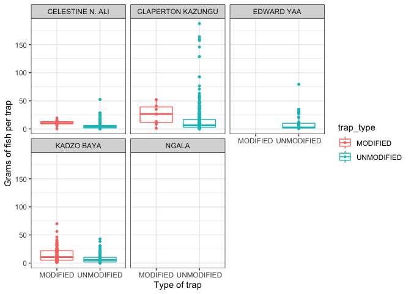
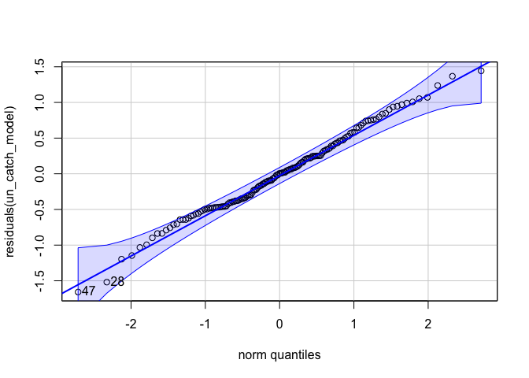
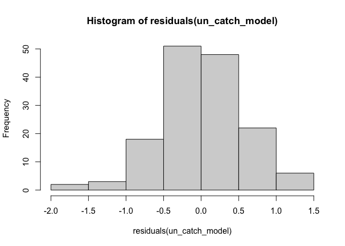

Analysis of Fishing Landings dataset
================
Author: Emma Strand; <emma_strand@uri.edu>

## Potential dataset issues

**Notes**:  
- Modified traps were only recorded in February.. is this a problem?  
- Circle back to triple check the number of fish column in the QC
script.

## Goal

**1. Total catch per unit effort between modified and traditional traps.
It would be great to see this as grams captured per trap set.**

Results:  
- Modified traps had a significantly higher total catch per trap set.
This pattern holds for all landing sites and individual fisherman (it
does not appear that either of those variables influence this result).  
- Unmodified traps had a significantly higher weight in grams per trap
set. This pattern holds for all individual fisherman, but Mayungu
landing site might drive this result more than the other sites.  
- *insert statement about grams per trap vs catch per trap and trap
type. finish stats below for this.*

**2. Species catch per unit effort between modified and traditional
traps. Take the top 3-5 species and run \#1 for them separately.**

Results:  
- Top species caught across all surveys:

1.  Total mature fish catch per unit effort between modified and
    traditional traps. This will have to be for the top 3-5 species
    separately. Go to Fishbase and find the length at first maturity for
    that particular species, then assign each fish a “mature” or
    “immature” status in the data and calculate.  
2.  Average length of catch versus length at first maturity (Lmat). Take
    the difference for each fish in the data against its length at first
    maturity and then calculate a weighted value for modified versus
    traditional traps where a value above 0 represents a fish above Lmat
    and a value below represents a fish below Lmat.  
3.  Length frequency of top 3-5 species in modified versus traditional
    (different colors) with Lmat etc. indicators pulled from Fishbase.

## Contents

-   [**Reading in datafiles**](#data)  
-   [**Total catch (grams) per unit effort (trap
    set)**](#catch_effort)  
-   [**Calculate top species caught**](#species)

## <a name="data"></a> **Reading in datafiles**

``` r
library(plyr)
library(dplyr)
library(tidyverse)
library(ggplot2)
library(readxl)
library(lubridate)
library(Hmisc)
library(writexl)
library(naniar)
library(Rmisc)
library(stats)
library(lme4)
library(car)
```

Read in the data frame that is the output of the QC script.

``` r
# read in excel file
data <- read_excel("data/Fishlandings-cleaned-21052022-May.xlsx") 

# creating a month column based on operation date column 
data$month <- data$Operation_date
data$month <- format(data$month, "%m") #extracting only the month in the new column
data$month <- as.numeric(data$month)
data$month <- month.abb[data$month] #changing numeric months to month names 
```

## <a name="catch_effort"></a> **Total catch (grams) per unit effort (trap set)**

Grouping by fisher\_id but this might be effective to group by
enumerator once I have correct list of names. There are 3 boat trips
recorded with the exact same fish data that are under 3 different fisher
ID names but all the same enumerator.. come back to this in QC.

Goal: grams captured per trap set.

``` r
modified_trap_df <- data %>% unite(survey_id, Operation_date, fisher_id, sep = " ", remove = FALSE) %>%
  dplyr::group_by(survey_id) %>% 
  mutate(total_catch = sum(number_of_fish),
         grams_per_trap = total_weight_kg/total_traps_collected,
         catch_per_trap = total_catch/total_traps_collected) %>%
  dplyr::ungroup(survey_id) %>%
  subset(trap_type == "MODIFIED" | trap_type == "UNMODIFIED") %>%
  select(survey_id, enumerator, trap_type, `No. of fishers in crew`, landing_site, total_catch, month, grams_per_trap, catch_per_trap) %>%
  distinct() 
```

### Plotting figures.

Catch per trap

``` r
# basic total catch per trap with no other variables 
modified_trap_df %>% 
  ggplot(aes(x=trap_type, y=catch_per_trap, color=trap_type)) +
  geom_boxplot(aes(color=trap_type), outlier.size = 0, lwd=0.5) +
    geom_point(aes(fill=trap_type), pch = 21, size=1) +
  theme_bw() + 
  ylab("Total catch per trap") + xlab("Type of trap") +
  theme(axis.text.x = element_text(vjust = 1.1)) #Set the text angle
```

    ## Warning: Removed 33 rows containing non-finite values (stat_boxplot).

    ## Warning: Removed 33 rows containing missing values (geom_point).

<!-- -->

``` r
# by fisherman 
modified_trap_df %>% 
  ggplot(aes(x=trap_type, y=catch_per_trap, color=trap_type)) + 
  facet_wrap(~enumerator) +
  geom_boxplot(aes(color=trap_type), outlier.size = 0, lwd=0.5) +
    geom_point(aes(fill=trap_type), pch = 21, size=1) +
  theme_bw() + 
  ylab("Grams of fish per trap") + xlab("Type of trap") +
  theme(axis.text.x = element_text(vjust = 1.1)) #Set the text angle
```

    ## Warning: Removed 33 rows containing non-finite values (stat_boxplot).
    ## Removed 33 rows containing missing values (geom_point).

<!-- -->

``` r
# by landing site
modified_trap_df %>% 
  ggplot(aes(x=trap_type, y=catch_per_trap, color=trap_type)) + 
  facet_wrap(~landing_site) +
  geom_boxplot(aes(color=trap_type), outlier.size = 0, lwd=0.5) +
    geom_point(aes(fill=trap_type), pch = 21, size=1) +
  theme_bw() + 
  ylab("Grams of fish per trap") + xlab("Type of trap") +
  theme(axis.text.x = element_text(vjust = 1.1)) #Set the text angle
```

    ## Warning: Removed 33 rows containing non-finite values (stat_boxplot).
    ## Removed 33 rows containing missing values (geom_point).

<!-- -->

``` r
# by month
modified_trap_df %>% 
  ggplot(aes(x=trap_type, y=catch_per_trap, color=trap_type)) + 
  facet_wrap(~month) +
  geom_boxplot(aes(color=trap_type), outlier.size = 0, lwd=0.5) +
    geom_point(aes(fill=trap_type), pch = 21, size=1) +
  theme_bw() + 
  ylab("Grams of fish per trap") + xlab("Type of trap") +
  theme(axis.text.x = element_text(vjust = 1.1)) #Set the text angle
```

    ## Warning: Removed 33 rows containing non-finite values (stat_boxplot).
    ## Removed 33 rows containing missing values (geom_point).

<!-- -->

Grams per trap

``` r
# basic grams per trap plot with no other variables 
modified_trap_df %>% 
  ggplot(aes(x=trap_type, y=grams_per_trap, color=trap_type)) + 
  geom_boxplot(aes(color=trap_type), outlier.size = 0, lwd=0.5) +
    geom_point(aes(fill=trap_type), pch = 21, size=1) +
  theme_bw() + 
  ylab("Grams of fish per trap") + xlab("Type of trap") +
  theme(axis.text.x = element_text(vjust = 1.1)) #Set the text angle
```

    ## Warning: Removed 32 rows containing non-finite values (stat_boxplot).

    ## Warning: Removed 32 rows containing missing values (geom_point).

<!-- -->

``` r
# visually seeing if this differs by fisherman 
modified_trap_df %>% 
  ggplot(aes(x=trap_type, y=grams_per_trap, color=trap_type)) + 
  facet_wrap(~enumerator) +
  geom_boxplot(aes(color=trap_type), outlier.size = 0, lwd=0.5) +
    geom_point(aes(fill=trap_type), pch = 21, size=1) +
  theme_bw() + 
  ylab("Grams of fish per trap") + xlab("Type of trap") +
  theme(axis.text.x = element_text(vjust = 1.1)) #Set the text angle
```

    ## Warning: Removed 32 rows containing non-finite values (stat_boxplot).
    ## Removed 32 rows containing missing values (geom_point).

<!-- -->

``` r
# visually seeing if this differs by landing site 
modified_trap_df %>% 
  ggplot(aes(x=trap_type, y=grams_per_trap, color=trap_type)) + 
  facet_wrap(~landing_site) +
  geom_boxplot(aes(color=trap_type), outlier.size = 0, lwd=0.5) +
    geom_point(aes(fill=trap_type), pch = 21, size=1) +
  theme_bw() + 
  ylab("Grams of fish per trap") + xlab("Type of trap") +
  theme(axis.text.x = element_text(vjust = 1.1)) #Set the text angle
```

    ## Warning: Removed 32 rows containing non-finite values (stat_boxplot).
    ## Removed 32 rows containing missing values (geom_point).

<!-- -->

``` r
# by month
modified_trap_df %>% 
  ggplot(aes(x=trap_type, y=grams_per_trap, color=trap_type)) + 
  facet_wrap(~month) +
  geom_boxplot(aes(color=trap_type), outlier.size = 0, lwd=0.5) +
    geom_point(aes(fill=trap_type), pch = 21, size=1) +
  theme_bw() + 
  ylab("Grams of fish per trap") + xlab("Type of trap") +
  theme(axis.text.x = element_text(vjust = 1.1)) #Set the text angle
```

    ## Warning: Removed 32 rows containing non-finite values (stat_boxplot).
    ## Removed 32 rows containing missing values (geom_point).

<!-- -->

The relationship between grams per trap and total catch per trap.

``` r
modified_trap_df %>% 
  ggplot(aes(x=catch_per_trap, y=grams_per_trap, color=trap_type)) +
  theme_bw() + xlab("total catch per trap") + ylab("grams per trap") +
  geom_smooth(aes(fill=trap_type), method="loess", se=TRUE, fullrange=TRUE, level=0.95, color="black") +
  geom_point(aes(fill=trap_type), pch = 21, size=1)
```

    ## `geom_smooth()` using formula 'y ~ x'

    ## Warning: Removed 38 rows containing non-finite values (stat_smooth).

    ## Warning: Removed 51 rows containing missing values (geom_smooth).

    ## Warning: Removed 38 rows containing missing values (geom_point).

<!-- -->

### Statistics on the above.

Default of t.test in R is a Welch t-test which is just an adaptation of
t-test, and it is used when the two samples have possibly unequal
variances. Use var.equal = TRUE or FALSE to specifiy the variances of
the dataset.

You can test equal variances with a Fisher’s F-test. If p &lt; 0.05 then
we include var.equal = FALSE in below ttest. If p &gt; 0.05 then we
include var.equal = TRUE in below ttest.

We are using an unpaired two sample t-test for this dataset.

``` r
UN <- modified_trap_df %>% subset(trap_type == "MODIFIED") %>% na.omit()
MOD <- modified_trap_df %>% subset(trap_type == "UNMODIFIED") %>% na.omit()
```

#### Grams per trap

``` r
var.test(UN$grams_per_trap, MOD$grams_per_trap)
```

    ## 
    ##  F test to compare two variances
    ## 
    ## data:  UN$grams_per_trap and MOD$grams_per_trap
    ## F = 0.54523, num df = 149, denom df = 976, p-value = 7.027e-06
    ## alternative hypothesis: true ratio of variances is not equal to 1
    ## 95 percent confidence interval:
    ##  0.4317249 0.7040670
    ## sample estimates:
    ## ratio of variances 
    ##          0.5452349

``` r
t.test(grams_per_trap~trap_type, data = modified_trap_df, var.equal = FALSE)
```

    ## 
    ##  Welch Two Sample t-test
    ## 
    ## data:  grams_per_trap by trap_type
    ## t = -2.6535, df = 249.19, p-value = 0.008478
    ## alternative hypothesis: true difference in means between group MODIFIED and group UNMODIFIED is not equal to 0
    ## 95 percent confidence interval:
    ##  -0.27298168 -0.04038802
    ## sample estimates:
    ##   mean in group MODIFIED mean in group UNMODIFIED 
    ##                0.8711472                1.0278321

#### Total catch per trap

``` r
var.test(UN$catch_per_trap, MOD$catch_per_trap)
```

    ## 
    ##  F test to compare two variances
    ## 
    ## data:  UN$catch_per_trap and MOD$catch_per_trap
    ## F = 0.56997, num df = 149, denom df = 976, p-value = 2.855e-05
    ## alternative hypothesis: true ratio of variances is not equal to 1
    ## 95 percent confidence interval:
    ##  0.4513141 0.7360136
    ## sample estimates:
    ## ratio of variances 
    ##          0.5699746

``` r
t.test(catch_per_trap~trap_type, data = modified_trap_df, var.equal = FALSE)
```

    ## 
    ##  Welch Two Sample t-test
    ## 
    ## data:  catch_per_trap by trap_type
    ## t = 3.8155, df = 236.39, p-value = 0.0001735
    ## alternative hypothesis: true difference in means between group MODIFIED and group UNMODIFIED is not equal to 0
    ## 95 percent confidence interval:
    ##  2.131122 6.681071
    ## sample estimates:
    ##   mean in group MODIFIED mean in group UNMODIFIED 
    ##                 15.20394                 10.79785

#### Total catch per trap vs weight in grams per trap.

We use a linear mixed model for this so we can include other variables
like fisherman and landing site.

Grams per trap is log transformed.

I don’t think this is the best way to do this…. circle back to a more
proper model. Maybe just linear model for each type of trap? But then
can’t include name of fisherman and landing site as random factors..

``` r
catch_model <- lmer(log(grams_per_trap) ~ catch_per_trap*trap_type + (1|enumerator) + (1|landing_site), na.action=na.omit, data=modified_trap_df)

qqPlot(residuals(catch_model)) 
```

<!-- -->

    ## 304 577 
    ## 301 571

``` r
hist(residuals(catch_model))
```

<!-- -->

``` r
Anova(catch_model, ddf="lme4", type='III')
```

    ## Analysis of Deviance Table (Type III Wald chisquare tests)
    ## 
    ## Response: log(grams_per_trap)
    ##                           Chisq Df Pr(>Chisq)    
    ## (Intercept)              15.774  1  7.136e-05 ***
    ## catch_per_trap           35.834  1  2.148e-09 ***
    ## trap_type                63.977  1  1.259e-15 ***
    ## catch_per_trap:trap_type 13.288  1  0.0002672 ***
    ## ---
    ## Signif. codes:  0 '***' 0.001 '**' 0.01 '*' 0.05 '.' 0.1 ' ' 1

Left off at statistics and results for total catch per trap vs weight in
grams per trap… question: does higher catch \# result in higher weight
in each modified and unmodified traps?

## <a name="species"></a> **Calculate top species caught**

Calculating which species were the most abundant across the entire
survey.

Left off at ordering this plot by the most abundant.. maybe do relative
abundance next? for the whole survey?

``` r
species_list <- data %>% select(scientific_name, number_of_fish) %>% na.omit() %>%
  dplyr::group_by(scientific_name) %>%
  mutate(species_catch = sum(number_of_fish)) %>% select(-number_of_fish) %>% distinct()

species_list %>% filter(species_catch > 1000) %>%
  ggplot(., aes(x=scientific_name, y=species_catch)) + ylab("number of fish caught") + xlab("Genus species") +
  geom_point() + theme_bw() + theme(axis.text.x = element_text(angle = 60, hjust=1)) #Set the text angle
```

<!-- -->

After this then subset for just top species and do the first goal with
only those…
