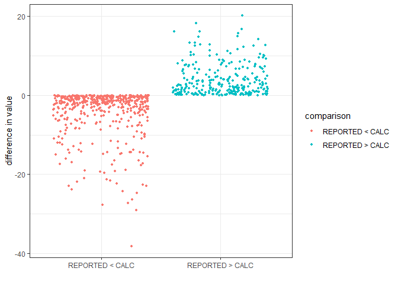

Analysis of Fishing Landings dataset
================
Author: Emma Strand; <emma_strand@uri.edu>

## Prior Scripts

QC:
<https://github.com/emmastrand/Kenya_SamakiSalama/blob/main/FishLandings/scripts/QC.md>

## <a name="data"></a> **Reading in datafiles**

``` r
library(plyr)
library(dplyr)
library(tidyverse)
library(ggplot2)
library(readxl)
library(lubridate)
library(Hmisc)
library(writexl)
library(naniar)
library(Rmisc)
library(stats)
library(lme4)
library(car)
library(forcats)
library(ggstatsplot)
library(ggridges)
library(ggbreak)
library(emmeans)
```

## Read in the data frame that is the output of the QC script.

Summary information so far: 741 total surveys, 591 unmodified traps, 150
modified traps.

``` r
# read in excel file
## 4,508 rows x 25 variables (this should match the final version of QC script)
data <- read_excel("data/cleaned-Fishlandings-data-FEB 2023 JMCC.xlsx") #read in excel file 

# creating new columns with month year and date
## survey ID is master identifier that is based on `date_collected_dd_mm_yyyy` column 
data <- data %>% 
  separate(date_collected_dd_mm_yyyy, c("year", "month", "day"), remove = FALSE) 

#changing this column to numeric instead of a character (needed for next fxn)
data$month <- as.numeric(data$month) 
#changing numeric months to month names
data$month <- month.abb[data$month] 
# changing levels of month (important for figures later on); only first three letter of month 
data$month <- factor(data$month, levels=c("Jan", "Feb","Mar","Apr","May","Jun",
                                          "Jul", "Aug", "Sep", "Oct", "Nov", "Dec"))
```

## Metadata summary information

**Modified traps Uyombo, Mayungu (BMUs)** - 150 surveys - 2021:
September, August, November  
- 2022: February, March, April  
- Data collected by: CLAPERTON KAZUNGU, CELESTINE N. ALI, KADZO BAYA  
- Four landing sites: UYOMBO, MAYUNGU, MAWE YA KATI, KIVULINI - 49
fishers involved / 69 fishers total - Destinations: Fish dealer, Home,
Mama Karanga

**Unmodified traps in Uyombo, Mayungu (BMUs)**  
- 591 surveys - 2021: May, June, July, August, September, October,
November, December  
- 2022: February, March, April  
- Data collected by: CLAPERTON KAZUNGU, CELESTINE N. ALI, KADZO BAYA  
- Four landing sites: UYOMBO, MAYUNGU, MAWE YA KATI, KIVULINI - 64
fishers involved / 69 fishers total - Destinations: Fish dealer, Home,
Mama Karanga, Gift, Other

``` r
## modified: 546 rows from 150 unique surveys 
## unmodified: 3,962 rows from 591 surveys 

unmodified_metadata <- data %>% subset(trap_type == "UNMODIFIED") %>%
  unite(yearmonth, year, month, sep = " ", remove = FALSE)

modified_metadata <- data %>% subset(trap_type == "MODIFIED") %>%
  unite(yearmonth, year, month, sep = " ", remove = FALSE)

# unique(modified_metadata$destination)
# unique(unmodified_metadata$survey_id)
```

## Check ranges and add filters

79 unique species total: 31 of those found in modified traps and 78 of
those found in unmodified traps

``` r
range(data$total_traps_collected) ## 1-16 traps used 
```

    ## [1]  1 16

``` r
range(data$total_biomass_kg) ## 0.3 kg - 24 kg 
```

    ## [1]  0.3 24.0

``` r
range(data$total_value_KES) ## 60 KES - 4800 KES 
```

    ## [1]   60 4800

``` r
range(data$`No. of fishers in crew`) ## 1 - 6 fishermen involved with 1 representative survey per catch 
```

    ## [1] 1 6

``` r
range(data$number_of_fish) ## 1 - 19 fish caught per species caught 
```

    ## [1]  1 19

``` r
unique(data$length_corrected)
```

    ## [1] "26-30" "16-20" "31-35" "11-15" "21-25" "36-40" "41-45" "46-50" "51-60"

``` r
#unique(data$scientific_name)
#unique(unmodified_metadata$scientific_name)
```

### Editing modified and unmodified to experimental and control traps

``` r
data <- data %>%
  mutate(trap_type = case_when(
    trap_type == "MODIFIED" ~ "Experimental",
    trap_type == "UNMODIFIED" ~ "Control"))
```

### Additional filtering of non-realistic data

1.  Survey id `2022-02-11 12:37:00 SS/MAY/SB/035/FF` appears to set trap
    and collect at the same time in 2 locations so removing the location
    with the non-realistic CPUE of above 40.

``` r
## PRE FILTER 4,508 rows
## POST FILTER 4,498 rows (confirmed only the below was taken outs)
data <- data %>% 
  subset(!landing_site == "MAYUNGU" | !survey_id == "2022-02-11 12:37:00 SS/MAY/SB/035/FF")
```

## Calculating total catch per trap (CPUE)

``` r
data2 <- data %>%
  # group by survey id
  dplyr::group_by(survey_id, trap_type) %>% 
  # count the number of fish caught for each survey id
  mutate(total_catch = sum(number_of_fish),
  # catch per unit effort (# of traps)
         CPUE = total_catch/total_traps_collected)

range(data2$total_catch) ## 1 - 114 fish 
```

    ## [1]   1 114

``` r
range(data2$CPUE) ## 0.25 - 16.00 fish per trap 
```

    ## [1]  0.25 16.00

``` r
# data2 %>% dplyr::select(survey_id, trap_type, CPUE) %>% distinct() %>%
#   ggplot(., aes(x=trap_type, y=CPUE)) + geom_boxplot(outlier.shape = NA) +
#   geom_jitter(alpha=0.2, size=0.6, width=0.25, color="gray50") + theme_bw()
```

### Statistics on the above.

Default of t.test in R is a Welch t-test which is just an adaptation of
t-test, and it is used when the two samples have possibly unequal
variances. Use var.equal = TRUE or FALSE to specifiy the variances of
the dataset.

You can test equal variances with a Fisher’s F-test. If p \< 0.05 then
we include var.equal = FALSE in below ttest. If p \> 0.05 then we
include var.equal = TRUE in below ttest.

``` r
data2_CPUE <- data2 %>% dplyr::select(survey_id, BMU, trap_type, CPUE) %>% distinct()

exp_CPUE <- data2_CPUE %>% subset(trap_type == "Experimental") ## 150 data points
con_CPUE <- data2_CPUE %>% subset(trap_type == "Control") ## 591 data points 

var.test(exp_CPUE$CPUE, con_CPUE$CPUE) 
```

    ## 
    ##  F test to compare two variances
    ## 
    ## data:  exp_CPUE$CPUE and con_CPUE$CPUE
    ## F = 0.72888, num df = 149, denom df = 590, p-value = 0.0196
    ## alternative hypothesis: true ratio of variances is not equal to 1
    ## 95 percent confidence interval:
    ##  0.5704406 0.9497665
    ## sample estimates:
    ## ratio of variances 
    ##          0.7288769

``` r
## p-value = 0.0196; ratio = 0.7288769
t.test(CPUE~trap_type, data = data2_CPUE, var.equal = FALSE)
```

    ## 
    ##  Welch Two Sample t-test
    ## 
    ## data:  CPUE by trap_type
    ## t = 0.60851, df = 262.79, p-value = 0.5434
    ## alternative hypothesis: true difference in means between group Control and group Experimental is not equal to 0
    ## 95 percent confidence interval:
    ##  -0.2707560  0.5129543
    ## sample estimates:
    ##      mean in group Control mean in group Experimental 
    ##                   3.307210                   3.186111

``` r
## p-value = 0.5434 

CPUE_per_trap_stats <- summarySE(data2_CPUE, measurevar = c("CPUE"), groupvars = c("trap_type", "BMU"))
CPUE_per_trap_stats2 <- summarySE(data2_CPUE, measurevar = c("CPUE"), groupvars = c("trap_type"))

CPUE_plot <- CPUE_per_trap_stats %>%
  ggplot(., aes(x=BMU, y=CPUE, fill=trap_type, group=trap_type)) + theme_bw() +
  geom_errorbar(aes(x=BMU, y=CPUE, ymin=CPUE-se, ymax=CPUE+se), 
                position=position_dodge(0.3), alpha=0.9, size=0.5, width=0.1) +
  geom_point(size=2, shape=21, position=position_dodge(0.3)) + scale_fill_manual(values = c("black", "white"))
```

    ## Warning: Using `size` aesthetic for lines was deprecated in ggplot2 3.4.0.
    ## ℹ Please use `linewidth` instead.
    ## This warning is displayed once every 8 hours.
    ## Call `lifecycle::last_lifecycle_warnings()` to see where this warning was
    ## generated.

``` r
ggsave(file="output/CPUE.png", CPUE_plot, width = 4, height = 3.5, units = c("in"))

CPUE_plot2 <- CPUE_per_trap_stats2 %>%
  ggplot(., aes(x=trap_type, y=CPUE, fill=trap_type, group=trap_type)) + theme_bw() +
  geom_errorbar(aes(x=trap_type, y=CPUE, ymin=CPUE-se, ymax=CPUE+se), 
                position=position_dodge(0.3), alpha=0.9, size=0.5, width=0.2) + ylim(2.85,3.6) +
  geom_point(size=3, shape=21, position=position_dodge(0.3)) + scale_fill_manual(values = c("black", "white"))

ggsave(file="output/CPUE2.png", CPUE_plot2, width = 4, height = 3.5, units = c("in"))
```

## Calculating (reported) yield per trap

``` r
data2 <- data2 %>%
  ## this df is still grouped by survey id and trap type 
  # reported yield (kg) per unit effort (# of traps)
  mutate(yield_kg_trap = total_biomass_kg/total_traps_collected)

range(data2$yield_kg_trap) ## 0.057 kg - 5.25 kg 
```

    ## [1] 0.05714286 5.25000000

### Statistics on the above.

``` r
data2_yieldkg <- data2 %>% dplyr::select(survey_id, BMU, trap_type, yield_kg_trap) %>% distinct()

exp_yieldkg <- data2_yieldkg %>% subset(trap_type == "Experimental") ## 150 data points
con_yieldkg <- data2_yieldkg %>% subset(trap_type == "Control") ## 591 data points 

var.test(exp_yieldkg$yield_kg_trap, con_yieldkg$yield_kg_trap) 
```

    ## 
    ##  F test to compare two variances
    ## 
    ## data:  exp_yieldkg$yield_kg_trap and con_yieldkg$yield_kg_trap
    ## F = 0.98162, num df = 149, denom df = 590, p-value = 0.9069
    ## alternative hypothesis: true ratio of variances is not equal to 1
    ## 95 percent confidence interval:
    ##  0.7682416 1.2790993
    ## sample estimates:
    ## ratio of variances 
    ##           0.981616

``` r
## p-value = 0.9069; ratio = 0.981616
t.test(yield_kg_trap~trap_type, data = data2_yieldkg, var.equal = TRUE)
```

    ## 
    ##  Two Sample t-test
    ## 
    ## data:  yield_kg_trap by trap_type
    ## t = -2.0243, df = 739, p-value = 0.0433
    ## alternative hypothesis: true difference in means between group Control and group Experimental is not equal to 0
    ## 95 percent confidence interval:
    ##  -0.222384982 -0.003409729
    ## sample estimates:
    ##      mean in group Control mean in group Experimental 
    ##                  0.8250887                  0.9379861

``` r
## p-value = 0.0433 

yieldkg_per_trap_stats <- summarySE(data2_yieldkg, measurevar = c("yield_kg_trap"), groupvars = c("trap_type"))
yieldkg_per_trap_stats2 <- summarySE(data2_yieldkg, measurevar = c("yield_kg_trap"), groupvars = c("trap_type", "BMU"))

yield_kg_plot <- yieldkg_per_trap_stats %>%
  ggplot(., aes(x=trap_type, y=yield_kg_trap, fill=trap_type, group=trap_type)) + theme_bw() +
  geom_errorbar(aes(x=trap_type, y=yield_kg_trap, ymin=yield_kg_trap-se, ymax=yield_kg_trap+se), 
                position=position_dodge(0.3), alpha=0.9, size=0.5, width=0.1) +
  geom_point(size=4, shape=21, position=position_dodge(0.3)) + scale_fill_manual(values = c("black", "white"))

ggsave(file="output/Yield.png", yield_kg_plot, width = 4, height = 3.5, units = c("in"))

yield_kg_plot2 <- yieldkg_per_trap_stats2 %>%
  ggplot(., aes(x=BMU, y=yield_kg_trap, fill=trap_type, group=trap_type)) + theme_bw() +
  geom_errorbar(aes(x=BMU, y=yield_kg_trap, ymin=yield_kg_trap-se, ymax=yield_kg_trap+se), 
                position=position_dodge(0.3), alpha=0.9, size=0.5, width=0.2) + 
  geom_point(size=2, shape=21, position=position_dodge(0.3)) + scale_fill_manual(values = c("black", "white"))

ggsave(file="output/Yield2.png", yield_kg_plot2, width = 4, height = 3.5, units = c("in"))
```

## Calculating (reported) value per trap

``` r
data2 <- data2 %>%
  ## this df is still grouped by survey id and trap type 
  # reported value (KES) per unit effort (# of traps)
  mutate(value_KES_trap = total_value_KES/total_traps_collected)

range(data2$value_KES_trap) ## 11.42 KES - 1150 KES 
```

    ## [1]   11.42857 1150.00000

### Statistics on the above.

``` r
data2_valueKES <- data2 %>% dplyr::select(survey_id, BMU, trap_type, value_KES_trap) %>% distinct()

exp_valueKES <- data2_valueKES %>% subset(trap_type == "Experimental") ## 150 data points
con_valueKES <- data2_valueKES %>% subset(trap_type == "Control") ## 591 data points 

var.test(exp_valueKES$value_KES_trap, con_valueKES$value_KES_trap) 
```

    ## 
    ##  F test to compare two variances
    ## 
    ## data:  exp_valueKES$value_KES_trap and con_valueKES$value_KES_trap
    ## F = 0.97334, num df = 149, denom df = 590, p-value = 0.8557
    ## alternative hypothesis: true ratio of variances is not equal to 1
    ## 95 percent confidence interval:
    ##  0.7617626 1.2683119
    ## sample estimates:
    ## ratio of variances 
    ##          0.9733375

``` r
## p-value = 0.8557; ratio = 0.9733375
t.test(value_KES_trap~trap_type, data = data2_valueKES, var.equal = TRUE)
```

    ## 
    ##  Two Sample t-test
    ## 
    ## data:  value_KES_trap by trap_type
    ## t = -2.1439, df = 739, p-value = 0.03236
    ## alternative hypothesis: true difference in means between group Control and group Experimental is not equal to 0
    ## 95 percent confidence interval:
    ##  -46.229197  -2.034566
    ## sample estimates:
    ##      mean in group Control mean in group Experimental 
    ##                   163.5565                   187.6883

``` r
## p-value = 0.03236 

valueKES_per_trap_stats <- summarySE(data2_valueKES, measurevar = c("value_KES_trap"), groupvars = c("trap_type"))
valueKES_per_trap_stats2 <- summarySE(data2_valueKES, measurevar = c("value_KES_trap"), groupvars = c("trap_type", "BMU"))

value_KES_plot <- valueKES_per_trap_stats %>%
  ggplot(., aes(x=trap_type, y=value_KES_trap, fill=trap_type, group=trap_type)) + theme_bw() +
  geom_errorbar(aes(x=trap_type, y=value_KES_trap, ymin=value_KES_trap-se, ymax=value_KES_trap+se), 
                position=position_dodge(0.3), alpha=0.9, size=0.5, width=0.1) +
  geom_point(size=4, shape=21, position=position_dodge(0.3)) + scale_fill_manual(values = c("black", "white"))

ggsave(file="output/Value.png", value_KES_plot, width = 4, height = 3.5, units = c("in"))

value_KES_plot2 <- valueKES_per_trap_stats2 %>%
  ggplot(., aes(x=BMU, y=value_KES_trap, fill=trap_type, group=trap_type)) + theme_bw() +
  geom_errorbar(aes(x=BMU, y=value_KES_trap, ymin=value_KES_trap-se, ymax=value_KES_trap+se), 
                position=position_dodge(0.3), alpha=0.9, size=0.5, width=0.2) + 
  geom_point(size=2, shape=21, position=position_dodge(0.3)) + scale_fill_manual(values = c("black", "white"))

ggsave(file="output/Value2.png", value_KES_plot2, width = 4, height = 3.5, units = c("in"))
```

## Calculating median length

``` r
data2 <- data2 %>% ungroup() %>%
  mutate(median_length = case_when(
    length_corrected == "0-10" ~ 5,
    length_corrected == "11-15" ~ 13,
    length_corrected == "16-20" ~ 18,
    length_corrected == "21-25" ~ 23,
    length_corrected == "26-30" ~ 28,
    length_corrected == "31-35" ~ 33,
    length_corrected == "36-40" ~ 38,
    length_corrected == "41-45" ~ 43,
    length_corrected == "46-50" ~ 48,
    length_corrected == "51-60" ~ 55.5,
    length_corrected == "61-70" ~ 65.5,
    length_corrected == "71-80" ~ 75.5,
    length_corrected == "81-90" ~ 85.5,
    length_corrected == ">90" ~ 100 ### circle back to what value to use here
  )) 

hist(data2$median_length) ## majority fall within 10-40 cm 
```

<!-- -->

### Statistics on the above.

``` r
data2_length <- data2 %>% dplyr::select(survey_id, BMU, trap_type, scientific_name, number_of_fish, median_length) %>% 
  ### transforms so that e.g. 14 siganus sutor is now 14 rows
  tidyr::uncount(., number_of_fish, .remove = TRUE) %>% 
  filter(!is.na(median_length))

exp_length <- data2_length %>% subset(trap_type == "Experimental") ## 2,428 data points (many fish per survey)
con_length <- data2_length %>% subset(trap_type == "Control") ## 15,396 data points (many fish per survey)

var.test(exp_length$median_length, con_length$median_length) 
```

    ## 
    ##  F test to compare two variances
    ## 
    ## data:  exp_length$median_length and con_length$median_length
    ## F = 0.71281, num df = 2427, denom df = 15395, p-value < 2.2e-16
    ## alternative hypothesis: true ratio of variances is not equal to 1
    ## 95 percent confidence interval:
    ##  0.6713853 0.7578146
    ## sample estimates:
    ## ratio of variances 
    ##          0.7128101

``` r
## p-value < 2.2e-16; ratio = 0.7128101
t.test(median_length~trap_type, data = data2_length, var.equal = FALSE)
```

    ## 
    ##  Welch Two Sample t-test
    ## 
    ## data:  median_length by trap_type
    ## t = -38.105, df = 3592, p-value < 2.2e-16
    ## alternative hypothesis: true difference in means between group Control and group Experimental is not equal to 0
    ## 95 percent confidence interval:
    ##  -4.591064 -4.141730
    ## sample estimates:
    ##      mean in group Control mean in group Experimental 
    ##                   25.28826                   29.65465

``` r
## p-value < 2.2e-16

length_stats <- summarySE(data2_length, measurevar = c("median_length"), groupvars = c("trap_type"))
length_stats2 <- summarySE(data2_length, measurevar = c("median_length"), groupvars = c("trap_type", "BMU"))

length_plot <- length_stats %>%
  ggplot(., aes(x=trap_type, y=median_length, fill=trap_type, group=trap_type)) + theme_bw() +
  geom_errorbar(aes(x=trap_type, y=median_length, ymin=median_length-se, ymax=median_length+se), 
                position=position_dodge(0.3), alpha=0.9, size=0.5, width=0.1) + 
  scale_y_break(c(25.45, 29.5)) + ylim(25.15,29.85) +
  geom_point(size=3, shape=21, position=position_dodge(0.3)) + scale_fill_manual(values = c("black", "white"))

ggsave(file="output/Length.png", length_plot, width = 4.5, height = 3.5, units = c("in"))

length_plot2 <- length_stats2 %>%
  ggplot(., aes(x=BMU, y=median_length, fill=trap_type, group=trap_type)) + theme_bw() +
  geom_errorbar(aes(x=BMU, y=median_length, ymin=median_length-se, ymax=median_length+se), 
                position=position_dodge(0.3), alpha=0.9, size=0.5, width=0.1) +
  geom_point(size=1, shape=21, position=position_dodge(0.3)) + scale_fill_manual(values = c("black", "white"))

ggsave(file="output/Length2.png", length_plot2, width = 4, height = 3.5, units = c("in"))
```

## Calculating take home metrics

Use 2021-08-13 12:13:00 SS/MAY/SB/026/FF to double check calculations

``` r
data2 <- data2 %>% dplyr::group_by(survey_id, trap_type, destination) %>%   
  mutate(no_perdestination = sum(number_of_fish),
         percent_perdestination = no_perdestination/total_catch*100)

data2_takehome <- data2 %>% 
  dplyr::select(survey_id, BMU, trap_type, destination, percent_perdestination) %>% 
  distinct() %>% subset(destination == "HOME")

takehome_stats <- summarySE(data2_takehome, measurevar = c("percent_perdestination"), groupvars = c("trap_type"))
takehome_stats2 <- summarySE(data2_takehome, measurevar = c("percent_perdestination"), groupvars = c("trap_type", "BMU"))

exp_takehome <- data2_takehome %>% subset(trap_type == "Experimental") ## 40 data points (multiple destinations)
con_takehome <- data2_takehome %>% subset(trap_type == "Control") ## 352 data points (multiple destinations)

var.test(exp_takehome$percent_perdestination, con_takehome$percent_perdestination) 
```

    ## 
    ##  F test to compare two variances
    ## 
    ## data:  exp_takehome$percent_perdestination and con_takehome$percent_perdestination
    ## F = 3.4214, num df = 39, denom df = 351, p-value = 1.068e-09
    ## alternative hypothesis: true ratio of variances is not equal to 1
    ## 95 percent confidence interval:
    ##  2.229023 5.745881
    ## sample estimates:
    ## ratio of variances 
    ##           3.421355

``` r
## p-value = 1.068e-09; ratio = 3.421355
t.test(percent_perdestination~trap_type, data = data2_takehome, var.equal = FALSE)
```

    ## 
    ##  Welch Two Sample t-test
    ## 
    ## data:  percent_perdestination by trap_type
    ## t = -3.0569, df = 41.629, p-value = 0.003897
    ## alternative hypothesis: true difference in means between group Control and group Experimental is not equal to 0
    ## 95 percent confidence interval:
    ##  -17.485794  -3.576978
    ## sample estimates:
    ##      mean in group Control mean in group Experimental 
    ##                   16.34073                   26.87211

``` r
## p-value 0.003897

takehome_plot <- takehome_stats %>%
  ggplot(., aes(x=trap_type, y=percent_perdestination, fill=trap_type, group=trap_type)) + theme_bw() +
  geom_errorbar(aes(x=trap_type, y=percent_perdestination, ymin=percent_perdestination-se, ymax=percent_perdestination+se), 
                position=position_dodge(0.3), alpha=0.9, size=0.5, width=0.1) + ylim(15,33) +
  geom_point(size=3, shape=21, position=position_dodge(0.3)) + scale_fill_manual(values = c("black", "white"))

takehome_plot2 <- takehome_stats2 %>%
  ggplot(., aes(x=BMU, y=percent_perdestination, fill=trap_type, group=trap_type)) + theme_bw() +
  geom_errorbar(aes(x=BMU, y=percent_perdestination, ymin=percent_perdestination-se, ymax=percent_perdestination+se), 
                position=position_dodge(0.3), alpha=0.9, size=0.5, width=0.1) +
  geom_point(size=2, shape=21, position=position_dodge(0.3)) + scale_fill_manual(values = c("black", "white"))

ggsave(file="output/Take_Home.png", takehome_plot, width = 4, height = 3.5, units = c("in"))
ggsave(file="output/Take_Home2.png", takehome_plot2, width = 4, height = 3.5, units = c("in"))
```

## Calculating species data

73 total species of fish caught (`species_list` is output). 31 species
from 12 families found in experimental traps. 72 species from 18
families found in control traps.

Produces species counts for each type of trap. Top 5:

**Control** for 591 surveys 1: Siganus sutor (6,963)  
2: Leptoscarus vaigiensis (1,887)  
3: Lethrinus nebulosus (1,074)  
4: Scarus ghobban (1,042) 5: Scarus rubroviolaceus (765)

**Experimental** for 150 surveys 1: Siganus sutor (1,818) 2: Scarus
ghobban (124) 3: Lethrinus nebulosus (113) 4: Siganus canaliculatus (84)
5: Parupeneus macronemus (50)

``` r
spp_df <- data2 %>% ungroup() %>%
  group_by(scientific_name, trap_type) %>%
  ## this df is still grouped by survey id and trap type 
  # reported value (KES) per unit effort (# of traps)
  mutate(spp_count = sum(number_of_fish)) %>% 
  dplyr::select(scientific_name, trap_type, spp_count) %>% distinct() %>% ungroup()

spp_df_mod <- spp_df %>% subset(trap_type == "Experimental") %>% dplyr::select(scientific_name) %>% distinct()
spp_df_unmod <- spp_df %>% subset(trap_type == "Control") %>% dplyr::select(scientific_name) %>% distinct()

species_list <- spp_df %>% dplyr::select(scientific_name) %>% distinct()
species_list %>% write.csv("data/full_species_list.csv")
```

## Loading Galligan and FishBase dataset

Most species in the list above have metadata below.

``` r
fishbase_lifehistory <- read_excel("data/fishbase.xlsx", sheet = "life history") %>% #read in excel file 
  select(scientific_name, Lm, Lmax) %>% dplyr::rename(Lmat_fishbase = Lm) %>% dplyr::rename(Lmax_fishbase = Lmax) 

# rows that appear in species_list but not fishbase_lifehistory
## checking which fish I still need Fishbase information for (44 species)
# dplyr::setdiff(species_list, fishbase_lifehistory) %>% write.csv("data/add_fishbase_info.csv")

fishbase_biomass <- read_excel("data/fishbase.xlsx", sheet = "biomass") %>%
  dplyr::select(scientific_name, a, b)

fishbase <- full_join(fishbase_lifehistory, fishbase_biomass, by = "scientific_name")

galligan <- read.csv("data/SpeciesData_GatedTraps_Galligan_edited.csv", header=TRUE, sep = ",") %>%
  dplyr::rename(scientific_name = Species) #%>% dplyr::select(., scientific_name)
# dplyr::setdiff(species_list, galligan) 
### 11 fish found in our dataset that are not found in Galligan dataset 
## these won't be included in the nutrient or revenue analysis
## I think this is OK b/c all species have 113 or lower than 40 total catch

metadata <- full_join(fishbase, galligan, by = "scientific_name")

Lmat_check <- metadata %>% dplyr::select(scientific_name, Lmat_fishbase, Lmat_cm) %>%
  mutate(Lmat_difference = Lmat_fishbase-Lmat_cm) 
```

### Calculating number of families that appear in each type of trap

``` r
left_join(spp_df_unmod, metadata, by = "scientific_name") %>%
  dplyr::select(Family) %>% distinct() %>% na.omit()
```

    ## # A tibble: 18 × 1
    ##    Family        
    ##    <chr>         
    ##  1 Siganidae     
    ##  2 Haemulidae    
    ##  3 Acanthuridae  
    ##  4 Lethrinidae   
    ##  5 Scaridae      
    ##  6 Lutjanidae    
    ##  7 Mullidae      
    ##  8 Serranidae    
    ##  9 Carangidae    
    ## 10 Chaetodontidae
    ## 11 Labridae      
    ## 12 Pomacentridae 
    ## 13 Plotosidae    
    ## 14 Pomacanthidae 
    ## 15 Holocentridae 
    ## 16 Balistidae    
    ## 17 Monacanthidae 
    ## 18 Priacanthidae

``` r
## 18 families caught in control traps 

left_join(spp_df_mod, metadata, by = "scientific_name") %>%
  dplyr::select(Family) %>% distinct() %>% na.omit()
```

    ## # A tibble: 12 × 1
    ##    Family        
    ##    <chr>         
    ##  1 Siganidae     
    ##  2 Mullidae      
    ##  3 Haemulidae    
    ##  4 Lethrinidae   
    ##  5 Acanthuridae  
    ##  6 Scaridae      
    ##  7 Balistidae    
    ##  8 Chaetodontidae
    ##  9 Carangidae    
    ## 10 Serranidae    
    ## 11 Lutjanidae    
    ## 12 Plotosidae

``` r
## 12 families caught in experimental traps 
```

### Calculating species richness

Use 2021-08-13 12:13:00 SS/MAY/SB/026/FF to double check calculationss

``` r
data2 <- data2 %>% group_by(survey_id, trap_type) %>%
  mutate(richness = n_distinct(scientific_name),
         richness_trap = richness/total_traps_collected)

range(data2$richness) ## 1 - 14 different species in one survey 
```

    ## [1]  1 14

``` r
range(data2$richness_trap) ## 0.0625 - 6.0000 different species in one survey 
```

    ## [1] 0.0625 6.0000

``` r
richnessdf <- data2 %>% dplyr::select(survey_id, BMU, trap_type, richness, richness_trap) %>% distinct()

richness_stats <- summarySE(richnessdf, measurevar = c("richness"), groupvars = c("trap_type"))
richness_stats2 <- summarySE(richnessdf, measurevar = c("richness"), groupvars = c("trap_type", "BMU"))

richness_trap_stats <- summarySE(richnessdf, measurevar = c("richness_trap"), groupvars = c("trap_type"))
richness_trap_stats2 <- summarySE(richnessdf, measurevar = c("richness_trap"), groupvars = c("trap_type", "BMU"))

#### RICHNESS 
richness_plot <- richness_stats %>%
  ggplot(., aes(x=trap_type, y=richness, fill=trap_type, group=trap_type)) + theme_bw() +
  geom_errorbar(aes(x=trap_type, y=richness, ymin=richness-se, ymax=richness+se), 
                position=position_dodge(0.3), alpha=0.9, size=0.5, width=0.1) + ylim(1.8,4.7) +
  geom_point(size=2, shape=21, position=position_dodge(0.3)) + scale_fill_manual(values = c("black", "white"))

ggsave(file="output/Richness.png", richness_plot, width = 4, height = 3.5, units = c("in"))

richness_plot2 <- richness_stats2 %>%
  ggplot(., aes(x=BMU, y=richness, fill=trap_type, group=trap_type)) + theme_bw() +
  geom_errorbar(aes(x=BMU, y=richness, ymin=richness-se, ymax=richness+se), 
                position=position_dodge(0.3), alpha=0.9, size=0.5, width=0.1) +
  geom_point(size=2, shape=21, position=position_dodge(0.3)) + scale_fill_manual(values = c("black", "white"))

ggsave(file="output/Richness2.png", richness_plot2, width = 4, height = 3.5, units = c("in"))

#### RICHNESS PER TRAP 
richness_trap_plot <- richness_trap_stats %>%
  ggplot(., aes(x=trap_type, y=richness_trap, fill=trap_type, group=trap_type)) + theme_bw() +
  geom_errorbar(aes(x=trap_type, y=richness_trap, ymin=richness_trap-se, ymax=richness_trap+se), 
                position=position_dodge(0.3), alpha=0.9, size=0.5, width=0.1) + ylim(0.4,0.65) +
  geom_point(size=3, shape=21, position=position_dodge(0.3)) + scale_fill_manual(values = c("black", "white"))

ggsave(file="output/Richness_trap.png", richness_trap_plot, width = 4, height = 3.5, units = c("in"))

richness_trap_plot2 <- richness_trap_stats2 %>%
  ggplot(., aes(x=BMU, y=richness_trap, fill=trap_type, group=trap_type)) + theme_bw() +
  geom_errorbar(aes(x=BMU, y=richness_trap, ymin=richness_trap-se, ymax=richness_trap+se), 
                position=position_dodge(0.3), alpha=0.9, size=0.5, width=0.1) +
  geom_point(size=2, shape=21, position=position_dodge(0.3)) + scale_fill_manual(values = c("black", "white"))

ggsave(file="output/Richness_trap2.png", richness_trap_plot2, width = 4, height = 3.5, units = c("in"))

# richness_aov <- aov(richness~trap_type*BMU, data=richnessdf)
# summary(richness_aov)
# TukeyHSD(richness_aov)

exp_richness <- richnessdf %>% subset(trap_type == "Experimental") ## 150 data points (multiple destinations)
con_richness <- richnessdf %>% subset(trap_type == "Control") ## 591 data points (multiple destinations)

var.test(exp_richness$richness, con_richness$richness) 
```

    ## 
    ##  F test to compare two variances
    ## 
    ## data:  exp_richness$richness and con_richness$richness
    ## F = 0.29305, num df = 149, denom df = 590, p-value < 2.2e-16
    ## alternative hypothesis: true ratio of variances is not equal to 1
    ## 95 percent confidence interval:
    ##  0.2293500 0.3818608
    ## sample estimates:
    ## ratio of variances 
    ##          0.2930505

``` r
## p-value < 2.2e-16; ratio = 0.2930505
t.test(richness~trap_type, data = richnessdf, var.equal = FALSE)
```

    ## 
    ##  Welch Two Sample t-test
    ## 
    ## data:  richness by trap_type
    ## t = 18.173, df = 436.22, p-value < 2.2e-16
    ## alternative hypothesis: true difference in means between group Control and group Experimental is not equal to 0
    ## 95 percent confidence interval:
    ##  2.071149 2.573453
    ## sample estimates:
    ##      mean in group Control mean in group Experimental 
    ##                   4.375635                   2.053333

``` r
## p-value 7.052e-14
```

## Calculating maturity

**Control traps**:  
- 8,335 mature fish caught (54.19%) and 7,047 immature fish caught
(45.81%)  
- 15,382 total

**Experimental traps**:  
- 1,775 mature fish caught (73.11%) and 653 immature fish caught
(26.89%)  
- 2,428 total

``` r
## data2 pre merge = 4,498 x 31
## data2 post merge = 4,498 x 78 [with left join this only keep metadata for fish found in our surveys]
## metadata 227 x 48 columns 
data2 <- left_join(data2, metadata, by = "scientific_name")

## Lmaturity 
data2 <- data2 %>% 
  ### use Lmat_cm from Galligan 
  mutate(Lmat_corrected = if_else(is.na(Lmat_cm), Lmat_fishbase, Lmat_cm)) %>%
  ### categorizing mature or immature 
  mutate(maturity = if_else(median_length >= Lmat_corrected, "mature", "immature")) %>%
  ### calculating distance from Lmat
  mutate(length_dist = median_length-Lmat_corrected) 

## calculating total numbers for stats above 
data2 %>% dplyr::select(survey_id, trap_type, scientific_name, number_of_fish, maturity) %>% 
  group_by(trap_type, maturity) %>% 
  filter(!is.na(maturity)) %>%
  mutate(sum = sum(number_of_fish)) %>%
  dplyr::select(trap_type, maturity, sum) %>% distinct()
```

    ## # A tibble: 4 × 3
    ## # Groups:   trap_type, maturity [4]
    ##   trap_type    maturity   sum
    ##   <chr>        <chr>    <dbl>
    ## 1 Control      mature    8335
    ## 2 Control      immature  7047
    ## 3 Experimental mature    1775
    ## 4 Experimental immature   653

``` r
## calculating stats for distance from maturity 
data2_maturity <- data2 %>% 
  dplyr::select(survey_id, trap_type, scientific_name, number_of_fish, maturity, length_dist) %>%
  tidyr::uncount(., number_of_fish, .remove = TRUE) %>% 
  filter(!is.na(length_dist))
```

### Calculating statistics for distance from maturity

``` r
exp_maturity <- data2_maturity %>% subset(trap_type == "Experimental") ## 2,428 data points (many fish per survey)
con_maturity <- data2_maturity %>% subset(trap_type == "Control") ## 15,382 data points (many fish per survey)

var.test(exp_maturity$length_dist, con_maturity$length_dist) 
```

    ## 
    ##  F test to compare two variances
    ## 
    ## data:  exp_maturity$length_dist and con_maturity$length_dist
    ## F = 0.71107, num df = 2427, denom df = 15381, p-value < 2.2e-16
    ## alternative hypothesis: true ratio of variances is not equal to 1
    ## 95 percent confidence interval:
    ##  0.6697397 0.7559628
    ## sample estimates:
    ## ratio of variances 
    ##          0.7110657

``` r
## p-value < 2.2e-16; ratio = 0.7110657

data2_maturity_mature <- data2_maturity %>% subset(maturity == "mature")
data2_maturity_immature <- data2_maturity %>% subset(maturity == "immature")

t.test(length_dist~trap_type, data = data2_maturity_mature, var.equal = FALSE)
```

    ## 
    ##  Welch Two Sample t-test
    ## 
    ## data:  length_dist by trap_type
    ## t = -1.7179, df = 2610.3, p-value = 0.08593
    ## alternative hypothesis: true difference in means between group Control and group Experimental is not equal to 0
    ## 95 percent confidence interval:
    ##  -0.48986929  0.03235536
    ## sample estimates:
    ##      mean in group Control mean in group Experimental 
    ##                   7.065542                   7.294299

``` r
## p-value 0.08593
t.test(length_dist~trap_type, data = data2_maturity_immature, var.equal = FALSE)
```

    ## 
    ##  Welch Two Sample t-test
    ## 
    ## data:  length_dist by trap_type
    ## t = -15.671, df = 956.81, p-value < 2.2e-16
    ## alternative hypothesis: true difference in means between group Control and group Experimental is not equal to 0
    ## 95 percent confidence interval:
    ##  -2.169874 -1.686901
    ## sample estimates:
    ##      mean in group Control mean in group Experimental 
    ##                  -5.774060                  -3.845672

``` r
## p-value < 2.2e-16

t.test(length_dist~trap_type, data = data2_maturity, var.equal = FALSE)
```

    ## 
    ##  Welch Two Sample t-test
    ## 
    ## data:  length_dist by trap_type
    ## t = -20.592, df = 3596.2, p-value < 2.2e-16
    ## alternative hypothesis: true difference in means between group Control and group Experimental is not equal to 0
    ## 95 percent confidence interval:
    ##  -3.411541 -2.818367
    ## sample estimates:
    ##      mean in group Control mean in group Experimental 
    ##                   1.183298                   4.298252

``` r
## p-value < 2.2e-16

maturity_stats <- summarySE(data2_maturity, measurevar = c("length_dist"), 
                            groupvars = c("trap_type", "scientific_name")) %>% filter(!N<3)
```

    ## Warning in qt(conf.interval/2 + 0.5, datac$N - 1): NaNs produced

``` r
maturity_stats2 <- summarySE(data2_maturity, measurevar = c("length_dist"), groupvars = c("trap_type"))
```

### Constructing maturity figure

``` r
maturity_plot <- maturity_stats %>%
  # filters out the observations aren't in both categories 
  # (takes out species that only have 1 unique mean dist value so only 1 trap type)
  group_by(scientific_name) %>%
  dplyr::filter(n_distinct(length_dist) >= 2) %>% 
  ungroup() %>%
  mutate(scientific_name = fct_reorder(scientific_name, desc(N))) %>%
  ggplot(., aes(x=fct_rev(scientific_name), y=length_dist, fill=trap_type)) + 
  coord_flip() +
  scale_fill_manual(values = c("black", "white")) +
  geom_hline(yintercept = 0, lty = "dotted") +
  theme(axis.text.x = element_text(face = "italic"),
        axis.text.y = element_text(margin = margin(t = 0, r = 10, b = 0, l = 0))) +
  geom_line(aes(group = scientific_name), color="grey14") +
  geom_point(size=2, shape=21) + theme_bw() + 
  #geom_errorbar(aes(x=trap_type, y=length_dist, ymin=length_dist-se, ymax=length_dist+se)) +
  labs(y="Distance from Lmat (cm)", x="", fill="Trap Type") 

ggsave(file="output/Maturity.png", maturity_plot, width = 7, height = 6, units = c("in"))
```

## Calculating length frequency distribution

``` r
# re factoring the length column 
data2$length_corrected <- factor(data2$length_corrected, levels=c("0-10", "11-15","16-20","21-25","26-30",
                                                                        "31-35","36-40","41-45", "46-50", "51-60",
                                                                        "61-70", "71-80", "81-90", ">90"))

## creating dataframe for length frequency 
data2_length_frequency <- data2 %>% 
  select(survey_id, trap_type, scientific_name, number_of_fish, length_corrected, median_length, 
         maturity, Lmat_corrected) %>%
  #subset(trap_type == "Control") %>%
  #subset(trap_type == "Experimental") %>%
  subset(scientific_name == "Siganus sutor" | 
           scientific_name == "Scarus ghobban" |
           scientific_name == "Lethrinus nebulosus" |
           scientific_name == "Scarus rubroviolaceus" |
           scientific_name == "Siganus canaliculatus") %>% 
  group_by(scientific_name) %>%
  mutate(n = sum(number_of_fish)) %>%
  #dplyr::filter(n_distinct(trap_type) >= 2) %>% 
  ungroup() %>%
  tidyr::uncount(., number_of_fish, .remove = TRUE) 

species_list_order <- data2_length_frequency %>% dplyr::select(scientific_name, n) %>% distinct()

data2_length_frequency$scientific_name <- factor(data2_length_frequency$scientific_name, 
                                                 levels = c("Siganus sutor", 
                                                            "Scarus ghobban",
                                                            "Lethrinus nebulosus",
                                                            "Scarus rubroviolaceus",
                                                            "Siganus canaliculatus")) 
  
length_frequency_plot <- data2_length_frequency %>% subset(trap_type == "Experimental") %>%
  ggplot(., aes(x=length_corrected, fill=trap_type)) +
    geom_histogram(color="black", alpha=0.6, position = 'identity', stat="count") +
    scale_fill_manual(values=c("white")) + ### grey80 for control; white for experimental 
    theme_classic() +
    labs(fill="") +
    facet_grid(scientific_name~trap_type, scales = "free_y") +
    theme_bw() + xlab("Length (cm)") + ylab("Frequency") +
    theme(axis.text.x.bottom = element_text(colour = 'black', angle = 60, hjust = 1),
        axis.text.y = element_text(colour = 'black', size = 8, face = 'italic'),
        panel.border = element_blank(),
          panel.grid.major = element_blank(),
          panel.grid.minor = element_blank(),
        strip.text.x = element_text(size = 9, color = "black", face = "bold.italic"),
        axis.line = element_line(colour = "black"),
        axis.title.y = element_text(size = 12, face = "bold", margin = margin(t = 0, r = 10, b = 0, l = 0)),
        axis.title.x = element_text(size = 12, face = "bold", margin = margin(t = 10, r = 0, b = 0, l = 0))) 
```

    ## Warning in geom_histogram(color = "black", alpha = 0.6, position = "identity",
    ## : Ignoring unknown parameters: `binwidth`, `bins`, and `pad`

``` r
ggsave(file="output/Length_frequency_experimental.png", length_frequency_plot, width = 5, height = 8, units = c("in"))
```

### Calculating % fish underneath Lm and sample size per trap type for the figure below

**Siganus sutor**:  
- Control: 59.13% immature (below Lmat) - Experimental: 27.50% immature
(below Lmat)

**Siganus canaliculatus**: - Control: 12.98% immature (below Lmat) -
Experimental: 0% immature (below Lmat)

**Scarus rubroviolaceus**: - Control: 25.49% immature (below Lmat) -
Experimental: 0% immature (below Lmat)

**Scarus ghobban**: - Control: 16.79% immature (below Lmat) -
Experimental: 0% immature (below Lmat)

**Lethrinus nebulosus**: - Control: 99.53% immature (below Lmat) -
Experimental: 98.23% immature (below Lmat)

``` r
maturity_calcs <- data2_length_frequency %>%
  group_by(scientific_name, trap_type) %>%
  mutate(sample_size = n(),
         count_below = sum(median_length <= Lmat_corrected, na.rm=TRUE),
         percent_below = (count_below/sample_size)*100) %>%
 select(scientific_name, Lmat_corrected, trap_type, sample_size, 
         count_below, percent_below) %>% 
  ungroup() %>% distinct()

# double checking the above calculation worked
## cross reference output against dataframe above. 
data2_length_frequency %>% 
  filter(scientific_name == "Siganus sutor", trap_type == "Control") %>%
  count(maturity == "immature") 
```

    ## # A tibble: 2 × 2
    ##   `maturity == "immature"`     n
    ##   <lgl>                    <int>
    ## 1 FALSE                     2846
    ## 2 TRUE                      4117

## Calculating Biomass

W=aL^b

W = Biomass  
L = Length (in our case, median length)  
a = (taken from fishbase) b = (taken from fishbase)

Read in data from fishbase. These units are in cm and grams.

<https://www.fishbase.de/manual/English/FishbaseThe_LENGTH_WEIGHT_table.htm>

``` r
### Switching to data3 which will filter out those fish with no nutrient or a and b values 
data3 <- data2 %>% ungroup() %>%
  ## mutating a and b column to be numeric; this will create NAs b/c not all fish had a and b valueus in fishbase
  mutate_at(c('a', 'b'), as.numeric) %>%
  mutate(W_g = (a*(median_length^b))*number_of_fish,
         W_kg = W_g/1000) %>%
  group_by(survey_id, trap_type) %>%
  filter(!is.na(W_kg)) %>%
  mutate(calculated_total_biomass = sum(W_kg),
         calculated_biomass_pertrap = calculated_total_biomass/total_traps_collected) %>% 
  ungroup()
```

    ## Warning: There were 2 warnings in `mutate()`.
    ## The first warning was:
    ## ℹ In argument: `a = .Primitive("as.double")(a)`.
    ## Caused by warning:
    ## ! NAs introduced by coercion
    ## ℹ Run `dplyr::last_dplyr_warnings()` to see the 1 remaining warning.

``` r
range(data3$calculated_biomass_pertrap) ## 0.03890296 kg - 5.97829841 kg 
```

    ## [1] 0.03890296 5.97829841

### Comparing reported vs. calculated

``` r
data3 %>% 
  select(survey_id, total_biomass_kg, calculated_total_biomass) %>%
  distinct() %>% na.omit() %>%
  mutate(comparison = if_else(total_biomass_kg > calculated_total_biomass, "REPORTED > CALC", "REPORTED < CALC"),
         difference = total_biomass_kg-calculated_total_biomass) %>%
  ggplot(., aes(x=comparison, y=difference)) + theme_bw() +
  geom_jitter(aes(color=comparison), size=1) + xlab("") + ylab("difference in value")
```

<!-- -->

### Statistics on the above.

``` r
data3_calculated_yield <- data3 %>% dplyr::select(survey_id, BMU, trap_type, calculated_biomass_pertrap) %>% distinct()

exp_calculated_yield <- data3_calculated_yield %>% subset(trap_type == "Experimental") ## 150 data points
con_calculated_yield <- data3_calculated_yield %>% subset(trap_type == "Control") ## 591 data points 

var.test(exp_calculated_yield$calculated_biomass_pertrap, con_calculated_yield$calculated_biomass_pertrap) 
```

    ## 
    ##  F test to compare two variances
    ## 
    ## data:  exp_calculated_yield$calculated_biomass_pertrap and con_calculated_yield$calculated_biomass_pertrap
    ## F = 1.535, num df = 149, denom df = 590, p-value = 0.0005297
    ## alternative hypothesis: true ratio of variances is not equal to 1
    ## 95 percent confidence interval:
    ##  1.201322 2.000164
    ## sample estimates:
    ## ratio of variances 
    ##           1.534981

``` r
## p-value = 0.0005297; ratio = 1.534981
t.test(calculated_biomass_pertrap~trap_type, data = data3_calculated_yield, var.equal = FALSE)
```

    ## 
    ##  Welch Two Sample t-test
    ## 
    ## data:  calculated_biomass_pertrap by trap_type
    ## t = -3.264, df = 200.96, p-value = 0.001291
    ## alternative hypothesis: true difference in means between group Control and group Experimental is not equal to 0
    ## 95 percent confidence interval:
    ##  -0.4663454 -0.1150902
    ## sample estimates:
    ##      mean in group Control mean in group Experimental 
    ##                   0.957042                   1.247760

``` r
## p-value = 0.001291

calculated_yield_per_trap_stats <- summarySE(data3_calculated_yield, 
                                     measurevar = c("calculated_biomass_pertrap"), groupvars = c("trap_type"))

calculated_yield_per_trap_stats2 <- summarySE(data3_calculated_yield, 
                                     measurevar = c("calculated_biomass_pertrap"), groupvars = c("trap_type", "BMU"))

calculated_kg_plot <- calculated_yield_per_trap_stats %>%
  ggplot(., aes(x=trap_type, y=calculated_biomass_pertrap, fill=trap_type, group=trap_type)) + theme_bw() +
  geom_errorbar(aes(x=trap_type, y=calculated_biomass_pertrap, 
                    ymin=calculated_biomass_pertrap-se, ymax=calculated_biomass_pertrap+se), 
                position=position_dodge(0.3), alpha=0.9, size=0.5, width=0.1) + ylim(0.9,1.4) +
  #scale_y_break(c(1.1, 1.75)) + ylim(0.9,2.4) +
  geom_point(size=3, shape=21, position=position_dodge(0.3)) + scale_fill_manual(values = c("black", "white"))

ggsave(file="output/Yield_calculated.png", calculated_kg_plot, width = 4, height = 3.5, units = c("in"))

calculated_kg_plot2 <- calculated_yield_per_trap_stats2 %>%
  ggplot(., aes(x=BMU, y=calculated_biomass_pertrap, fill=trap_type, group=trap_type)) + theme_bw() +
  geom_errorbar(aes(x=BMU, y=calculated_biomass_pertrap, ymin=calculated_biomass_pertrap-se, ymax=calculated_biomass_pertrap+se), 
                position=position_dodge(0.3), alpha=0.9, size=0.5, width=0.1) +
  geom_point(size=2, shape=21, position=position_dodge(0.3)) + scale_fill_manual(values = c("black", "white"))

ggsave(file="output/Yield_calculated2.png", calculated_kg_plot2, width = 4, height = 3.5, units = c("in"))
```

## Calculating economic data

Each species group has a KSH per kg value.

``` r
data3 <- data3 %>% 
  ### 1. calculate each species group price 
  mutate(KSHperspp = Price_KSHPerkg*W_kg) %>% group_by(survey_id, trap_type) %>%
  filter(!is.na(KSHperspp)) %>%
  ### 2. calculate total value per survey 
  mutate(KSHpersurvey = sum(KSHperspp), na.rm=TRUE) %>% ungroup() %>%
  ### 3. Divide by total traps collected in that survey to get per trap 
  mutate(KSHpertrap = KSHpersurvey/total_traps_collected, na.rm=TRUE)

range(data3$KSHpertrap) ## 7.404932 KES - 932.642487 KES 
```

    ## [1]   7.404932 932.642487

### Statistics on the above.

``` r
data3_calculated_value <- data3 %>% ungroup() %>%
  dplyr::select(survey_id, BMU, month, trap_type, KSHpertrap) %>% distinct()

exp_calculated_value <- data3_calculated_value %>% subset(trap_type == "Experimental") ## 150 data points
con_calculated_value <- data3_calculated_value %>% subset(trap_type == "Control") ## 591 data points 

var.test(exp_calculated_value$KSHpertrap, con_calculated_value$KSHpertrap) 
```

    ## 
    ##  F test to compare two variances
    ## 
    ## data:  exp_calculated_value$KSHpertrap and con_calculated_value$KSHpertrap
    ## F = 1.489, num df = 149, denom df = 590, p-value = 0.001318
    ## alternative hypothesis: true ratio of variances is not equal to 1
    ## 95 percent confidence interval:
    ##  1.165301 1.940192
    ## sample estimates:
    ## ratio of variances 
    ##           1.488957

``` r
## p-value = 0.001318; ratio = 1.488957
t.test(KSHpertrap~trap_type, data = data3_calculated_value, var.equal = FALSE)
```

    ## 
    ##  Welch Two Sample t-test
    ## 
    ## data:  KSHpertrap by trap_type
    ## t = -4.876, df = 202.64, p-value = 2.184e-06
    ## alternative hypothesis: true difference in means between group Control and group Experimental is not equal to 0
    ## 95 percent confidence interval:
    ##  -100.13900  -42.47089
    ## sample estimates:
    ##      mean in group Control mean in group Experimental 
    ##                   153.4384                   224.7434

``` r
## p-value = 2.184e-06

calculated_value_per_trap_stats <- summarySE(data3_calculated_value, 
                                     measurevar = c("KSHpertrap"), groupvars = c("trap_type"))

calculated_value_per_trap_stats2 <- summarySE(data3_calculated_value, 
                                     measurevar = c("KSHpertrap"), groupvars = c("trap_type", "BMU"))

calculated_value_plot <- calculated_value_per_trap_stats %>%
  ggplot(., aes(x=trap_type, y=KSHpertrap, fill=trap_type, group=trap_type)) + theme_bw() +
  geom_errorbar(aes(x=trap_type, y=KSHpertrap, ymin=KSHpertrap-se, ymax=KSHpertrap+se), 
                position=position_dodge(0.3), alpha=0.9, size=0.5, width=0.1) + ylim(140,250) +
  geom_point(size=3, shape=21, position=position_dodge(0.3)) + scale_fill_manual(values = c("black", "white"))

ggsave(file="output/Value_calculated.png", calculated_value_plot, width = 4, height = 3.5, units = c("in"))

calculated_value_plot2 <- calculated_value_per_trap_stats2 %>%
  ggplot(., aes(x=BMU, y=KSHpertrap, fill=trap_type, group=trap_type)) + theme_bw() +
  geom_errorbar(aes(x=BMU, y=KSHpertrap, ymin=KSHpertrap-se, ymax=KSHpertrap+se), 
                position=position_dodge(0.3), alpha=0.9, size=0.5, width=0.1) +
  geom_point(size=2, shape=21, position=position_dodge(0.3)) + scale_fill_manual(values = c("black", "white"))

ggsave(file="output/Value_calculated2.png", calculated_value_plot2, width = 4, height = 3.5, units = c("in"))
```

Calculating per month data

``` r
calculated_value_per_trap_stats_permonth <- summarySE(data3_calculated_value, 
                                     measurevar = c("KSHpertrap"), groupvars = c("trap_type", "month"))

revenue_plot <- calculated_value_per_trap_stats_permonth %>% 
  ggplot(., aes(x=month, y=KSHpertrap, lty=trap_type)) +  
  #scale_color_manual(values = c( "#387780", "#FF8C61")) +
  #scale_fill_manual(values = c( "#387780", "#FF8C61")) +
  theme_bw() + xlab("Month") + ylab("Revenue (KSH trap-1)") +
  geom_line(data=calculated_value_per_trap_stats_permonth, aes(group = trap_type), size=0.5) +
  geom_point(data = calculated_value_per_trap_stats_permonth, aes(x=month, y=KSHpertrap), size=1) +
  geom_errorbar(data = calculated_value_per_trap_stats_permonth, 
                aes(ymin=KSHpertrap-se, ymax=KSHpertrap+se), size=0.5, width=.2)

ggsave(file="output/Revenue.png", revenue_plot, width = 5.5, height = 3.5, units = c("in"))
```

Statistics on per month

- `fixed-effect model matrix is rank deficient so dropping 5 columns / coefficients`

``` r
data3_calculated_value_subset <- data3_calculated_value %>% subset(month == "Aug")
t.test(KSHpertrap ~ trap_type, data = data3_calculated_value_subset)
```

    ## 
    ##  Welch Two Sample t-test
    ## 
    ## data:  KSHpertrap by trap_type
    ## t = -2.9683, df = 31.638, p-value = 0.005666
    ## alternative hypothesis: true difference in means between group Control and group Experimental is not equal to 0
    ## 95 percent confidence interval:
    ##  -167.37664  -31.10946
    ## sample estimates:
    ##      mean in group Control mean in group Experimental 
    ##                    107.790                    207.033

``` r
revenue_LMER <- lmer(log(KSHpertrap) ~ trap_type*month + (1|BMU), na.action=na.omit, data=data3_calculated_value) 
```

    ## fixed-effect model matrix is rank deficient so dropping 5 columns / coefficients

``` r
qqPlot(residuals(revenue_LMER)) 
```

<!-- -->

    ## [1] 294 267

``` r
hist(residuals(revenue_LMER)) 
```

<!-- -->

``` r
revenue_anova <- Anova(revenue_LMER, ddf="lme4", type='III') 
revenue_tukey <- emmeans(revenue_LMER, list(pairwise ~ trap_type*month), adjust = "tukey")
revenue_tukey_significant <- as.data.frame(revenue_tukey$`pairwise differences of trap_type, month`) %>% 
  na.omit(.) %>% filter(p.value < 0.06)
```

## Calculating nutritional yield

``` r
### to calculate nutrient components per group of fish per survey 
## W_g = calculated biomass (g)
## Nutrient_mgPer100g 
## (W_g/100)*Nutrient_mgPer100g = nutrientmg for that group of fish in that survey 

data3 <- data3 %>%
  mutate(spp_Calcium = (W_g/100)*Calcium_mgPer100g,
         spp_Iron = (W_g/100)*Iron_mgPer100g,
         spp_Omega3 = (W_g/100)*Omega3_gPer100g,
         spp_Protein = (W_g/100)*Protein_gPer100g,
         spp_VitaminA = (W_g/100)*VitaminA_ugPer100g,
         spp_Selenium = (W_g/100)*Selenium_ugPer100g,
         spp_Zinc = (W_g/100)*Zinc_mgPer100g) %>% 
  # calculating total nutrient for each survey 
  dplyr::group_by(survey_id, trap_type) %>%
  mutate(pertrap_Calcium = sum(spp_Calcium)/total_traps_collected,
         pertrap_Iron = sum(spp_Iron)/total_traps_collected,
         pertrap_Omega3 = sum(spp_Omega3)/total_traps_collected,
         pertrap_Protein = sum(spp_Protein)/total_traps_collected,
         pertrap_VitaminA = sum(spp_VitaminA)/total_traps_collected,
         pertrap_Selenium = sum(spp_Selenium)/total_traps_collected,
         pertrap_Zinc = sum(spp_Zinc)/total_traps_collected) %>% ungroup() %>%
  ## plotted outliers below and decided to exclude outliers 
  filter(pertrap_Calcium < 3000) %>%
  filter(pertrap_Iron < 75) %>%
  filter(pertrap_VitaminA < 3000) 
```

### Plotting individual nutrients

``` r
nutrient_df <- data3 %>% 
  dplyr::select(survey_id, trap_type, pertrap_Zinc) %>%  ###CHANGE NAME HERE
  distinct() %>% 
  dplyr::rename(nutrient = pertrap_Zinc) ###CHANGE NAME HERE

nutrient_stats <- summarySE(nutrient_df, measurevar = c("nutrient"), groupvars = c("trap_type"))
  
nutrient_individual_plot <- nutrient_stats %>% 
  ggplot(., aes(x=trap_type, y=nutrient, fill=trap_type, group=trap_type)) + theme_bw() +
  geom_errorbar(aes(x=trap_type, y=nutrient, ymin=nutrient-se, ymax=nutrient+se), 
                position=position_dodge(0.3), alpha=0.9, size=0.5, width=0.1) + ylab("Zinc") + ###CHANGE NAME HERE
  #ylim(160,240) + ##protein
  #ylim(375,550) + ## calcium
  #ylim(7.25,12) + ##iron 
  #ylim(1.75,3.25) + ##omega3
  #ylim(300,425) + ##vitaminA
  #ylim(265,350) + ##selenium
  ylim(16,24) + ##zinc
  geom_point(size=3, shape=21, position=position_dodge(0.3)) + scale_fill_manual(values = c("black", "white"))

ggsave(file="output/Nutrient_Zinc.png", nutrient_individual_plot, width = 4, height = 3.5, units = c("in")) ###CHANGE NAME HERE
```

### Statistics on the above

``` r
nutrient_stats <- data3 %>% 
  select(survey_id, pertrap_Calcium, pertrap_Iron, pertrap_Omega3, 
         pertrap_Protein, pertrap_VitaminA, pertrap_Selenium, pertrap_Zinc, trap_type) %>% 
  distinct() %>% na.omit()

exp_nutrient_stats <- nutrient_stats %>% subset(trap_type == "Experimental") ## 144 data points
con_nutrient_stats <- nutrient_stats %>% subset(trap_type == "Control") ## 588 data points 

var.test(exp_nutrient_stats$pertrap_Zinc, con_nutrient_stats$pertrap_Zinc)  ### CHANGE NUTRIENT HERE
```

    ## 
    ##  F test to compare two variances
    ## 
    ## data:  exp_nutrient_stats$pertrap_Zinc and con_nutrient_stats$pertrap_Zinc
    ## F = 1.3252, num df = 146, denom df = 589, p-value = 0.0252
    ## alternative hypothesis: true ratio of variances is not equal to 1
    ## 95 percent confidence interval:
    ##  1.035229 1.731025
    ## sample estimates:
    ## ratio of variances 
    ##           1.325243

``` r
## CALCIUM == p-value = 0.1332; ratio = 1.208592
## IRON == p-value = 0.02413; ratio = 1.327981
## OMEGA3 == p-value = 0.006829; ratio = 1.403781
## PROTEIN == p-value = 0.04991; ratio = 1.280264
## VITAMIN A == p-value = 0.7941; ratio = 0.962974
## SELENIUM == p-value = 0.1717; ratio = 1.188199
## ZINC == p-value = 0.0252; ratio = 1.325243

### replace variable name below for each t.test 
t.test(pertrap_Zinc~trap_type, data = nutrient_stats, var.equal = FALSE) ### CHANGE NUTRIENT HERE
```

    ## 
    ##  Welch Two Sample t-test
    ## 
    ## data:  pertrap_Zinc by trap_type
    ## t = -2.4092, df = 204.27, p-value = 0.01687
    ## alternative hypothesis: true difference in means between group Control and group Experimental is not equal to 0
    ## 95 percent confidence interval:
    ##  -7.049412 -0.704111
    ## sample estimates:
    ##      mean in group Control mean in group Experimental 
    ##                   17.21354                   21.09030

``` r
calcium_stats <- summarySE(nutrient_stats, measurevar = c("pertrap_Calcium"), groupvars = c("trap_type"))
iron_stats <- summarySE(nutrient_stats, measurevar = c("pertrap_Iron"), groupvars = c("trap_type"))
omega3_stats <- summarySE(nutrient_stats, measurevar = c("pertrap_Omega3"), groupvars = c("trap_type"))
protein_stats <- summarySE(nutrient_stats, measurevar = c("pertrap_Protein"), groupvars = c("trap_type"))
vitaminA_stats <- summarySE(nutrient_stats, measurevar = c("pertrap_VitaminA"), groupvars = c("trap_type"))
selenium_stats <- summarySE(nutrient_stats, measurevar = c("pertrap_Selenium"), groupvars = c("trap_type"))
zinc_stats <- summarySE(nutrient_stats, measurevar = c("pertrap_Zinc"), groupvars = c("trap_type"))
```

## Calculating bycatch

399 instances of bycatch (2.36% of total catch). 85% of that bycatch
occured in controlled traps (341 bycatch fish caught in control and 58
in experimental).

Control traps account for 79.76% of surveys

17 species of bycatch fish caught: - *Acanthurus triostegus*,
*Acanthurus nigricauda*, *Acanthurus nigrofuscus*, *Abudefduf
sexfasciatus*, *Balistapus undulatus*  
- *Cephalopholis spiloparaea*, *Chaetodon auriga*, *Chaetodon kleinii*,
*Cheilinus trilobatus*, *Epinephelus fuscoguttatus*  
- *Heniochus acuminatus*, *Naso annulatus*, *Naso brachycentron*, *Naso
hexacanthus*, *Naso unicornis*  
- *Novaculichthys taeniourus*, *Plectorhinchus flavomaculatus*

``` r
### POST FILTERS ABOVE = 4,129 
data3 %>% dplyr::select(survey_id, scientific_name, number_of_fish, trap_type, Bycatch) %>% 
  filter(Bycatch == "Yes") %>% 
  mutate(sum = sum(number_of_fish)) %>%
  group_by(trap_type) %>%
  mutate(count = sum(number_of_fish),
         percent_bycatch = count/sum) %>%
  select(scientific_name, Bycatch, trap_type, sum, count, percent_bycatch) %>% distinct()
```

    ## # A tibble: 22 × 6
    ## # Groups:   trap_type [2]
    ##    scientific_name               Bycatch trap_type     sum count percent_bycatch
    ##    <chr>                         <chr>   <chr>       <dbl> <dbl>           <dbl>
    ##  1 Naso hexacanthus              Yes     Control       415   349           0.841
    ##  2 Heniochus acuminatus          Yes     Control       415   349           0.841
    ##  3 Novaculichthys taeniourus     Yes     Control       415   349           0.841
    ##  4 Acanthurus triostegus         Yes     Control       415   349           0.841
    ##  5 Abudefduf sexfasciatus        Yes     Control       415   349           0.841
    ##  6 Naso brachycentron            Yes     Control       415   349           0.841
    ##  7 Acanthurus nigrofuscus        Yes     Control       415   349           0.841
    ##  8 Plectorhinchus flavomaculatus Yes     Control       415   349           0.841
    ##  9 Acanthurus nigricauda         Yes     Control       415   349           0.841
    ## 10 Balistapus undulatus          Yes     Experiment…   415    66           0.159
    ## # ℹ 12 more rows

``` r
### total (16517+399) = 16916
### total non bycatch 16,517 
### 14,297 control
### 2,220 experimental

bycatchdf <- data2 %>% dplyr::group_by(survey_id, trap_type, Bycatch) %>%
  mutate(no_bycatch = sum(number_of_fish),
         bycatch_trap = no_bycatch/total_traps_collected) %>%
  dplyr::select(survey_id, trap_type, Bycatch, bycatch_trap) %>% 
  distinct() %>% subset(Bycatch == "Yes")

bycatchdf_stats <- summarySE(bycatchdf, measurevar = c("bycatch_trap"), groupvars = c("trap_type"))
### I think this is higher because experimental traps catch more Naso annulatus

bycatch_plot <- bycatchdf_stats %>%
  ggplot(., aes(x=trap_type, y=bycatch_trap, fill=trap_type, group=trap_type)) + theme_bw() +
  geom_errorbar(aes(x=trap_type, y=bycatch_trap, ymin=bycatch_trap-se, ymax=bycatch_trap+se), 
                position=position_dodge(0.3), alpha=0.9, size=0.5, width=0.1) + 
  ylim(0.3,0.9) +  
  geom_point(size=3, shape=21, position=position_dodge(0.3)) + scale_fill_manual(values = c("black", "white"))

ggsave(file="output/Bycatch.png", bycatch_plot, width = 4, height = 3.5, units = c("in")) 

### replace variable name below for each t.test 
t.test(bycatch_trap~trap_type, data = bycatchdf, var.equal = FALSE)
```

    ## 
    ##  Welch Two Sample t-test
    ## 
    ## data:  bycatch_trap by trap_type
    ## t = -1.7276, df = 27.717, p-value = 0.09519
    ## alternative hypothesis: true difference in means between group Control and group Experimental is not equal to 0
    ## 95 percent confidence interval:
    ##  -0.57117947  0.04865488
    ## sample estimates:
    ##      mean in group Control mean in group Experimental 
    ##                  0.4433946                  0.7046569

``` r
### 17 / 150 surveys (11.33%) experimental have bycatch
### 93 / 591 (15.73%) control surveys have bycatch

exp_bycatchdf <- bycatchdf %>% subset(trap_type == "Experimental") ## 17 data points
con_bycatchdf <- bycatchdf %>% subset(trap_type == "Control") ## 93 data points 

var.test(exp_bycatchdf$bycatch_trap, con_bycatchdf$bycatch_trap) 
```

    ## 
    ##  F test to compare two variances
    ## 
    ## data:  exp_bycatchdf$bycatch_trap and con_bycatchdf$bycatch_trap
    ## F = 0.55651, num df = 16, denom df = 92, p-value = 0.1842
    ## alternative hypothesis: true ratio of variances is not equal to 1
    ## 95 percent confidence interval:
    ##  0.2852074 1.3372204
    ## sample estimates:
    ## ratio of variances 
    ##          0.5565117

``` r
### p-value = 0.1842; ratio = 0.5565117
```

Creating pie charts

``` r
piechart_exp_df <- data.frame(category = c("bycatch", "non-bycatch"), value = c(17, 150))
piechart_con_df <- data.frame(category = c("bycatch", "non-bycatch"), value = c(93, 591))

experimental_piechart <- ggplot(piechart_exp_df, aes(x="", y=value, fill=category)) +
  geom_bar(stat="identity", width=1, color="black") +
  coord_polar("y", start=0) +
  theme_void() +
  scale_fill_manual(values = c("grey90", "white")) +
  theme(legend.position="none")
ggsave(file="output/Bycatch_experimental.png", experimental_piechart, width = 4, height = 4, units = c("in"))

control_piechart <- ggplot(piechart_con_df, aes(x="", y=value, fill=category)) +
  geom_bar(stat="identity", width=1, color="black") +
  coord_polar("y", start=0) +
  theme_void() +
  scale_fill_manual(values = c("grey90", "white")) +
  theme(legend.position="none")
ggsave(file="output/Bycatch_control.png", control_piechart, width = 4, height = 4, units = c("in"))

piechart_df <- data.frame(category = c("bycatch", "non-bycatch"), value = c(399, 16517))

piechart1 <- ggplot(piechart_df, aes(x="", y=value, fill=category)) +
  geom_bar(stat="identity", width=1, color="black") +
  coord_polar("y", start=0) +
  theme_void() +
  scale_fill_manual(values = c("grey90", "white")) +
  theme(legend.position="none")

ggsave(file="output/Bycatch_total.png", piechart1, width = 4, height = 4, units = c("in"))

piechart_df2 <- data.frame(category = c("control", "experimental"), value = c(341, 58))

piechart2 <- ggplot(piechart_df2, aes(x="", y=value, fill=category)) +
  geom_bar(stat="identity", width=1, color="black") +
  coord_polar("y", start=0) +
  theme_void() +
  scale_fill_manual(values = c("grey90", "white")) +
  theme(legend.position="none")

ggsave(file="output/Bycatch_traptype.png", piechart2, width = 4, height = 4, units = c("in"))
```

### Exporting analyzed dataframes

``` r
pertrap_final_df <- data3 %>% dplyr::select(survey_id, BMU, landing_site, fisher_id, household_id, 
                                            trap_type, total_traps_collected, date_set_dd_mm_yyyy, 
                                            date_collected_dd_mm_yyyy, year, month, day,
                                            total_biomass_kg, take_home_weight_kg, total_value_KES,
                                            take_home_value_KES, `No. of fishers in crew`, 
                                            date_time_set, date_time_collected, total_catch, 
                                            CPUE, yield_kg_trap, value_KES_trap, richness,
                                            calculated_biomass_pertrap, KSHpertrap, pertrap_Calcium, 
                                            pertrap_Iron, pertrap_Omega3, pertrap_Protein, pertrap_VitaminA, 
                                            pertrap_Selenium, pertrap_Zinc) %>% distinct()

perspp_final_df <- data3 %>% dplyr::select(survey_id, BMU, trap_type, Kiswahili_name, scientific_name,
                                           number_of_fish, destination, length_corrected, median_length,
                                           no_perdestination, percent_perdestination, a,
                                           b, Family, FishGroups, EnglishName, KiswahiliName, 
                                           Bycatch, Price_KSHPerkg, FunGr_Diet, TrophLevel, 
                                           SE_TrophLevel, Vulnerability, Lmat_corrected, Lopt_cm, Linf_cm,
                                           SizeCategory, Diet, Mobility, Active, Schooling, Position,
                                           TempPrefMin_degC, TempPrefMean_degC, TempPrefMax_degC, Calcium_mgPer100g,
                                           Calicum_L95, Calcium_U95, Iron_mgPer100g, Iron_L95, Iron_U95,
                                           Omega3_gPer100g, Omega3_L95, Omega3_U95, Protein_gPer100g,
                                           Protein_L95, Protein_U95, VitaminA_ugPer100g, VitaminA_L95,
                                           VitaminA_U95, Selenium_ugPer100g, Selenium_L95, Selenium_U95, Zinc_mgPer100g,
                                           Zinc_L95, Zinc_U95, maturity, length_dist, W_g, W_kg, spp_Calcium,
                                           spp_Iron, spp_Omega3, spp_Protein, spp_VitaminA, spp_Selenium, spp_Zinc)

pertrap_final_df %>% write.csv("output/pertrap_final_df.csv")

### this is too big to save to github
#perspp_final_df %>% write.csv("output/perspp_final_df.csv")
```
