CPUE, maturity, and length analysis of Fishing Landings dataset
================
Author: Emma Strand; <emma_strand@uri.edu>

## Calculations Made (all only unmodified and modified traps)

In `modified_trap_df`:  
Grouped by survey id (operation date + fisher ID):  
- `total_catch` (total number of fish in that fishing trip) = sum of
`number_of_fish`  
- `kg_per_trap` (total \# kg per trap – Biomass) =
total\_biomass\_kg/total\_traps\_collected  
- `catch_per_trap` (\# of fish per trap – Abundance) =
total\_catch/total\_traps\_collected

In `species_list` to calculate top 10 species throughout entire
survey:  
Grouped by species and trap type, - `species_catch` = sum of
`number_of_fish`

In `species_df` to calculate top species regardless of trap type:  
Grouped by species,  
- `species_total_catch` = sum of `number_of_fish`

In `species_df` to calculate abundance for each top species:  
Dataset filtered to only top 10 species:  
Grouped by survey id and species,  
- `topspecies_catch` = sum of `number_of_fish` (number of fish in top 10
for each trap, not the same \# of fish value as above calculations)  
- `catch_per_trap` = topspecies\_catch/total\_traps\_collected. *Catch
per trap is the \# of that species / trap \# from that survey* i.e. 25
Siganus sutor individuals / 4 traps collected for that fishing trip =
there are 6.25 Siganus sutor per trap set.

In `maturity` to calculate the abundance of mature and immature fish:  
- `median_length` is the median of the length bin (i.e. 6-10 bin =
median length of 8, 71-80 bin = median length of 75.5)  
Grouped by survey id, species, maturity, trap type:  
- `nofish_pertrap` = number of fish / total traps collected.

## Contents

-   [**Reading in datafiles**](#data)  
-   [**Total catch (grams) per unit effort (trap
    set)**](#catch_effort)  
-   [**Calculate top species caught**](#species)  
-   [**Top species stats per trap**](#species_pertrap)  
-   [**Creating database from Fishbase**](#fishbase)  
-   [**Catch per unit effort for top species by maturity**](#maturity)  
-   [**Catch and length data of mature fish**](#length)  
-   [**Length Frequency plots of top species**](#freq_plots)

## <a name="data"></a> **Reading in datafiles**

``` r
library(plyr)
library(dplyr)
library(tidyverse)
library(ggplot2)
library(readxl)
library(lubridate)
library(Hmisc)
library(writexl)
library(naniar)
library(Rmisc)
library(stats)
library(lme4)
library(car)
library(forcats)
```

## Read in the data frame that is the output of the QC script.

``` r
# read in excel file
data <- read_excel("data/cleaned-Fishlandings-data- CC-JM-Clay-IW updated 04-09-2022.xlsx") #read in excel file 

data <- data %>% separate(Operation_date, c("year", "month", "day"), remove = FALSE) # creating new columns with month year and date
data$month <- as.numeric(data$month) #changing this column to numeric instead of a character (needed for next fxn)
data$month <- month.abb[data$month] #changing numeric months to month names 

data$month <- factor(data$month, levels=c("Jan", "Feb","Mar","Apr","May","Jun",
                                          "Jul", "Aug", "Sep", "Oct", "Dec", "NA"))

data$total_traps_collected[data$total_traps_collected == 0] <- NA
```

## Creating a survey id and calculating total catch, catch per trap, kg per trap

``` r
data <- data %>%
  unite(survey_id, Operation_date, fisher_id, date_time_collected, sep = " ", remove = FALSE) %>% # needs to be both bc data input has errors
  subset(trap_type == "MODIFIED" | trap_type == "UNMODIFIED") %>%
  mutate(trap_type = case_when(
    trap_type == "MODIFIED" ~ "Experimental",
    trap_type == "UNMODIFIED" ~ "Control")) %>% # renaming modified and unmodified to experimental and control
  dplyr::group_by(survey_id) %>% # group by survey id
  mutate(total_catch = sum(number_of_fish), #count the number of fish caught for each survey id
         kg_per_trap = total_biomass_kg/total_traps_collected, #divide total weight for survey id by total traps 
         catch_per_trap = total_catch/total_traps_collected,
         value_per_trap = total_value_KES/total_traps_collected) %>% #divide total catch per survey id by total traps 
  dplyr::ungroup(survey_id) # ungroup
```

## Calculating top species

``` r
species_list <- data %>% select(scientific_name, number_of_fish, trap_type) %>% 
  filter(!is.na(trap_type)) %>% 
  filter(!is.na(number_of_fish)) %>% 
  dplyr::group_by(scientific_name, trap_type) %>%
  mutate(species_catch = sum(number_of_fish)) %>% 
  select(-number_of_fish) %>% distinct() %>%
  ungroup()

# print top 5 species from modified traps 
species_list %>% subset(trap_type == "Experimental") %>%                                    
  arrange(desc(species_catch)) %>% head(5)
```

    ## # A tibble: 5 × 3
    ##   scientific_name       trap_type    species_catch
    ##   <chr>                 <chr>                <dbl>
    ## 1 Siganus sutor         Experimental        124369
    ## 2 Lethrinus nebulosus   Experimental         17832
    ## 3 Scarus ghobban        Experimental         12354
    ## 4 Siganus canaliculatus Experimental          6772
    ## 5 Parupeneus indicus    Experimental          5449

``` r
# print top 5 species from unmodified traps 
species_list %>% subset(trap_type == "Control") %>%                                    
  arrange(desc(species_catch)) %>% head(5)
```

    ## # A tibble: 5 × 3
    ##   scientific_name        trap_type species_catch
    ##   <chr>                  <chr>             <dbl>
    ## 1 Siganus sutor          Control          187444
    ## 2 Lethrinus nebulosus    Control           33780
    ## 3 Scarus ghobban         Control           21899
    ## 4 Siganus canaliculatus  Control           16401
    ## 5 Leptoscarus vaigiensis Control           11049

## Calculating median length per trap

``` r
data <- data %>%
  mutate(median_length = case_when(
    length_corrected == "0-10" ~ 5,
    length_corrected == "11-15" ~ 13,
    length_corrected == "16-20" ~ 18,
    length_corrected == "21-25" ~ 23,
    length_corrected == "26-30" ~ 28,
    length_corrected == "31-35" ~ 33,
    length_corrected == "36-40" ~ 38,
    length_corrected == "41-45" ~ 43,
    length_corrected == "46-50" ~ 48,
    length_corrected == "51-60" ~ 55.5,
    length_corrected == "61-70" ~ 65.5,
    length_corrected == "71-80" ~ 75.5,
    length_corrected == "81-90" ~ 85.5,
    length_corrected == ">90" ~ 100 ### circle back to what value to use here
  )) 

length_df <- data %>% 
  select(survey_id, total_traps_collected, scientific_name, number_of_fish, trap_type,
         length_corrected, median_length) %>%
  mutate(number_of_fish = if_else(is.na(number_of_fish), 1, number_of_fish)) %>% # replacing NAs with the value of 1
  tidyr::uncount(., number_of_fish, .remove = TRUE) %>% # expanding number of fish to number of observations
  dplyr::group_by(survey_id) %>% # group by survey id
  mutate(mean_length_persurvey = mean(median_length)) %>%
  ungroup() %>% select(-scientific_name, -length_corrected, -median_length, -total_traps_collected) %>%
  distinct()

length_df_stats <- length_df %>% filter(!is.na(mean_length_persurvey))
length_df_stats <- summarySE(length_df_stats, measurevar = c("mean_length_persurvey"), 
                             groupvars = c("trap_type"))

Legnth_persurvey <- length_df %>% 
  ggplot(aes(x=trap_type, y=mean_length_persurvey)) +
  geom_boxplot(outlier.size = 0, lwd=0.5) +
  #color_scale_manual(values = c(""))
  geom_point(size=0.75) +
  theme_classic() + 
  ylab("Length (cm)") + #xlab("Type of trap") +
  theme(axis.text.x = element_text(vjust = 1.1)) #Set the text angle

Legnth_persurvey2 <- length_df_stats %>% 
  ggplot(aes(x=trap_type, y=mean_length_persurvey)) +
  geom_point(size=4) +
  geom_errorbar(aes(ymin=mean_length_persurvey-se, ymax=mean_length_persurvey+se), width=.1) +
  theme_classic() + 
  ylab("Length (cm)") + #xlab("Type of trap") +
  theme(axis.text.x = element_text(vjust = 1.1)) #Set the text angle

ggsave(file="output/Length_persurvey.png", Legnth_persurvey, width = 4, height = 4, units = c("in"))
```

    ## Warning: Removed 207 rows containing non-finite values (stat_boxplot).

    ## Warning: Removed 207 rows containing missing values (geom_point).

``` r
ggsave(file="output/Length_persurvey2.png", Legnth_persurvey2, width = 2, height = 3, units = c("in"))

UN_length <- length_df %>% subset(trap_type == "Control") %>% filter(!is.na(mean_length_persurvey)) 
MOD_length <- length_df %>% subset(trap_type == "Experimental") %>% filter(!is.na(mean_length_persurvey))

var.test(UN_length$mean_length_persurvey, MOD_length$mean_length_persurvey)
```

    ## 
    ##  F test to compare two variances
    ## 
    ## data:  UN_length$mean_length_persurvey and MOD_length$mean_length_persurvey
    ## F = 1.2264, num df = 3588, denom df = 1453, p-value = 4.983e-06
    ## alternative hypothesis: true ratio of variances is not equal to 1
    ## 95 percent confidence interval:
    ##  1.124218 1.335791
    ## sample estimates:
    ## ratio of variances 
    ##           1.226425

``` r
t.test(mean_length_persurvey~trap_type, data = length_df, var.equal = FALSE)
```

    ## 
    ##  Welch Two Sample t-test
    ## 
    ## data:  mean_length_persurvey by trap_type
    ## t = -2.9256, df = 2959.7, p-value = 0.003464
    ## alternative hypothesis: true difference in means between group Control and group Experimental is not equal to 0
    ## 95 percent confidence interval:
    ##  -0.5515980 -0.1089145
    ## sample estimates:
    ##      mean in group Control mean in group Experimental 
    ##                   26.81323                   27.14349

``` r
length_spp <- data %>% 
  mutate(number_of_fish = if_else(is.na(number_of_fish), 1, number_of_fish)) %>% # replacing NAs with the value of 1
  tidyr::uncount(., number_of_fish, .remove = TRUE) %>% # expanding number of fish to number of observations
  filter(!is.na(median_length)) %>%
  subset(scientific_name == "Siganus sutor" | scientific_name == "Lethrinus nebulosus" |
           scientific_name == "Scarus ghobban" | scientific_name == "Leptoscarus vaigiensis" |
           scientific_name == "Siganus canaliculatus")

length_stats <- summarySE(length_spp, measurevar = c("median_length"), 
                               groupvars = c("scientific_name", "trap_type"))

length_spp <- length_spp %>% subset(scientific_name == "Siganus canaliculatus")
exp_length <- length_spp %>% subset(trap_type == "Experimental") 
con_length <- length_spp %>% subset(trap_type == "Control") 

var.test(exp_length$median_length, con_length$median_length)
```

    ## 
    ##  F test to compare two variances
    ## 
    ## data:  exp_length$median_length and con_length$median_length
    ## F = 0.95952, num df = 6771, denom df = 16400, p-value = 0.04399
    ## alternative hypothesis: true ratio of variances is not equal to 1
    ## 95 percent confidence interval:
    ##  0.9220117 0.9988874
    ## sample estimates:
    ## ratio of variances 
    ##           0.959518

``` r
t.test(median_length~trap_type, data = length_spp, var.equal = FALSE)
```

    ## 
    ##  Welch Two Sample t-test
    ## 
    ## data:  median_length by trap_type
    ## t = -8.0715, df = 12868, p-value = 7.561e-16
    ## alternative hypothesis: true difference in means between group Control and group Experimental is not equal to 0
    ## 95 percent confidence interval:
    ##  -0.7816695 -0.4761971
    ## sample estimates:
    ##      mean in group Control mean in group Experimental 
    ##                   28.28291                   28.91184

## <a name="catch_effort"></a> **Total catch (grams) per unit effort (trap set)**

**Total catch per unit effort between modified and traditional traps. It
would be great to see this as grams captured per trap set.**

Grouping by fisher\_id but this might be effective to group by
enumerator once I have correct list of names. There are 3 boat trips
recorded with the exact same fish data that are under 3 different fisher
ID names but all the same enumerator.. come back to this in QC.

Goal: kilograms captured per trap set.

``` r
modified_trap_df <- data %>%
  select(survey_id, enumerator, trap_type, total_traps_collected, 
         `No. of fishers in crew`, landing_site, total_catch, month, 
         year, kg_per_trap, catch_per_trap, value_per_trap) %>%
  distinct()

#### 
df_spp <- data %>% filter(!is.na(value_per_trap)) %>%
  subset(scientific_name == "Leptoscarus vaigiensis")
exp <- df_spp %>% subset(trap_type == "Experimental") 
con <- df_spp %>% subset(trap_type == "Control") 

var.test(exp$value_per_trap, con$value_per_trap)
```

    ## 
    ##  F test to compare two variances
    ## 
    ## data:  exp$value_per_trap and con$value_per_trap
    ## F = 0.98473, num df = 662, denom df = 1737, p-value = 0.8194
    ## alternative hypothesis: true ratio of variances is not equal to 1
    ## 95 percent confidence interval:
    ##  0.869133 1.119769
    ## sample estimates:
    ## ratio of variances 
    ##          0.9847273

``` r
t.test(value_per_trap~trap_type, data = df_spp, var.equal = FALSE)
```

    ## 
    ##  Welch Two Sample t-test
    ## 
    ## data:  value_per_trap by trap_type
    ## t = -1.0911, df = 1205.3, p-value = 0.2755
    ## alternative hypothesis: true difference in means between group Control and group Experimental is not equal to 0
    ## 95 percent confidence interval:
    ##  -17.61818   5.02554
    ## sample estimates:
    ##      mean in group Control mean in group Experimental 
    ##                   177.2238                   183.5201

``` r
summarySE(df_spp, measurevar = c("value_per_trap"), groupvars = c("trap_type"))
```

    ##      trap_type    N value_per_trap       sd       se       ci
    ## 1      Control 1738       177.2238 127.1256 3.049356 5.980794
    ## 2 Experimental  663       183.5201 126.1511 4.899302 9.620043

``` r
#### 
kg_per_trap_stats <- modified_trap_df %>% filter(!is.na(kg_per_trap))
kg_per_trap_stats <- summarySE(kg_per_trap_stats, measurevar = c("kg_per_trap"), groupvars = c("trap_type"))

catch_per_trap_stats <- modified_trap_df %>% filter(!is.na(catch_per_trap))
catch_per_trap_stats <- summarySE(catch_per_trap_stats, measurevar = c("catch_per_trap"), groupvars = c("trap_type"))

value_per_trap_stats <- modified_trap_df %>% filter(!is.na(value_per_trap))
value_per_trap_stats <- summarySE(value_per_trap_stats, measurevar = c("value_per_trap"), groupvars = c("trap_type"))
```

``` r
df_sppfig <- data %>%
   subset(scientific_name == "Siganus sutor" | scientific_name == "Lethrinus nebulosus" |
           scientific_name == "Scarus ghobban" | scientific_name == "Leptoscarus vaigiensis" |
           scientific_name == "Siganus canaliculatus") %>%
  gather(measurement, value, 37:40) %>%
  group_by(scientific_name, trap_type) %>%
  filter(!is.na(value)) 
  
df_sppstats <- summarySE(df_sppfig, measurevar = c("value"), groupvars = c("measurement", "trap_type", "scientific_name"))

spp_fig <- df_sppstats %>%
  ggplot(., aes(x=scientific_name, y=value, color=trap_type)) + geom_point() +
  geom_errorbar(aes(ymin=value-se, ymax=value+se), width=.1) + theme_classic() + 
  facet_wrap(~measurement, scales = "free") 

ggsave(file="output/Metrics_5spp.png", spp_fig, width = 8, height = 6, units = c("in"))
```

### Plotting figures.

Abundance = Catch per trap

``` r
# basic total catch per trap with no other variables 
CPUE_n <- modified_trap_df %>% 
  ggplot(aes(x=trap_type, y=catch_per_trap)) +
  geom_boxplot(outlier.size = 0, lwd=0.5) +
  #color_scale_manual(values = c(""))
    geom_point(size=0.75) +
  theme_classic() + 
  ylab("Abundance (# of individuals per trap collected)") + #xlab("Type of trap") +
  theme(axis.text.x = element_text(vjust = 1.1)) #Set the text angle

CPUE_n2 <- catch_per_trap_stats %>% 
  ggplot(aes(x=trap_type, y=catch_per_trap)) +
  geom_point(size=1) +
  geom_errorbar(aes(ymin=catch_per_trap-se, ymax=catch_per_trap+se), width=.1) +
  theme_classic() + 
  ylab("CPUE (n trap-1)") + #xlab("Type of trap") +
  theme(axis.text.x = element_text(vjust = 1.1)) #Set the text angle

ggsave(file="output/CPUE.png", CPUE_n, width = 4, height = 4, units = c("in"))
```

    ## Warning: Removed 231 rows containing non-finite values (stat_boxplot).

    ## Warning: Removed 231 rows containing missing values (geom_point).

``` r
ggsave(file="output/CPUE2.png", CPUE_n2, width = 2, height = 3, units = c("in"))

# by fisherman 
modified_trap_df %>% 
  ggplot(aes(x=trap_type, y=catch_per_trap, color=trap_type)) + 
  facet_wrap(~enumerator) +
  geom_boxplot(aes(color=trap_type), outlier.size = 0, lwd=0.5) +
    geom_point(aes(fill=trap_type), pch = 21, size=1) +
  theme_bw() + 
  ylab("Abundance (# of individuals per trap collected)") + #xlab("Type of trap") +
  theme(axis.text.x = element_text(vjust = 1.1)) #Set the text angle
```

    ## Warning: Removed 231 rows containing non-finite values (stat_boxplot).
    ## Removed 231 rows containing missing values (geom_point).

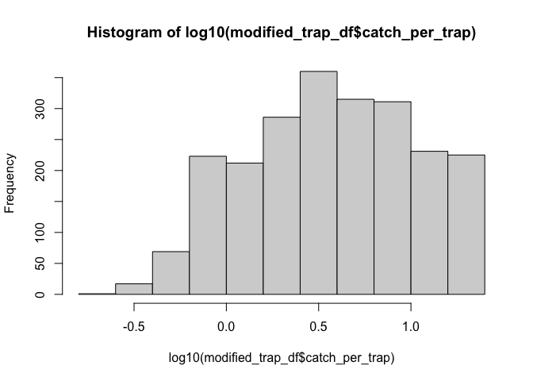<!-- -->

``` r
# by landing site
modified_trap_df %>% 
  ggplot(aes(x=trap_type, y=catch_per_trap, color=trap_type)) + 
  facet_wrap(~landing_site) +
  geom_boxplot(aes(color=trap_type), outlier.size = 0, lwd=0.5) +
    geom_point(aes(fill=trap_type), pch = 21, size=1) +
  theme_bw() + 
  ylab("Abundance (# of individuals per trap collected)") + xlab("Type of trap") +
  theme(axis.text.x = element_text(vjust = 1.1)) #Set the text angle
```

    ## Warning: Removed 231 rows containing non-finite values (stat_boxplot).
    ## Removed 231 rows containing missing values (geom_point).

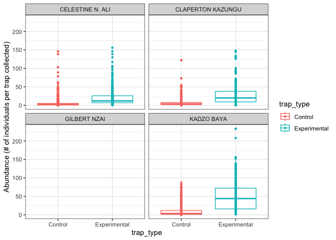<!-- -->

``` r
# by month and year 
modified_trap_df %>% unite(ym, year, month, sep = " ", remove = FALSE) %>% filter(catch_per_trap < 1500) %>%
  ggplot(aes(x=month, y=catch_per_trap, color=trap_type)) + 
  facet_wrap(~year, scales = "free_y") +
  geom_boxplot(aes(color=trap_type), outlier.size = 0, lwd=0.5) +
  #geom_point(aes(x=ym, y=catch_per_trap, fill=trap_type), pch = 21, size=1) +
  theme_classic() + 
  ylab("Abundance (# of individuals per trap collected)") + xlab("Time of year") +
  theme(axis.text.x = element_text(vjust = 1.1, hjust=1.1, angle=60)) #Set the text angle
```

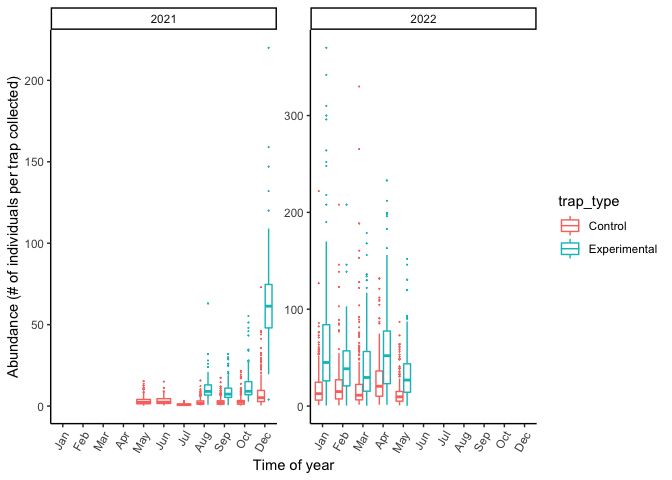<!-- -->

Biomass = Kilograms per trap

``` r
# basic grams per trap plot with no other variables 
Yield_reported <- modified_trap_df %>% 
  ggplot(aes(x=trap_type, y=kg_per_trap)) + 
  geom_boxplot(outlier.size = 0, lwd=0.5) +
    geom_point(size=0.75) +
  theme_classic() + 
  ylab("Biomass (kg per trap collected)") + xlab("Type of trap") +
  theme(axis.text.x = element_text(vjust = 1.1)) #Set the text angle

Yield_reported2 <- kg_per_trap_stats %>% 
  ggplot(aes(x=trap_type, y=kg_per_trap)) + 
  geom_point(size=4) +
  geom_errorbar(aes(ymin=kg_per_trap-se, ymax=kg_per_trap+se), width=.1) +
  theme_classic() + 
  ylab("Biomass (kg per trap collected)") + xlab("Type of trap") +
  theme(axis.text.x = element_text(vjust = 1.1)) #Set the text angle

ggsave(file="output/Yield_reported.png", Yield_reported, width = 4, height = 4, units = c("in"))
```

    ## Warning: Removed 25 rows containing non-finite values (stat_boxplot).

    ## Warning: Removed 25 rows containing missing values (geom_point).

``` r
ggsave(file="output/Yield_reported2.png", Yield_reported2, width = 2, height = 3, units = c("in"))

# visually seeing if this differs by fisherman 
modified_trap_df %>% 
  ggplot(aes(x=trap_type, y=kg_per_trap, color=trap_type)) + 
  facet_wrap(~enumerator) +
  geom_boxplot(aes(color=trap_type), outlier.size = 0, lwd=0.5) +
    geom_point(aes(fill=trap_type), pch = 21, size=1) +
  theme_bw() + 
  ylab("Biomass (kg per trap collected)") + xlab("Type of trap") +
  theme(axis.text.x = element_text(vjust = 1.1)) #Set the text angle
```

    ## Warning: Removed 25 rows containing non-finite values (stat_boxplot).
    ## Removed 25 rows containing missing values (geom_point).

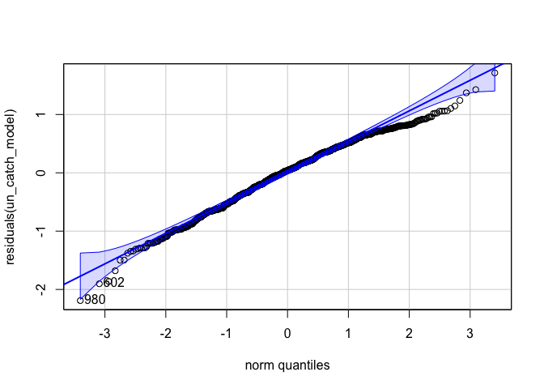<!-- -->

``` r
# visually seeing if this differs by landing site 
modified_trap_df %>% 
  ggplot(aes(x=trap_type, y=kg_per_trap, color=trap_type)) + 
  facet_wrap(~landing_site) +
  geom_boxplot(aes(color=trap_type), outlier.size = 0, lwd=0.5) +
    geom_point(aes(fill=trap_type), pch = 21, size=1) +
  theme_bw() + 
  ylab("Biomass (kg per trap collected)") + xlab("Type of trap") +
  theme(axis.text.x = element_text(vjust = 1.1)) #Set the text angle
```

    ## Warning: Removed 25 rows containing non-finite values (stat_boxplot).
    ## Removed 25 rows containing missing values (geom_point).

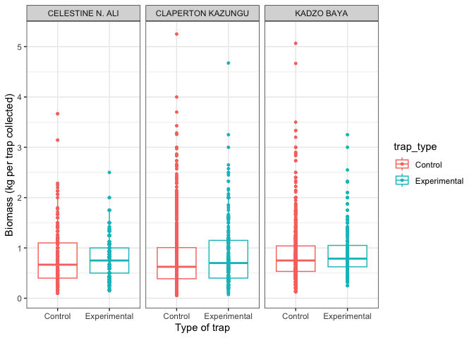<!-- -->

``` r
# by month and year 
modified_trap_df %>% unite(ym, year, month, sep = " ", remove = FALSE) %>% #filter(catch_per_trap < 1500) %>%
  ggplot(aes(x=month, y=kg_per_trap, color=trap_type)) + 
  facet_wrap(~year) +
  geom_boxplot(aes(color=trap_type), outlier.size = 0, lwd=0.5) +
 # geom_point(aes(x=month, group=trap_type, y=grams_per_trap, fill=trap_type), pch = 21, size=1) +
  theme_classic() + 
  ylab("Biomass (kg per trap collected)") + xlab("Time of year") +
  theme(axis.text.x = element_text(vjust = 1.1, hjust=1.1, angle=60)) #Set the text angle
```

    ## Warning: Removed 25 rows containing non-finite values (stat_boxplot).

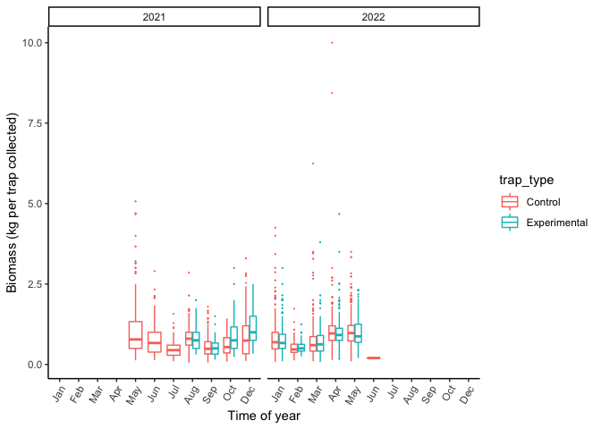<!-- -->

Value reported per trap

``` r
Value_reported <- modified_trap_df %>% 
  ggplot(aes(x=trap_type, y=value_per_trap)) + 
  geom_boxplot(outlier.size = 0, lwd=0.5) +
    geom_point(size=0.75) +
  theme_classic() + 
  ylab("Value (KES per trap collected)") + xlab("Type of trap") +
  theme(axis.text.x = element_text(vjust = 1.1)) #Set the text angle

Value_reported2 <- value_per_trap_stats %>% 
  ggplot(aes(x=trap_type, y=value_per_trap)) + 
  geom_point(size=4) +
  geom_errorbar(aes(ymin=value_per_trap-se, ymax=value_per_trap+se), width=.1) +
  theme_classic() + 
  ylab("Value (KES per trap collected)") + xlab("Type of trap") +
  theme(axis.text.x = element_text(vjust = 1.1)) #Set the text angle

ggsave(file="output/Value_reported.png", Value_reported, width = 4, height = 4, units = c("in"))
```

    ## Warning: Removed 305 rows containing non-finite values (stat_boxplot).

    ## Warning: Removed 305 rows containing missing values (geom_point).

``` r
ggsave(file="output/Value_reported2.png", Value_reported2, width = 2, height = 3, units = c("in"))
```

The relationship between grams per trap and total catch per trap.

``` r
modified_trap_df %>% filter(catch_per_trap < 1500) %>%
  ggplot(aes(x=catch_per_trap, y=kg_per_trap, color=trap_type)) +
  theme_bw() + xlab("Abundance (# of individuals per trap collected)") + ylab("Biomass (kg per trap collected)") +
  geom_smooth(aes(fill=trap_type), method="loess", se=TRUE, fullrange=TRUE, level=0.95, color="black") +
  geom_point(aes(fill=trap_type), pch = 21, size=1)
```

    ## `geom_smooth()` using formula 'y ~ x'

    ## Warning: Removed 3 rows containing non-finite values (stat_smooth).

    ## Warning: Removed 10 rows containing missing values (geom_smooth).

    ## Warning: Removed 3 rows containing missing values (geom_point).

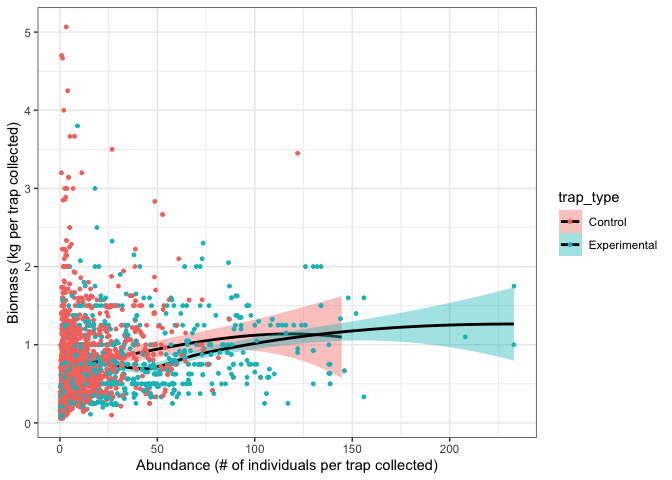<!-- -->

### Statistics on the above.

Default of t.test in R is a Welch t-test which is just an adaptation of
t-test, and it is used when the two samples have possibly unequal
variances. Use var.equal = TRUE or FALSE to specifiy the variances of
the dataset.

You can test equal variances with a Fisher’s F-test. If p &lt; 0.05 then
we include var.equal = FALSE in below ttest. If p &gt; 0.05 then we
include var.equal = TRUE in below ttest.

We are using an unpaired two sample t-test for this dataset.

``` r
UN <- modified_trap_df %>% subset(trap_type == "Control") %>% filter(!is.na(kg_per_trap)) %>% 
  filter(!is.na(catch_per_trap)) %>% filter(!is.na(value_per_trap))
MOD <- modified_trap_df %>% subset(trap_type == "Experimental") %>% filter(!is.na(kg_per_trap)) %>% 
  filter(!is.na(catch_per_trap)) %>% filter(!is.na(value_per_trap))
```

#### Kilograms per trap

``` r
var.test(UN$kg_per_trap, MOD$kg_per_trap)
```

    ## 
    ##  F test to compare two variances
    ## 
    ## data:  UN$kg_per_trap and MOD$kg_per_trap
    ## F = 1.1078, num df = 3445, denom df = 1495, p-value = 0.02055
    ## alternative hypothesis: true ratio of variances is not equal to 1
    ## 95 percent confidence interval:
    ##  1.015927 1.206282
    ## sample estimates:
    ## ratio of variances 
    ##           1.107837

``` r
t.test(kg_per_trap~trap_type, data = modified_trap_df, var.equal = FALSE)
```

    ## 
    ##  Welch Two Sample t-test
    ## 
    ## data:  kg_per_trap by trap_type
    ## t = -2.4515, df = 3687.1, p-value = 0.01427
    ## alternative hypothesis: true difference in means between group Control and group Experimental is not equal to 0
    ## 95 percent confidence interval:
    ##  -0.063866767 -0.007105888
    ## sample estimates:
    ##      mean in group Control mean in group Experimental 
    ##                  0.7966091                  0.8320954

#### Total catch per trap

``` r
var.test(UN$catch_per_trap, MOD$catch_per_trap)
```

    ## 
    ##  F test to compare two variances
    ## 
    ## data:  UN$catch_per_trap and MOD$catch_per_trap
    ## F = 0.19402, num df = 3445, denom df = 1495, p-value < 2.2e-16
    ## alternative hypothesis: true ratio of variances is not equal to 1
    ## 95 percent confidence interval:
    ##  0.1779271 0.2112653
    ## sample estimates:
    ## ratio of variances 
    ##           0.194024

``` r
t.test(catch_per_trap~trap_type, data = modified_trap_df, var.equal = FALSE)
```

    ## 
    ##  Welch Two Sample t-test
    ## 
    ## data:  catch_per_trap by trap_type
    ## t = -28.012, df = 1751.4, p-value < 2.2e-16
    ## alternative hypothesis: true difference in means between group Control and group Experimental is not equal to 0
    ## 95 percent confidence interval:
    ##  -34.30532 -29.81579
    ## sample estimates:
    ##      mean in group Control mean in group Experimental 
    ##                   11.58572                   43.64628

#### Total catch per trap

``` r
var.test(UN$value_per_trap, MOD$value_per_trap)
```

    ## 
    ##  F test to compare two variances
    ## 
    ## data:  UN$value_per_trap and MOD$value_per_trap
    ## F = 1.048, num df = 3445, denom df = 1495, p-value = 0.2881
    ## alternative hypothesis: true ratio of variances is not equal to 1
    ## 95 percent confidence interval:
    ##  0.9610964 1.1411771
    ## sample estimates:
    ## ratio of variances 
    ##           1.048046

``` r
t.test(value_per_trap~trap_type, data = modified_trap_df, var.equal = TRUE)
```

    ## 
    ##  Two Sample t-test
    ## 
    ## data:  value_per_trap by trap_type
    ## t = -6.6608, df = 5132, p-value = 3.008e-11
    ## alternative hypothesis: true difference in means between group Control and group Experimental is not equal to 0
    ## 95 percent confidence interval:
    ##  -24.91037 -13.58141
    ## sample estimates:
    ##      mean in group Control mean in group Experimental 
    ##                   147.3544                   166.6003

#### Total catch per trap vs weight in grams per trap.

We use a linear mixed model for this so we can include other variables
like fisherman and landing site.

Grams per trap is log transformed.

I’m not sure yet if this is the best way to do this…

``` r
# unmodified
un_catch_model <- lmer(log(kg_per_trap) ~ catch_per_trap + (1|enumerator) + (1|landing_site), na.action=na.omit, data=UN)
qqPlot(residuals(un_catch_model)) 
```

<!-- -->

    ## [1] 2675  786

``` r
hist(residuals(un_catch_model))
```

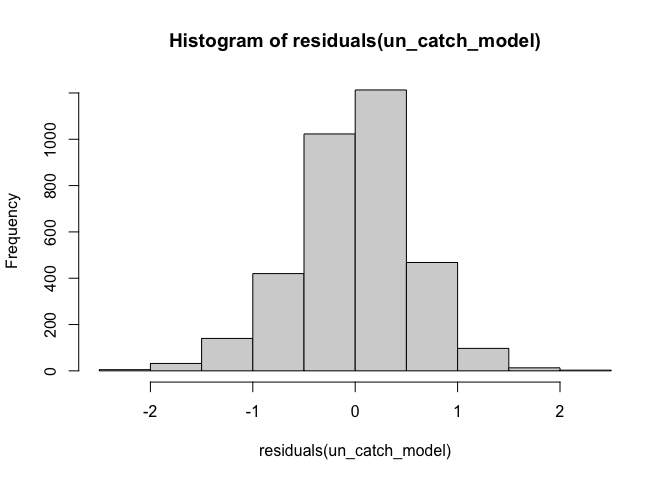<!-- -->

``` r
# modified
mod_catch_model <- lmer(log(kg_per_trap) ~ catch_per_trap + (1|enumerator) + (1|landing_site), na.action=na.omit, data=MOD)
qqPlot(residuals(mod_catch_model)) 
```

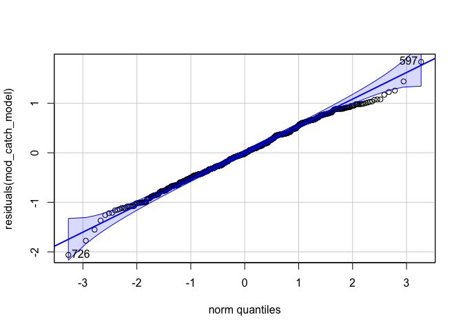<!-- -->

    ## [1] 976 596

``` r
hist(residuals(mod_catch_model))
```

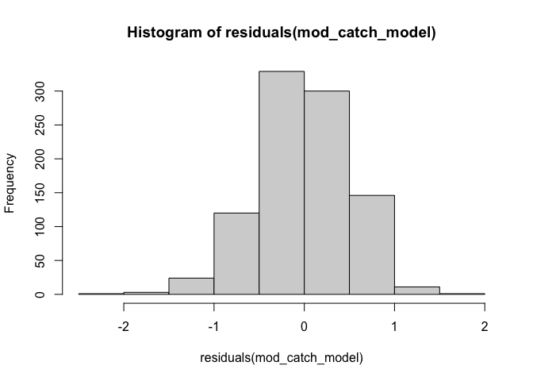<!-- -->

``` r
summary(un_catch_model)
```

    ## Linear mixed model fit by REML ['lmerMod']
    ## Formula: 
    ## log(kg_per_trap) ~ catch_per_trap + (1 | enumerator) + (1 | landing_site)
    ##    Data: UN
    ## 
    ## REML criterion at convergence: 6030.3
    ## 
    ## Scaled residuals: 
    ##     Min      1Q  Median      3Q     Max 
    ## -4.7824 -0.5867  0.0707  0.6665  3.5571 
    ## 
    ## Random effects:
    ##  Groups       Name        Variance Std.Dev.
    ##  landing_site (Intercept) 0.04356  0.2087  
    ##  enumerator   (Intercept) 0.03094  0.1759  
    ##  Residual                 0.33333  0.5773  
    ## Number of obs: 3446, groups:  landing_site, 4; enumerator, 3
    ## 
    ## Fixed effects:
    ##                  Estimate Std. Error t value
    ## (Intercept)    -0.5551629  0.1469235  -3.779
    ## catch_per_trap  0.0110078  0.0005231  21.045
    ## 
    ## Correlation of Fixed Effects:
    ##             (Intr)
    ## ctch_pr_trp -0.045

``` r
summary(mod_catch_model)
```

    ## Linear mixed model fit by REML ['lmerMod']
    ## Formula: 
    ## log(kg_per_trap) ~ catch_per_trap + (1 | enumerator) + (1 | landing_site)
    ##    Data: MOD
    ## 
    ## REML criterion at convergence: 2222.3
    ## 
    ## Scaled residuals: 
    ##     Min      1Q  Median      3Q     Max 
    ## -4.2429 -0.6966  0.0685  0.7404  3.4855 
    ## 
    ## Random effects:
    ##  Groups       Name        Variance Std.Dev.
    ##  landing_site (Intercept) 0.010741 0.10364 
    ##  enumerator   (Intercept) 0.001252 0.03538 
    ##  Residual                 0.253954 0.50394 
    ## Number of obs: 1496, groups:  landing_site, 4; enumerator, 3
    ## 
    ## Fixed effects:
    ##                  Estimate Std. Error t value
    ## (Intercept)    -0.4186052  0.0613548  -6.823
    ## catch_per_trap  0.0038299  0.0003166  12.095
    ## 
    ## Correlation of Fixed Effects:
    ##             (Intr)
    ## ctch_pr_trp -0.254

``` r
Anova(un_catch_model, ddf="lme4", type='III')
```

    ## Analysis of Deviance Table (Type III Wald chisquare tests)
    ## 
    ## Response: log(kg_per_trap)
    ##                  Chisq Df Pr(>Chisq)    
    ## (Intercept)     14.278  1  0.0001577 ***
    ## catch_per_trap 442.889  1  < 2.2e-16 ***
    ## ---
    ## Signif. codes:  0 '***' 0.001 '**' 0.01 '*' 0.05 '.' 0.1 ' ' 1

``` r
Anova(mod_catch_model, ddf="lme4", type='III')
```

    ## Analysis of Deviance Table (Type III Wald chisquare tests)
    ## 
    ## Response: log(kg_per_trap)
    ##                  Chisq Df Pr(>Chisq)    
    ## (Intercept)     46.549  1  8.934e-12 ***
    ## catch_per_trap 146.296  1  < 2.2e-16 ***
    ## ---
    ## Signif. codes:  0 '***' 0.001 '**' 0.01 '*' 0.05 '.' 0.1 ' ' 1

## <a name="species"></a> **Calculate top species caught**

**Species catch per unit effort between modified and traditional traps.
Take the top 3-5 species and run \#1 for them separately.**

Calculating which species were the most abundant across the entire
survey.

This might have to be number of fish caught per trap? So that the
difference in \# of traps for modified and unmodified is accounted for?

This is split for modified and unmodified so far.. but can be changed to
combined.. the trend is about the same for most abundant type of fish in
each trap..

``` r
# above 250 cut off includes top each count for each type of trap 
species_list %>% filter(species_catch > 250) %>%
  ggplot(., aes(x=scientific_name, y=species_catch, group = trap_type, color = trap_type)) + 
  ylab("number of fish caught") + xlab("Genus species") +
  ggtitle("Species with counts > 250") +
  geom_point() + theme_bw() + theme(axis.text.x = element_text(angle = 60, hjust=1)) #Set the text angle
```

<!-- -->

## <a name="species_pertrap"></a> **Top species stats per trap**

Create a subsetted df from the top 10 total species (break this down
into modified and unmodified later?).

``` r
# calculate species total catch to then figure out which ones were most popular regardless of trap type
species_df <- data %>% filter(!is.na(number_of_fish)) %>%
  group_by(scientific_name) %>%
  mutate(species_total_catch = sum(number_of_fish)) %>% ungroup() #must ungroup for following commands 

# use the above metric to subset to top 10 of those 
species_keep <- species_df %>% select(scientific_name, species_total_catch) %>% 
  distinct() %>% slice_max(species_total_catch, n = 20) 

# filter species df based on the species_keep list 
species_df <- species_df %>% filter(scientific_name %in% species_keep$scientific_name)

# double checking the above command worked - output should be only 5 
unique(sort(species_keep$scientific_name))
```

    ##  [1] "Acanthurus dussumieri"    "Chaetodon auriga"        
    ##  [3] "Chaetodon selene"         "Leptoscarus vaigiensis"  
    ##  [5] "Lethrinus harak"          "Lethrinus mahsena"       
    ##  [7] "Lethrinus nebulosus"      "Naso annulatus"          
    ##  [9] "Parupeneus indicus"       "Parupeneus macronemus"   
    ## [11] "Plectorhinchus gaterinus" "Plectorhinchus sordidus" 
    ## [13] "Plectorhinchus vittatus"  "Scarus ghobban"          
    ## [15] "Scarus psittacus"         "Scarus rubroviolaceus"   
    ## [17] "Scarus russelii"          "Siganus canaliculatus"   
    ## [19] "Siganus stellatus"        "Siganus sutor"

### Abundance

``` r
### species_df is already subsetted to the top 10 species 
# within each survey id, for each species calculate topspecies_catch as the number fish in that species in that survey
# then calculate the catch per trap as the number of fish of that species over the total number of traps collected
species_df <- species_df %>%
  dplyr::group_by(survey_id, scientific_name) %>% # group by survey id
  mutate(topspecies_catch = sum(number_of_fish),
         catch_per_trap = topspecies_catch/total_traps_collected) %>% #divide total catch per survey id by total traps 
  dplyr::ungroup(survey_id, scientific_name) #ungroup by this column

species_df %>%
  ggplot(aes(x=trap_type, y=catch_per_trap, color=trap_type)) + 
  geom_boxplot(aes(color=trap_type), outlier.size = 0, lwd=0.5) +
  facet_wrap(~scientific_name, scales = "free_y") +
  theme_classic() + ggtitle("Top 10 most abundant species") +
  ylab("Abundance (# of individuals per trap collected)") + xlab("Genus species") +
  theme(axis.text.x = element_text()) #Set the text angle
```

    ## Warning: Removed 245 rows containing non-finite values (stat_boxplot).

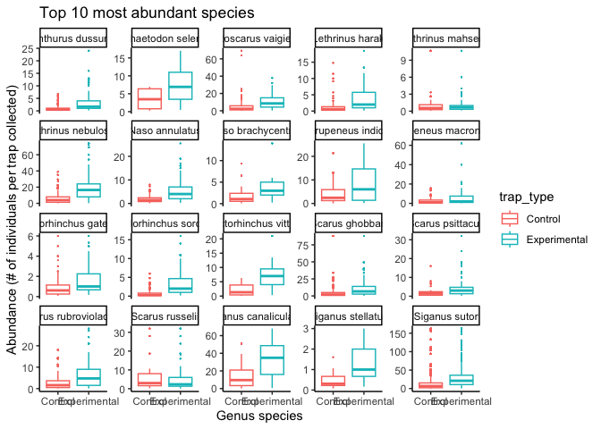<!-- -->

### Statistics for the top ten species

Left off at trying to solve the following error when running aov:

Error in as.POSIXlt.character(x, tz, …) : character string is not in a
standard unambiguous format

Error in lm.fit(x, y, offset = offset, singular.ok = singular.ok, …) :
NA/NaN/Inf in ‘y’

``` r
Topspp_MOD <- species_df %>% subset(trap_type == "Experimental")

Topspp_UNMOD <- species_df %>% subset(trap_type == "Control")  

var.test(Topspp_MOD$catch_per_trap, MOD$catch_per_trap) # output is significant so put false below
```

    ## 
    ##  F test to compare two variances
    ## 
    ## data:  Topspp_MOD$catch_per_trap and MOD$catch_per_trap
    ## F = 0.51011, num df = 25759, denom df = 1495, p-value < 2.2e-16
    ## alternative hypothesis: true ratio of variances is not equal to 1
    ## 95 percent confidence interval:
    ##  0.4732561 0.5484851
    ## sample estimates:
    ## ratio of variances 
    ##          0.5101096

``` r
#t.test(catch_per_trap~trap_type, data = species_df, var.equal = FALSE)

#aov(catch_per_trap ~ trap_type + scientific_name, data = species_df)
```

## <a name="maturity"></a> **Catch per unit effort for top species by maturity**

**Total mature fish catch per unit effort between modified and
traditional traps. This will have to be for the top 3-5 species
separately. Go to Fishbase and find the length at first maturity for
that particular species, then assign each fish a “mature” or “immature”
status in the data and calculate.**

Data pulled from Fishbase and put in the datasheet `fishbase.xlsx`.

``` r
fishbase <- read_excel("data/fishbase.xlsx", sheet = "life history") %>% #read in excel file 
  select(scientific_name, Lm, Lm_se_min, Lm_se_max, Lmax)

maturity <- full_join(data, fishbase, by = "scientific_name") %>% # joining maturity reproduction info with main dataframe
  filter(!is.na(Lm)) # taking out observations that don't have an Lm value so only the top species 

maturity <- maturity %>% 
  mutate(maturity = if_else(median_length >= Lm, "mature", "immature")) %>%
  subset(trap_type == "Experimental" | trap_type == "Control") %>% #subsetting to only the modified and unmodified traps 
  select(survey_id, year, scientific_name, trap_type, maturity, total_traps_collected, 
         length_corrected, median_length, number_of_fish, Lm) %>%
  mutate(nofish_pertrap = number_of_fish/total_traps_collected) 
```

Immaure and mature fish catch comparison

``` r
maturity %>% select(number_of_fish, trap_type, maturity, scientific_name, 
                    total_traps_collected, nofish_pertrap) %>% 
  na.omit() %>% 
  ggplot(., aes(x=scientific_name, y=nofish_pertrap, color=maturity)) +
  geom_boxplot() + theme_classic() + 
  theme(axis.text.x = element_text(angle=60, hjust=1)) +
  xlab("Species") +
  ylab("Abundance (number of individuals per trap collected)")
```

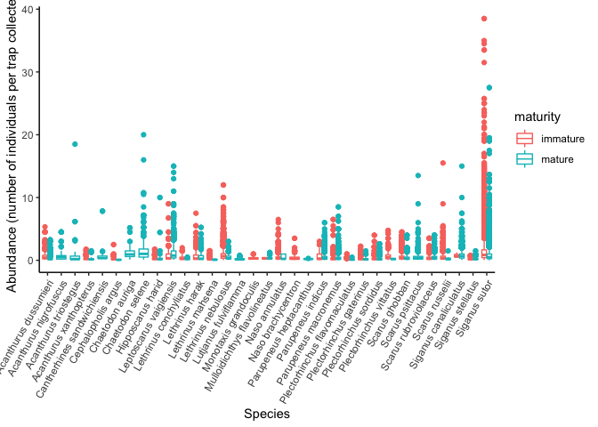<!-- -->

``` r
maturity %>% select(number_of_fish, trap_type, maturity, scientific_name, total_traps_collected, nofish_pertrap) %>% 
  na.omit() %>%  
  ggplot(., aes(x=maturity, y=nofish_pertrap, color=trap_type)) +
  geom_boxplot() + theme_classic() + 
  facet_wrap(~trap_type, scales = "free_y") +
  #theme(axis.text.x = element_text(angle=60, hjust=1)) +
  xlab("Maturity") +
  ylab("Abundance (number of individuals per trap collected)")
```

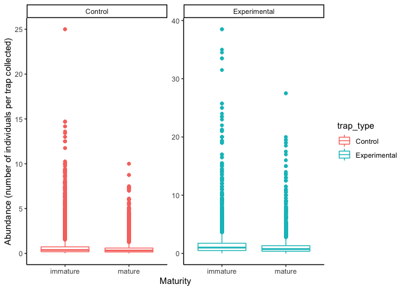<!-- -->

Statistics on the above…

Circle back to the padj values coming out to “0.000000e+00”.

Double check `trap_type+maturity` vs `trap_type*maturity`.

``` r
nofish_maturity_aov <- aov(number_of_fish ~ trap_type*maturity, data = maturity)
summary(nofish_maturity_aov)
```

    ##                       Df  Sum Sq Mean Sq F value  Pr(>F)    
    ## trap_type              1    5995    5995  102.42 < 2e-16 ***
    ## maturity               1   12993   12993  221.98 < 2e-16 ***
    ## trap_type:maturity     1     499     499    8.53 0.00349 ** 
    ## Residuals          74486 4359961      59                    
    ## ---
    ## Signif. codes:  0 '***' 0.001 '**' 0.01 '*' 0.05 '.' 0.1 ' ' 1
    ## 146 observations deleted due to missingness

``` r
nofish_maturity_tukey <- TukeyHSD(nofish_maturity_aov)
nofish_maturity_tukey$`trap_type:maturity`
```

    ##                                                 diff        lwr         upr
    ## Experimental:immature-Control:immature     0.8015999  0.5778186  1.02538126
    ## Control:mature-Control:immature           -0.7168704 -0.8965754 -0.53716541
    ## Experimental:mature-Control:immature      -0.2590956 -0.4675062 -0.05068507
    ## Control:mature-Experimental:immature      -1.5184703 -1.7376369 -1.29930379
    ## Experimental:mature-Experimental:immature -1.0606956 -1.3039548 -0.81743633
    ## Experimental:mature-Control:mature         0.4577748  0.2543274  0.66122218
    ##                                                  p adj
    ## Experimental:immature-Control:immature    4.596323e-14
    ## Control:mature-Control:immature           3.297362e-14
    ## Experimental:mature-Control:immature      7.666480e-03
    ## Control:mature-Experimental:immature      0.000000e+00
    ## Experimental:mature-Experimental:immature 9.769963e-15
    ## Experimental:mature-Control:mature        4.461830e-08

## <a name="length"></a> **Catch and length data of mature fish**

**Average length of catch versus length at first maturity (Lmat). Take
the difference for each fish in the data against its length at first
maturity and then calculate a weighted value for modified versus
traditional traps where a value above 0 represents a fish above Lmat and
a value below represents a fish below Lmat.**

Transform count value to that number of observations:
<https://stackoverflow.com/questions/70759069/transform-count-column-into-number-of-rows>.

``` r
maturity_dist <- maturity %>% 
  mutate(number_of_fish = if_else(is.na(number_of_fish), 1, number_of_fish)) %>% # replacing NAs with the value of 1
  tidyr::uncount(., number_of_fish, .remove = TRUE) %>% # expanding number of fish to number of observations
  mutate(length_dist = median_length-Lm) %>%
  filter(!is.na(length_dist)) %>%
  group_by(scientific_name, trap_type) %>%
  mutate(avg_length_dist = mean(length_dist)) %>% #### a positive value here = mature; a negative value = immature 
  ungroup() %>% 
  filter(scientific_name %in% species_keep$scientific_name) %>%
  mutate(scientific_name = factor(scientific_name, levels = c("Siganus sutor", "Lethrinus nebulosus",
                                                              "Scarus ghobban", "Siganus canaliculatus",
                                                              "Leptoscarus vaigiensis", "Parupeneus indicus",
                                                              "Acanthurus dussumieri", "Chaetodon selene",
                                                              "Parupeneus macronemus", "Scarus rubroviolaceus",
                                                              "Scarus russelii", "Scarus psittacus",
                                                              "Naso annulatus", "Plectorhinchus vittatus",
                                                              "Plectorhinchus sordidus", "Plectorhinchus gaterinus",
                                                              "Lethrinus harak", "Siganus stellatus",
                                                              "Chaetodon auriga", "Lethrinus mahsena"))) 
maturity_dist$scientific_name <- fct_rev(maturity_dist$scientific_name)

maturity_dist_plot <- maturity_dist %>%
  group_by(scientific_name) %>%
  filter(., n_distinct(avg_length_dist) >= 2) %>% # filters out the observations aren't in both categories (takes out species that only have 1 unique mean dist value so only 1 trap type)
  ungroup() %>%
  ggplot(., aes(x=scientific_name, y=avg_length_dist, color=trap_type)) + 
  coord_flip() +
  geom_hline(yintercept = 0, lty = "dotted") +
  geom_line(aes(group = scientific_name), color="grey14") +
  geom_point(size=2) + theme_bw() + 
  scale_color_manual(values = c("black", "blue")) +
  theme(axis.title.y = element_text(margin = margin(t = 0, r = 10, b = 0, l = 0))) +
  labs(y="Mean distance from Lm (cm)", x="", color="Trap Type") 

ggsave(file="output/Maturity.png", maturity_dist_plot, width = 7, height = 6, units = c("in"))
```

## <a name="freq_plots"></a> **Length Frequency plots of top species**

**Length frequency of top 3-5 species in modified versus traditional
(different colors) with Lmat etc. indicators pulled from Fishbase.**

<http://derekogle.com/fishR/2017-07-28-JoyPlot>

From the `species_keep` df:

Siganus sutor = 311813  
Lethrinus nebulosus = 51612  
Scarus ghobban = 34253  
Siganus canaliculatus = 23173  
Leptoscarus vaigiensis = 15758

``` r
library(ggridges)

# the column we want to plot: maturity$length_corrected
maturity$length_corrected <- factor(maturity$length_corrected, levels=c("0-10", "11-15","16-20","21-25","26-30",
                                                                        "31-35","36-40","41-45", "46-50", "51-60",
                                                                        "61-70", "71-80", "81-90", ">90"))

maturity <- maturity %>% filter(!is.na(length_corrected)) %>%
  group_by(length_corrected, scientific_name, trap_type) %>%
  mutate(count.per.bin = sum(number_of_fish)) %>%
  ungroup()

maturity_topspp <- maturity %>% #subset(year=="2022") %>% 
  subset(scientific_name == "Siganus sutor" | scientific_name == "Lethrinus nebulosus" |
           scientific_name == "Scarus ghobban" | scientific_name == "Leptoscarus vaigiensis" |
           scientific_name == "Siganus canaliculatus") %>%
    mutate(Lm_range = case_when(
    Lm >= 0 & Lm <= 10.5 ~ "0-10",
    Lm >= 10.5 & Lm <= 15.4 ~ "11-15",
    Lm >= 15.5 & Lm <= 20.4 ~ "16-20",
    Lm >= 20.5 & Lm <= 25.4 ~ "21-25",
    Lm >= 25.5 & Lm <= 30.4 ~ "26-30",
    Lm >= 30.5 & Lm <= 35.4 ~ "31-35",
    Lm >= 35.5 & Lm <= 40.4 ~ "36-40",
    Lm >= 40.5 & Lm <= 45.4 ~ "41-45",
    Lm >= 45.5 & Lm <= 50.4 ~ "46-50",
    Lm >= 50.5 & Lm <= 60.4 ~ "51-60",
    Lm >= 60.5 & Lm <= 70.4 ~ "61-70",
    Lm >= 70.5 & Lm <= 80.4 ~ "71-80",
    Lm >= 80.5 & Lm <= 90.4 ~ "81-90",
    Lm > 90.5 ~ ">90")) 

# creating table that will work best for visualization 
maturity_figs <- maturity_topspp %>% 
  mutate(number_of_fish = if_else(is.na(number_of_fish), 1, number_of_fish)) %>% # replacing NAs with the value of 1
  tidyr::uncount(., number_of_fish, .remove = TRUE)

maturity_figs$scientific_name = factor(maturity_figs$scientific_name, levels=c('Siganus sutor',
                                                                               'Lethrinus nebulosus',
                                                                               'Scarus ghobban',
                                                                               'Siganus canaliculatus',
                                                                               'Leptoscarus vaigiensis'))

# setting common figure parameters 
a <- maturity_figs %>% # expanding number of fish to number of observations
  filter(!is.na(length_corrected)) %>%
  ggplot(., aes(x=length_corrected, fill=trap_type, color=trap_type)) + 
  theme_bw() + xlab("Length (cm)") + ylab("Frequency") +
  theme(axis.text.x.bottom = element_text(colour = 'black', angle = 60, hjust = 1),
        axis.text.y = element_text(colour = 'black', size = 8, face = 'italic')) + 
  theme(panel.border = element_blank(),
   panel.grid.major = element_blank(),
   panel.grid.minor = element_blank(),
   strip.text.x = element_text(size = 9, color = "black", face = "bold.italic"),
   axis.line = element_line(colour = "black")) +
  theme(axis.title.y = element_text(size = 12, face = "bold", margin = margin(t = 0, r = 10, b = 0, l = 0))) +
  theme(axis.title.x = element_text(size = 12, face = "bold", margin = margin(t = 10, r = 0, b = 0, l = 0))) +
  facet_grid(scientific_name~trap_type, scales = "free_y")
  #ggtitle("Not standardized by per trap - come back to this?")
```

### Calculating % fish underneath Lm and sample size per trap type for the figure below

``` r
maturity_calcs <- maturity_figs %>%
  group_by(scientific_name, trap_type) %>%
  mutate(sample_size = n(),
         count_below = sum(median_length <= Lm, na.rm=TRUE),
         percent_below = (count_below/sample_size)*100) %>%
 select(scientific_name, trap_type, sample_size, 
         count_below, percent_below) %>% 
  ungroup() %>% distinct()

# double checking the above calculation worked
maturity_figs %>% 
  filter(scientific_name == "Siganus sutor", trap_type == "Control") %>%
  count(maturity == "immature") 
```

    ## # A tibble: 2 × 2
    ##   `maturity == "immature"`     n
    ##   <lgl>                    <int>
    ## 1 FALSE                    99557
    ## 2 TRUE                     87888

``` r
length_freq <- a +
  geom_bar(position = position_dodge(), alpha=0.5) +
  scale_fill_manual(values = c("white", "white")) +
  scale_color_manual(values = c("black", "black"))

ggsave(file="output/Length_freq.png", length_freq, width = 6, height = 8, units = c("in"))

### left off at trying to get a density or geom smooth on categorical data - haven't been able to make that work
a + geom_histogram(aes(y = ..count.., colour = trap_type, fill = trap_type), 
                   alpha = 0.6, position = position_dodge(), stat="count") +
  geom_vline(data = maturity_figs, mapping = aes(xintercept = Lm_range), lty = "dotted", size=1.2)
```

    ## Warning: Ignoring unknown parameters: binwidth, bins, pad

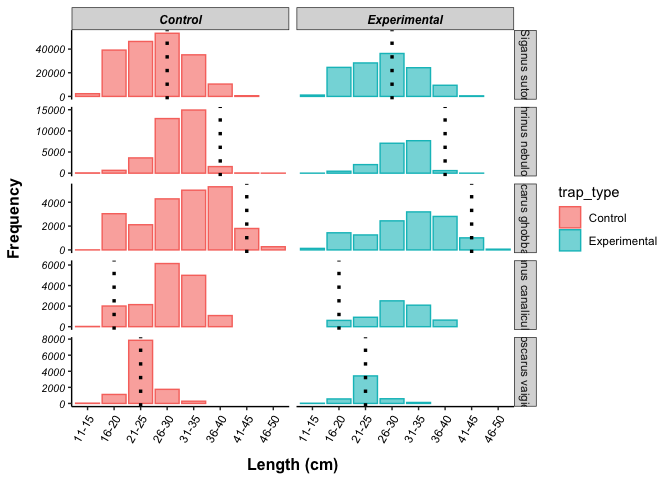<!-- -->

<https://rstudio-pubs-static.s3.amazonaws.com/595950_6dc36259819541e5869f9fff162a8a41.html#histogram>

<https://statisticsglobe.com/normal-density-curve-on-top-of-histogram-ggplot2-r>

## Fishbase R

<https://github.com/ropensci/rfishbase>

Left off at FishBase R having SSL certificate problems. Download a and b
from fishbase for top 5 and make script for this.

``` r
#remotes::install_github("ropensci/rfishbase")
library("rfishbase")
#library(curl)
#install.packages("curl", type = "source")
```

``` r
#FB <- fb_tbl("ecology")
```

Error:

`Error in curl::curl_fetch_memory(file, handle): SSL certificate problem: certificate has expired   Error in curl::curl_fetch_memory(file, handle): SSL certificate problem: certificate has expired   Error in curl::curl_fetch_memory(file, handle): SSL certificate problem: certificate has expired   Error in curl::curl_fetch_memory(file, handle): SSL certificate problem: certificate has expired   Warning in curl::curl_fetch_memory(url, handle = handle) :     SSL certificate problem: certificate has expired   Warning in curl::curl_fetch_memory(url, handle = handle) :     SSL certificate problem: certificate has expired   Error in rbind(deparse.level, ...) :      numbers of columns of arguments do not match`

### Biomass per trap collected

1.) Expand df by \# of fish so that each row is a fish observation.  
2.) Calculate median length of the bin of each fish (L).  
3.) Find a and b parameters for all fish. Add this to the fishbase and
read in that df.  
4.) Add a and b columns to `species_df` by species Id.  
5.) Mutate to calculate W=aLb.  
6.) Group by species and survey id to calculate biomass per trap
collected.

#### Calculating biomass

W=aL^b

W = Biomass  
L = Length (in our case, median length)  
a = (taken from fishbase) b = (taken from fishbase)

Read in data from fishbase. These units are in cm and grams.

<https://www.fishbase.de/manual/English/FishbaseThe_LENGTH_WEIGHT_table.htm>

``` r
biomass_fishbase <- read_excel("data/fishbase.xlsx", sheet = "biomass") %>% #read in excel file 
  select(scientific_name, a, b)
biomass_fishbase$a <- as.numeric(biomass_fishbase$a)
```

    ## Warning: NAs introduced by coercion

``` r
biomass_fishbase$b <- as.numeric(biomass_fishbase$b)
```

    ## Warning: NAs introduced by coercion

``` r
biomass_survey_data <- data %>% filter(!is.na(number_of_fish)) %>%
  subset(trap_type == "Experimental" | trap_type == "Control") %>%
  select(survey_id, Operation_date, year, month, day, enumerator, trap_type, total_traps_collected,
         total_biomass_kg, take_home_weight_kg, total_value_KES, take_home_value_KES, scientific_name, 
         length_cm, number_of_fish, crew_size_corrected, length_corrected) 

biomass_df <- full_join(biomass_survey_data, biomass_fishbase, by = "scientific_name") 

biomass_df <- biomass_df %>%
 # mutate(number_of_fish = if_else(is.na(number_of_fish), 1, number_of_fish)) %>% # replacing NAs with the value of 1
 # tidyr::uncount(., number_of_fish, .remove = TRUE) %>%
  mutate(median_length = case_when(
    length_corrected == "0-10" ~ 5,
    length_corrected == "11-15" ~ 13,
    length_corrected == "16-20" ~ 18,
    length_corrected == "21-25" ~ 23,
    length_corrected == "26-30" ~ 28,
    length_corrected == "31-35" ~ 33,
    length_corrected == "36-40" ~ 38,
    length_corrected == "41-45" ~ 43,
    length_corrected == "46-50" ~ 48,
    length_corrected == "51-60" ~ 55.5,
    length_corrected == "61-70" ~ 65.5,
    length_corrected == "71-80" ~ 75.5,
    length_corrected == "81-90" ~ 85.5,
    length_corrected == ">90" ~ 100 ### circle back to what value to use here
  )) %>%
  mutate(W_g = (a*(median_length^b))*number_of_fish,
         W_kg = W_g/1000) %>% # calculating biomass from W=aL^b 
  group_by(survey_id) %>%
  mutate(calculated_total_biomass = sum(W_kg),
         calculated_biomass_pertrap = calculated_total_biomass/total_traps_collected) %>% 
  ungroup()

biomass_comparison <- biomass_df %>% select(survey_id, total_biomass_kg, calculated_total_biomass) %>%
  distinct() %>% na.omit() %>%
  mutate(comparison = if_else(total_biomass_kg > calculated_total_biomass, "REPORTED > CALC", "REPORTED < CALC"),
         difference = total_biomass_kg-calculated_total_biomass) 

biomass_comparison %>%
  ggplot(., aes(x=comparison, y=difference)) + theme_bw() +
  geom_point(aes(color=comparison), size=1) + xlab("") + ylab("difference in value")
```

<!-- -->

Calculated biomass per trap figures.

``` r
# basic grams per trap plot with no other variables 
biomass_df %>% filter(!is.na(calculated_biomass_pertrap)) %>%
  ggplot(aes(x=trap_type, y=calculated_biomass_pertrap, color=trap_type)) + 
  geom_boxplot(aes(color=trap_type), outlier.size = 0, lwd=0.5) +
    geom_point(aes(fill=trap_type), pch = 21, size=1) +
  theme_bw() + 
  ylab("Calculated Biomass (kg per trap collected)") + xlab("Type of trap") +
  theme(axis.text.x = element_text(vjust = 1.1)) #Set the text angle
```

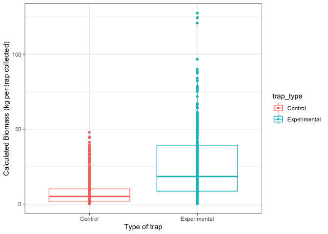<!-- -->

``` r
# visually seeing if this differs by fisherman 
biomass_df %>% filter(!is.na(calculated_biomass_pertrap)) %>%
  ggplot(aes(x=trap_type, y=calculated_biomass_pertrap, color=trap_type)) + 
  facet_wrap(~enumerator) +
  geom_boxplot(aes(color=trap_type), outlier.size = 0, lwd=0.5) +
    geom_point(aes(fill=trap_type), pch = 21, size=1) +
  theme_bw() + 
  ylab("Calculated Biomass (kg per trap collected)") + xlab("Type of trap") +
  theme(axis.text.x = element_text(vjust = 1.1)) #Set the text angle
```

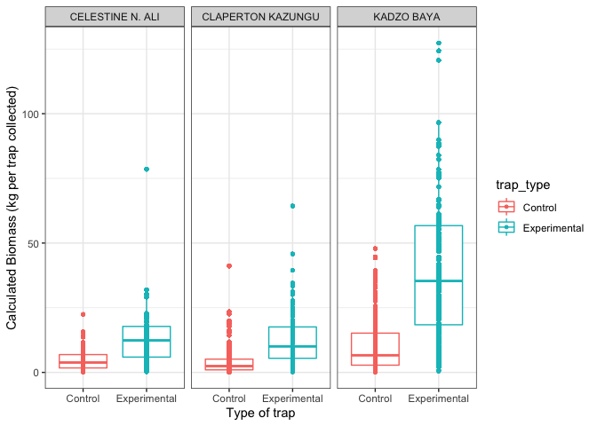<!-- -->

List of species to ask Fishbase for a and b.

``` r
biomass_df %>% 
  select(scientific_name) %>% distinct() %>%
  write.csv("data/full_species_list.csv")
```
