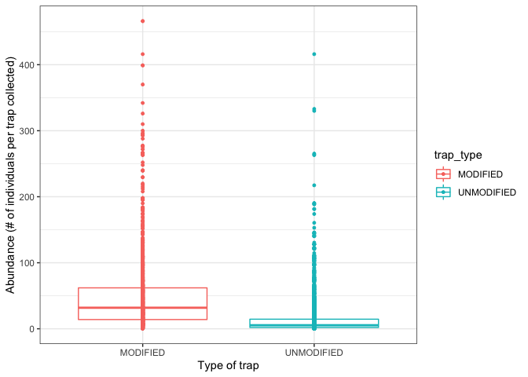
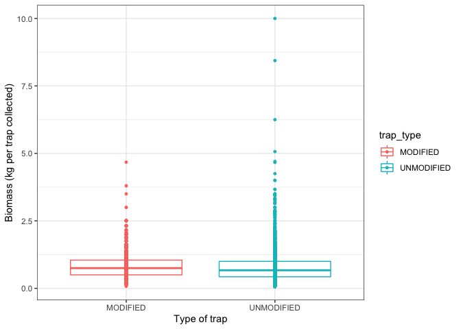
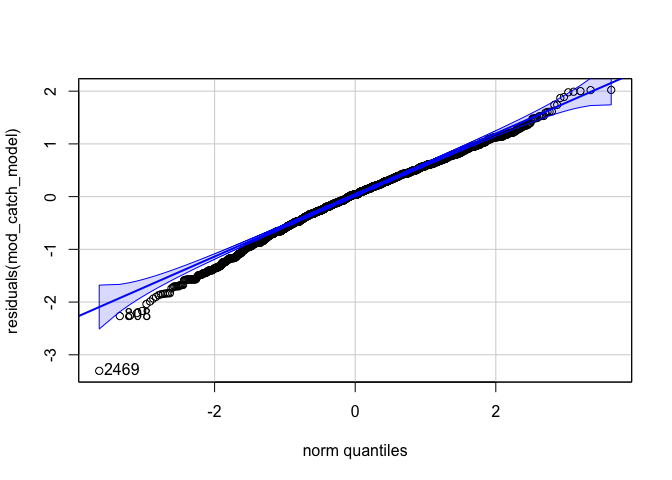

CUE, maturity, and length analysis of Fishing Landings dataset
================
Author: Emma Strand; <emma_strand@uri.edu>

## Questions for Austin and Clay

**To-Do**:

-   Model for grams per trap vs catch per trap and trap type.  
-   ANOVA for top species per trap type.  
-   Create datafile from fishbase info.  
-   \#3-5 on below aims.  
-   Relative abundance plots in other script.  
-   Summary points, results, and next steps suggestions finalize.

## Summary of dataset

Modified traps data:  
2022: January, February, March, April, May

Unmodified traps data: 2021: January, June, August, September 2022:
January, February, March, April, May, June

## Aims and Results

**1. Total catch per unit effort between modified and traditional traps.
It would be great to see this as grams captured per trap set.**

Results:

**2. Species catch per unit effort between modified and traditional
traps. Take the top 3-5 species and run \#1 for them separately.**

Results:

**3. Total mature fish catch per unit effort between modified and
traditional traps. This will have to be for the top 3-5 species
separately. Go to Fishbase and find the length at first maturity for
that particular species, then assign each fish a “mature” or “immature”
status in the data and calculate.**

Results:

**4. Average length of catch versus length at first maturity (Lmat).
Take the difference for each fish in the data against its length at
first maturity and then calculate a weighted value for modified versus
traditional traps where a value above 0 represents a fish above Lmat and
a value below represents a fish below Lmat.**

Results:

**5. Length frequency of top 3-5 species in modified versus traditional
(different colors) with Lmat etc. indicators pulled from Fishbase.**

Results:

## Contents

-   [**Reading in datafiles**](#data)  
-   [**Total catch (grams) per unit effort (trap
    set)**](#catch_effort)  
-   [**Calculate top species caught**](#species)  
-   [**Top species stats per trap**](#species_pertrap)  
-   [**Creating database from Fishbase**](#fishbase)  
-   [**Catch per unit effort for top species by maturity**](#maturity)  
-   [**Catch and length data of mature fish**](#length)

## <a name="data"></a> **Reading in datafiles**

``` r
library(plyr)
library(dplyr)
library(tidyverse)
library(ggplot2)
library(readxl)
library(lubridate)
library(Hmisc)
library(writexl)
library(naniar)
library(Rmisc)
library(stats)
library(lme4)
library(car)
```

Read in the data frame that is the output of the QC script.

``` r
# read in excel file
data <- read_excel("data/Fishlandings-cleaned-clay-June_updated-IW.xlsx") #read in excel file 

data <- data %>% separate(Operation_date, c("year", "month", "day"), remove = FALSE) # creating new columns with month year and date
data$month <- as.numeric(data$month) #changing this column to numeric instead of a character (needed for next fxn)
data$month <- month.abb[data$month] #changing numeric months to month names 
```

## <a name="catch_effort"></a> **Total catch (grams) per unit effort (trap set)**

Grouping by fisher\_id but this might be effective to group by
enumerator once I have correct list of names. There are 3 boat trips
recorded with the exact same fish data that are under 3 different fisher
ID names but all the same enumerator.. come back to this in QC.

Goal: grams captured per trap set.

``` r
modified_trap_df <- data %>% unite(survey_id, Operation_date, fisher_id, sep = " ", remove = FALSE) %>%
  dplyr::group_by(survey_id) %>% # group by survey id
  mutate(total_catch = sum(number_of_fish), #count the number of fish caught for each survey id
         grams_per_trap = total_weight_kg/total_traps_collected, #divide total weight for survey id by total traps 
         catch_per_trap = total_catch/total_traps_collected) %>% #divide total catch per survey id by total traps 
  dplyr::ungroup(survey_id) %>% #ungroup by this column  
  subset(trap_type == "MODIFIED" | trap_type == "UNMODIFIED") %>% #subset for only modified and unmodified traps 
  select(survey_id, enumerator, trap_type, `No. of fishers in crew`, landing_site, total_catch, month, year, grams_per_trap, catch_per_trap) %>%
  distinct() 
```

### Plotting figures.

Catch per trap

``` r
# basic total catch per trap with no other variables 
modified_trap_df %>% filter(catch_per_trap < 1500) %>%
  ggplot(aes(x=trap_type, y=catch_per_trap, color=trap_type)) +
  geom_boxplot(aes(color=trap_type), outlier.size = 0, lwd=0.5) +
    geom_point(aes(fill=trap_type), pch = 21, size=1) +
  theme_bw() + 
  ylab("Total catch per trap") + xlab("Type of trap") +
  theme(axis.text.x = element_text(vjust = 1.1)) #Set the text angle
```

<!-- -->

``` r
# by fisherman 
modified_trap_df %>% 
  ggplot(aes(x=trap_type, y=catch_per_trap, color=trap_type)) + 
  facet_wrap(~enumerator) +
  geom_boxplot(aes(color=trap_type), outlier.size = 0, lwd=0.5) +
    geom_point(aes(fill=trap_type), pch = 21, size=1) +
  theme_bw() + 
  ylab("Total catch per trap") + xlab("Type of trap") +
  theme(axis.text.x = element_text(vjust = 1.1)) #Set the text angle
```

    ## Warning: Removed 210 rows containing non-finite values (stat_boxplot).

    ## Warning: Removed 210 rows containing missing values (geom_point).

<!-- -->

``` r
# by landing site
modified_trap_df %>% 
  ggplot(aes(x=trap_type, y=catch_per_trap, color=trap_type)) + 
  facet_wrap(~landing_site) +
  geom_boxplot(aes(color=trap_type), outlier.size = 0, lwd=0.5) +
    geom_point(aes(fill=trap_type), pch = 21, size=1) +
  theme_bw() + 
  ylab("Total catch per trap") + xlab("Type of trap") +
  theme(axis.text.x = element_text(vjust = 1.1)) #Set the text angle
```

    ## Warning: Removed 210 rows containing non-finite values (stat_boxplot).
    ## Removed 210 rows containing missing values (geom_point).

<!-- -->

``` r
# by month and year 
modified_trap_df %>% unite(ym, year, month, sep = " ", remove = FALSE) %>% filter(catch_per_trap < 1500) %>%
  ggplot(aes(x=month, y=catch_per_trap, color=trap_type)) + 
  facet_wrap(~year, scales = "free_y") +
  geom_boxplot(aes(color=trap_type), outlier.size = 0, lwd=0.5) +
  #geom_point(aes(x=ym, y=catch_per_trap, fill=trap_type), pch = 21, size=1) +
  theme_classic() + 
  ylab("Total catch per trap") + xlab("Time of year") +
  theme(axis.text.x = element_text(vjust = 1.1, hjust=1.1, angle=60)) #Set the text angle
```

<!-- -->

Grams per trap

``` r
# basic grams per trap plot with no other variables 
modified_trap_df %>% 
  ggplot(aes(x=trap_type, y=grams_per_trap, color=trap_type)) + 
  geom_boxplot(aes(color=trap_type), outlier.size = 0, lwd=0.5) +
    geom_point(aes(fill=trap_type), pch = 21, size=1) +
  theme_bw() + 
  ylab("Grams of fish per trap") + xlab("Type of trap") +
  theme(axis.text.x = element_text(vjust = 1.1)) #Set the text angle
```

    ## Warning: Removed 94 rows containing non-finite values (stat_boxplot).

    ## Warning: Removed 94 rows containing missing values (geom_point).

<!-- -->

``` r
# visually seeing if this differs by fisherman 
modified_trap_df %>% 
  ggplot(aes(x=trap_type, y=grams_per_trap, color=trap_type)) + 
  facet_wrap(~enumerator) +
  geom_boxplot(aes(color=trap_type), outlier.size = 0, lwd=0.5) +
    geom_point(aes(fill=trap_type), pch = 21, size=1) +
  theme_bw() + 
  ylab("Grams of fish per trap") + xlab("Type of trap") +
  theme(axis.text.x = element_text(vjust = 1.1)) #Set the text angle
```

    ## Warning: Removed 94 rows containing non-finite values (stat_boxplot).
    ## Removed 94 rows containing missing values (geom_point).

<!-- -->

``` r
# visually seeing if this differs by landing site 
modified_trap_df %>% 
  ggplot(aes(x=trap_type, y=grams_per_trap, color=trap_type)) + 
  facet_wrap(~landing_site) +
  geom_boxplot(aes(color=trap_type), outlier.size = 0, lwd=0.5) +
    geom_point(aes(fill=trap_type), pch = 21, size=1) +
  theme_bw() + 
  ylab("Grams of fish per trap") + xlab("Type of trap") +
  theme(axis.text.x = element_text(vjust = 1.1)) #Set the text angle
```

    ## Warning: Removed 94 rows containing non-finite values (stat_boxplot).
    ## Removed 94 rows containing missing values (geom_point).

<!-- -->

``` r
# by month and year 
modified_trap_df %>% unite(ym, year, month, sep = " ", remove = FALSE) %>% #filter(catch_per_trap < 1500) %>%
  ggplot(aes(x=month, y=grams_per_trap, color=trap_type)) + 
  facet_wrap(~year, scales = "free_y") +
  geom_boxplot(aes(color=trap_type), outlier.size = 0, lwd=0.5) +
 # geom_point(aes(x=month, group=trap_type, y=grams_per_trap, fill=trap_type), pch = 21, size=1) +
  theme_classic() + 
  ylab("Grams of fish per trap") + xlab("Time of year") +
  theme(axis.text.x = element_text(vjust = 1.1, hjust=1.1, angle=60)) #Set the text angle
```

    ## Warning: Removed 94 rows containing non-finite values (stat_boxplot).

<!-- -->

The relationship between grams per trap and total catch per trap.

``` r
modified_trap_df %>% filter(catch_per_trap < 1500) %>%
  ggplot(aes(x=catch_per_trap, y=grams_per_trap, color=trap_type)) +
  theme_bw() + xlab("total catch per trap") + ylab("grams per trap") +
  geom_smooth(aes(fill=trap_type), method="loess", se=TRUE, fullrange=TRUE, level=0.95, color="black") +
  geom_point(aes(fill=trap_type), pch = 21, size=1)
```

    ## `geom_smooth()` using formula 'y ~ x'

    ## Warning: Removed 1 rows containing non-finite values (stat_smooth).

    ## Warning: Removed 30 rows containing missing values (geom_smooth).

    ## Warning: Removed 1 rows containing missing values (geom_point).

<!-- -->

### Statistics on the above.

Default of t.test in R is a Welch t-test which is just an adaptation of
t-test, and it is used when the two samples have possibly unequal
variances. Use var.equal = TRUE or FALSE to specifiy the variances of
the dataset.

You can test equal variances with a Fisher’s F-test. If p &lt; 0.05 then
we include var.equal = FALSE in below ttest. If p &gt; 0.05 then we
include var.equal = TRUE in below ttest.

We are using an unpaired two sample t-test for this dataset.

``` r
UN <- modified_trap_df %>% subset(trap_type == "MODIFIED") %>% na.omit()
MOD <- modified_trap_df %>% subset(trap_type == "UNMODIFIED") %>% na.omit()
```

#### Grams per trap

``` r
var.test(UN$grams_per_trap, MOD$grams_per_trap)
```

    ## 
    ##  F test to compare two variances
    ## 
    ## data:  UN$grams_per_trap and MOD$grams_per_trap
    ## F = 0.7715, num df = 734, denom df = 1235, p-value = 0.0001038
    ## alternative hypothesis: true ratio of variances is not equal to 1
    ## 95 percent confidence interval:
    ##  0.6786744 0.8789030
    ## sample estimates:
    ## ratio of variances 
    ##          0.7714954

``` r
t.test(grams_per_trap~trap_type, data = modified_trap_df, var.equal = FALSE)
```

    ## 
    ##  Welch Two Sample t-test
    ## 
    ## data:  grams_per_trap by trap_type
    ## t = -0.99452, df = 1939.3, p-value = 0.3201
    ## alternative hypothesis: true difference in means between group MODIFIED and group UNMODIFIED is not equal to 0
    ## 95 percent confidence interval:
    ##  -0.06561682  0.02145999
    ## sample estimates:
    ##   mean in group MODIFIED mean in group UNMODIFIED 
    ##                0.8929056                0.9149840

#### Total catch per trap

``` r
var.test(UN$catch_per_trap, MOD$catch_per_trap)
```

    ## 
    ##  F test to compare two variances
    ## 
    ## data:  UN$catch_per_trap and MOD$catch_per_trap
    ## F = 0.61091, num df = 734, denom df = 1235, p-value = 3.239e-13
    ## alternative hypothesis: true ratio of variances is not equal to 1
    ## 95 percent confidence interval:
    ##  0.5374086 0.6959596
    ## sample estimates:
    ## ratio of variances 
    ##          0.6109089

``` r
t.test(catch_per_trap~trap_type, data = modified_trap_df, var.equal = FALSE)
```

    ## 
    ##  Welch Two Sample t-test
    ## 
    ## data:  catch_per_trap by trap_type
    ## t = 10.041, df = 1903.5, p-value < 2.2e-16
    ## alternative hypothesis: true difference in means between group MODIFIED and group UNMODIFIED is not equal to 0
    ## 95 percent confidence interval:
    ##  25.27546 37.54562
    ## sample estimates:
    ##   mean in group MODIFIED mean in group UNMODIFIED 
    ##                 60.88043                 29.46989

#### Total catch per trap vs weight in grams per trap.

We use a linear mixed model for this so we can include other variables
like fisherman and landing site.

Grams per trap is log transformed.

I’m not sure yet if this is the best way to do this…

``` r
# unmodified
un_catch_model <- lmer(log(grams_per_trap) ~ catch_per_trap + (1|enumerator) + (1|landing_site), na.action=na.omit, data=UN)
```

    ## boundary (singular) fit: see help('isSingular')

``` r
qqPlot(residuals(un_catch_model)) 
```

<!-- -->

    ## [1] 727 229

``` r
hist(residuals(un_catch_model))
```

<!-- -->

``` r
# modified
mod_catch_model <- lmer(log(grams_per_trap) ~ catch_per_trap + (1|enumerator) + (1|landing_site), na.action=na.omit, data=MOD)
```

    ## boundary (singular) fit: see help('isSingular')

``` r
qqPlot(residuals(mod_catch_model)) 
```

<!-- -->

    ## [1]  375 1208

``` r
hist(residuals(mod_catch_model))
```

<!-- -->

``` r
summary(un_catch_model)
```

    ## Linear mixed model fit by REML ['lmerMod']
    ## Formula: log(grams_per_trap) ~ catch_per_trap + (1 | enumerator) + (1 |  
    ##     landing_site)
    ##    Data: UN
    ## 
    ## REML criterion at convergence: 1064.7
    ## 
    ## Scaled residuals: 
    ##     Min      1Q  Median      3Q     Max 
    ## -3.9839 -0.5272  0.0595  0.6613  3.3416 
    ## 
    ## Random effects:
    ##  Groups       Name        Variance Std.Dev.
    ##  landing_site (Intercept) 0.008948 0.0946  
    ##  enumerator   (Intercept) 0.000000 0.0000  
    ##  Residual                 0.241503 0.4914  
    ## Number of obs: 735, groups:  landing_site, 4; enumerator, 3
    ## 
    ## Fixed effects:
    ##                  Estimate Std. Error t value
    ## (Intercept)    -0.3011122  0.0575074  -5.236
    ## catch_per_trap  0.0021516  0.0002961   7.267
    ## 
    ## Correlation of Fixed Effects:
    ##             (Intr)
    ## ctch_pr_trp -0.325
    ## optimizer (nloptwrap) convergence code: 0 (OK)
    ## boundary (singular) fit: see help('isSingular')

``` r
summary(mod_catch_model)
```

    ## Linear mixed model fit by REML ['lmerMod']
    ## Formula: log(grams_per_trap) ~ catch_per_trap + (1 | enumerator) + (1 |  
    ##     landing_site)
    ##    Data: MOD
    ## 
    ## REML criterion at convergence: 2180.9
    ## 
    ## Scaled residuals: 
    ##     Min      1Q  Median      3Q     Max 
    ## -4.2740 -0.6235  0.1728  0.6483  2.8310 
    ## 
    ## Random effects:
    ##  Groups       Name        Variance Std.Dev.
    ##  landing_site (Intercept) 0.0000   0.0000  
    ##  enumerator   (Intercept) 0.0000   0.0000  
    ##  Residual                 0.3365   0.5801  
    ## Number of obs: 1236, groups:  landing_site, 4; enumerator, 3
    ## 
    ## Fixed effects:
    ##                  Estimate Std. Error t value
    ## (Intercept)    -0.2800079  0.0175304 -15.973
    ## catch_per_trap  0.0009313  0.0002101   4.432
    ## 
    ## Correlation of Fixed Effects:
    ##             (Intr)
    ## ctch_pr_trp -0.338
    ## optimizer (nloptwrap) convergence code: 0 (OK)
    ## boundary (singular) fit: see help('isSingular')

``` r
Anova(un_catch_model, ddf="lme4", type='III')
```

    ## Analysis of Deviance Table (Type III Wald chisquare tests)
    ## 
    ## Response: log(grams_per_trap)
    ##                 Chisq Df Pr(>Chisq)    
    ## (Intercept)    27.416  1  1.640e-07 ***
    ## catch_per_trap 52.802  1  3.689e-13 ***
    ## ---
    ## Signif. codes:  0 '***' 0.001 '**' 0.01 '*' 0.05 '.' 0.1 ' ' 1

``` r
Anova(mod_catch_model, ddf="lme4", type='III')
```

    ## Analysis of Deviance Table (Type III Wald chisquare tests)
    ## 
    ## Response: log(grams_per_trap)
    ##                  Chisq Df Pr(>Chisq)    
    ## (Intercept)    255.127  1  < 2.2e-16 ***
    ## catch_per_trap  19.639  1  9.355e-06 ***
    ## ---
    ## Signif. codes:  0 '***' 0.001 '**' 0.01 '*' 0.05 '.' 0.1 ' ' 1

## <a name="species"></a> **Calculate top species caught**

Calculating which species were the most abundant across the entire
survey.

This might have to be number of fish caught per trap? So that the
difference in \# of traps for modified and unmodified is accounted for?

This is split for modified and unmodified so far.. but can be changed to
combined.. the trend is about the same for most abundant type of fish in
each trap..

``` r
species_list <- data %>% select(scientific_name, number_of_fish, trap_type) %>% 
  filter(!is.na(trap_type)) %>% 
  filter(!is.na(number_of_fish)) %>% 
  subset(trap_type == "MODIFIED" | trap_type == "UNMODIFIED") %>% #subset for only modified and unmodified traps 
  dplyr::group_by(scientific_name, trap_type) %>%
  mutate(species_catch = sum(number_of_fish)) %>% 
  select(-number_of_fish) %>% distinct() %>%
  ungroup()

# above 250 cut off includes top each count for each type of trap 
species_list %>% filter(species_catch > 250) %>%
  ggplot(., aes(x=scientific_name, y=species_catch, group = trap_type, color = trap_type)) + 
  ylab("number of fish caught") + xlab("Genus species") +
  geom_point() + theme_bw() + theme(axis.text.x = element_text(angle = 60, hjust=1)) #Set the text angle
```

<!-- -->

``` r
# species_list %>% filter(species_catch > 250) %>% 
#   select(scientific_name) %>% 
#   distinct() %>%
#   write_csv("output/top_species.csv")

# print top 5 species from modified traps 
species_list %>% subset(trap_type == "MODIFIED") %>%                                    
  arrange(desc(species_catch)) %>% head(5)
```

    ## # A tibble: 5 × 3
    ##   scientific_name       trap_type species_catch
    ##   <chr>                 <chr>             <dbl>
    ## 1 Siganus sutor         MODIFIED         121529
    ## 2 Lethrinus nebulosus   MODIFIED           8717
    ## 3 Scarus ghobban        MODIFIED           7335
    ## 4 Siganus canaliculatus MODIFIED           3221
    ## 5 Acanthurus dussumieri MODIFIED           3201

``` r
# print top 5 species from unmodified traps 
species_list %>% subset(trap_type == "UNMODIFIED") %>%                                    
  arrange(desc(species_catch)) %>% head(5)
```

    ## # A tibble: 5 × 3
    ##   scientific_name        trap_type  species_catch
    ##   <chr>                  <chr>              <dbl>
    ## 1 Siganus sutor          UNMODIFIED        178391
    ## 2 Lethrinus nebulosus    UNMODIFIED         18444
    ## 3 Scarus ghobban         UNMODIFIED         15690
    ## 4 Leptoscarus vaigiensis UNMODIFIED         11393
    ## 5 Parupeneus indicus     UNMODIFIED          6328

Relative abundance plots? relative of total caught number?

## <a name="species_pertrap"></a> **Top species stats per trap**

Create a subsetted df from the top 5 total species (break this down into
modified and unmodified later?).

``` r
species_df <- data %>% filter(!is.na(number_of_fish)) %>%
  subset(trap_type == "MODIFIED" | trap_type == "UNMODIFIED") %>%
  group_by(scientific_name) %>%
  mutate(species_total_catch = sum(number_of_fish)) %>% ungroup() #must ungroup for following commands 

species_keep <- species_df %>% select(scientific_name, species_total_catch) %>% 
  distinct() %>% slice_max(species_total_catch, n = 10)

# filter species df based on the species_keep list 
species_df <- species_df %>% filter(scientific_name %in% species_keep$scientific_name)

# double checking the above command worked - output should be only 5 
unique(sort(species_df$scientific_name))
```

    ##  [1] "Acanthurus dussumieri"  "Chaetodon selene"       "Leptoscarus vaigiensis"
    ##  [4] "Lethrinus nebulosus"    "Parupeneus indicus"     "Scarus ghobban"        
    ##  [7] "Scarus psittacus"       "Scarus rubroviolaceus"  "Siganus canaliculatus" 
    ## [10] "Siganus sutor"

With just the top 10 species, just plotting catch per trap. I don’t
think I can do weight of just these species by trap because the weight
is for the whole catch.

``` r
species_df <- species_df %>% unite(survey_id, Operation_date, fisher_id, sep = " ", remove = FALSE) %>%
  dplyr::group_by(survey_id) %>% # group by survey id
  mutate(topspecies_catch = sum(number_of_fish),
         catch_per_trap = topspecies_catch/total_traps_collected) %>% #divide total catch per survey id by total traps 
  dplyr::ungroup(survey_id) #ungroup by this column

# basic grams per trap plot with no other variables 
species_df %>% 
  ggplot(aes(x=scientific_name, y=catch_per_trap, color=trap_type)) + 
  geom_boxplot(aes(color=trap_type), outlier.size = 0, lwd=0.5) +
  theme_classic() + ggtitle("For top 10 most abundant species") +
  ylab("Catch per trap (species catch / total catch)") + xlab("Genus species") +
  theme(axis.text.x = element_text(angle = 60, hjust=1)) #Set the text angle
```

    ## Warning: Removed 1809 rows containing non-finite values (stat_boxplot).

<!-- -->

## <a name="fishbase"></a> **Creating database from Fishbase**

Search on fishbase maturity level and length stats to add to the
spreadsheet ‘maturity.xlsx’ on the github folder ‘data’.

## <a name="maturity"></a> **Catch per unit effort for top species by maturity**

## <a name="length"></a> **Catch and length data of mature fish**
