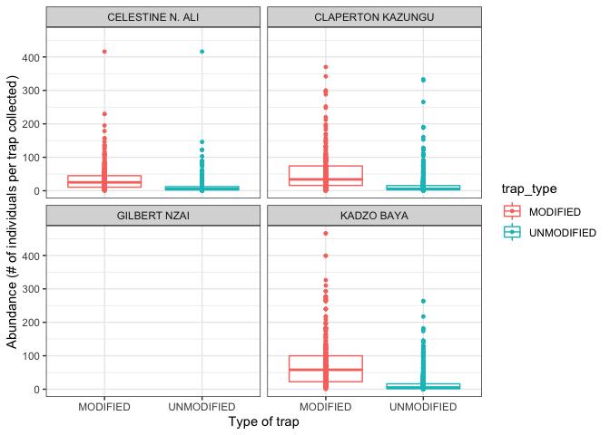
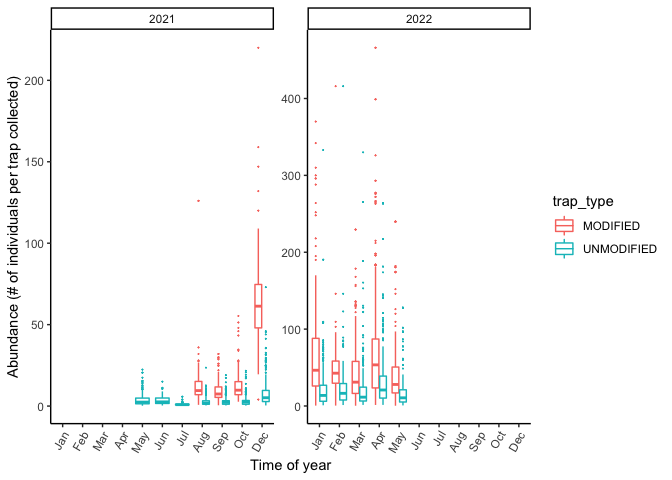
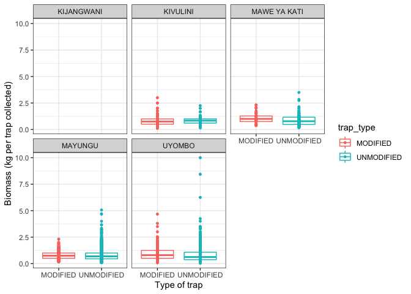
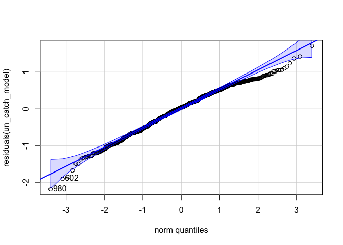
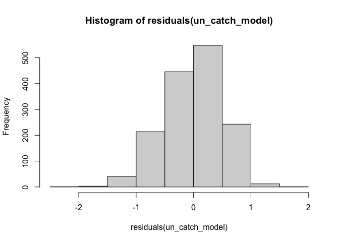
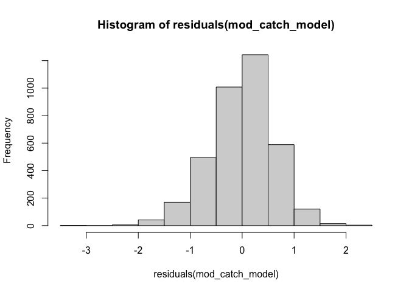
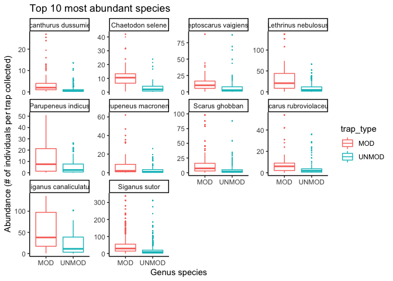

CUE, maturity, and length analysis of Fishing Landings dataset
================
Author: Emma Strand; <emma_strand@uri.edu>

## Questions for Austin and Clay

## Summary of dataset

Modified traps data:  
2022: January, February, March, April, May

Unmodified traps data: 2021: January, June, August, September 2022:
January, February, March, April, May, June

## Contents

-   [**Reading in datafiles**](#data)  
-   [**Total catch (grams) per unit effort (trap
    set)**](#catch_effort)  
-   [**Calculate top species caught**](#species)  
-   [**Top species stats per trap**](#species_pertrap)  
-   [**Creating database from Fishbase**](#fishbase)  
-   [**Catch per unit effort for top species by maturity**](#maturity)  
-   [**Catch and length data of mature fish**](#length)  
-   [**Length Frequency plots of top species**](#freq_plots)

## <a name="data"></a> **Reading in datafiles**

``` r
library(plyr)
library(dplyr)
library(tidyverse)
library(ggplot2)
library(readxl)
library(lubridate)
library(Hmisc)
library(writexl)
library(naniar)
library(Rmisc)
library(stats)
library(lme4)
library(car)
```

Read in the data frame that is the output of the QC script.

``` r
# read in excel file
data <- read_excel("data/cleaned-Fishlandings-data- CC-JM-Clay-IW combined 7-28-2022.xlsx") #read in excel file 

data <- data %>% separate(Operation_date, c("year", "month", "day"), remove = FALSE) # creating new columns with month year and date
data$month <- as.numeric(data$month) #changing this column to numeric instead of a character (needed for next fxn)
data$month <- month.abb[data$month] #changing numeric months to month names 

data$month <- factor(data$month, levels=c("Jan", "Feb","Mar","Apr","May","Jun",
                                          "Jul", "Aug", "Sep", "Oct", "Dec", "NA"))

data$total_traps_collected[data$total_traps_collected == 0] <- NA
```

## <a name="catch_effort"></a> **Total catch (grams) per unit effort (trap set)**

**Total catch per unit effort between modified and traditional traps. It
would be great to see this as grams captured per trap set.**

Grouping by fisher\_id but this might be effective to group by
enumerator once I have correct list of names. There are 3 boat trips
recorded with the exact same fish data that are under 3 different fisher
ID names but all the same enumerator.. come back to this in QC.

Goal: grams captured per trap set.

``` r
modified_trap_df <- data %>% unite(survey_id, Operation_date, fisher_id, sep = " ", remove = FALSE) %>%
  dplyr::group_by(survey_id) %>% # group by survey id
  mutate(total_catch = sum(number_of_fish), #count the number of fish caught for each survey id
         grams_per_trap = total_weight_kg/total_traps_collected, #divide total weight for survey id by total traps 
         catch_per_trap = total_catch/total_traps_collected) %>% #divide total catch per survey id by total traps 
  dplyr::ungroup(survey_id) %>% #ungroup by this column  
  subset(trap_type == "MODIFIED" | trap_type == "UNMODIFIED") %>% #subset for only modified and unmodified traps 
  select(survey_id, enumerator, trap_type, total_traps_collected, `No. of fishers in crew`, landing_site, total_catch, month, year, grams_per_trap, catch_per_trap) %>%
  distinct() 
```

### Plotting figures.

Catch per trap

``` r
# basic total catch per trap with no other variables 
modified_trap_df %>% filter(catch_per_trap < 1500) %>%
  ggplot(aes(x=trap_type, y=catch_per_trap, color=trap_type)) +
  geom_boxplot(aes(color=trap_type), outlier.size = 0, lwd=0.5) +
    geom_point(aes(fill=trap_type), pch = 21, size=1) +
  theme_bw() + 
  ylab("Total catch per trap") + xlab("Type of trap") +
  theme(axis.text.x = element_text(vjust = 1.1)) #Set the text angle
```

<!-- -->

``` r
# by fisherman 
modified_trap_df %>% 
  ggplot(aes(x=trap_type, y=catch_per_trap, color=trap_type)) + 
  facet_wrap(~enumerator) +
  geom_boxplot(aes(color=trap_type), outlier.size = 0, lwd=0.5) +
    geom_point(aes(fill=trap_type), pch = 21, size=1) +
  theme_bw() + 
  ylab("Total catch per trap") + xlab("Type of trap") +
  theme(axis.text.x = element_text(vjust = 1.1)) #Set the text angle
```

    ## Warning: Removed 61 rows containing non-finite values (stat_boxplot).

    ## Warning: Removed 61 rows containing missing values (geom_point).

<!-- -->

``` r
# by landing site
modified_trap_df %>% 
  ggplot(aes(x=trap_type, y=catch_per_trap, color=trap_type)) + 
  facet_wrap(~landing_site) +
  geom_boxplot(aes(color=trap_type), outlier.size = 0, lwd=0.5) +
    geom_point(aes(fill=trap_type), pch = 21, size=1) +
  theme_bw() + 
  ylab("Total catch per trap") + xlab("Type of trap") +
  theme(axis.text.x = element_text(vjust = 1.1)) #Set the text angle
```

    ## Warning: Removed 61 rows containing non-finite values (stat_boxplot).
    ## Removed 61 rows containing missing values (geom_point).

<!-- -->

``` r
# by month and year 
modified_trap_df %>% unite(ym, year, month, sep = " ", remove = FALSE) %>% filter(catch_per_trap < 1500) %>%
  ggplot(aes(x=month, y=catch_per_trap, color=trap_type)) + 
  facet_wrap(~year, scales = "free_y") +
  geom_boxplot(aes(color=trap_type), outlier.size = 0, lwd=0.5) +
  #geom_point(aes(x=ym, y=catch_per_trap, fill=trap_type), pch = 21, size=1) +
  theme_classic() + 
  ylab("Total catch per trap") + xlab("Time of year") +
  theme(axis.text.x = element_text(vjust = 1.1, hjust=1.1, angle=60)) #Set the text angle
```

<!-- -->

Grams per trap

``` r
# basic grams per trap plot with no other variables 
modified_trap_df %>% 
  ggplot(aes(x=trap_type, y=grams_per_trap, color=trap_type)) + 
  geom_boxplot(aes(color=trap_type), outlier.size = 0, lwd=0.5) +
    geom_point(aes(fill=trap_type), pch = 21, size=1) +
  theme_bw() + 
  ylab("Grams of fish per trap") + xlab("Type of trap") +
  theme(axis.text.x = element_text(vjust = 1.1)) #Set the text angle
```

    ## Warning: Removed 62 rows containing non-finite values (stat_boxplot).

    ## Warning: Removed 62 rows containing missing values (geom_point).

<!-- -->

``` r
# visually seeing if this differs by fisherman 
modified_trap_df %>% 
  ggplot(aes(x=trap_type, y=grams_per_trap, color=trap_type)) + 
  facet_wrap(~enumerator) +
  geom_boxplot(aes(color=trap_type), outlier.size = 0, lwd=0.5) +
    geom_point(aes(fill=trap_type), pch = 21, size=1) +
  theme_bw() + 
  ylab("Grams of fish per trap") + xlab("Type of trap") +
  theme(axis.text.x = element_text(vjust = 1.1)) #Set the text angle
```

    ## Warning: Removed 62 rows containing non-finite values (stat_boxplot).
    ## Removed 62 rows containing missing values (geom_point).

<!-- -->

``` r
# visually seeing if this differs by landing site 
modified_trap_df %>% 
  ggplot(aes(x=trap_type, y=grams_per_trap, color=trap_type)) + 
  facet_wrap(~landing_site) +
  geom_boxplot(aes(color=trap_type), outlier.size = 0, lwd=0.5) +
    geom_point(aes(fill=trap_type), pch = 21, size=1) +
  theme_bw() + 
  ylab("Grams of fish per trap") + xlab("Type of trap") +
  theme(axis.text.x = element_text(vjust = 1.1)) #Set the text angle
```

    ## Warning: Removed 62 rows containing non-finite values (stat_boxplot).
    ## Removed 62 rows containing missing values (geom_point).

<!-- -->

``` r
# by month and year 
modified_trap_df %>% unite(ym, year, month, sep = " ", remove = FALSE) %>% #filter(catch_per_trap < 1500) %>%
  ggplot(aes(x=month, y=grams_per_trap, color=trap_type)) + 
  facet_wrap(~year) +
  geom_boxplot(aes(color=trap_type), outlier.size = 0, lwd=0.5) +
 # geom_point(aes(x=month, group=trap_type, y=grams_per_trap, fill=trap_type), pch = 21, size=1) +
  theme_classic() + 
  ylab("Grams of fish per trap") + xlab("Time of year") +
  theme(axis.text.x = element_text(vjust = 1.1, hjust=1.1, angle=60)) #Set the text angle
```

    ## Warning: Removed 62 rows containing non-finite values (stat_boxplot).

<!-- -->

The relationship between grams per trap and total catch per trap.

``` r
modified_trap_df %>%# filter(catch_per_trap < 1500) %>%
  ggplot(aes(x=catch_per_trap, y=grams_per_trap, color=trap_type)) +
  theme_bw() + xlab("total catch per trap") + ylab("grams per trap") +
  geom_smooth(aes(fill=trap_type), method="loess", se=TRUE, fullrange=TRUE, level=0.95, color="black") +
  geom_point(aes(fill=trap_type), pch = 21, size=1)
```

    ## `geom_smooth()` using formula 'y ~ x'

    ## Warning: Removed 62 rows containing non-finite values (stat_smooth).

    ## Warning: Removed 54 rows containing missing values (geom_smooth).

    ## Warning: Removed 62 rows containing missing values (geom_point).

<!-- -->

### Statistics on the above.

Default of t.test in R is a Welch t-test which is just an adaptation of
t-test, and it is used when the two samples have possibly unequal
variances. Use var.equal = TRUE or FALSE to specifiy the variances of
the dataset.

You can test equal variances with a Fisher’s F-test. If p &lt; 0.05 then
we include var.equal = FALSE in below ttest. If p &gt; 0.05 then we
include var.equal = TRUE in below ttest.

We are using an unpaired two sample t-test for this dataset.

``` r
UN <- modified_trap_df %>% subset(trap_type == "MODIFIED") %>% filter(!is.na(grams_per_trap)) %>% filter(!is.na(catch_per_trap))
MOD <- modified_trap_df %>% subset(trap_type == "UNMODIFIED") %>% filter(!is.na(grams_per_trap)) %>% filter(!is.na(catch_per_trap))
```

#### Grams per trap

``` r
var.test(UN$grams_per_trap, MOD$grams_per_trap)
```

    ## 
    ##  F test to compare two variances
    ## 
    ## data:  UN$grams_per_trap and MOD$grams_per_trap
    ## F = 0.72688, num df = 1049, denom df = 2828, p-value = 1.259e-09
    ## alternative hypothesis: true ratio of variances is not equal to 1
    ## 95 percent confidence interval:
    ##  0.6583185 0.8044689
    ## sample estimates:
    ## ratio of variances 
    ##          0.7268842

``` r
t.test(grams_per_trap~trap_type, data = modified_trap_df, var.equal = FALSE)
```

    ## 
    ##  Welch Two Sample t-test
    ## 
    ## data:  grams_per_trap by trap_type
    ## t = 4.2895, df = 2182.7, p-value = 1.869e-05
    ## alternative hypothesis: true difference in means between group MODIFIED and group UNMODIFIED is not equal to 0
    ## 95 percent confidence interval:
    ##  0.0403919 0.1084280
    ## sample estimates:
    ##   mean in group MODIFIED mean in group UNMODIFIED 
    ##                0.8647085                0.7902985

#### Total catch per trap

``` r
var.test(UN$catch_per_trap, MOD$catch_per_trap)
```

    ## 
    ##  F test to compare two variances
    ## 
    ## data:  UN$catch_per_trap and MOD$catch_per_trap
    ## F = 1.873, num df = 1049, denom df = 2828, p-value < 2.2e-16
    ## alternative hypothesis: true ratio of variances is not equal to 1
    ## 95 percent confidence interval:
    ##  1.696297 2.072885
    ## sample estimates:
    ## ratio of variances 
    ##           1.872971

``` r
t.test(catch_per_trap~trap_type, data = modified_trap_df, var.equal = FALSE)
```

    ## 
    ##  Welch Two Sample t-test
    ## 
    ## data:  catch_per_trap by trap_type
    ## t = 16.389, df = 1484, p-value < 2.2e-16
    ## alternative hypothesis: true difference in means between group MODIFIED and group UNMODIFIED is not equal to 0
    ## 95 percent confidence interval:
    ##  44.18302 56.19691
    ## sample estimates:
    ##   mean in group MODIFIED mean in group UNMODIFIED 
    ##                 69.91612                 19.72616

#### Total catch per trap vs weight in grams per trap.

We use a linear mixed model for this so we can include other variables
like fisherman and landing site.

Grams per trap is log transformed.

I’m not sure yet if this is the best way to do this…

``` r
# unmodified
un_catch_model <- lmer(log(grams_per_trap) ~ catch_per_trap + (1|enumerator) + (1|landing_site), na.action=na.omit, data=UN)
qqPlot(residuals(un_catch_model)) 
```

<!-- -->

    ## [1] 695  59

``` r
hist(residuals(un_catch_model))
```

<!-- -->

``` r
# modified
mod_catch_model <- lmer(log(grams_per_trap) ~ catch_per_trap + (1|enumerator) + (1|landing_site), na.action=na.omit, data=MOD)
```

    ## boundary (singular) fit: see help('isSingular')

``` r
qqPlot(residuals(mod_catch_model)) 
```

<!-- -->

    ## [1] 2248 2252

``` r
hist(residuals(mod_catch_model))
```

<!-- -->

``` r
summary(un_catch_model)
```

    ## Linear mixed model fit by REML ['lmerMod']
    ## Formula: log(grams_per_trap) ~ catch_per_trap + (1 | enumerator) + (1 |  
    ##     landing_site)
    ##    Data: UN
    ## 
    ## REML criterion at convergence: 1582.5
    ## 
    ## Scaled residuals: 
    ##     Min      1Q  Median      3Q     Max 
    ## -3.5194 -0.5961  0.0935  0.7499  3.5994 
    ## 
    ## Random effects:
    ##  Groups       Name        Variance Std.Dev.
    ##  landing_site (Intercept) 0.023740 0.15408 
    ##  enumerator   (Intercept) 0.002161 0.04649 
    ##  Residual                 0.256968 0.50692 
    ## Number of obs: 1050, groups:  landing_site, 4; enumerator, 3
    ## 
    ## Fixed effects:
    ##                  Estimate Std. Error t value
    ## (Intercept)    -0.3488346  0.0862655  -4.044
    ## catch_per_trap  0.0018086  0.0001827   9.898
    ## 
    ## Correlation of Fixed Effects:
    ##             (Intr)
    ## ctch_pr_trp -0.176

``` r
summary(mod_catch_model)
```

    ## Linear mixed model fit by REML ['lmerMod']
    ## Formula: log(grams_per_trap) ~ catch_per_trap + (1 | enumerator) + (1 |  
    ##     landing_site)
    ##    Data: MOD
    ## 
    ## REML criterion at convergence: 5476.6
    ## 
    ## Scaled residuals: 
    ##     Min      1Q  Median      3Q     Max 
    ## -5.8131 -0.6071  0.0929  0.6252  3.2744 
    ## 
    ## Random effects:
    ##  Groups       Name        Variance Std.Dev.
    ##  landing_site (Intercept) 0.02732  0.1653  
    ##  enumerator   (Intercept) 0.00000  0.0000  
    ##  Residual                 0.40148  0.6336  
    ## Number of obs: 2829, groups:  landing_site, 4; enumerator, 3
    ## 
    ## Fixed effects:
    ##                  Estimate Std. Error t value
    ## (Intercept)    -0.4224045  0.0851368  -4.961
    ## catch_per_trap  0.0015269  0.0001803   8.468
    ## 
    ## Correlation of Fixed Effects:
    ##             (Intr)
    ## ctch_pr_trp -0.045
    ## optimizer (nloptwrap) convergence code: 0 (OK)
    ## boundary (singular) fit: see help('isSingular')

``` r
Anova(un_catch_model, ddf="lme4", type='III')
```

    ## Analysis of Deviance Table (Type III Wald chisquare tests)
    ## 
    ## Response: log(grams_per_trap)
    ##                 Chisq Df Pr(>Chisq)    
    ## (Intercept)    16.352  1  5.261e-05 ***
    ## catch_per_trap 97.970  1  < 2.2e-16 ***
    ## ---
    ## Signif. codes:  0 '***' 0.001 '**' 0.01 '*' 0.05 '.' 0.1 ' ' 1

``` r
Anova(mod_catch_model, ddf="lme4", type='III')
```

    ## Analysis of Deviance Table (Type III Wald chisquare tests)
    ## 
    ## Response: log(grams_per_trap)
    ##                 Chisq Df Pr(>Chisq)    
    ## (Intercept)    24.616  1  6.996e-07 ***
    ## catch_per_trap 71.700  1  < 2.2e-16 ***
    ## ---
    ## Signif. codes:  0 '***' 0.001 '**' 0.01 '*' 0.05 '.' 0.1 ' ' 1

## <a name="species"></a> **Calculate top species caught**

**Species catch per unit effort between modified and traditional traps.
Take the top 3-5 species and run \#1 for them separately.**

Calculating which species were the most abundant across the entire
survey.

This might have to be number of fish caught per trap? So that the
difference in \# of traps for modified and unmodified is accounted for?

This is split for modified and unmodified so far.. but can be changed to
combined.. the trend is about the same for most abundant type of fish in
each trap..

``` r
species_list <- data %>% select(scientific_name, number_of_fish, trap_type) %>% 
  filter(!is.na(trap_type)) %>% 
  filter(!is.na(number_of_fish)) %>% 
  subset(trap_type == "MODIFIED" | trap_type == "UNMODIFIED") %>% #subset for only modified and unmodified traps 
  dplyr::group_by(scientific_name, trap_type) %>%
  mutate(species_catch = sum(number_of_fish)) %>% 
  select(-number_of_fish) %>% distinct() %>%
  ungroup()

# above 250 cut off includes top each count for each type of trap 
species_list %>% filter(species_catch > 250) %>%
  ggplot(., aes(x=scientific_name, y=species_catch, group = trap_type, color = trap_type)) + 
  ylab("number of fish caught") + xlab("Genus species") +
  geom_point() + theme_bw() + theme(axis.text.x = element_text(angle = 60, hjust=1)) #Set the text angle
```

<!-- -->

``` r
# species_list %>% filter(species_catch > 250) %>% 
#   select(scientific_name) %>% 
#   distinct() %>%
#   write_csv("output/top_species.csv")

# print top 5 species from modified traps 
species_list %>% subset(trap_type == "MODIFIED") %>%                                    
  arrange(desc(species_catch)) %>% head(5)
```

    ## # A tibble: 5 × 3
    ##   scientific_name       trap_type species_catch
    ##   <chr>                 <chr>             <dbl>
    ## 1 Siganus sutor         MODIFIED         149176
    ## 2 Lethrinus nebulosus   MODIFIED          16989
    ## 3 Scarus ghobban        MODIFIED          10695
    ## 4 Siganus canaliculatus MODIFIED           6067
    ## 5 Parupeneus indicus    MODIFIED           4282

``` r
# print top 5 species from unmodified traps 
species_list %>% subset(trap_type == "UNMODIFIED") %>%                                    
  arrange(desc(species_catch)) %>% head(5)
```

    ## # A tibble: 5 × 3
    ##   scientific_name        trap_type  species_catch
    ##   <chr>                  <chr>              <dbl>
    ## 1 Siganus sutor          UNMODIFIED        231472
    ## 2 Lethrinus nebulosus    UNMODIFIED         30713
    ## 3 Scarus ghobban         UNMODIFIED         21715
    ## 4 Leptoscarus vaigiensis UNMODIFIED         15989
    ## 5 Siganus canaliculatus  UNMODIFIED         11963

## <a name="species_pertrap"></a> **Top species stats per trap**

Create a subsetted df from the top 10 total species (break this down
into modified and unmodified later?).

``` r
# calculate species total catch to then figure out which ones were most popular regardless of trap type
species_df <- data %>% filter(!is.na(number_of_fish)) %>%
  subset(trap_type == "MODIFIED" | trap_type == "UNMODIFIED") %>%
  group_by(scientific_name) %>%
  mutate(species_total_catch = sum(number_of_fish)) %>% ungroup() #must ungroup for following commands 

# use the above metric to subset to top 10 of those 
species_keep <- species_df %>% select(scientific_name, species_total_catch) %>% 
  distinct() %>% slice_max(species_total_catch, n = 10) 

# filter species df based on the species_keep list 
species_df <- species_df %>% filter(scientific_name %in% species_keep$scientific_name)

# double checking the above command worked - output should be only 5 
unique(sort(species_df$scientific_name))
```

    ##  [1] "Acanthurus dussumieri"  "Chaetodon selene"       "Leptoscarus vaigiensis"
    ##  [4] "Lethrinus nebulosus"    "Parupeneus indicus"     "Scarus ghobban"        
    ##  [7] "Scarus psittacus"       "Scarus rubroviolaceus"  "Siganus canaliculatus" 
    ## [10] "Siganus sutor"

With just the top 10 species, just plotting catch per trap. I don’t
think I can do weight of just these species by trap because the weight
is for the whole catch.

``` r
### species_df is already subsetted to the top 10 species 
# within each survey id, for each species calculate topspecies_catch as the number fish in that species in that survey
# then calculate the catch per trap as the number of fish of that species over the total number of traps collected
species_df <- species_df %>% unite(survey_id, Operation_date, fisher_id, sep = " ", remove = FALSE) %>%
  dplyr::group_by(survey_id, scientific_name) %>% # group by survey id
  mutate(topspecies_catch = sum(number_of_fish),
         catch_per_trap = topspecies_catch/total_traps_collected) %>% #divide total catch per survey id by total traps 
  dplyr::ungroup(survey_id, scientific_name) #ungroup by this column

# basic grams per trap plot with no other variables 
species_df %>% mutate(trap_type = case_when(
    trap_type == "MODIFIED" ~ "MOD",
    trap_type == "UNMODIFIED" ~ "UNMOD")) %>%
  ggplot(aes(x=trap_type, y=catch_per_trap, color=trap_type)) + 
  geom_boxplot(aes(color=trap_type), outlier.size = 0, lwd=0.5) +
  facet_wrap(~scientific_name, scales = "free_y") +
  theme_classic() + ggtitle("For top 10 most abundant species") +
  ylab("Catch per trap (species catch # / total catch)") + xlab("Genus species") +
  theme(axis.text.x = element_text()) #Set the text angle
```

    ## Warning: Removed 1809 rows containing non-finite values (stat_boxplot).

<!-- -->

### Statistics for the top ten species

Left off at trying to solve the following error when running aov:

Error in as.POSIXlt.character(x, tz, …) : character string is not in a
standard unambiguous format

Error in lm.fit(x, y, offset = offset, singular.ok = singular.ok, …) :
NA/NaN/Inf in ‘y’

``` r
Topspp_MOD <- species_df %>% subset(trap_type == "MODIFIED")

Topspp_UNMOD <- species_df %>% subset(trap_type == "UNMODIFIED")  

var.test(Topspp_MOD$catch_per_trap, MOD$catch_per_trap) # output is significant so put false below
```

    ## 
    ##  F test to compare two variances
    ## 
    ## data:  Topspp_MOD$catch_per_trap and MOD$catch_per_trap
    ## F = 1.2111, num df = 21601, denom df = 2828, p-value = 4.081e-11
    ## alternative hypothesis: true ratio of variances is not equal to 1
    ## 95 percent confidence interval:
    ##  1.145108 1.279380
    ## sample estimates:
    ## ratio of variances 
    ##           1.211108

``` r
#t.test(catch_per_trap~trap_type, data = species_df, var.equal = FALSE)

#aov(catch_per_trap ~ trap_type + scientific_name, data = species_df)
```

## <a name="maturity"></a> **Catch per unit effort for top species by maturity**

**Total mature fish catch per unit effort between modified and
traditional traps. This will have to be for the top 3-5 species
separately. Go to Fishbase and find the length at first maturity for
that particular species, then assign each fish a “mature” or “immature”
status in the data and calculate.**

Data pulled from Fishbase and put in the datasheet `fishbase.xlsx`.

### Creating maturity dataframe based on data pulled from fishbase

``` r
fishbase <- read_excel("data/fishbase.xlsx", sheet = "data") %>% #read in excel file 
  select(scientific_name, Lm, Lm_se_min, Lm_se_max)

maturity <- full_join(data, fishbase, by = "scientific_name") %>% # joining maturity reproduction info with main dataframe
  unite(survey_id, Operation_date, fisher_id, sep = " ", remove = FALSE) %>% #creating a survey id based on date and fisherman
  filter(!is.na(Lm)) %>% # taking out observations that don't have an Lm value so only the top species 
  mutate(Lm_range = case_when( ### making a new column as Lm corrected to then compare to Length_corrected 
    Lm >= 0 & Lm <= 10.5 ~ "0-10",
    Lm >= 10.5 & Lm <= 15.4 ~ "11-15",
    Lm >= 15.5 & Lm <= 20.4 ~ "16-20",
    Lm >= 20.5 & Lm <= 25.4 ~ "21-25",
    Lm >= 25.5 & Lm <= 30.4 ~ "26-30",
    Lm >= 30.5 & Lm <= 35.4 ~ "31-35",
    Lm >= 35.5 & Lm <= 40.4 ~ "36-40",
    Lm >= 40.5 & Lm <= 45.4 ~ "41-45",
    Lm >= 45.5 & Lm <= 50.4 ~ "46-50",
    Lm >= 50.5 & Lm <= 75 ~ ">50",
    Lm > 75 ~ ">75")) %>%
  mutate(Lm_comparison = case_when( ### I can't compare character columns so making a new column to use in comparison
    Lm_range == "0-10" ~ 1,
    Lm_range == "11-15" ~ 11,
    Lm_range == "16-20" ~ 16,
    Lm_range == "21-25" ~ 21,
    Lm_range == "26-30" ~ 26,
    Lm_range == "31-35" ~ 31,
    Lm_range == "36-40" ~ 36,
    Lm_range == "41-45" ~ 41,
    Lm_range == "46-50" ~ 46,
    Lm_range == ">50" ~ 50,
    Lm_range == ">75" ~ 75)) %>%
  mutate(Length_comparison = case_when( ### I can't compare character columns so making a new column to use in comparison
    length_corrected == "0-10" ~ 1,
    length_corrected == "11-15" ~ 11,
    length_corrected == "16-20" ~ 16,
    length_corrected == "21-25" ~ 21,
    length_corrected == "26-30" ~ 26,
    length_corrected == "31-35" ~ 31,
    length_corrected == "36-40" ~ 36,
    length_corrected == "41-45" ~ 41,
    length_corrected == "46-50" ~ 46,
    length_corrected == ">50" ~ 50,
    length_corrected == ">75" ~ 75))
  
### there is probably a more efficient way to do the above this works for now 

maturity$Length_comparison <- as.numeric(maturity$Length_comparison)
maturity$Lm_comparison <- as.numeric(maturity$Lm_comparison)

maturity <- maturity %>% 
  mutate(maturity = if_else(length_corrected >= Lm_comparison, "mature", "immature")) %>%
  subset(trap_type == "MODIFIED" | trap_type == "UNMODIFIED") %>% #subsetting to only the modified and unmodified traps 
  mutate(nofish_pertrap = number_of_fish/total_traps_collected) #per species per survey id
```

Immaure and mature fish catch comparison

``` r
maturity %>% select(number_of_fish, trap_type, maturity, scientific_name, total_traps_collected, nofish_pertrap) %>% 
  na.omit() %>% 
  ggplot(., aes(x=scientific_name, y=nofish_pertrap, color=maturity)) +
  geom_boxplot() + theme_classic() + 
  theme(axis.text.x = element_text(angle=60, hjust=1)) +
  xlab("Species") +
  ylab("Number of fish per trap set")
```

<!-- -->

``` r
maturity %>% select(number_of_fish, trap_type, maturity, scientific_name, total_traps_collected, nofish_pertrap) %>% 
  na.omit() %>%  
  ggplot(., aes(x=maturity, y=nofish_pertrap, color=trap_type)) +
  geom_boxplot() + theme_classic() + 
  facet_wrap(~trap_type, scales = "free_y") +
  #theme(axis.text.x = element_text(angle=60, hjust=1)) +
  xlab("Maturity") +
  ylab("Number of fish per trap set")
```

<!-- -->

Statistics on the above…

Circle back to the padj values coming out to “0.000000e+00”.

Double check `trap_type+maturity` vs `trap_type*maturity`.

``` r
nofish_maturity_aov <- aov(number_of_fish ~ trap_type*maturity, data = maturity)
summary(nofish_maturity_aov)
```

    ##                       Df  Sum Sq Mean Sq F value Pr(>F)    
    ## trap_type              1   43121   43121 634.973 <2e-16 ***
    ## maturity               1   35467   35467 522.259 <2e-16 ***
    ## trap_type:maturity     1      48      48   0.703  0.402    
    ## Residuals          70065 4758141      68                   
    ## ---
    ## Signif. codes:  0 '***' 0.001 '**' 0.01 '*' 0.05 '.' 0.1 ' ' 1
    ## 143 observations deleted due to missingness

``` r
nofish_maturity_tukey <- TukeyHSD(nofish_maturity_aov)
nofish_maturity_tukey$`trap_type:maturity`
```

    ##                                             diff         lwr       upr
    ## UNMODIFIED:immature-MODIFIED:immature -1.7863916 -2.04200482 -1.530778
    ## MODIFIED:mature-MODIFIED:immature     -1.5045134 -1.78810411 -1.220923
    ## UNMODIFIED:mature-MODIFIED:immature   -3.1786405 -3.42982109 -2.927460
    ## MODIFIED:mature-UNMODIFIED:immature    0.2818781  0.04678129  0.516975
    ## UNMODIFIED:mature-UNMODIFIED:immature -1.3922489 -1.58702712 -1.197471
    ## UNMODIFIED:mature-MODIFIED:mature     -1.6741271 -1.90439666 -1.443858
    ##                                            p adj
    ## UNMODIFIED:immature-MODIFIED:immature 0.00000000
    ## MODIFIED:mature-MODIFIED:immature     0.00000000
    ## UNMODIFIED:mature-MODIFIED:immature   0.00000000
    ## MODIFIED:mature-UNMODIFIED:immature   0.01112794
    ## UNMODIFIED:mature-UNMODIFIED:immature 0.00000000
    ## UNMODIFIED:mature-MODIFIED:mature     0.00000000

## <a name="length"></a> **Catch and length data of mature fish**

**Average length of catch versus length at first maturity (Lmat). Take
the difference for each fish in the data against its length at first
maturity and then calculate a weighted value for modified versus
traditional traps where a value above 0 represents a fish above Lmat and
a value below represents a fish below Lmat.**

We only have bins for the length values.. so this might have to be by
5s. i.e. catch = 11-15; Lm 21-25. Can take median values and do that
calculation?

I’m not sure this is the best way to do this…

Transform count value to that number of observations:
<https://stackoverflow.com/questions/70759069/transform-count-column-into-number-of-rows>.

``` r
maturity_dist <- maturity %>% 
  select(survey_id, number_of_fish, scientific_name, trap_type, length_corrected, Lm, Lm_range, Lm_comparison, Length_comparison, maturity) %>%
  mutate(number_of_fish = if_else(is.na(number_of_fish), 1, number_of_fish)) %>% # replacing NAs with the value of 1
  tidyr::uncount(., number_of_fish, .remove = TRUE) %>% # expanding number of fish to number of observations
  #### notes on below fxn --- maybe not the best way to do this? 0-10 is a bigger bin than 11-15 so median value isn't as representative?
  mutate(median_length = case_when(
    length_corrected == "0-10" ~ 5,
    length_corrected == "11-15" ~ 13,
    length_corrected == "16-20" ~ 18,
    length_corrected == "21-25" ~ 23,
    length_corrected == "26-30" ~ 28,
    length_corrected == "31-35" ~ 33,
    length_corrected == "36-40" ~ 38,
    length_corrected == "41-45" ~ 43,
    length_corrected == "46-50" ~ 48,
    length_corrected == ">50" ~ 50,
    length_corrected == ">75" ~ 75)) %>%
  mutate(length_dist = median_length-Lm) %>%
  group_by(scientific_name, trap_type) %>%
  mutate(avg_length_dist = mean(length_dist)) %>% #### a positive value here = mature; a negative value = immature 
  ungroup()

maturity_dist %>% group_by(scientific_name) %>%
  filter(., n_distinct(avg_length_dist) >= 2) %>% # filters out the observations aren't in both categories (takes out species that only have 1 unique mean dist value so only 1 trap type)
  ungroup() %>%
  ggplot(., aes(x=scientific_name, y=avg_length_dist, color = trap_type)) +
  geom_hline(yintercept = 0, lty = "dotted") +
  geom_line(aes(group = scientific_name), color="grey14") +
  geom_point() + theme_bw() + 
  theme(axis.text.x = element_text(angle=60, hjust=1)) +
  labs(y="Mean distance from Lm", x="Genus species", color="Trap Type")
```

    ## Warning: Removed 6528 row(s) containing missing values (geom_path).

    ## Warning: Removed 276011 rows containing missing values (geom_point).

<!-- -->

## <a name="freq_plots"></a> **Length Frequency plots of top species**

**Length frequency of top 3-5 species in modified versus traditional
(different colors) with Lmat etc. indicators pulled from Fishbase.**

Check this calculation for each fish not just each survey id???

<http://derekogle.com/fishR/2017-07-28-JoyPlot>

From the `species_keep` df:

Siganus sutor = 380648  
Lethrinus nebulosus = 47702  
Scarus ghobban = 32410  
Leptoscarus vaigiensis = 19606  
Siganus canaliculatus = 18030

``` r
# the column we want to plot: maturity$length_corrected
maturity$length_corrected <- factor(maturity$length_corrected, levels=c("0-10", "11-15","16-20","21-25","26-30","31-35","36-40",
                                                                        "41-45", "46-50", ">75"))

maturity <- maturity %>% filter(!is.na(length_corrected)) %>%
  group_by(length_corrected, scientific_name, trap_type) %>%
  mutate(count.per.bin = sum(number_of_fish)) %>%
  ungroup()

maturity2022_topspp <- maturity %>% subset(year=="2022") %>% 
  subset(scientific_name == "Siganus sutor" | scientific_name == "Lethrinus nebulosus" |
           scientific_name == "Scarus ghobban" | scientific_name == "Leptoscarus vaigiensis" |
           scientific_name == "Siganus canaliculatus")
  
maturity2022_topspp %>% 
  mutate(number_of_fish = if_else(is.na(number_of_fish), 1, number_of_fish)) %>% # replacing NAs with the value of 1
  tidyr::uncount(., number_of_fish, .remove = TRUE) %>% # expanding number of fish to number of observations
  ggplot(., aes(x=length_corrected, fill=trap_type, color=trap_type)) + 
  geom_bar(alpha=0.3) +
  geom_vline(data = maturity2022_topspp, mapping = aes(xintercept = Lm_range), lty = "dotted") +
  theme_bw() + xlab("Length (cm)") + ylab("Frequency") +
  theme(axis.text.x.bottom = element_text(colour = 'black', angle = 60, hjust = 1),
        axis.text.y = element_text(colour = 'black', size = 8, face = 'italic')) + 
  theme(panel.border = element_blank(),
   panel.grid.major = element_blank(),
   panel.grid.minor = element_blank(),
   strip.text.x = element_text(size = 9, color = "black", face = "bold.italic"),
   axis.line = element_line(colour = "black")) +
  theme(axis.title.y = element_text(size = 12, face = "bold", margin = margin(t = 0, r = 10, b = 0, l = 0))) +
  theme(axis.title.x = element_text(size = 12, face = "bold", margin = margin(t = 10, r = 0, b = 0, l = 0))) +
  facet_wrap(~scientific_name, scales = "free_y") +
  ggtitle("Siganus canaliculatus Lm range = 0-10, can edit on in other program")
```

<!-- -->
