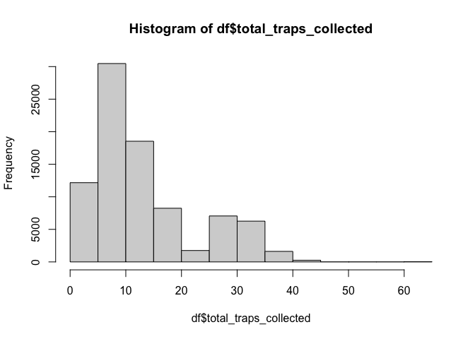
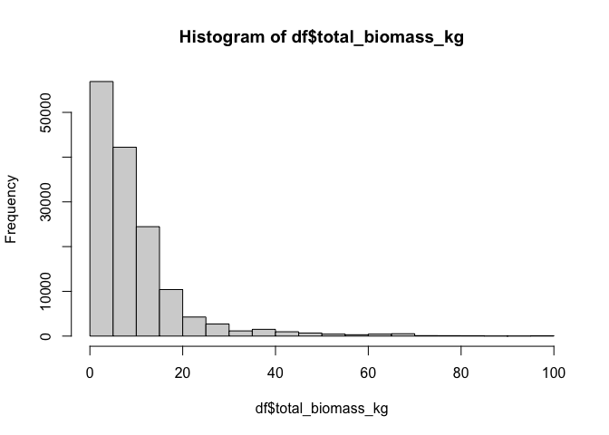
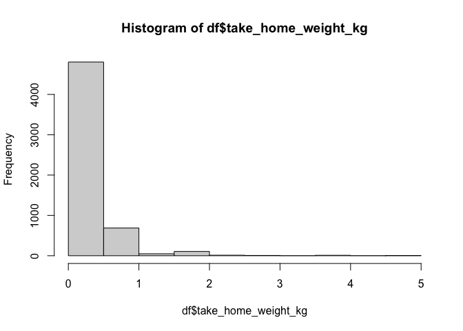
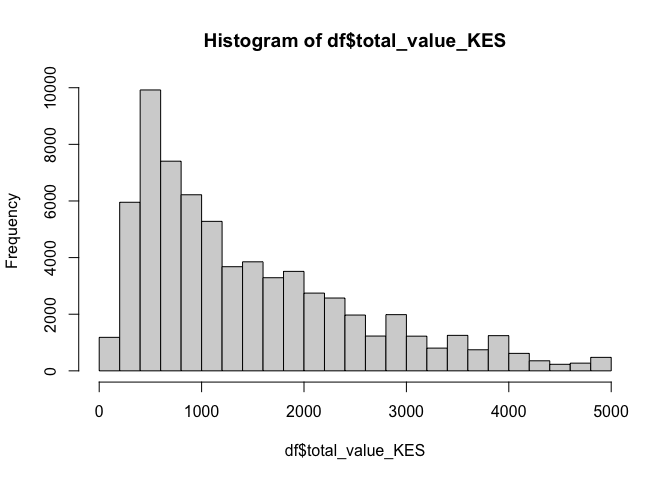
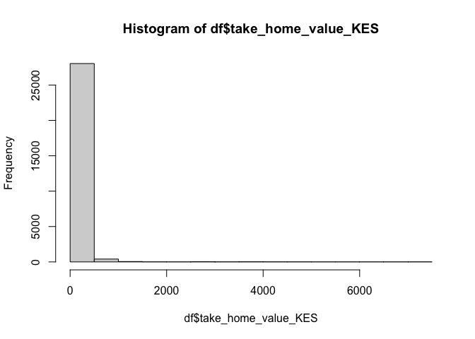
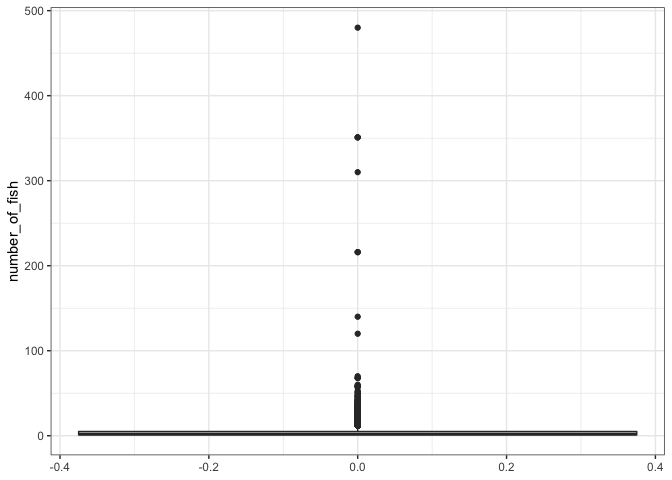

Quality Control of Fishing Landings dataset
================
Author: Emma Strand; <emma_strand@uri.edu>

## Questions for Austin and Clay

Crew size range - double check

## Contents

-   [**Protocol to run this with a future xlsx file**](#protocol)  
-   [**Load all libraries**](#libraries)  
-   [**Create dataframe**](#df)  
-   [**Quality Control: enumerator**](#Enumerator)  
-   [**Quality Control: landing\_site and BMU**](#Landing_site)  
-   [**Quality Control: fisher information**](#fisher_info)  
-   [**Quality Control: trap information**](#trap)  
-   [**Quality Control: catch information**](#catch)  
-   [**Gear type, and fish numbers/final destination**](#gear)  
-   [**Quality Control: final check for notes written by field
    team**](#notes)  
-   [**Exporting cleaned dataset**](#export)

## <a name="protocol"></a> **Protocol to run this with a future xlsx file**

1.  In the toolbar above, hit the arrow next to `Knit`. Scroll down to
    `Knit Directory` and select the option `Project Directory`.  
2.  **In `Create dataframe` code chunk**: Replace raw data file name in
    the function that creates the following variables:
    fishing\_operation, catch\_composition, and validation\_lists.  
3.  **In `Enumerator`, `Landing_site`, and `BMU` code chunks**: Run the
    unique() function and double check that this list is the correct
    names.  
4.  **In Trap information**, run code chunk functions for `trap_type`
    and `total_traps_collected` sections and double check the output is
    as expected.  
5.  **In catch information**, run code chunk functions for
    `weight and value measures`, `number of fishers in crew`, and
    `Kiswahili_name` and double check the output is as expected.  
6.  **In Species/Scientific name**, run code chunk functions and check
    output to make sure it is as expected.  
7.  **In length, gear type, number of fish, and desintation sections**,
    run code chunk to double check the output of ranges is as
    expected.  
8.  In the export section, rename the new datafile excel file.

## <a name="libraries"></a> **Load all libraries**

``` r
library(plyr)
library(dplyr)
library(tidyverse)
library(ggplot2)
library(readxl)
library(lubridate)
library(Hmisc)
library(writexl)
library(naniar)
```

## <a name="df"></a> **Create dataframe**

**Load in raw data files.**

[Reading in an excel datafile instead of a
csv](http://www.sthda.com/english/wiki/reading-data-from-excel-files-xls-xlsx-into-r).
This requires the `readxl` package listed in load all libraries step.

``` r
## when running future iterations of raw data file, replace the file name below 
fishing_operation <- read_excel("data/Fishlandings-data_clay June_updated-IW.xlsx", sheet = "fishing_operation",
                                col_types = c("date", "text", "text", "text", "text", "text", "text", 
                                              "text", "numeric", "date", "text", "date", "text", "numeric", 
                                              "numeric", "numeric", "numeric", "numeric", "numeric", "text", "skip")) %>% rename(Operation_date = date_dd_mm_yyyy)

nrow(fishing_operation) #7817 fishing operations (keep this # in mind for sanity check at the end)
```

    ## [1] 7817

``` r
## when running future iterations of raw data file, replace the file name below 
catch_composition <- read_excel("data/Fishlandings-data_clay June_updated-IW.xlsx", sheet = "catch_composition") %>%
  select(-'...10', -'...11', -'...12', -'...13') %>%
  rename(Operation_date = Date)

nrow(catch_composition) #43663 fish observations (keep this # in mind for sanity check at the end)
```

    ## [1] 43663

``` r
## when running future iterations of raw data file, replace the file name below 
validation_lists <- read_excel("data/Fishlandings-data_clay June_updated-IW.xlsx", sheet = "validation_lists")

# read in enumerator names file 
enumerator_list <- read_excel("data/enumerator_list.xlsx")
```

Errors found in fisher\_id column are mostly capitalization errors.

``` r
fishing_operation$fisher_id <- toupper(fishing_operation$fisher_id)
catch_composition$fisher_id <- toupper(catch_composition$fisher_id)
```

Creating a larger dataframe to work with for the rest of quality
control.

``` r
df <- full_join(fishing_operation, catch_composition, by = c("fisher_id", "Operation_date")) %>%
  select(-`time_in_water (effort)`) %>% # take this out if we start collecting time in water data
  rename(fishing_operation_notes= general_notes) %>%
  rename(catch_composition_notes = notes_picture) %>%
  rename(scientific_name = SPECIES)
```

## Quality Control

### Operation\_date

In the above chunk, these dates are automatically read in as *dttm*
format (date and time).

### <a name="Enumerator"></a> **Enumerator**

[Replace character string with another in
R](https://stackoverflow.com/questions/11936339/replace-specific-characters-within-strings)

A lot of errors occur with different lower and upper case iterations of
names. I replaced this information with all upper case to collapse this
information. For example, “kadzo baya” and “Kadzo baya” are the same
fisherman but were reading as different categories.

Kadzo Baya and Kadzo Kazungu refer to the same person.

``` r
# change all lower case to upper case
df$enumerator <- toupper(df$enumerator)
enumerator_list$enumerator <- toupper(enumerator_list$enumerator)

# replace incorrect spellings 
df$enumerator <- gsub("CELESTINAR.N.ALI", "CELESTINE N. ALI", df$enumerator)
df$enumerator <- gsub("^CELESTINAR$", "CELESTINE N. ALI", df$enumerator)
df$enumerator <- gsub("CELESTINAR NALI", "CELESTINE N. ALI", df$enumerator)
df$enumerator <- gsub("^CLAPERTON$", "CLAPERTON KAZUNGU", df$enumerator)
df$enumerator <- gsub("MACKSON KAZUNGU", "MAXSON KAZUNGU", df$enumerator)
df$enumerator <- gsub("BIDALA RASHID", "BIDALLA RASHID", df$enumerator)
df$enumerator <- gsub("GARAMA YERI", "GARAMA K. YERI", df$enumerator)
df$enumerator <- gsub("GARAMA K YERI", "GARAMA K. YERI", df$enumerator)
df$enumerator <- gsub("BRUNO MUYE", "BRUNO MOYE", df$enumerator)
df$enumerator <- gsub("^ALI$", "CELESTINE N. ALI", df$enumerator) #^ and $ indicate start and end of phrase
df$enumerator <- gsub("KADZO KAZUNGU", "KADZO BAYA", df$enumerator)
df$enumerator <- gsub("ANTONY JUMA", "ANTHONY JUMA", df$enumerator)
df$enumerator <- gsub("CLAPETRON", "CLAPERTON KAZUNGU", df$enumerator)
df$enumerator <- gsub("KARIM NYINGE", "KARIMA NYINGE", df$enumerator)
df$enumerator <- gsub("KARIMA NYINGEE", "KARIMA NYINGE", df$enumerator)
df$enumerator <- gsub("^BRUNO$", "BRUNO MOYE", df$enumerator)
df$enumerator <- gsub("MARKSON KAZUNGU", "MAXSON KAZUNGU", df$enumerator)
df$enumerator <- gsub("BIDAKA RASHID", "BIDALLA RASHID", df$enumerator)

# compare df list to the enumerator list 
# result is those that appear in the df but not validated enumerator list
setdiff(df$enumerator, enumerator_list$enumerator)
```

    ## [1] NA

``` r
## Step #2 in protocol at the top of this script 
unique(sort(df$enumerator)) # at this point, double check that this list are all individual fishermen 
```

    ##  [1] "ANTHONY JUMA"      "BASHIR SAID"       "BIDALLA RASHID"   
    ##  [4] "BRUNO MOYE"        "CELESTINE N. ALI"  "CLAPERTON KAZUNGU"
    ##  [7] "FRANKLINE KAZUNGU" "GARAMA K. YERI"    "GILBERT NZAI"     
    ## [10] "KADZO BAYA"        "KARIMA NYINGE"     "KITSAO KARISA"    
    ## [13] "MAXSON KAZUNGU"    "NGALA"             "OMAR ALI"

### <a name="Landing_site"></a> **Landing\_site and BMU**

### Landing site

``` r
df$landing_site <- toupper(df$landing_site)
enumerator_list$landing_site <- toupper(enumerator_list$landing_site)

df$landing_site <- gsub("KIRKLAND", "KARKLAND", df$landing_site)
df$landing_site <- gsub("KITANGONI", "KITANGANI", df$landing_site)
df$landing_site <- gsub("KIUKONI", "KIVUKONI", df$landing_site)
df$landing_site <- gsub("KIVUKANI", "KIVUKONI", df$landing_site)
df$landing_site <- gsub("KIVUKUNI", "KIVUKONI", df$landing_site)

# compare df list to the enumerator list 
# result is those that appear in the df but not validated enumerator list
setdiff(df$landing_site, enumerator_list$landing_site)
```

    ## [1] NA

``` r
unique(sort(df$landing_site))
```

    ##  [1] "BURENI"          "CHAUREMBO"       "KANAMAI"         "KARKLAND"       
    ##  [5] "KIJANGWANI"      "KITANGANI"       "KIVUKONI"        "KIVULINI"       
    ##  [9] "KURUWITU"        "MAWE YA KATI"    "MAYUNGU"         "MWANAMIA"       
    ## [13] "MWENDO WA PANYA" "NGOLOKO"         "SUN N SAND"      "UYOMBO"         
    ## [17] "VIPINGO"         "VUMA"

``` r
## Step #3 in protocol to double check this output list is all the correct site names 
## (if the only output from setdiff() is NA then this list is correct)
```

### BMU

``` r
df$BMU <- toupper(df$BMU)
enumerator_list$BMU <- toupper(enumerator_list$BMU)

# compare df list to the enumerator list 
# result is those that appear in the df but not validated enumerator list
setdiff(df$BMU, enumerator_list$BMU)
```

    ## [1] "MAWE YA KATI" "KIVULINI"     NA

``` r
unique(sort(df$BMU))
```

    ## [1] "KANAMAI"      "KIVULINI"     "KURUWITU"     "MAWE YA KATI" "MAYUNGU"     
    ## [6] "TAKAUNGU"     "UYOMBO"

``` r
## Step #4 in protocol to double check this output list is all the correct BMU names 
## (if the only output from setdiff() is NA then this list is correct)
```

### <a name="Fisher_info"></a> **Fisher information**

We don’t have a current need to correct fisher phone number right now.

### household\_id

The only issue I can detect here is some lower case vs upper case.

It would be nice to have a list of expected household and fisher ID’s.

``` r
df$household_id <- toupper(df$household_id)
unique(df$household_id)
```

    ##   [1] "SS/TAK/CO/149"    "SS/TAK/CO/147"    "SS/TAK/CO/206"   
    ##   [4] "SS/TAK/CO/160"    "SS/TAK/CO/150"    "SS/TAK/CO/165"   
    ##   [7] "SS/TAK/CO/158"    "SS/TAK/CO/163"    "SS/TAK/CO/152"   
    ##  [10] "SS/TAK/CO/146"    "SS/TAK/CO/192"    "SS/TAK/CO/151"   
    ##  [13] "SS/TAK/CO/155"    "SS/KAN/CO/082"    "SS/KAN/CO/083"   
    ##  [16] "SS/KAN/CO/136"    "SS/KAN/CO/016"    "SS/KAN/CO/018"   
    ##  [19] "SS/KAN/CO/013"    "SS/KAN/CO/012"    "SS/TAK/CO/145"   
    ##  [22] "SS/TAK/CO/154"    "SS/TAK/CO/148"    "SS/TAK/CO/166"   
    ##  [25] "SS/TAK/CO/159"    "SS/KAN/CO/038"    "SS/KAN/CO/043"   
    ##  [28] "SS/KAN/CO/042"    "SS/KAN/CO/044"    "SS/MAY/SB/065"   
    ##  [31] "SS/MAY/SB/043"    "SS/MAY/SB/027"    "SS/MAY/SB/026"   
    ##  [34] "SS/MAY/SB/048"    "SS/MAY/SB/047"    "SS/MAY/SB/036"   
    ##  [37] "SS/MAY/SB/063"    "SS/MAY/SB/064"    "SS/MAY/SB/059"   
    ##  [40] "SS/MAY/SB/029"    "SS/MAY/SB/030"    "SS/MAY/SB/058"   
    ##  [43] "SS/MAY/SB/083"    "SS/MAY/SB/017"    "SS/MAY/SB/082"   
    ##  [46] "SS/MAY/SB/028"    "SS/MAY/SB/070"    "SS/MAY/SB/009"   
    ##  [49] "SS/MAY/SB/012"    "SS/MAY/SB/015"    "SS/MAY/SB/025"   
    ##  [52] "SS/MAY/SB/002"    "SS/MAY/SB/042"    "SS/MAY/SB/033"   
    ##  [55] "SS/UYO/SB/085"    "SS/UYO/SB/089"    "SS/UYO/SB/092"   
    ##  [58] "SS/UYO/SB/099"    "SS/UYO/SB/086"    "SS/UYO/SB/079"   
    ##  [61] "SS/UYO/SB/091"    "SS/UYO/SB/020"    "SS/UYO/SB/039"   
    ##  [64] "SS/UYO/SB/100"    "SS/KUR/SG/100"    "SS/KAN/CO/127"   
    ##  [67] "SS/KAN/CO/067"    "SS/KAN/CO/106"    "SS/KAN/CO/071"   
    ##  [70] "SS/KAN/CO/086"    "SS/KAN/CO/117"    "SS/KAN/CO/024"   
    ##  [73] "SS/KAN/CO/030"    "SS/KAN/CO/035"    "SS/KAN/CO/036"   
    ##  [76] "SS/KAN/CO/077"    "SS/KAN/CO/072"    "SS/KAN/CO/015"   
    ##  [79] "SS/KAN/CO/025"    "SS/KAN/CO/002"    "SS/KAN/CO/009"   
    ##  [82] "SS/KAN/CO/070"    "SS/KAN/CO/028"    "SS/KUR/SG/048"   
    ##  [85] "SS/KAN/CO/031"    "SS/KAN/CO/172"    "SS/KAN/CO/183"   
    ##  [88] "SS/KAN/CO/171"    "SS/KAN/CO/167"    "SS/KAN/CO/173"   
    ##  [91] "SS/KAN/CO/182"    "SS/KAN/CO/017"    "SS/MAY/SB/011"   
    ##  [94] "SS/MAY/SB/032"    "SS/MAY/SB/068"    "SS/MAY/SB/034"   
    ##  [97] "SS/MAY/SB/076"    "SS/MAY/SB/004"    "SS/MAY/SB/072"   
    ## [100] "SS/MAY/SB/045"    "SS/MAY/SB/001"    "SS/MAY/SB/003"   
    ## [103] "SS/MAY/SB/074"    "SS/MAY/SB/031"    "SS/MAY/SB/010"   
    ## [106] "SS/MAY/SB/066"    "SS/MAY/SB/006"    "SS/MAY/SB/013"   
    ## [109] "SS/MAY/SB/077"    "SS/MAY/SB/018"    "SS/MAY/SB/049"   
    ## [112] "SS/MAY/SB/022"    "SS/MAY/SB/019"    "SS/MAY/SB/014"   
    ## [115] "SS/TAK/CO/205"    "SS/TAK/CO/161"    "SS/TAK/CO/067"   
    ## [118] "SS/TAK/CO/162"    "SS/TAK/CO/174"    "SS/TAK/CO/157"   
    ## [121] "SS/TAK/CO/172"    "SS/TAK/CO/171"    "SS/TAK/CO/170"   
    ## [124] "SS/TAK/CO/167"    "SS/TAK/CO/191"    "SS/TAK/CO/173"   
    ## [127] "SS/TAK/CO/168"    "SS/TAK/CO/183"    "SS/TAK/CO/182"   
    ## [130] "SS/TAK/CO/038"    "SS/KAN/CO/034"    "SS/KAN/CO/041"   
    ## [133] "SS/KAN/CO/022"    "SS/UYO/SB/095"    "SS/UYO/SB/094"   
    ## [136] "SS/UYO/SB/088"    "SS/UYO/SB/093"    "SS/UYO/SB/071"   
    ## [139] "SS/MAY/SB/035"    "SS/MAY/SB/039"    "SS/TAK/CO/169"   
    ## [142] "SS/MAY/SB/005"    "SS/MAY/SB/055"    "SS/UYO/SB/090"   
    ## [145] "SS/KAN/CO/085"    "SS/KAN/CO/133"    "SS/KAN/CO/076"   
    ## [148] "SS/KAN/CO/078"    "SS/KAN/CO/140"    "SS/KAN/CO/014"   
    ## [151] "SS/TAK/CO/195"    "SS/TAK/CO/144"    "SS/TAK/CO/142"   
    ## [154] "SS/TAK/CO/176"    "SS/TAK/CO/198"    "SS/TAK/CO/179"   
    ## [157] "SS/KAN/CO/084"    "SS/KUR/SG/090"    "SS/KUR/SG/030"   
    ## [160] "SS/KUR/SG/020"    "SS/KUR/SG/029"    "SS/KUR/SG/049"   
    ## [163] "SS/KUR/SG/035"    "SS/KUR/SG/034"    "SS/KUR/SG/046"   
    ## [166] "SS/KUR/SG/133"    "SS/KUR/SG/036"    "SS/KUR/SG/095"   
    ## [169] "SS/KAN/CO/023"    "SS/KAN/CO/020"    "SS/KAN/CO/113"   
    ## [172] "SS/KAN/CO/026"    "SS/KAN/CO/135"    "SS/KAN/CO/088"   
    ## [175] "SS/TAK/CO/197"    "SS/TAK/CO/194"    "SS/TAK/CO/175"   
    ## [178] "SS/TAK/CO/178"    "SS/KAN/CO/075"    "SS/KAN/CO/073"   
    ## [181] NA                 "SS/KUR/SG/086"    "SS/KUR/SG/081"   
    ## [184] "SS/KUR/SG/021"    "SS/KUR/SG/064"    "SS/KUR/SG/011"   
    ## [187] "SS/KUR/SG/061"    "SS/KUR/SG/042"    "SS/KUR/SG/016"   
    ## [190] "SS/KUR/SG/077"    "SS/KUR/SG/018"    "SS/KUR/SG/073"   
    ## [193] "SS/KUR/SG/068"    "SS/KUR/SG/069"    "SS/KUR/SG/060"   
    ## [196] "SS/KUR/SG/072"    "SS/KUR/SG/078"    "SS/KUR/SG/076"   
    ## [199] "SS/KUR/SG/010"    "SS/KUR/SG/043"    "SS/KUR/SG/065"   
    ## [202] "SS/KUR/SG/082"    "SS/KUR/SG/099"    "SS/KUR/SG/054"   
    ## [205] "SS/KUR/SG/094"    "SS/KUR/SG/038"    "SS/KUR/SG/096"   
    ## [208] "SS/KUR/SG/037"    "SS/KUR/SG/047"    "SS/KUR/SG/098"   
    ## [211] "SS/KUR/SG/033"    "SS/KAN/CO/099"    "SS/KAN/CO/074"   
    ## [214] "SS/TAK/CO/177"    "SS/MAY/SB/050"    "SS/KAN/CO/039"   
    ## [217] "SS/KAN/CO/040"    "SS/KUR/SG/069F"   "SS/MAY/SB/046"   
    ## [220] "SS/UYO/SB/021"    "SS/UYO/SB/035"    "SS/KUR/SG/008"   
    ## [223] "SS/KUR/SG/005"    "SS/KUR/SG/027"    "SS/KUR/SG/032"   
    ## [226] "SS/KUR/SG/002"    "SS/KUR/SG/012"    "SS/KUR/SG/009"   
    ## [229] "SS/TAK/CO/164"    "SS/TAK/CO/203"    "SS/UYO/SB/147"   
    ## [232] "SS/UYO/SB/152"    "SS/UYO/SB/083"    "SS/TAK/CO/117"   
    ## [235] "SS/KAN/CO/102"    "SS/TAK/CO/180"    "SS/TAK/CO/181"   
    ## [238] "SS/TAK/CO/199"    "SS/MAY/SB/038"    "SS/KUR/SG/083"   
    ## [241] "SS/KUR/SG/040"    "SS/KUR/SG/057"    "SS/AY/SB/025"    
    ## [244] "SS/AY/SB/002"     "SS/AY/SB/015"     "SS/AY/SB/028"    
    ## [247] "SS/AY/SB/012"     "SS/AY/SB/070"     "SS/AY/SB/009"    
    ## [250] "SS/AY/SB/017"     "SS/AY/SB/083"     "SS/AY/SB/082"    
    ## [253] "SS/AY/SB/030"     "SS/AY/SB/029"     "SS/AY/SB/058"    
    ## [256] "SS/AY/SB/064"     "SS/AY/SB/068"     "SS/AY/SB/059"    
    ## [259] "SS/AY/SB/063"     "SS/AY/SB/027"     "SS/AY/SB/026"    
    ## [262] "SS/AY/SB/033"     "SS/AY/SB/042"     "SS/MAY/SB/168"   
    ## [265] "SS/MAY/SB/053"    "SS/KAN/CO/011"    "SS/UYO/SB/028"   
    ## [268] "SS/MAY/SB/020"    "SS/UYO/SB/090/FF" "SS/UYO/SB/71"    
    ## [271] "SS/MAY/SB/085"    "SS/MAY/SB/089"    "SS/MAY/SB/021"   
    ## [274] "SS/MAY/SB/071"    "SS/MAY/SB/095"    "SS/MAY/SB/086"   
    ## [277] "SS/MAY/SB/094"    "SS/MAY/SB/100"    "SS/MAY/SB/099"   
    ## [280] "SS/MAY/SB/090"    "SS/MAY/SB/091"    "SS/MAY/SB/092"   
    ## [283] "SS/MAY/SB/088"    "SS/MAY/SB/041"    "SS/MAY/SB/052"   
    ## [286] "SS/MAY/SB/081"    "SS/TAK/CO/196"    "SS/TAK/CO/135"   
    ## [289] "SS/TAK/CO/036"    "SS/TAK/CO/035"    "SS/TAK/CO/031"   
    ## [292] "SS/TAK/CO/023"    "SS/TAK/CO/026"    "SS/TAK/CO/030"   
    ## [295] "SS/TAK/CO/088"    "SS/TAK/CO/024"    "SS/KUR/SG/001"   
    ## [298] "SS/UYO/SB/084"    "SS/KUR/SG/007"    "SS/KUR/SG/039"   
    ## [301] "SS/KUR/SG/050"    "SS/KUR/SG/097"    "SS/KUR/SG/041"   
    ## [304] "SS/KAN/CO/107"

### <a name="trap"></a> **Trap information**

### trap\_type

The only issue I can detect here is some lower case vs upper case.

``` r
df$trap_type <- toupper(df$trap_type)
unique(sort(df$trap_type))
```

    ##  [1] "BUNDUKI"                     "HANDLINE"                   
    ##  [3] "MKANO"                       "MKANO,BUNDUKI"              
    ##  [5] "MODIFIED"                    "MONOFILAMENT GILLNET"       
    ##  [7] "MONOFILLAMENT"               "MSHIPI"                     
    ##  [9] "NETI YA MKANO"               "NETI YA UZI"                
    ## [11] "NYAVU"                       "NYAVU MSHIPI"               
    ## [13] "NYAVU UZI"                   "NYAVU YA KUTEGA"            
    ## [15] "NYAVU YA MKANO"              "NYAVU YA MKANO/OCTOPUS HOOK"
    ## [17] "NYAVU YA UZI"                "REEF SEINE"                 
    ## [19] "SEINE NET"                   "SPEAR GUN"                  
    ## [21] "SPEAR GUN AND SEINE NET"     "SPEARGUN"                   
    ## [23] "UNMODIFIED"

### total\_traps\_collected

View the values put in the df here to double check all values make
sense.

``` r
total_traps_collected <- df %>% select(total_traps_collected) %>% na.omit()
range(total_traps_collected)
```

    ## [1]  0 63

``` r
## Protocol with new df: double check the below range is expected 
hist(df$total_traps_collected)
```

<!-- -->

### Date and time set; date and time collected

In the first chunk of code, these dates are automatically read in as
*dttm* format (date and time). This new columns will be more useful for
data analysis later.

``` r
# making new columns for date and time 
df$date_time_set <- paste(df$date_set_dd_mm_yyyy, df$`time_set_24hh:mm`, sep = " ")
df$date_time_collected <- paste(df$date_collected_dd_mm_yyyy, df$`time_collected_24hh:mm`, sep = " ")

# removing the 'hrs' from observations in this column
df$date_time_set <- gsub("hrs", "", df$date_time_set)
df$date_time_collected <- gsub("hrs", "", df$date_time_collected)

# converting to date and time format 
df$date_time_set <- parse_date_time(df$date_time_set, orders = "ymdHM")
df$date_time_collected <- parse_date_time(df$date_time_collected, orders = "ymdHM")

## any failed to parse error messages will be from rows that do not have a date and time
```

### <a name="catch"></a> **Catch information**

### Weight and value measures

``` r
total_weight_kg <- df %>% select(total_weight_kg) %>% na.omit()
take_home_weight_kg <- df %>% select(take_home_weight_kg) %>% na.omit()
total_value_KES <- df %>% select(total_value_KES) %>% na.omit()
take_home_value_KES <- df %>% select(take_home_value_KES) %>% na.omit()

## Step #4 from protocol: Double check the below values are in the correct ranges
range(total_weight_kg)
```

    ## [1]   0 490

``` r
range(take_home_weight_kg)
```

    ## [1]     0 23040

``` r
range(total_value_KES)
```

    ## [1]      1 137200

``` r
range(take_home_value_KES)
```

    ## [1]    0 7500

``` r
hist(df$total_weight_kg)
```

<!-- -->

``` r
hist(df$take_home_weight_kg)
```

<!-- -->

``` r
hist(df$total_value_KES)
```

<!-- -->

``` r
hist(df$take_home_value_KES)
```

<!-- -->

### No. of fishers in crew

Crews above 5 people are unrealistic. I’m changing that data to ‘NA’ for
now.

``` r
fishermen_no <- df %>% select(`No. of fishers in crew`) %>% na.omit()

## Protocol: Double check the below values are in the correct ranges
range(fishermen_no)
```

    ## [1]  0 38

``` r
unique(sort(fishermen_no$`No. of fishers in crew`))
```

    ##  [1]  0  1  2  3  4  5  6  7  8 10 12 16 18 19 20 22 24 34 38

``` r
# 
# df %>% filter(`No. of fishers in crew` > 5)
# 
# df <- df %>% 
#  mutate(crew_size = case_when(
#     `No. of fishers in crew` > 5 ~ "NA"))

df$crew_size_corrected <- df$`No. of fishers in crew`

# # replacing values higher than 5 with NA
# df <- df %>%
#  replace_with_na_at(
#     .vars = 'crew_size_corrected',
#     condition = ~(.x > 6))
#   
# # double checking that the above worked
# unique(sort(df$crew_size_corrected))
```

### Kiswahili\_name

``` r
df$Kiswahili_name <- toupper(df$Kiswahili_name)
unique(sort(df$Kiswahili_name))
```

    ##   [1] "BARAKUDA"           "BATANI"             "BOCHO"             
    ##   [4] "BUA"                "BUA/MBORO YA MVUA"  "BUNDU"             
    ##   [7] "BUNJU"              "CHAA"               "CHALE"             
    ##  [10] "CHANG GAMWE"        "CHANGA"             "CHANGE GAMWE"      
    ##  [13] "CHANGO NDOMO"       "CHANGU"             "CHANGU GAMWE"      
    ##  [16] "CHANGU MACHO"       "CHANGU MDOMO"       "CHANGU NDOMO"      
    ##  [19] "CHANGU NDOWA"       "CHEMBEU"            "CHENA"             
    ##  [22] "DOME"               "FUTE"               "FUTE MLEA"         
    ##  [25] "FUTE MOSHI"         "FUTE MRABA"         "FUTE MRAMBA"       
    ##  [28] "GENDA"              "GENDE"              "GONA"              
    ##  [31] "GONA SHARIFU"       "GONO"               "JAME"              
    ##  [34] "JANARE"             "JODARI"             "KABANGI"           
    ##  [37] "KADA"               "KADIFU"             "KAMBA KOLOLO"      
    ##  [40] "KAMBA SHUARI"       "KAMBA SIMBA"        "KAMBA WINDU"       
    ##  [43] "KANG'AJA"           "KANGAJA"            "KANGAJA HEWANI"    
    ##  [46] "KANGAJA HEWENI"     "KANGAJE"            "KANGAJI HEWANI"    
    ##  [49] "KATATANGE"          "KERENGE"            "KHADA"             
    ##  [52] "KIBOMA"             "KIFUDU"             "KIFUVU"            
    ##  [55] "KIFUVUU"            "KIJAME"             "KIKANDE"           
    ##  [58] "KIKOKWE"            "KINAUCHI"           "KINGOE"            
    ##  [61] "KITAME"             "KITATANGA"          "KITATANGE"         
    ##  [64] "KIUNGA"             "KIVUVU"             "KOLE KOLE"         
    ##  [67] "KOLEKOLE"           "KORIS"              "KOTOWE"            
    ##  [70] "KOTWE"              "KUFI"               "KUFI SAFARI"       
    ##  [73] "KUMBA"              "KUWAUCHI"           "MABACHO"           
    ##  [76] "MBININI"            "MBONO"              "MBORO YA MVUVI"    
    ##  [79] "MCHAKUFA"           "MGENDA"             "MKIZI"             
    ##  [82] "MKORE"              "MKORWE"             "MKUNAJI"           
    ##  [85] "MKUNDAJA"           "MKUNDAJE"           "MKUNDAJI"          
    ##  [88] "MKUNDJI"            "MKUNGA"             "MKUNGA CHAI"       
    ##  [91] "MKUNGA CHUI"        "MKUNGA IBRAHIM"     "MKUNGA MBONO"      
    ##  [94] "MKUNGA SAMAKI"      "MLEA"               "MLEYA"             
    ##  [97] "MNGENDA"            "MTANI"              "MTONZI"            
    ## [100] "MTUMBUA"            "MTUMBUA DAU"        "MTUMBUU"           
    ## [103] "MTUNE"              "MUGENDA"            "NGAGU"             
    ## [106] "NGANGU"             "NGINDO"             "NGISI"             
    ## [109] "NGOGO"              "NGURU"              "NJANA"             
    ## [112] "NUMBA"              "NYAVI"              "NYENGA"            
    ## [115] "PAKOE"              "PAMAMBA"            "PANDA"             
    ## [118] "PANDU"              "PANGA"              "PANGA SAMAKI"      
    ## [121] "PAROTI"             "PONO"               "PONO BLEU FISH"    
    ## [124] "PONO BLUE"          "PONO BLUE FIN"      "PONO BLUE FISH"    
    ## [127] "PONO BLUEFISH"      "PONO CHANI"         "PONO KABANGI"      
    ## [130] "PONO KADIFU"        "PONO KASIKI"        "PONO MAENGE"       
    ## [133] "PONO MWANI"         "PONO SUNGURA"       "PUJU"              
    ## [136] "PUJU PEMBE"         "PUNDU"              "PWEZA"             
    ## [139] "SENDENGOMANI"       "SHANA"              "SHARIFU"           
    ## [142] "SIMU"               "SITEFUE"            "STEFUE"            
    ## [145] "TAA"                "TAF MANGA"          "TAFI"              
    ## [148] "TAFI  SIGANUS"      "TAFI KITUMBO"       "TAFI MAENGA"       
    ## [151] "TAFI MAENGE"        "TAFI MAENGU"        "TAFI MANGA"        
    ## [154] "TAFI MIMBA"         "TAFI MWAMBA"        "TAKAUNA"           
    ## [157] "TAKUANA"            "TEMBO"              "TENGESI"           
    ## [160] "TEWA"               "TEWA JESHI"         "TEWA KALESO"       
    ## [163] "TEWA KOPE"          "TEWA KOPWE"         "TEWA LESO"         
    ## [166] "TEWA MOSHI"         "TEWA THARAFA"       "TEWA THARAKA"      
    ## [169] "TEWA WIMBI"         "TEWE"               "TEWEJESHI"         
    ## [172] "TOA"                "TOGOO"              "TUFUANA"           
    ## [175] "TUGUU"              "TUKUANA"            "TUNDU"             
    ## [178] "TUTE"               "USENDE NGOMANI"     "VUMBAMA"           
    ## [181] "VUMBANA"            "WAYO"               "WAYO ULIMI NG'OMBE"
    ## [184] "WAYOO"

### SPECIES / Scientific name

**This is a hard-coding way to do this.. ideally we could downloand a
dataset from fishbase and create a compare function that could recognize
a name that is a letter or 2 off from a name in fishbase and then create
suggestions…**

We can pull in the validation\_lists df to double check these spellings.

``` r
# Taking out double spaces in between genus and species 
validation_lists$scientific_name <- gsub("  ", " ", validation_lists$scientific_name)
```

Sorting through df for errors.

``` r
# create capitalize function for upper case genus and lower case species 
capitalize_fxn <- function(x){
  first <- toupper(substr(x, start=1, stop=1)) ## capitalize first letter
  rest <- tolower(substr(x, start=2, stop=nchar(x)))   ## everything else lowercase
  paste0(first, rest)
}

df$scientific_name <- capitalize_fxn(df$scientific_name)
validation_lists$scientific_name <- capitalize_fxn(validation_lists$scientific_name)

# Taking out double spaces in between genus and species 
df$scientific_name <- gsub("  ", " ", df$scientific_name)

# Correcting commonly misspelled genus names 

# this chunk is for one genus. This is a data input issue that is difficult to catch and fix in R
df$scientific_name <- gsub("Acanthrus", "Acanthurus", df$scientific_name)
df$scientific_name <- gsub("Acantharus", "Acanthurus", df$scientific_name)
df$scientific_name <- gsub("Acantrus", "Acanthurus", df$scientific_name)
df$scientific_name <- gsub("Acantarus", "Acanthurus", df$scientific_name)
df$scientific_name <- gsub("Acathurus", "Acanthurus", df$scientific_name)
df$scientific_name <- gsub("Acronthurus", "Acanthurus", df$scientific_name)
df$scientific_name <- gsub("Acanthrurus", "Acanthurus", df$scientific_name)
df$scientific_name <- gsub("dossumieri", "dussumieri", df$scientific_name)
df$scientific_name <- gsub("dusimieri", "dussumieri", df$scientific_name)
df$scientific_name <- gsub("dusimii", "dussumieri", df$scientific_name)
df$scientific_name <- gsub("dussimieri", "dussumieri", df$scientific_name)
df$scientific_name <- gsub("Abdefduf", "Abudefduf", df$scientific_name)
df$scientific_name <- gsub("Cheilo", "Cheilio", df$scientific_name)
df$scientific_name <- gsub("inemis", "inermis", df$scientific_name)
df$scientific_name <- gsub("argentmaculatus", "argentimaculatus", df$scientific_name)
df$scientific_name <- gsub("Cheillinus", "Cheilinus", df$scientific_name)
df$scientific_name <- gsub("candiculatus", "canaliculatus", df$scientific_name)
df$scientific_name <- gsub("canaliculutus", "canaliculatus", df$scientific_name)
df$scientific_name <- gsub("Cholurururs", "Chlorurus", df$scientific_name)
df$scientific_name <- gsub("stronycephalus", "strongylocephalus", df$scientific_name)
df$scientific_name <- gsub("Gymonthorax", "Gymnothorax", df$scientific_name)
df$scientific_name <- gsub("javanicus", "favagineus", df$scientific_name)
df$scientific_name <- gsub("vaiginsis", "vaigiensis", df$scientific_name)
df$scientific_name <- gsub("semicirculatus", "semicirculatus", df$scientific_name)
df$scientific_name <- gsub("semisulcatus", "semicirculatus", df$scientific_name)
df$scientific_name <- gsub("Pomacnathus", "Pomacanthus", df$scientific_name)
df$scientific_name <- gsub("granoculis", "grandoculis", df$scientific_name)
df$scientific_name <- gsub("malanostigma", "melanostigma", df$scientific_name)
df$scientific_name <- gsub("hard", "harid", df$scientific_name)
df$scientific_name <- gsub("sexfaciatus", "sexfasciatus", df$scientific_name)
df$scientific_name <- gsub("dussumiera", "dussumieri", df$scientific_name)
df$scientific_name <- gsub("caeruleopanctatus", "caeruleopunctatus", df$scientific_name)
df$scientific_name <- gsub("hebei", "heberi", df$scientific_name)
df$scientific_name <- gsub("kippos", "hippos", df$scientific_name)
df$scientific_name <- gsub("Carnx", "Caranx", df$scientific_name)
df$scientific_name <- gsub("coioidea", "coioides", df$scientific_name)
df$scientific_name <- gsub("monochrou", "monochrous", df$scientific_name)
df$scientific_name <- gsub("monochrouss", "monochrous", df$scientific_name)
df$scientific_name <- gsub("Kyphasus", "Kyphosus", df$scientific_name)
df$scientific_name <- gsub("Lenthrinus", "Lethrinus", df$scientific_name)
df$scientific_name <- gsub("Leturinus", "Lethrinus", df$scientific_name)
df$scientific_name <- gsub("vaiguensis", "vaigiensis", df$scientific_name)
df$scientific_name <- gsub("bornonicus", "borbonicus", df$scientific_name)
df$scientific_name <- gsub("nebulosis", "nebulosus", df$scientific_name)
df$scientific_name <- gsub("nebulous", "nebulosus", df$scientific_name)
df$scientific_name <- gsub("Leptoscaus", "Leptoscarus", df$scientific_name)
df$scientific_name <- gsub("fluluiflamma", "fulviflamma", df$scientific_name)
df$scientific_name <- gsub("flavlineathe", "flavolineatus", df$scientific_name)
df$scientific_name <- gsub("taeniourous", "taeniorus", df$scientific_name)
df$scientific_name <- gsub("Navaculichthys", "Novaculichthys", df$scientific_name)
df$scientific_name <- gsub("taeniorus", "taeniourus", df$scientific_name)
df$scientific_name <- gsub("Parupeneus sp nov.", "Parupeneus", df$scientific_name)
df$scientific_name <- gsub("Platux", "Platax", df$scientific_name)
df$scientific_name <- gsub("platyyuna", "platyura", df$scientific_name)
df$scientific_name <- gsub("playfair", "playfairi", df$scientific_name)
df$scientific_name <- gsub("Plectorhincus", "Plectorhinchus", df$scientific_name)
df$scientific_name <- gsub("Plectorhnichus", "Plectorhinchus", df$scientific_name)
df$scientific_name <- gsub("Plotasus", "Plotosus", df$scientific_name)
df$scientific_name <- gsub("Pomatonus", "Pomatomus", df$scientific_name)
df$scientific_name <- gsub("Rhinecanthurus", "Rhineacanthus", df$scientific_name)
df$scientific_name <- gsub("vubroviolaceus", "rubroviolaceus", df$scientific_name)
df$scientific_name <- gsub("sirubroviolaceus", "rubroviolaceus", df$scientific_name)
df$scientific_name <- gsub("Scromberomorus", "Scomerommorus", df$scientific_name)
df$scientific_name <- gsub("Sphraena", "Sphyraena", df$scientific_name)
df$scientific_name <- gsub("meyeri", "meyeni", df$scientific_name)
df$scientific_name <- gsub("triostregus", "triostegus", df$scientific_name)
df$scientific_name <- gsub("Adudefduf", "Abudefduf", df$scientific_name)
df$scientific_name <- gsub("scoplas", "scopas", df$scientific_name)
df$scientific_name <- gsub("xanthonta", "xanthonota", df$scientific_name)
df$scientific_name <- gsub("Carangoifes", "Carangoides", df$scientific_name)
df$scientific_name <- gsub("vippos", "hippos", df$scientific_name)
df$scientific_name <- gsub("Cephelopholu", "Cephalopholis", df$scientific_name)
df$scientific_name <- gsub("Chaetadon", "Chaetodon", df$scientific_name)
df$scientific_name <- gsub("auringa", "auriga", df$scientific_name)
df$scientific_name <- gsub("selen$", "selene", df$scientific_name) # $ indicates end of phrase; didnt use ^ because this is species name is the 2nd word 
df$scientific_name <- gsub("trilohatus", "trilobatus", df$scientific_name)
df$scientific_name <- gsub("Cheiellinus", "Cheilinus", df$scientific_name)
df$scientific_name <- gsub("Cheillnus", "Cheilinus", df$scientific_name)
df$scientific_name <- gsub("inerms", "inermis", df$scientific_name)
df$scientific_name <- gsub("piinnulatus", "pinnulatus", df$scientific_name)
df$scientific_name <- gsub("pinnulatrus", "pinnulatus", df$scientific_name)
df$scientific_name <- gsub("Cirrihitus", "Cirrhitus", df$scientific_name)
df$scientific_name <- gsub("farmosa", "formosa", df$scientific_name)
df$scientific_name <- gsub("Cymonthorax", "Gymnothorax", df$scientific_name)
df$scientific_name <- gsub("Cynoglassus", "Cynoglossus", df$scientific_name)
df$scientific_name <- gsub("lachnen", "lachneri", df$scientific_name)
df$scientific_name <- gsub("luchneri", "lachneri", df$scientific_name)
df$scientific_name <- gsub("Epimephelus", "Epinephelus", df$scientific_name)
df$scientific_name <- gsub("colodes", "coioides", df$scientific_name)
df$scientific_name <- gsub("coicoides", "coioides", df$scientific_name)
df$scientific_name <- gsub("coloides", "coioides", df$scientific_name)
df$scientific_name <- gsub("faragineus", "favagineus", df$scientific_name)
df$scientific_name <- gsub("favagineous", "favagineus", df$scientific_name)
df$scientific_name <- gsub("hortulatus", "hortulanus", df$scientific_name)
df$scientific_name <- gsub("Himantur", "Himantura", df$scientific_name)
df$scientific_name <- gsub("Himanturaa", "Himantura", df$scientific_name)
df$scientific_name <- gsub("Hippscarus", "Hipposcarus", df$scientific_name)
df$scientific_name <- gsub("vagiensis", "vaigiensis", df$scientific_name)
df$scientific_name <- gsub("vaigienesis", "vaigiensis", df$scientific_name)
df$scientific_name <- gsub("fuaviflamma", "fulviflamma", df$scientific_name)
df$scientific_name <- gsub("fluliuflamma", "fulviflamma", df$scientific_name)
df$scientific_name <- gsub("fuluvifiamma", "fulviflamma", df$scientific_name)
df$scientific_name <- gsub("fulvifiamma", "fulviflamma", df$scientific_name)
df$scientific_name <- gsub("Latjanus", "Lutjanus", df$scientific_name)
df$scientific_name <- gsub("conchiliatus", "conchliatus", df$scientific_name)
df$scientific_name <- gsub("conchuliatutus", "conchliatus", df$scientific_name)
df$scientific_name <- gsub("conchyliantus", "conchliatus", df$scientific_name)
df$scientific_name <- gsub("hara$", "harak", df$scientific_name)
df$scientific_name <- gsub("harar$", "harak", df$scientific_name)
df$scientific_name <- gsub("letjan$", "lentjan", df$scientific_name)
df$scientific_name <- gsub("olivacous$", "olivaceus", df$scientific_name)
df$scientific_name <- gsub("Letjanus", "Lutjanus", df$scientific_name)
df$scientific_name <- gsub("Liza", "Planiliza", df$scientific_name)
df$scientific_name <- gsub("alatar$", "alata", df$scientific_name)
df$scientific_name <- gsub("argemtimaculutus", "argentimaculatus", df$scientific_name)
df$scientific_name <- gsub("argentinmaculatus", "argentimaculatus", df$scientific_name)
df$scientific_name <- gsub("ghibbon$", "gibbus", df$scientific_name)
df$scientific_name <- gsub("Lutjan", "Lutjanus", df$scientific_name)
df$scientific_name <- gsub("Lutjanusus", "Lutjanus", df$scientific_name)
df$scientific_name <- gsub("Migul", "Mugil", df$scientific_name)
df$scientific_name <- gsub("Monodactytus", "Monodactylus", df$scientific_name)
df$scientific_name <- gsub("bernditi", "berndti", df$scientific_name)
df$scientific_name <- gsub("berndt", "berndti", df$scientific_name)
df$scientific_name <- gsub("berndtii", "berndti", df$scientific_name)
df$scientific_name <- gsub("annalutus", "annulatus", df$scientific_name)
df$scientific_name <- gsub("anna$", "annulatus", df$scientific_name)
df$scientific_name <- gsub("annaturus", "annulatus", df$scientific_name)
df$scientific_name <- gsub("annulator", "annulatus", df$scientific_name)
df$scientific_name <- gsub("annulutus", "annulatus", df$scientific_name)
df$scientific_name <- gsub("annunthurus$", "annulatus", df$scientific_name)
df$scientific_name <- gsub("annuthurus$", "annulatus", df$scientific_name)
df$scientific_name <- gsub("brachycentus$", "brachycentron", df$scientific_name)
df$scientific_name <- gsub("bracycentron", "brachycentron", df$scientific_name)
df$scientific_name <- gsub("branchycentron", "brachycentron", df$scientific_name)
df$scientific_name <- gsub("unicaris", "unicornis", df$scientific_name)
df$scientific_name <- gsub("oyanea$", "cyanea", df$scientific_name)
df$scientific_name <- gsub("Panacirus", "Panulirus", df$scientific_name)
df$scientific_name <- gsub("Panilirus", "Panulirus", df$scientific_name)
df$scientific_name <- gsub("Panulinus", "Panulirus", df$scientific_name)
df$scientific_name <- gsub("homaruis", "homarus", df$scientific_name)
df$scientific_name <- gsub("humarus", "homarus", df$scientific_name)
df$scientific_name <- gsub("hurmarus", "homarus", df$scientific_name)
df$scientific_name <- gsub("pencillatus", "penicillatus", df$scientific_name)
df$scientific_name <- gsub("Paraparenus", "Parupeneus", df$scientific_name)
df$scientific_name <- gsub("Parapeneneus", "Parupeneus", df$scientific_name)
df$scientific_name <- gsub("Parapenenus", "Parupeneus", df$scientific_name)
df$scientific_name <- gsub("Parapeneous", "Parupeneus", df$scientific_name)
df$scientific_name <- gsub("Parapeneus", "Parupeneus", df$scientific_name)
df$scientific_name <- gsub("Parapenious", "Parupeneus", df$scientific_name)
df$scientific_name <- gsub("Parapenous", "Parupeneus", df$scientific_name)
df$scientific_name <- gsub("Paraperenus", "Parupeneus", df$scientific_name)
df$scientific_name <- gsub("Parupenenus", "Parupeneus", df$scientific_name)
df$scientific_name <- gsub("Parupeneous", "Parupeneus", df$scientific_name)
df$scientific_name <- gsub("Parupenenus", "Parupeneus", df$scientific_name)
df$scientific_name <- gsub("Perepeneus", "Parupeneus", df$scientific_name)
df$scientific_name <- gsub("baberinus", "barberinus", df$scientific_name)
df$scientific_name <- gsub("indica$", "indicus", df$scientific_name)
df$scientific_name <- gsub("Plactorhinches", "Plectorhinchus", df$scientific_name)
df$scientific_name <- gsub("Plactorhinchus", "Plectorhinchus", df$scientific_name)
df$scientific_name <- gsub("Platasus", "Plotosus", df$scientific_name)
df$scientific_name <- gsub("Platxbelone", "Platybelone", df$scientific_name)
df$scientific_name <- gsub("fiavomaculatus", "flavomaculatus", df$scientific_name)
df$scientific_name <- gsub("flavamaculatus", "flavomaculatus", df$scientific_name)
df$scientific_name <- gsub("plaxfairi", "playfairi", df$scientific_name)
df$scientific_name <- gsub("playfairii", "playfairi", df$scientific_name)
df$scientific_name <- gsub("sardidus", "sordidus", df$scientific_name)
df$scientific_name <- gsub("Plectorhinechus", "Plectorhinchus", df$scientific_name)
df$scientific_name <- gsub("Plectorhines", "Plectorhinchus", df$scientific_name)
df$scientific_name <- gsub("Plectorhninus", "Plectorhinchus", df$scientific_name)
df$scientific_name <- gsub("Plectorihinchus", "Plectorhinchus", df$scientific_name)
df$scientific_name <- gsub("Plectrorchinchw", "Plectorhinchus", df$scientific_name)
df$scientific_name <- gsub("Plectrorhinchw", "Plectorhinchus", df$scientific_name)
df$scientific_name <- gsub("Priacanthurus", "Priacanthus", df$scientific_name)
df$scientific_name <- gsub("Pricanthurus", "Priacanthus", df$scientific_name)
df$scientific_name <- gsub("hamsur$", "hamrur", df$scientific_name)
df$scientific_name <- gsub("Psedorhombus", "Pseudorhombus", df$scientific_name)
df$scientific_name <- gsub("mile$", "miles", df$scientific_name)
df$scientific_name <- gsub("Rhineacanthus", "Rhinecanthus", df$scientific_name)
df$scientific_name <- gsub("aculateus$", "aculeatus", df$scientific_name)
df$scientific_name <- gsub("Sardinelle", "Sardinella", df$scientific_name)
df$scientific_name <- gsub("Scarrus", "Scarus", df$scientific_name)
df$scientific_name <- gsub("Scarua", "Scarus", df$scientific_name)
df$scientific_name <- gsub("Scarus$", "Scarus sp.", df$scientific_name)
df$scientific_name <- gsub("ghoban$", "ghobban", df$scientific_name)
df$scientific_name <- gsub("ghobbao", "ghobban", df$scientific_name)
df$scientific_name <- gsub("nuselii", "russelii", df$scientific_name)
df$scientific_name <- gsub("risselii", "russelii", df$scientific_name)
df$scientific_name <- gsub("ruselii", "russelii", df$scientific_name)
df$scientific_name <- gsub("psittatus", "psittacus", df$scientific_name)
df$scientific_name <- gsub("phargonis", "pharaonis", df$scientific_name)
df$scientific_name <- gsub("fluscence", "fuscescens", df$scientific_name)
df$scientific_name <- gsub("fluscenscens", "fuscescens", df$scientific_name)
df$scientific_name <- gsub("fluscescens", "fuscescens", df$scientific_name)
df$scientific_name <- gsub("gittatus", "guttatus", df$scientific_name)
df$scientific_name <- gsub("guitatus", "guttatus", df$scientific_name)
df$scientific_name <- gsub("Signus", "Siganus", df$scientific_name)
df$scientific_name <- gsub("Sphyreana", "Sphyraena", df$scientific_name)
df$scientific_name <- gsub("Spinephelus", "Epinephelus", df$scientific_name)
df$scientific_name <- gsub("iciura$", "leiura", df$scientific_name)
df$scientific_name <- gsub("satheta$", "sathete", df$scientific_name)
df$scientific_name <- gsub("Strougylura", "Strongylura", df$scientific_name)
df$scientific_name <- gsub("Suffiamen", "Sufflamen", df$scientific_name)
df$scientific_name <- gsub("Sufiamen", "Sufflamen", df$scientific_name)
df$scientific_name <- gsub("bymma", "lymma", df$scientific_name)
df$scientific_name <- gsub("chiltanae", "chiltonae", df$scientific_name)
df$scientific_name <- gsub("chittonae", "chiltonae", df$scientific_name)
df$scientific_name <- gsub("chillonae", "chiltonae", df$scientific_name)
df$scientific_name <- gsub("Thysanophys", "Thysanophrys", df$scientific_name)
df$scientific_name <- gsub("lepsurus", "lepturus", df$scientific_name)
df$scientific_name <- gsub("duaucelii", "duvauceli", df$scientific_name)
df$scientific_name <- gsub("duraucelii", "duvauceli", df$scientific_name)
df$scientific_name <- gsub("duvaucelii", "duvauceli", df$scientific_name)

# correcting spellings in validation list 
validation_lists$scientific_name <- gsub("Gymonthorax", "Gymnothorax", validation_lists$scientific_name)
validation_lists$scientific_name <- gsub("Pomatonus", "Pomatomus", validation_lists$scientific_name)
```

Double checking our df against the valid names so we know what names are
typos.

``` r
# making df of names that are in the catch_composition (df) but are not in the validation_lists
# these names are typos - fix with gsub functions above 
valid_names <- validation_lists %>% select(scientific_name)
catch_names <- df %>% select(scientific_name)

unvalidated_names <- setdiff(catch_names, valid_names) %>% 
  filter(!scientific_name == "NANA") %>% filter(!scientific_name == "Nana")

# prints list that appear in survey dataset but don't match the validation list we have 
unique(sort(unvalidated_names$scientific_name))
```

    ##  [1] "Acanthopagrus berda"          "Acanthurus duvauceli"        
    ##  [3] "Acanthurus harak"             "Amanses scopas"              
    ##  [5] "Ancanthurus nigrofuscus"      "Auxis thazard"               
    ##  [7] "Carangoides flavimarginatus"  "Carangoides florimaginatus"  
    ##  [9] "Caranx hippos"                "Cyprichromis leptosoma"      
    ## [11] "Epinephelus melanostigma"     "Epinephelus spilotoceps"     
    ## [13] "Gymnothorax flavimarginatus"  "Gymnothorax monochrous"      
    ## [15] "Gymothorax favagineus"        "Himantura gerrardi"          
    ## [17] "Hipposcarus scarus"           "Kyphosus bigibbus"           
    ## [19] "Leptoscarus triostegus"       "Lethrinus conchliatus"       
    ## [21] "Lethrinus sutor"              "Lethrinus vaigiensis"        
    ## [23] "Lutjanus canius"              "Monodactylus argentimailatus"
    ## [25] "Monotaxis grandoculis"        "Mugil cephalus"              
    ## [27] "Naso brachycentron"           "Panulirus homarus"           
    ## [29] "Panulirus ornatus"            "Panulirus penicillatus"      
    ## [31] "Panulirus versicolor"         "Parupeneus semicirculatus"   
    ## [33] "Planiliza alata"              "Planiliza sp."               
    ## [35] "Platybelone platyura"         "Plectorhinchus plagiodesmus" 
    ## [37] "Plectorhinchus playfairi"     "Plotosus canius"             
    ## [39] "Pono blue fish"               "Pseudorhombus arsius"        
    ## [41] "Sardinella melanura"          "Scarus carolinus"            
    ## [43] "Sepia pharaonis"              "Siganus canaliculatus"       
    ## [45] "Siganus fuscescens"           "Siganus guttatus"            
    ## [47] "Sphyraena japonica"           "Sphyraena leiura"            
    ## [49] "Terapon theraps"              "Thunnus albacares"           
    ## [51] "Thysanophrys chiltonae"       "Uroteuthis cynea"            
    ## [53] "Uroteuthis duvauceli"         "Uroteuthis lineatus"

1.) In catch composition and in fishbase but not on validation list.
**Suggested fix: address if these are reasonable to find in Ghana and if
they are, keep these entries.**

-   Acanthopagrus berda  
-   Amanses scopas  
-   Auxis thazard  
-   Caranx hippos  
-   Cyprichromis leptosoma  
-   Epinephelus melanostigma  
-   Epinephelus spilotoceps  
-   Gymothorax favagineus  
-   Gymnothorax flavimarginatus  
-   Gymnothorax monochrous  
-   Himantura gerrardi  
-   Kyphosus bigibbus  
-   Lethrinus conchliatus  
-   Monotaxis grandoculis  
-   Mugil cephalus  
-   Naso brachycentron  
-   Panulirus homarus  
-   Panulirus ornatus  
-   Panulirus penicillatus  
-   Panulirus versicolor  
-   Planiliza alata  
-   Platybelone platyura  
-   Plectorhinchus plagiodesmus  
-   Plectorhinchus playfairi  
-   Plotasus canius  
-   Pseudorhombus arsius  
-   Sardinella melanura  
-   Sepia pharaonis  
-   Siganus canaliculatus  
-   Siganus fuscescens  
-   Siganus guttatus  
-   Sphyraena japonica  
-   Terapon theraps  
-   Thunnus albacares  
-   Thysanophrys chiltonae

2.) In catch composition but not in validation list or on fishbase (not
close to a name we have so unsure what it is supposed to be).
**Suggested fix: if there is not a clear answer to what these are
supposed to be, filter them out.**

-   Acanthurus duvaucelii  
-   Acanthurus harak  
-   Carangoides flavimarginatus  
-   Carangoides florimaginatus  
-   Hipposcarus scarus  
-   Leptoscarus triostegus  
-   Lethrinus sutor  
-   Lethrinus vaigiensis  
-   Lutjanus canius  
-   Monodactylus argentimailatus  
-   Parupeneus semicirculatus  
-   Pono blue fish (probably meant to be a common name..)  
-   Scarus carolinus  
-   Sphyraena leiura  
-   Uroteuthis cynea  
-   Uroteuthis lineatus

3.) In validation list but is not on fish base. **No fix needed here,
just an FYI.**.

-   Acanthurus vaigiensis

### Length (cm)

This column is a character for because of the “&lt;” and “-”.

1.) 3 observations (rows) have 2 length values and multiple fish.
changed these values to NA for now.

-   “16-20 ,46-50”  
-   “26-30,21- 25”

2.) Many operations by CLAPERTON KAZUNGU include a length value of 4488
which is not realistic so I changed these to NA for now.

3.) Some ranges weren’t correct like “16-25” and only have &lt;10
observations like that so I changed them to the nearest possible
category. e.g. “16-25” to “16-20”. “21-30” to “21-25”.

``` r
unique(sort(df$length_cm))
```

    ##   [1] "˂10"                "<10"                "<11"               
    ##   [4] "<12"                "<13"                "<14"               
    ##   [7] "<15"                "<16"                "<17"               
    ##  [10] ">10"                ">50 write in: 101"  ">50 write in: 102" 
    ##  [13] ">50 write in: 103"  ">50 write in: 104"  ">50 write in: 107" 
    ##  [16] ">50 write in: 109"  ">50 write in: 110"  ">50 write in: 111" 
    ##  [19] ">50 write in: 62"   ">50 write in: 65"   ">50 write in: 66.5"
    ##  [22] ">50 write in: 68"   ">50 write in: 68.7" ">50 write in: 72"  
    ##  [25] ">50 write in: 79.2" ">50 write in: 80"   ">50 write in: 82"  
    ##  [28] ">50 write in: 85"   ">50 write in: 86"   ">50 write in: 87"  
    ##  [31] ">50 write in: 89"   ">50 write in: 90"   ">50 write in: 92"  
    ##  [34] ">50 write in: 93"   ">50 write in: 94"   ">50 write in: 96"  
    ##  [37] ">50 write in: 98"   ">50 write in:101"   "1-15"              
    ##  [40] "100"                "102"                "103"               
    ##  [43] "105"                "106"                "107"               
    ##  [46] "108"                "109"                "11-15"             
    ##  [49] "11-16"              "110"                "111"               
    ##  [52] "112"                "114"                "115"               
    ##  [55] "117"                "119"                "123"               
    ##  [58] "129"                "134"                "16"                
    ##  [61] "16-20"              "16-30"              "17"                
    ##  [64] "170"                "173"                "176"               
    ##  [67] "177"                "181"                "183"               
    ##  [70] "189"                "198"                "21-24"             
    ##  [73] "21-25"              "21-25 26-30"        "21-25 26-31"       
    ##  [76] "21-25, 26-30"       "21-26"              "25-30"             
    ##  [79] "26-20"              "26-30"              "26-31"             
    ##  [82] "269-30"             "31-25"              "31-35"             
    ##  [85] "31-36"              "31.-35"             "36-34"             
    ##  [88] "36-40"              "41-45"              "45-50"             
    ##  [91] "46-50"              "52"                 "54"                
    ##  [94] "55"                 "56"                 "58"                
    ##  [97] "59"                 "60"                 "60.3"              
    ## [100] "60.4"               "61"                 "62"                
    ## [103] "63"                 "64.8"               "64.9"              
    ## [106] "65"                 "65.6"               "65.8"              
    ## [109] "66"                 "67"                 "67.1"              
    ## [112] "67.7"               "68"                 "68.1"              
    ## [115] "68.2"               "68.4"               "68.5"              
    ## [118] "68.7"               "68.9"               "69"                
    ## [121] "69.7"               "69.8"               "69.9"              
    ## [124] "70"                 "70.5"               "71.8"              
    ## [127] "72"                 "72.2"               "72.3"              
    ## [130] "72.4"               "72.6"               "73"                
    ## [133] "74"                 "74.1"               "74.2"              
    ## [136] "74.3"               "74.5"               "74.7"              
    ## [139] "75"                 "75.5"               "75.6"              
    ## [142] "75.7"               "75.8"               "75.9"              
    ## [145] "76"                 "76.4"               "76.6"              
    ## [148] "76.7"               "76.8"               "76.9"              
    ## [151] "77"                 "77.2"               "77.8"              
    ## [154] "78"                 "78.1"               "78.2"              
    ## [157] "78.4"               "78.5"               "78.6"              
    ## [160] "78.8"               "79"                 "79.1"              
    ## [163] "79.2"               "79.4"               "79.5"              
    ## [166] "79.8"               "80"                 "80.2"              
    ## [169] "80.3"               "81"                 "82"                
    ## [172] "82.1"               "82.2"               "82.3"              
    ## [175] "82.4"               "83"                 "84"                
    ## [178] "85"                 "86"                 "87"                
    ## [181] "88"                 "89"                 "90"                
    ## [184] "91"                 "92"                 "93"                
    ## [187] "94"                 "95"                 "96"                
    ## [190] "97"                 "98"                 "99"

``` r
# replace the write in verbiage with no characters
df$length_cm <- gsub(">50 write in: ", "", df$length_cm)
df$length_cm <- gsub(">50 write in:", "", df$length_cm)

# replacing values that don't make sense
df$length_cm <- gsub("269-30", "26-30", df$length_cm)
df$length_cm <- gsub("˂10", "<10", df$length_cm)
df$length_cm <- gsub(">10", "<10", df$length_cm)

# correcting incorrect ranges
df$length_cm <- gsub("31-15", "31-35", df$length_cm)
df$length_cm <- gsub("10-15", "11-15", df$length_cm)
df$length_cm <- gsub("31-37", "31-35", df$length_cm)
df$length_cm <- gsub("31-36", "31-35", df$length_cm)
df$length_cm <- gsub("16-25", "16-20", df$length_cm)
df$length_cm <- gsub("21-30", "21-25", df$length_cm)
df$length_cm <- gsub("26-35", "26-30", df$length_cm)
df$length_cm <- gsub("31.-35", "31-35", df$length_cm)
df$length_cm <- gsub("36-34", "36-40", df$length_cm)
df$length_cm <- gsub("25-30", "26-30", df$length_cm)
df$length_cm <- gsub("45-50", "46-50", df$length_cm)
df$length_cm <- gsub("31-25", "31-35", df$length_cm)
df$length_cm <- gsub("1-15", "11-15", df$length_cm)
df$length_cm <- gsub("26-31", "26-30", df$length_cm)
df$length_cm <- gsub("26-20", "26-30", df$length_cm)
df$length_cm <- gsub("21-26", "21-25", df$length_cm)
df$length_cm <- gsub("21-24", "21-25", df$length_cm)
df$length_cm <- gsub("16-30", "16-20", df$length_cm)
df$length_cm <- gsub("110-15", "11-15", df$length_cm)
df$length_cm <- gsub("111-15", "11-15", df$length_cm)
df$length_cm <- gsub("11-16", "11-15", df$length_cm)

# taking out double values 
df$length_cm <- gsub("21-25 26-30", NA, df$length_cm)
df$length_cm <- gsub("21-25 26-31", NA, df$length_cm)
df$length_cm <- gsub("21-25, 26-30", NA, df$length_cm)

# converting <10 to a range of 0-10 
df <- df %>% 
  mutate(length_cm = if_else(length_cm == "<10", "0-10", length_cm),
         length_cm = if_else(length_cm == "<11", "11-15", length_cm),
         length_cm = if_else(length_cm == "<12", "11-15", length_cm),
         length_cm = if_else(length_cm == "<13", "11-15", length_cm),
         length_cm = if_else(length_cm == "<14", "11-15", length_cm),
         length_cm = if_else(length_cm == "<15", "11-15", length_cm),
         length_cm = if_else(length_cm == "<16", "16-20", length_cm),
         length_cm = if_else(length_cm == "<17", "16-20", length_cm))

# converting numerical values to ranges 
df$length_calc <- ifelse(grepl("-",df$length_cm), NA, df$length_cm) # if there is a "-" in the observation, then replace with NA and if not, put that value
df$length_calc <- as.numeric(df$length_calc) # converting this to numeric so I can use the next mutate function to change these values to bins

df <- df %>%
 mutate(length_calc = case_when(
    length_calc >= 0 & length_calc <= 10.5 ~ "0-10",
    length_calc >= 10.5 & length_calc <= 15.4 ~ "11-15",
    length_calc >= 15.5 & length_calc <= 20.4 ~ "16-20",
    length_calc >= 20.5 & length_calc <= 25.4 ~ "21-25",
    length_calc >= 25.5 & length_calc <= 30.4 ~ "26-30",
    length_calc >= 30.5 & length_calc <= 35.4 ~ "31-35",
    length_calc >= 35.5 & length_calc <= 40.4 ~ "36-40",
    length_calc >= 40.5 & length_calc <= 45.4 ~ "41-45",
    length_calc >= 45.5 & length_calc <= 50.4 ~ "46-50",
    length_calc >= 50.5 & length_calc <= 75 ~ ">50",
    length_calc > 75 ~ ">75")) 

df <- df %>%
  mutate(length_corrected = if_else(is.na(length_calc), length_cm, length_calc))

# double checking that worked for the corrected column 
unique(sort(df$length_cm))
```

    ##   [1] "0-10"  "100"   "101"   "102"   "103"   "104"   "105"   "106"   "107"  
    ##  [10] "108"   "109"   "11-15" "110"   "111"   "112"   "114"   "115"   "117"  
    ##  [19] "119"   "123"   "129"   "134"   "16"    "16-20" "17"    "170"   "173"  
    ##  [28] "176"   "177"   "181"   "183"   "189"   "198"   "21-25" "26-30" "31-35"
    ##  [37] "36-40" "41-45" "46-50" "52"    "54"    "55"    "56"    "58"    "59"   
    ##  [46] "60"    "60.3"  "60.4"  "61"    "62"    "63"    "64.8"  "64.9"  "65"   
    ##  [55] "65.6"  "65.8"  "66"    "66.5"  "67"    "67.1"  "67.7"  "68"    "68.1" 
    ##  [64] "68.2"  "68.4"  "68.5"  "68.7"  "68.9"  "69"    "69.7"  "69.8"  "69.9" 
    ##  [73] "70"    "70.5"  "71.8"  "72"    "72.2"  "72.3"  "72.4"  "72.6"  "73"   
    ##  [82] "74"    "74.1"  "74.2"  "74.3"  "74.5"  "74.7"  "75"    "75.5"  "75.6" 
    ##  [91] "75.7"  "75.8"  "75.9"  "76"    "76.4"  "76.6"  "76.7"  "76.8"  "76.9" 
    ## [100] "77"    "77.2"  "77.8"  "78"    "78.1"  "78.2"  "78.4"  "78.5"  "78.6" 
    ## [109] "78.8"  "79"    "79.1"  "79.2"  "79.4"  "79.5"  "79.8"  "80"    "80.2" 
    ## [118] "80.3"  "81"    "82"    "82.1"  "82.2"  "82.3"  "82.4"  "83"    "84"   
    ## [127] "85"    "86"    "87"    "88"    "89"    "90"    "91"    "92"    "93"   
    ## [136] "94"    "95"    "96"    "97"    "98"    "99"

``` r
unique(sort(df$length_corrected))
```

    ##  [1] ">50"   ">75"   "0-10"  "11-15" "16-20" "21-25" "26-30" "31-35" "36-40"
    ## [10] "41-45" "46-50"

Correct output for length\_corrected:
`">50"   ">75"   "0-10"  "11-15" "16-20" "21-25" "26-30" "31-35" "36-40" "41-45" "46-50"`.

## <a name="gear"></a> **Gear type, and fish numbers/final destination**

### Gear type

Double check that this list looks right. Left off at looking at this
list and then

``` r
df$`gear type` <- toupper(df$`gear type`)

df$`gear type` <- gsub("MONOFILLAMENT", "MONOFILAMENT", df$`gear type`)
df$`gear type` <- gsub("MONOFILLAMNET", "MONOFILAMENT", df$`gear type`)
df$`gear type` <- gsub("UNMODIFIED TRAP", "UNMODIFIED", df$`gear type`)
df$`gear type` <- gsub("MODIFIED TRAP", "MODIFIED", df$`gear type`)
df$`gear type` <- gsub("SPEAR GUN", "SPEARGUN", df$`gear type`)
df$`gear type` <- gsub("SEINE NETS", "SEINE NET", df$`gear type`)

unique(sort(df$`gear type`))
```

    ##  [1] "BUNDUKI"                  "GILLNET"                 
    ##  [3] "HANDLINE"                 "LOCAL CONSUMER"          
    ##  [5] "MODIFIED"                 "MONOFILAMENT"            
    ##  [7] "MSHIPI"                   "NETI YA MKANO"           
    ##  [9] "NYAVU MSHIPI"             "NYAVU UZI"               
    ## [11] "OTHER (SPECIFY IN NOTES)" "SEINE NET"               
    ## [13] "SPEAR"                    "SPEARGUN"                
    ## [15] "SPEARGUN AND SEINE NET"   "UNMODIFIED"              
    ## [17] "UZI"

### Number of fish

Doube check this range is what is expected.

``` r
unique(sort(df$number_of_fish))
```

    ##   [1]     0     1     2     3     4     5     6     7     8     9    10    11
    ##  [13]    12    13    14    15    16    17    18    19    20    21    22    23
    ##  [25]    24    25    26    27    28    29    30    31    32    33    34    35
    ##  [37]    36    37    38    39    40    41    42    43    44    45    46    47
    ##  [49]    48    49    50    51    52    53    54    55    56    57    58    59
    ##  [61]    60    61    62    65    66    67    68    69    70    72    75    76
    ##  [73]    77    78    80    82    83    84    85    87    89    92    94    96
    ##  [85]    98   103   111   120   129   140   150   153   160   170   192   234
    ##  [97]   270   300  6000 30000

``` r
df %>% ggplot(., aes(y=number_of_fish)) + geom_boxplot() + theme_bw()
```

    ## Warning: Removed 776 rows containing non-finite values (stat_boxplot).

<!-- -->

### Destination of fish

``` r
df$destination <- toupper(df$destination)

df$destination <- gsub("OTHER WRITE IN:", "", df$destination)
df$destination <- gsub(" LOCAL CONSUMER", "LOCAL CONSUMER", df$destination)
df$destination <- gsub("LOCAL CONSUMERS", "LOCAL CONSUMER", df$destination)

unique(sort(df$destination))
```

    ## [1] " MZUNGU"        "FISH DEALER"    "GIFT"           "HOME"          
    ## [5] "LOCAL CONSUMER" "MAMA KARANGA"   "MZUNGU"         "OTHER"

## <a name="notes"></a> **Final check: any notes from both datasets**

``` r
## check for any notes that the data collectors left for analysis 
unique(df$fishing_operation_notes)
```

    ## [1] NA                                             
    ## [2] "1"                                            
    ## [3] "4"                                            
    ## [4] "2"                                            
    ## [5] "18"                                           
    ## [6] "24"                                           
    ## [7] "4 bucket full were take home quantity"        
    ## [8] "couldn’t quantify take home"                  
    ## [9] "The catch was not sold instead was taken home"

``` r
unique(df$catch_composition_notes)
```

    ## [1] NA

## <a name="export"></a> **Exporting cleaned dataset**

``` r
head(df)
```

    ## # A tibble: 6 × 31
    ##   Operation_date      enumerator       landing_site BMU   fisher_id fisher_phone
    ##   <dttm>              <chr>            <chr>        <chr> <chr>     <chr>       
    ## 1 2022-02-13 00:00:00 CELESTINE N. ALI CHAUREMBO    TAKA… SS/TAK/C… 0           
    ## 2 2022-02-13 00:00:00 CELESTINE N. ALI CHAUREMBO    TAKA… SS/TAK/C… 0           
    ## 3 2022-02-13 00:00:00 CELESTINE N. ALI CHAUREMBO    TAKA… SS/TAK/C… 0           
    ## 4 2022-02-13 00:00:00 CELESTINE N. ALI CHAUREMBO    TAKA… SS/TAK/C… 0           
    ## 5 2022-02-13 00:00:00 CELESTINE N. ALI CHAUREMBO    TAKA… SS/TAK/C… 0           
    ## 6 2022-02-13 00:00:00 CELESTINE N. ALI CHAUREMBO    TAKA… SS/TAK/C… 0           
    ## # … with 25 more variables: household_id <chr>, trap_type <chr>,
    ## #   total_traps_collected <dbl>, date_set_dd_mm_yyyy <dttm>,
    ## #   `time_set_24hh:mm` <chr>, date_collected_dd_mm_yyyy <dttm>,
    ## #   `time_collected_24hh:mm` <chr>, total_weight_kg <dbl>,
    ## #   take_home_weight_kg <dbl>, total_value_KES <dbl>,
    ## #   take_home_value_KES <dbl>, `No. of fishers in crew` <dbl>,
    ## #   fishing_operation_notes <chr>, Kiswahili_name <chr>, …

``` r
nrow(df)
```

    ## [1] 115810

``` r
write_xlsx(df, "data/Fishlandings-cleaned-clay-June_updated-IW.xlsx")
```
