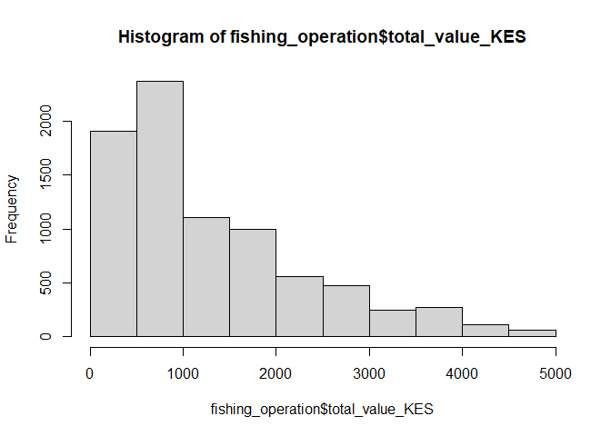

Quality Control of Fishing Landings dataset
================
Author: Emma Strand; <emma_strand@uri.edu>

## Contents

-   [**Protocol to run this with a future xlsx file**](#protocol)  
-   [**Load all libraries**](#libraries)  
-   [**Create dataframe**](#df)  
-   [**Quality Control: enumerator**](#Enumerator)  
-   [**Quality Control: landing\_site and BMU**](#Landing_site)  
-   [**Quality Control: fisher information**](#fisher_info)  
-   [**Quality Control: trap information**](#trap)  
-   [**Quality Control: catch information**](#catch)  
-   [**Gear type, and fish numbers/final destination**](#gear)  
-   [**Quality Control: final check for notes written by field
    team**](#notes)  
-   [**Exporting cleaned dataset**](#export)

## <a name="protocol"></a> **Protocol to run this with a future xlsx file**

1.  In the toolbar above, hit the arrow next to `Knit`. Scroll down to
    `Knit Directory` and select the option `Project Directory`.  
2.  **In `Create dataframe` code chunk**: Replace raw data file name in
    the function that creates the following variables:
    fishing\_operation, catch\_composition, and validation\_lists.  
3.  **In `Enumerator`, `Landing_site`, and `BMU` code chunks**: Run the
    unique() function and double check that this list is the correct
    names.  
4.  **In Trap information**, run code chunk functions for `trap_type`
    and `total_traps_collected` sections and double check the output is
    as expected.  
5.  **In catch information**, run code chunk functions for
    `weight and value measures`, `number of fishers in crew`, and
    `Kiswahili_name` and double check the output is as expected.  
6.  **In Species/Scientific name**, run code chunk functions and check
    output to make sure it is as expected.  
7.  **In length, gear type, number of fish, and desintation sections**,
    run code chunk to double check the output of ranges is as
    expected.  
8.  In the export section, rename the new datafile excel file.

## <a name="libraries"></a> **Load all libraries**

``` r
library(plyr)
library(dplyr)
library(tidyverse)
library(ggplot2)
library(readxl)
library(lubridate)
library(Hmisc)
library(writexl)
library(naniar)
```

## <a name="df"></a> **Create dataframe**

**Load in raw data files.**

Using this df `Fishlandings-data- CC-JM-Clay-IW updated 04-09-2022`: The
date is formatted DD-MM-YYYY. This file is from September.

[Reading in an excel datafile instead of a
csv](http://www.sthda.com/english/wiki/reading-data-from-excel-files-xls-xlsx-into-r).
This requires the `readxl` package listed in load all libraries step.

``` r
## when running future iterations of raw data file, replace the file name below 
fishing_operation <- read_excel("data/Fishlandings-data- CC-JM-Clay-IW updated 04-09-2022.xlsx", sheet = "fishing_operation",
                                col_types = c("date", "text", "text", "text", "text", "text", "text", 
                                              "text", "numeric", "date", "text", "date", "text", "numeric", 
                                              "numeric", "numeric", "numeric", "numeric", "numeric","text", "skip")) %>%
  rename(Operation_date = date_dd_mm_yyyy)

nrow(fishing_operation) 
```

    ## [1] 8463

``` r
# 10,670 July updated file; fishing operations (keep this # in mind for sanity check at the end)
# 8,463 September updated file

## when running future iterations of raw data file, replace the file name below 
catch_composition <- read_excel("data/Fishlandings-data- CC-JM-Clay-IW updated 04-09-2022.xlsx", 
                                sheet = "catch_composition",
                                col_types = c("date", "text", "text", "text", "text", "text", "numeric",
                                              "text", "text", "skip")) %>%
  rename(Operation_date = Date)

nrow(catch_composition) 
```

    ## [1] 65357

``` r
# 58,441 July updated file; fish observations (keep this # in mind for sanity check at the end)
# 65,357 September updated file

## when running future iterations of raw data file, replace the file name below 
validation_lists <- read_excel("data/Fishlandings-data- CC-JM-Clay-IW updated 04-09-2022.xlsx", sheet = "validation_lists")

# read in enumerator names file 
enumerator_list <- read_excel("data/enumerator_list.xlsx")
```

Errors found in fisher\_id column are mostly capitalization errors.

``` r
fishing_operation$fisher_id <- toupper(fishing_operation$fisher_id)
catch_composition$fisher_id <- toupper(catch_composition$fisher_id)
```

Creating a larger dataframe to work with for the rest of quality
control.

``` r
df <- full_join(fishing_operation, catch_composition, by = c("fisher_id", "Operation_date")) %>%
  select(-`time_in_water (effort)`) %>% # take this out if we start collecting time in water data
  rename(fishing_operation_notes= general_notes) %>%
  rename(catch_composition_notes = notes_picture) %>%
  rename(scientific_name = SPECIES) %>%
  rename(total_biomass_kg = total_weight_kg) 
```

## Quality Control

### Operation\_date

In the above chunk, these dates are automatically read in as *dttm*
format (date and time).

### <a name="Enumerator"></a> **Enumerator**

[Replace character string with another in
R](https://stackoverflow.com/questions/11936339/replace-specific-characters-within-strings)

A lot of errors occur with different lower and upper case iterations of
names. I replaced this information with all upper case to collapse this
information. For example, “kadzo baya” and “Kadzo baya” are the same
fisherman but were reading as different categories.

Kadzo Baya and Kadzo Kazungu refer to the same person.

``` r
# change all lower case to upper case
df$enumerator <- toupper(df$enumerator)
enumerator_list$enumerator <- toupper(enumerator_list$enumerator)

# replace incorrect spellings 
df$enumerator <- gsub("CELESTINAR.N.ALI", "CELESTINE N. ALI", df$enumerator)
df$enumerator <- gsub("^CELESTINAR$", "CELESTINE N. ALI", df$enumerator)
df$enumerator <- gsub("CELESTINAR NALI", "CELESTINE N. ALI", df$enumerator)
df$enumerator <- gsub("CELESTINER NALI", "CELESTINE N. ALI", df$enumerator)
df$enumerator <- gsub("^CLAPERTON$", "CLAPERTON KAZUNGU", df$enumerator)
df$enumerator <- gsub("MACKSON KAZUNGU", "MAXSON KAZUNGU", df$enumerator)
df$enumerator <- gsub("BIDALA RASHID", "BIDALLA RASHID", df$enumerator)
df$enumerator <- gsub("GARAMA YERI", "GARAMA K. YERI", df$enumerator)
df$enumerator <- gsub("GARAMA K YERI", "GARAMA K. YERI", df$enumerator)
df$enumerator <- gsub("BRUNO MUYE", "BRUNO MOYE", df$enumerator)
df$enumerator <- gsub("^ALI$", "CELESTINE N. ALI", df$enumerator) #^ and $ indicate start and end of phrase
df$enumerator <- gsub("KADZO KAZUNGU", "KADZO BAYA", df$enumerator)
df$enumerator <- gsub("KADZU BAYA", "KADZO BAYA", df$enumerator)
df$enumerator <- gsub("ANTONY JUMA", "ANTHONY JUMA", df$enumerator)
df$enumerator <- gsub("CLAPETRON", "CLAPERTON KAZUNGU", df$enumerator)
df$enumerator <- gsub("KARIM NYINGE", "KARIMA NYINGE", df$enumerator)
df$enumerator <- gsub("KARIMA NYINGEE", "KARIMA NYINGE", df$enumerator)
df$enumerator <- gsub("^BRUNO$", "BRUNO MOYE", df$enumerator)
df$enumerator <- gsub("MARKSON KAZUNGU", "MAXSON KAZUNGU", df$enumerator)
df$enumerator <- gsub("BIDAKA RASHID", "BIDALLA RASHID", df$enumerator)

# compare df list to the enumerator list 
# result is those that appear in the df but not validated enumerator list
setdiff(df$enumerator, enumerator_list$enumerator)
```

    ## [1] "NGALA CHINYAKA" "MWANAPILI"      "SAIDI MKALI"    NA

``` r
## Step #2 in protocol at the top of this script 
unique(sort(df$enumerator)) # at this point, double check that this list are all individual fishermen 
```

    ##  [1] "ANTHONY JUMA"      "BASHIR SAID"       "BIDALLA RASHID"   
    ##  [4] "BRUNO MOYE"        "CELESTINE N. ALI"  "CLAPERTON KAZUNGU"
    ##  [7] "FRANKLINE KAZUNGU" "GARAMA K. YERI"    "GILBERT NZAI"     
    ## [10] "KADZO BAYA"        "KARIMA NYINGE"     "KITSAO KARISA"    
    ## [13] "MAXSON KAZUNGU"    "MWANAPILI"         "NGALA CHINYAKA"   
    ## [16] "OMAR ALI"          "SAIDI MKALI"

### <a name="Landing_site"></a> **Landing\_site and BMU**

### Landing site

``` r
df$landing_site <- toupper(df$landing_site)
enumerator_list$landing_site <- toupper(enumerator_list$landing_site)

df$landing_site <- gsub("KIRKLAND", "KARKLAND", df$landing_site)
df$landing_site <- gsub("KITANGONI", "KITANGANI", df$landing_site)
df$landing_site <- gsub("KIUKONI", "KIVUKONI", df$landing_site)
df$landing_site <- gsub("KIVUKANI", "KIVUKONI", df$landing_site)
df$landing_site <- gsub("KIVUKUNI", "KIVUKONI", df$landing_site)

# compare df list to the enumerator list 
# result is those that appear in the df but not validated enumerator list
setdiff(df$landing_site, enumerator_list$landing_site)
```

    ## [1] "WHISPERING" "TAKAUNGU"   NA

``` r
unique(sort(df$landing_site))
```

    ##  [1] "BURENI"          "CHAUREMBO"       "KANAMAI"         "KARKLAND"       
    ##  [5] "KIJANGWANI"      "KITANGANI"       "KIVUKONI"        "KIVULINI"       
    ##  [9] "KURUWITU"        "MAWE YA KATI"    "MAYUNGU"         "MWANAMIA"       
    ## [13] "MWENDO WA PANYA" "NGOLOKO"         "SUN N SAND"      "TAKAUNGU"       
    ## [17] "UYOMBO"          "VIPINGO"         "VUMA"            "WHISPERING"

``` r
## Step #3 in protocol to double check this output list is all the correct site names 
## (if the only output from setdiff() is NA then this list is correct)
```

### BMU

``` r
df$BMU <- toupper(df$BMU)
enumerator_list$BMU <- toupper(enumerator_list$BMU)

# compare df list to the enumerator list 
# result is those that appear in the df but not validated enumerator list
setdiff(df$BMU, enumerator_list$BMU)
```

    ## [1] NA

``` r
unique(sort(df$BMU))
```

    ## [1] "KANAMAI"  "KURUWITU" "MAYUNGU"  "TAKAUNGU" "UYOMBO"

``` r
## Step #4 in protocol to double check this output list is all the correct BMU names 
## (if the only output from setdiff() is NA then this list is correct)
```

### <a name="Fisher_info"></a> **Fisher information**

We don’t have a current need to correct fisher phone number right now.

### household\_id

The only issue I can detect here is some lower case vs upper case.

It would be nice to have a list of expected household and fisher ID’s.

Some IDs only have 2 digits at the end - are these missing an zero in
front of them? I.e. 90 vs 090?

``` r
df$household_id <- toupper(df$household_id)
unique(df$household_id)
```

    ##   [1] "SS/UYO/SB/091" "SS/UYO/SB/085" "SS/UYO/SB/089" "SS/UYO/SB/088"
    ##   [5] "SS/UYO/SB/090" "SS/UYO/SB/092" "SS/UYO/SB/094" "SS/UYO/SB/095"
    ##   [9] "SS/UYO/SB/100" "SS/UYO/SB/099" "SS/MAY/SB/002" "SS/MAY/SB/001"
    ##  [13] "SS/MAY/SB/013" "SS/MAY/SB/018" "SS/MAY/SB/021" "SS/MAY/SB/049"
    ##  [17] "SS/MAY/SB/033" "SS/MAY/SB/032" "SS/MAY/SB/011" "SS/MAY/SB/003"
    ##  [21] "SS/MAY/SB/006" "SS/MAY/SB/041" "SS/MAY/SB/074" "SS/MAY/SB/030"
    ##  [25] "SS/MAY/SB/077" "SS/MAY/SB/010" "SS/MAY/SB/043" "SS/MAY/SB/042"
    ##  [29] "SS/MAY/SB/083" "SS/MAY/SB/052" "SS/MAY/SB/028" "SS/MAY/SB/082"
    ##  [33] "SS/MAY/SB/047" "SS/MAY/SB/046" "SS/MAY/SB/048" "SS/MAY/SB/044"
    ##  [37] "SS/MAY/SB/036" "SS/UYO/SB/096" "SS/MAY/SB/034" "SS/MAY/SB/038"
    ##  [41] "SS/MAY/SB/058" "SS/MAY/SB/017" "SS/MAY/SB/081" "SS/MAY/SB/029"
    ##  [45] "SS/MAY/SB/014" "SS/MAY/SB/015" "SS/MAY/SB/053" "SS/MAY/SB/045"
    ##  [49] "SS/UYO/SB/086" "SS/MAY/SB/022" "SS/UYO/SB/097" "SS/MAY/SB/064"
    ##  [53] "SS/MAY/SB/063" "SS/MAY/SB/076" "SS/UYO/SB/082" "SS/KAN/CO/078"
    ##  [57] "SS/KAN/CO/076" "SS/KAN/CO/140" "SS/KAN/CO/072" "SS/KAN/CO/073"
    ##  [61] "SS/KAN/CO/075" "SS/MAY/SB/020" "SS/MAY/SB/031" "SS/MAY/SB/070"
    ##  [65] "SS/MAY/SB/085" "SS/KAN/CO/074" "SS/KAN/CO/127" "SS/KAN/CO/067"
    ##  [69] "SS/KAN/CO/071" "SS/KAN/CO/106" "SS/KAN/CO/030" "SS/KAN/CO/113"
    ##  [73] "SS/KAN/CO/088" "SS/KAN/CO/031" "SS/KAN/CO/036" "SS/KAN/CO/026"
    ##  [77] "SS/KAN/CO/024" "SS/MAY/SB/012" "SS/MAY/SB/078" "SS/MAY/SB/009"
    ##  [81] "SS/KAN/CO/102" "SS/MAY/SB/065" "SS/MAY/SB/027" "SS/MAY/SB/026"
    ##  [85] "SS/UYO/SB/079" "SS/UYO/SB/071" "SS/MAY/SB/066" "SS/MAY/SB/025"
    ##  [89] "SS/MAY/SB/068" "SS/UYO/SB/039" "SS/MAY/SB/019" "SS/MAY/SB/050"
    ##  [93] "SS/MAY/SB/035" "SS/MAY/SB/060" "SS/MAY/SB/005" "SS/KAN/CO/020"
    ##  [97] "SS/KAN/CO/035" "SS/KAN/CO/023" "SS/UYO/SB/020" "SS/UYO/SB/093"
    ## [101] "SS/MAY/SB/059" "SS/KAN/CO/108" "SS/TAK/CO/176" "SS/KAN/CO/099"
    ## [105] "SS/KAN/CO/085" "SS/KAN/CO/133" "SS/KAN/CO/083" "SS/KAN/CO/018"
    ## [109] "SS/KAN/CO/077" "SS/KAN/CO/107" "SS/KAN/CO/016" "SS/KAN/CO/012"
    ## [113] "SS/KAN/CO/017" "SS/KAN/CO/014" "SS/KAN/CO/136" "SS/KAN/CO/013"
    ## [117] "SS/TAK/CO/175" "SS/TAK/CO/195" "SS/TAK/CO/198" "SS/TAK/CO/194"
    ## [121] "SS/TAK/CO/174" "SS/KAN/CO/086" "SS/KAN/CO/117" "SS/TAK/CO/179"
    ## [125] "SS/TAK/CO/142" "SS/TAK/CO/144" "SS/TAK/CO/178" "SS/TAK/CO/180"
    ## [129] "SS/TAK/CO/177" "SS/KAN/CO/062" "SS/KAN/CO/090" "SS/TAK/CO/197"
    ## [133] "SS/MAY/SB/004" "SS/MAY/SB/072" "SS/KUR/SG/041" "SS/KUR/SG/048"
    ## [137] "SS/TAK/CO/147" "SS/KUR/SG/037" "SS/KUR/SG/038" "SS/KAN/CO/015"
    ## [141] "SS/KUR/SG/040" "SS/KUR/SG/095" "SS/KUR/SG/049" "SS/KUR/SG/050"
    ## [145] "SS/KUR/SG/054" "SS/KUR/SG/065" "SS/KUR/SG/100" "SS/KUR/SG/043"
    ## [149] "SS/KAN/CO/082" "SS/KUR/SG/032" "SS/KUR/SG/008" "SS/KUR/SG/005"
    ## [153] "SS/KUR/SG/099" "SS/KUR/SG/009" "SS/KUR/SG/027" "SS/TAK/CO/154"
    ## [157] "SS/KUR/SG/046" "SS/KUR/SG/035" "SS/KUR/SG/034" "SS/KAN/CO/084"
    ## [161] "SS/TAK/CO/165" "SS/TAK/CO/192" "SS/KUR/SG/010" "SS/KUR/SG/068"
    ## [165] "SS/KUR/SG/060" "SS/KUR/SG/072" "SS/KUR/SG/016" "SS/KUR/SG/069"
    ## [169] "SS/KUR/SG/082" "SS/KUR/SG/002" "SS/KUR/SG/098" "SS/KUR/SG/033"
    ## [173] "SS/KUR/SG/018" "SS/KUR/SG/011" "SS/KUR/SG/047" "SS/KUR/SG/012"
    ## [177] "SS/KUR/SG/096" "SS/KUR/SG/077" "SS/KAN/CO/056" "SS/KAN/CO/065"
    ## [181] "SS/KAN/CO/060" "SS/KAN/CO/092" "SS/KAN/CO/057" "SS/TAK/CO/206"
    ## [185] "SS/TAK/CO/145" "SS/TAK/CO/203" "SS/TAK/CO/166" "SS/KAN/CO/051"
    ## [189] "SS/KAN/CO/055" "SS/KAN/CO/054" "SS/KUR/SG/083" "SS/KAN/CO/095"
    ## [193] "SS/TAK/CO/157" "SS/TAK/CO/152" "SS/TAK/CO/151" "SS/KUR/SG/001"
    ## [197] "SS/TAK/CO/183" "SS/KAN/CO/039" "SS/KAN/CO/042" "SS/KAN/CO/043"
    ## [201] "SS/KAN/CO/038" "SS/KUR/SG/021" "SS/KUR/SG/086" "SS/KUR/SG/081"
    ## [205] "SS/TAK/CO/135" "SS/TAK/CO/036" "SS/TAK/CO/035" "SS/TAK/CO/031"
    ## [209] "SS/TAK/CO/023" "SS/TAK/CO/160" "SS/TAK/CO/161" "SS/TAK/CO/172"
    ## [213] "SS/TAK/CO/171" "SS/TAK/CO/170" "SS/TAK/CO/167" "SS/TAK/CO/168"
    ## [217] "SS/TAK/CO/173" "SS/TAK/CO/182" "SS/TAK/CO/191" "SS/TAK/CO/169"
    ## [221] "SS/KUR/SG/029" "SS/KUR/SG/020" "SS/KUR/SG/090" "SS/KUR/SG/039"
    ## [225] "SS/TAK/CO/199" "SS/KUR/SG/089" "SS/KUR/SG/036" "SS/TAK/CO/026"
    ## [229] "SS/KUR/SG/097" "SS/KUR/SG/094" "SS/TAK/CO/196" "SS/TAK/CO/030"
    ## [233] "SS/TAK/CO/088" "SS/TAK/CO/117" "SS/KAN/CO/034" "SS/KUR/SG/007"
    ## [237] "SS/KUR/SG/030" "SS/TAK/CO/024" "SS/UYO/SB/084" "SS/KAN/CO/044"
    ## [241] "SS/TAK/CO/146" "SS/TAK/CO/150" "SS/KAN/CO/022" "SS/UYO/SB/021"
    ## [245] "SS/UYO/SB/035" "SS/TAK/CO/155" "SS/TAK/CO/205" "SS/TAK/CO/163"
    ## [249] "SS/TAK/CO/158" "SS/TAK/CO/149" "SS/TAK/CO/159" "SS/KUR/SG/064"
    ## [253] "SS/KUR/SG/061" "SS/TAK/CO/148" "SS/TAK/CO/162" "SS/TAK/CO/067"
    ## [257] "SS/MAY/SB/039" "SS/KAN/CO/135" "SS/KUR/SG/133" "SS/KAN/CO/041"
    ## [261] "SS/TAK/CO/038" "SS/TAK/CO/164" "SS/KAN/CO/172" "SS/KAN/CO/183"
    ## [265] "SS/KAN/CO/171" "SS/KAN/CO/167" "SS/UYO/SB/028" "SS/KAN/CO/173"
    ## [269] "SS/MAY/SB/055" "SS/KAN/CO/025" "SS/KAN/CO/002" "SS/KAN/CO/009"
    ## [273] "SS/KAN/CO/070" "SS/KAN/CO/028" "SS/KAN/CO/182" "SS/UYO/SB/147"
    ## [277] "SS/UYO/SB/152" "SS/UYO/SB/083" "SS/KUR/SG/042" "SS/KUR/SG/073"
    ## [281] "SS/KAN/CO/040" "SS/KUR/SG/078" "SS/KUR/SG/076" "SS/MAY/SB/168"
    ## [285] "SS/MAY/SB/095" "SS/KAN/CO/011" "SS/MAY/SB/086" "SS/MAY/SB/071"
    ## [289] "SS/MAY/SB/094" "SS/MAY/SB/100" "SS/MAY/SB/099" "SS/MAY/SB/090"
    ## [293] "SS/MAY/SB/091" "SS/MAY/SB/092" "SS/MAY/SB/088" "SS/MAY/SB/089"
    ## [297] "SS/TAK/CO/181" "SS/KUR/SG/057" "SS/KAN/CO/101" "SS/KAN/CO/100"
    ## [301] NA

``` r
df$household_id <- gsub("/FF", "", df$household_id)
```

### <a name="trap"></a> **Trap information**

### trap\_type

The only issue I can detect here is some lower case vs upper case.

``` r
df$trap_type <- toupper(df$trap_type)
unique(sort(df$trap_type))
```

    ##  [1] "FISHINING NET"                      "GILL NET"                          
    ##  [3] "HANDLINE"                           "HANDLINE/NET"                      
    ##  [5] "MODIFIED"                           "MONOFILAMENT"                      
    ##  [7] "MONOFILAMENT GILLNET"               "MONOFILAMENT,SPEARGUN"             
    ##  [9] "MONOFILAMENT/SPEAR"                 "MONOFILLAMENT"                     
    ## [11] "MONOFILLAMENT GILL NET"             "NET"                               
    ## [13] "NETI YA UZI"                        "NYAVU"                             
    ## [15] "NYAVU UZI"                          "NYAVU YA KUTEGA"                   
    ## [17] "NYAVU YA MONOFILAMENT/OCTOPUS HOOK" "NYAVU YA UZI"                      
    ## [19] "REEF SEINE"                         "RINGNET"                           
    ## [21] "SEINE NET"                          "SPEAR"                             
    ## [23] "SPEARGUN"                           "SPEARGUN AND SEINE NET"            
    ## [25] "SPEARGUN/NET"                       "UNMODIFIED"

### total\_traps\_collected

View the values put in the df here to double check all values make
sense.

``` r
total_traps_collected <- df %>% select(total_traps_collected) %>% na.omit()
range(total_traps_collected)
```

    ## [1]  1 45

``` r
## filtering traps to below 40
df$total_traps_collected <- ifelse(df$total_traps_collected > 40, NA, df$total_traps_collected)

## Protocol with new df: double check the below range is expected 
hist(df$total_traps_collected)
```

<!-- -->

### Date and time set; date and time collected

In the first chunk of code, these dates are automatically read in as
*dttm* format (date and time). This new columns will be more useful for
data analysis later.

``` r
# making new columns for date and time 
df$date_time_set <- paste(df$date_set_dd_mm_yyyy, df$`time_set_24hh:mm`, sep = " ")
df$date_time_collected <- paste(df$date_collected_dd_mm_yyyy, df$`time_collected_24hh:mm`, sep = " ")

# removing the 'hrs' from observations in this column
df$date_time_set <- gsub("hrs", "", df$date_time_set)
df$date_time_collected <- gsub("hrs", "", df$date_time_collected)

# converting to date and time format 
df$date_time_set <- parse_date_time(df$date_time_set, orders = "ymdHM")
df$date_time_collected <- parse_date_time(df$date_time_collected, orders = "ymdHM")

## any failed to parse error messages will be from rows that do not have a date and time
```

### <a name="catch"></a> **Catch information**

### Biomass and value measures

Step \#4 from protocol: Double check the below values are in the correct
ranges

``` r
##### TOTAL BIOMASS 
total_biomass_kg <- df %>% select(total_biomass_kg) %>% na.omit()
range(total_biomass_kg)
```

    ## [1]    0.125 2000.000

``` r
# filtering biomass kg to under 100 kg 
df$total_biomass_kg <- ifelse(df$total_biomass_kg > 100, NA, df$total_biomass_kg)
hist(df$total_biomass_kg)
```

<!-- -->

``` r
##### TAKE HOME BIOMASS 
# filtering take home weight to be under 10kg 
take_home_weight_kg <- df %>% select(take_home_weight_kg) %>% na.omit()
df$take_home_weight_kg <- ifelse(df$take_home_weight_kg > 10, NA, df$take_home_weight_kg)

range(take_home_weight_kg)
```

    ## [1]     0 23040

``` r
hist(df$take_home_weight_kg)
```

<!-- -->

``` r
unique(sort(df$take_home_weight_kg))
```

    ##   [1] 0.000 0.070 0.100 0.150 0.200 0.224 0.239 0.250 0.287 0.295 0.297 0.300
    ##  [13] 0.310 0.320 0.343 0.350 0.360 0.370 0.375 0.390 0.393 0.394 0.395 0.400
    ##  [25] 0.403 0.404 0.405 0.410 0.420 0.430 0.450 0.460 0.470 0.475 0.480 0.490
    ##  [37] 0.500 0.510 0.520 0.530 0.540 0.560 0.570 0.580 0.590 0.600 0.610 0.620
    ##  [49] 0.630 0.638 0.640 0.650 0.664 0.670 0.672 0.680 0.690 0.700 0.710 0.720
    ##  [61] 0.730 0.735 0.738 0.740 0.750 0.760 0.770 0.780 0.785 0.790 0.800 0.810
    ##  [73] 0.820 0.830 0.840 0.850 0.855 0.860 0.865 0.870 0.890 0.900 0.910 0.920
    ##  [85] 0.930 0.940 0.945 0.950 0.955 0.960 0.965 0.970 0.975 0.980 0.982 0.987
    ##  [97] 0.990 1.000 1.030 1.035 1.050 1.060 1.100 1.110 1.125 1.155 1.200 1.229
    ## [109] 1.236 1.250 1.270 1.274 1.300 1.310 1.312 1.390 1.400 1.412 1.437 1.470
    ## [121] 1.490 1.492 1.500 1.503 1.510 1.511 1.512 1.516 1.517 1.518 1.527 1.530
    ## [133] 1.531 1.535 1.545 1.563 1.570 1.573 1.582 1.590 1.595 1.600 1.604 1.609
    ## [145] 1.610 1.611 1.612 1.613 1.617 1.618 1.627 1.630 1.632 1.670 1.681 1.700
    ## [157] 1.701 1.703 1.710 1.711 1.713 1.721 1.730 1.731 1.741 1.770 1.782 1.800
    ## [169] 1.810 1.811 1.813 1.815 1.816 1.820 1.830 1.831 1.860 1.870 1.900 1.915
    ## [181] 1.930 1.931 1.937 1.943 2.000 2.010 2.100 2.110 2.130 2.200 2.300 2.400
    ## [193] 2.500 2.600 2.700 2.800 2.890 3.000 3.100 3.200 3.240 3.480 3.500 3.600
    ## [205] 3.778 4.000 4.200 5.000 6.000 7.000 8.000

``` r
##### TOTAL VALUE 
total_value_KES <- df %>% select(total_value_KES) %>% na.omit()
range(total_value_KES)
```

    ## [1] 0e+00 2e+05

``` r
# filtering to below 5,000 
df$total_value_KES <- ifelse(df$total_value_KES > 5000, NA, df$total_value_KES)
hist(df$total_value_KES)
```

<!-- -->

``` r
##### TAKE HOME VALUE 
take_home_value_KES <- df %>% select(take_home_value_KES) %>% na.omit()
df$take_home_value_KES <- ifelse(df$take_home_value_KES > 5000, NA, df$take_home_value_KES)

range(take_home_value_KES)
```

    ## [1]    0 7500

``` r
boxplot(df$take_home_value_KES)
```

<!-- -->

``` r
unique(sort(df$take_home_value_KES))
```

    ##   [1]    0.00    1.50    1.80   20.00   22.00   30.00   40.00   43.05   44.00
    ##  [10]   44.16   46.50   48.00   50.00   51.00   51.45   52.50   53.00   56.50
    ##  [19]   59.10   59.40   60.00   60.45   60.60   61.50   62.20   63.00   64.00
    ##  [28]   66.00   70.00   75.00   80.00   82.00   84.00   85.00   86.00   88.00
    ##  [37]   90.00   93.00   94.00   97.50   98.00  100.00  102.00  103.60  104.00
    ##  [46]  105.00  108.00  109.50  110.00  110.25  112.00  119.00  120.00  122.00
    ##  [55]  125.00  126.00  127.60  130.00  132.00  135.00  136.00  140.00  144.00
    ##  [64]  146.25  147.00  150.00  151.00  152.00  153.00  154.00  154.50  155.00
    ##  [73]  156.00  157.00  158.00  159.00  160.00  161.00  163.00  164.00  165.00
    ##  [82]  166.00  167.00  168.00  170.00  171.00  172.00  173.00  174.00  175.00
    ##  [91]  176.00  177.00  178.00  180.00  181.00  182.00  183.00  184.00  186.00
    ## [100]  187.50  188.10  189.00  190.00  193.00  194.00  195.00  198.00  200.00
    ## [109]  201.00  204.00  210.00  210.10  212.00  215.00  220.00  221.00  225.00
    ## [118]  227.00  230.00  231.00  232.00  240.00  241.00  242.00  245.00  250.00
    ## [127]  252.00  260.00  261.00  264.00  265.00  270.00  273.00  275.00  280.00
    ## [136]  283.50  285.00  286.00  289.00  290.00  294.00  300.00  302.00  308.00
    ## [145]  309.00  310.00  315.00  320.00  322.00  323.00  326.00  330.00  337.50
    ## [154]  338.00  340.00  342.00  345.00  346.00  347.00  350.00  360.00  362.00
    ## [163]  363.00  366.00  374.00  375.00  378.00  386.00  390.00  396.00  400.00
    ## [172]  420.00  425.00  440.00  450.00  460.00  480.00  484.00  500.00  502.00
    ## [181]  510.00  520.00  525.00  540.00  560.00  600.00  616.00  620.00  625.00
    ## [190]  650.00  660.00  700.00  720.00  750.00  800.00  845.00  850.00  880.00
    ## [199]  900.00  924.00  938.00  973.00 1044.00 1050.00 1100.00 1120.00 1133.00
    ## [208] 2000.00 2700.00 3500.00 4000.00 4500.00 5000.00

### No. of fishers in crew

Crews above 5 people are unrealistic. I’m changing that data to ‘NA’ for
now.

``` r
fishermen_no <- df %>% select(`No. of fishers in crew`) %>% na.omit()

hist(fishermen_no)
```

<!-- -->

``` r
## Protocol: Double check the below values are in the correct ranges
range(fishermen_no)
```

    ## [1]  0 38

``` r
unique(sort(fishermen_no$`No. of fishers in crew`))
```

    ##  [1]  0  1  2  3  4  5  6  7  8 10 12 14 16 18 19 20 21 22 24 34 38

``` r
df %>% filter(`No. of fishers in crew` > 7)
```

    ## # A tibble: 532 × 28
    ##    Operation_date      enumerator  landi…¹ BMU   fishe…² fishe…³ house…⁴ trap_…⁵
    ##    <dttm>              <chr>       <chr>   <chr> <chr>   <chr>   <chr>   <chr>  
    ##  1 2021-05-18 00:00:00 CELESTINE … MAYUNGU MAYU… SS/MAY… 706822… SS/MAY… UNMODI…
    ##  2 2021-05-18 00:00:00 CELESTINE … MAYUNGU MAYU… SS/MAY… 706822… SS/MAY… UNMODI…
    ##  3 2021-05-18 00:00:00 CELESTINE … MAYUNGU MAYU… SS/MAY… 706822… SS/MAY… UNMODI…
    ##  4 2021-05-18 00:00:00 CELESTINE … MAYUNGU MAYU… SS/MAY… 706822… SS/MAY… UNMODI…
    ##  5 2021-05-18 00:00:00 CELESTINE … MAYUNGU MAYU… SS/MAY… 706822… SS/MAY… UNMODI…
    ##  6 2021-05-18 00:00:00 CELESTINE … MAYUNGU MAYU… SS/MAY… 706822… SS/MAY… UNMODI…
    ##  7 2021-05-18 00:00:00 CELESTINE … MAYUNGU MAYU… SS/MAY… 706822… SS/MAY… UNMODI…
    ##  8 2021-05-18 00:00:00 CELESTINE … MAYUNGU MAYU… SS/MAY… 706822… SS/MAY… UNMODI…
    ##  9 2021-12-21 00:00:00 SAIDI MKALI KIVUKO… TAKA… SS/TAK… <NA>    SS/TAK… RINGNET
    ## 10 2021-12-25 00:00:00 SAIDI MKALI KIVUKO… TAKA… SS/TAK… 710934… SS/TAK… RINGNET
    ## # … with 522 more rows, 20 more variables: total_traps_collected <dbl>,
    ## #   date_set_dd_mm_yyyy <dttm>, `time_set_24hh:mm` <chr>,
    ## #   date_collected_dd_mm_yyyy <dttm>, `time_collected_24hh:mm` <chr>,
    ## #   total_biomass_kg <dbl>, take_home_weight_kg <dbl>, total_value_KES <dbl>,
    ## #   take_home_value_KES <dbl>, `No. of fishers in crew` <dbl>,
    ## #   fishing_operation_notes <chr>, Kiswahili_name <chr>, scientific_name <chr>,
    ## #   length_cm <chr>, `gear type` <chr>, number_of_fish <dbl>, …
    ## # ℹ Use `print(n = ...)` to see more rows, and `colnames()` to see all variable names

``` r
# df <- df %>%
#  mutate(crew_size = case_when(
#     `No. of fishers in crew` > 7 ~ "NA"))

df$crew_size_corrected <- df$`No. of fishers in crew`

# replacing values higher than 5 with NA
df <- df %>%
 replace_with_na_at(
    .vars = 'crew_size_corrected',
    condition = ~(.x > 7))

# double checking that the above worked
unique(sort(df$crew_size_corrected))
```

    ## [1] 0 1 2 3 4 5 6 7

### Kiswahili\_name

``` r
df$Kiswahili_name <- toupper(df$Kiswahili_name)
unique(sort(df$Kiswahili_name))
```

    ##   [1] "BARAKUDA"                 "BATANI"                  
    ##   [3] "BEHA"                     "BIRINZI"                 
    ##   [5] "BOCHO"                    "BUA"                     
    ##   [7] "BUA/MBORO YA MVUA"        "BUA/MBORO YA MVUVI"      
    ##   [9] "BUNDU"                    "BUNJU"                   
    ##  [11] "CHAA"                     "CHAA MACHO"              
    ##  [13] "CHALE"                    "CHANG GAMWE"             
    ##  [15] "CHANGA"                   "CHANGE GAMWE"            
    ##  [17] "CHANGO NDOMO"             "CHANGU"                  
    ##  [19] "CHANGU GAMWE"             "CHANGU MACHO"            
    ##  [21] "CHANGU MDOMO"             "CHANGU NDOMO"            
    ##  [23] "CHANGU NDOWA"             "CHANGU TAWA"             
    ##  [25] "CHANGUTAWA"               "CHEMBEU"                 
    ##  [27] "CHENA"                    "DOME"                    
    ##  [29] "FUA MAJI"                 "FUTE"                    
    ##  [31] "FUTE KUMBI"               "FUTE MLEA"               
    ##  [33] "FUTE MOSHI"               "FUTE MRABA"              
    ##  [35] "FUTE MRAMBA"              "GENDA"                   
    ##  [37] "GENDE"                    "GONA"                    
    ##  [39] "GONA SHARIFU"             "GONO"                    
    ##  [41] "HAMISI MACHO"             "JAME"                    
    ##  [43] "JANARE"                   "JODARI"                  
    ##  [45] "KAA"                      "KABANGI"                 
    ##  [47] "KADA"                     "KADIFU"                  
    ##  [49] "KAKURUWENDE"              "KAMBA"                   
    ##  [51] "KAMBA KOLOLO"             "KAMBA SHUARI"            
    ##  [53] "KAMBA SIMBA"              "KAMBA WINDU"             
    ##  [55] "KANG'AJA"                 "KANGAJA"                 
    ##  [57] "KANGAJA HEWANI"           "KANGAJA HEWENI"          
    ##  [59] "KANGAJE"                  "KANGAJI HEWANI"          
    ##  [61] "KATATANGE"                "KERENGE"                 
    ##  [63] "KHADA"                    "KHADA/TEWA"              
    ##  [65] "KIBAA"                    "KIBOMA"                  
    ##  [67] "KIFUDU"                   "KIFUVU"                  
    ##  [69] "KIFUVUU"                  "KIJALUO"                 
    ##  [71] "KIJAME"                   "KIKANDE"                 
    ##  [73] "KIKOKWE"                  "KINANZUA"                
    ##  [75] "KINAUCHI"                 "KINGOE"                  
    ##  [77] "KINGOE/SENDENGOMANI"      "KINWAUCHI"               
    ##  [79] "KINYWAUCHI"               "KIPEPEO"                 
    ##  [81] "KITAME"                   "KITATANGA"               
    ##  [83] "KITATANGE"                "KITETANGE"               
    ##  [85] "KIUNGA"                   "KIVUVU"                  
    ##  [87] "KOLE KOLE"                "KOLEKOLE"                
    ##  [89] "KORIS"                    "KOTOWE"                  
    ##  [91] "KOTWE"                    "KUFI"                    
    ##  [93] "KUFI SAFARI"              "KUFI/KIMBULIMBULI/KUKUSI"
    ##  [95] "KUFUDU"                   "KUMBA"                   
    ##  [97] "KUMBI"                    "KUMBI FUTE"              
    ##  [99] "KUNGA"                    "KUNGU"                   
    ## [101] "KUWAUCHI"                 "LWAYOO"                  
    ## [103] "MABACHO"                  "MBININI"                 
    ## [105] "MBONO"                    "MBORO YA MVUVI"          
    ## [107] "MCHAKUFA"                 "MGENDA"                  
    ## [109] "MIGORE"                   "MKIZI"                   
    ## [111] "MKORE"                    "MKORWE"                  
    ## [113] "MKUNAJI"                  "MKUNDAAJI"               
    ## [115] "MKUNDAJA"                 "MKUNDAJE"                
    ## [117] "MKUNDAJI"                 "MKUNDAJJI"               
    ## [119] "MKUNDJI"                  "MKUNGA"                  
    ## [121] "MKUNGA CHAI"              "MKUNGA CHUI"             
    ## [123] "MKUNGA IBRAHIM"           "MKUNGA MBONO"            
    ## [125] "MKUNGA SAMAKI"            "MKUNGA WIMBI"            
    ## [127] "MLEA"                     "MLEYA"                   
    ## [129] "MNGENDA"                  "MNYIMBI"                 
    ## [131] "MTANI"                    "MTONZI"                  
    ## [133] "MTUMBO WA DAU"            "MTUMBUA"                 
    ## [135] "MTUMBUA DAU"              "MTUMBUU"                 
    ## [137] "MTUNE"                    "MUGENDA"                 
    ## [139] "MUKIZI"                   "NDUDU"                   
    ## [141] "NDUNDUZI"                 "NGAGU"                   
    ## [143] "NGANGU"                   "NGINDO"                  
    ## [145] "NGISI"                    "NGOGO"                   
    ## [147] "NGURU"                    "NGUVU"                   
    ## [149] "NJANA"                    "NUBA"                    
    ## [151] "NUMBA"                    "NYAVI"                   
    ## [153] "NYENGA"                   "PAKOE"                   
    ## [155] "PAMAMBA"                  "PANDA"                   
    ## [157] "PANDU"                    "PANGA"                   
    ## [159] "PANGA SAMAKI"             "PAPA"                    
    ## [161] "PAPA USINGIZI"            "PAROTI"                  
    ## [163] "PONO"                     "PONO BLEU FISH"          
    ## [165] "PONO BLUE"                "PONO BLUE FIN"           
    ## [167] "PONO BLUE FISH"           "PONO BLUEFISH"           
    ## [169] "PONO CHANI"               "PONO DASI"               
    ## [171] "PONO KABANGI"             "PONO KADIFI"             
    ## [173] "PONO KADIFU"              "PONO KASIKI"             
    ## [175] "PONO MAENGE"              "PONO MWANI"              
    ## [177] "PONO SUNGURA"             "PUJU"                    
    ## [179] "PUJU KOPWE"               "PUJU PEMBE"              
    ## [181] "PUNDU"                    "PWEZA"                   
    ## [183] "SANGE"                    "SENDENGOMANI"            
    ## [185] "SHANA"                    "SHARIFU"                 
    ## [187] "SIMSIM"                   "SIMU"                    
    ## [189] "SITEFUE"                  "STEFUE"                  
    ## [191] "TAA"                      "TAA YEDA"                
    ## [193] "TAF MANGA"                "TAFI"                    
    ## [195] "TAFI  SIGANUS"            "TAFI KITUMBO"            
    ## [197] "TAFI MAENGA"              "TAFI MAENGE"             
    ## [199] "TAFI MAENGU"              "TAFI MANGA"              
    ## [201] "TAFI MIMBA"               "TAFI MWAMBA"             
    ## [203] "TAKAUNA"                  "TAKUANA"                 
    ## [205] "TEMBO"                    "TEMBO MOSHI"             
    ## [207] "TENGESI"                  "TEWA"                    
    ## [209] "TEWA JESHI"               "TEWA KALESO"             
    ## [211] "TEWA KASIKI"              "TEWA KOPE"               
    ## [213] "TEWA KOPWE"               "TEWA LESO"               
    ## [215] "TEWA MASHI"               "TEWA MOSHI"              
    ## [217] "TEWA THARAFA"             "TEWA THARAKA"            
    ## [219] "TEWA WIMBI"               "TEWE"                    
    ## [221] "TEWEJESHI"                "TIMBATI"                 
    ## [223] "TINGESI"                  "TOA"                     
    ## [225] "TOGOO"                    "TUFUANA"                 
    ## [227] "TUGUU"                    "TUGUU/SHANA"             
    ## [229] "TUKUANA"                  "TUKUWANA"                
    ## [231] "TUNDU"                    "TUTE"                    
    ## [233] "UNA"                      "USENDE NGOMANI"          
    ## [235] "USENDEGAMADI"             "VUMBAMA"                 
    ## [237] "VUMBANA"                  "WAYO"                    
    ## [239] "WAYO ULIMI NG'OMBE"       "WAYOO"

### SPECIES / Scientific name

**This is a hard-coding way to do this.. ideally we could downloand a
dataset from fishbase and create a compare function that could recognize
a name that is a letter or 2 off from a name in fishbase and then create
suggestions…**

We can pull in the validation\_lists df to double check these spellings.

``` r
# Taking out double spaces in between genus and species 
validation_lists$scientific_name <- gsub("  ", " ", validation_lists$scientific_name)
```

Sorting through df for errors.

``` r
# create capitalize function for upper case genus and lower case species 
capitalize_fxn <- function(x){
  first <- toupper(substr(x, start=1, stop=1)) ## capitalize first letter
  rest <- tolower(substr(x, start=2, stop=nchar(x)))   ## everything else lowercase
  paste0(first, rest)
}

df$scientific_name <- capitalize_fxn(df$scientific_name)
validation_lists$scientific_name <- capitalize_fxn(validation_lists$scientific_name)

# Taking out double spaces in between genus and species 
df$scientific_name <- gsub("  ", " ", df$scientific_name)

# Correcting commonly misspelled genus names 

# this chunk is for one genus. This is a data input issue that is difficult to catch and fix in R
df$scientific_name <- gsub("Acanthrus", "Acanthurus", df$scientific_name)
df$scientific_name <- gsub("Acantharus", "Acanthurus", df$scientific_name)
df$scientific_name <- gsub("Acantrus", "Acanthurus", df$scientific_name)
df$scientific_name <- gsub("Acantarus", "Acanthurus", df$scientific_name)
df$scientific_name <- gsub("Acathurus", "Acanthurus", df$scientific_name)
df$scientific_name <- gsub("Acronthurus", "Acanthurus", df$scientific_name)
df$scientific_name <- gsub("Acanthrurus", "Acanthurus", df$scientific_name)
df$scientific_name <- gsub("dossumieri", "dussumieri", df$scientific_name)
df$scientific_name <- gsub("dusimieri", "dussumieri", df$scientific_name)
df$scientific_name <- gsub("dusimii", "dussumieri", df$scientific_name)
df$scientific_name <- gsub("dussimieri", "dussumieri", df$scientific_name)
df$scientific_name <- gsub("Abdefduf", "Abudefduf", df$scientific_name)
df$scientific_name <- gsub("Cheilo", "Cheilio", df$scientific_name)
df$scientific_name <- gsub("inemis", "inermis", df$scientific_name)
df$scientific_name <- gsub("argentmaculatus", "argentimaculatus", df$scientific_name)
df$scientific_name <- gsub("Cheillinus", "Cheilinus", df$scientific_name)
df$scientific_name <- gsub("candiculatus", "canaliculatus", df$scientific_name)
df$scientific_name <- gsub("canaliculutus", "canaliculatus", df$scientific_name)
df$scientific_name <- gsub("Cholurururs", "Chlorurus", df$scientific_name)
df$scientific_name <- gsub("stronycephalus", "strongylocephalus", df$scientific_name)
df$scientific_name <- gsub("Gymonthorax", "Gymnothorax", df$scientific_name)
df$scientific_name <- gsub("Gymothorax", "Gymnothorax", df$scientific_name)
df$scientific_name <- gsub("javanicus", "favagineus", df$scientific_name)
df$scientific_name <- gsub("vaiginsis", "vaigiensis", df$scientific_name)
df$scientific_name <- gsub("semicirculatus", "semicirculatus", df$scientific_name)
df$scientific_name <- gsub("semisulcatus", "semicirculatus", df$scientific_name)
df$scientific_name <- gsub("Pomacnathus", "Pomacanthus", df$scientific_name)
df$scientific_name <- gsub("granoculis", "grandoculis", df$scientific_name)
df$scientific_name <- gsub("malanostigma", "melanostigma", df$scientific_name)
df$scientific_name <- gsub("hard", "harid", df$scientific_name)
df$scientific_name <- gsub("sexfaciatus", "sexfasciatus", df$scientific_name)
df$scientific_name <- gsub("dussumiera", "dussumieri", df$scientific_name)
df$scientific_name <- gsub("caeruleopanctatus", "caeruleopunctatus", df$scientific_name)
df$scientific_name <- gsub("hebei", "heberi", df$scientific_name)
df$scientific_name <- gsub("kippos", "hippos", df$scientific_name)
df$scientific_name <- gsub("Carnx", "Caranx", df$scientific_name)
df$scientific_name <- gsub("coioidea", "coioides", df$scientific_name)
df$scientific_name <- gsub("monochrou", "monochrous", df$scientific_name)
df$scientific_name <- gsub("monochrouss", "monochrous", df$scientific_name)
df$scientific_name <- gsub("Kyphasus", "Kyphosus", df$scientific_name)
df$scientific_name <- gsub("Lenthrinus", "Lethrinus", df$scientific_name)
df$scientific_name <- gsub("Leturinus", "Lethrinus", df$scientific_name)
df$scientific_name <- gsub("vaiguensis", "vaigiensis", df$scientific_name)
df$scientific_name <- gsub("bornonicus", "borbonicus", df$scientific_name)
df$scientific_name <- gsub("nebulosis", "nebulosus", df$scientific_name)
df$scientific_name <- gsub("nebulous", "nebulosus", df$scientific_name)
df$scientific_name <- gsub("Leptoscaus", "Leptoscarus", df$scientific_name)
df$scientific_name <- gsub("fluluiflamma", "fulviflamma", df$scientific_name)
df$scientific_name <- gsub("flavlineathe", "flavolineatus", df$scientific_name)
df$scientific_name <- gsub("taeniourous", "taeniorus", df$scientific_name)
df$scientific_name <- gsub("Navaculichthys", "Novaculichthys", df$scientific_name)
df$scientific_name <- gsub("taeniorus", "taeniourus", df$scientific_name)
df$scientific_name <- gsub("Parupeneus sp nov.", "Parupeneus", df$scientific_name)
df$scientific_name <- gsub("Platux", "Platax", df$scientific_name)
df$scientific_name <- gsub("platyyuna", "platyura", df$scientific_name)
df$scientific_name <- gsub("playfair", "playfairi", df$scientific_name)
df$scientific_name <- gsub("Plectorhincus", "Plectorhinchus", df$scientific_name)
df$scientific_name <- gsub("Plectorhnichus", "Plectorhinchus", df$scientific_name)
df$scientific_name <- gsub("Plotasus", "Plotosus", df$scientific_name)
df$scientific_name <- gsub("Pomatonus", "Pomatomus", df$scientific_name)
df$scientific_name <- gsub("Rhinecanthurus", "Rhineacanthus", df$scientific_name)
df$scientific_name <- gsub("vubroviolaceus", "rubroviolaceus", df$scientific_name)
df$scientific_name <- gsub("sirubroviolaceus", "rubroviolaceus", df$scientific_name)
df$scientific_name <- gsub("Scromberomorus", "Scomerommorus", df$scientific_name)
df$scientific_name <- gsub("Sphraena", "Sphyraena", df$scientific_name)
df$scientific_name <- gsub("meyeri", "meyeni", df$scientific_name)
df$scientific_name <- gsub("triostregus", "triostegus", df$scientific_name)
df$scientific_name <- gsub("Adudefduf", "Abudefduf", df$scientific_name)
df$scientific_name <- gsub("scoplas", "scopas", df$scientific_name)
df$scientific_name <- gsub("xanthonta", "xanthonota", df$scientific_name)
df$scientific_name <- gsub("Carangoifes", "Carangoides", df$scientific_name)
df$scientific_name <- gsub("vippos", "hippos", df$scientific_name)
df$scientific_name <- gsub("Cephelopholu", "Cephalopholis", df$scientific_name)
df$scientific_name <- gsub("Chaetadon", "Chaetodon", df$scientific_name)
df$scientific_name <- gsub("auringa", "auriga", df$scientific_name)
df$scientific_name <- gsub("selen$", "selene", df$scientific_name) # $ indicates end of phrase; didnt use ^ because this is species name is the 2nd word 
df$scientific_name <- gsub("trilohatus", "trilobatus", df$scientific_name)
df$scientific_name <- gsub("Cheiellinus", "Cheilinus", df$scientific_name)
df$scientific_name <- gsub("Cheillnus", "Cheilinus", df$scientific_name)
df$scientific_name <- gsub("inerms", "inermis", df$scientific_name)
df$scientific_name <- gsub("piinnulatus", "pinnulatus", df$scientific_name)
df$scientific_name <- gsub("pinnulatrus", "pinnulatus", df$scientific_name)
df$scientific_name <- gsub("Cirrihitus", "Cirrhitus", df$scientific_name)
df$scientific_name <- gsub("farmosa", "formosa", df$scientific_name)
df$scientific_name <- gsub("Cymonthorax", "Gymnothorax", df$scientific_name)
df$scientific_name <- gsub("Cynoglassus", "Cynoglossus", df$scientific_name)
df$scientific_name <- gsub("lachnen", "lachneri", df$scientific_name)
df$scientific_name <- gsub("luchneri", "lachneri", df$scientific_name)
df$scientific_name <- gsub("Epimephelus", "Epinephelus", df$scientific_name)
df$scientific_name <- gsub("colodes", "coioides", df$scientific_name)
df$scientific_name <- gsub("coicoides", "coioides", df$scientific_name)
df$scientific_name <- gsub("coloides", "coioides", df$scientific_name)
df$scientific_name <- gsub("faragineus", "favagineus", df$scientific_name)
df$scientific_name <- gsub("favagineous", "favagineus", df$scientific_name)
df$scientific_name <- gsub("hortulatus", "hortulanus", df$scientific_name)
df$scientific_name <- gsub("Himantur", "Himantura", df$scientific_name)
df$scientific_name <- gsub("Himanturaa", "Himantura", df$scientific_name)
df$scientific_name <- gsub("Hippscarus", "Hipposcarus", df$scientific_name)
df$scientific_name <- gsub("vagiensis", "vaigiensis", df$scientific_name)
df$scientific_name <- gsub("vaigienesis", "vaigiensis", df$scientific_name)
df$scientific_name <- gsub("fuaviflamma", "fulviflamma", df$scientific_name)
df$scientific_name <- gsub("fluliuflamma", "fulviflamma", df$scientific_name)
df$scientific_name <- gsub("fuluvifiamma", "fulviflamma", df$scientific_name)
df$scientific_name <- gsub("fulvifiamma", "fulviflamma", df$scientific_name)
df$scientific_name <- gsub("Latjanus", "Lutjanus", df$scientific_name)
df$scientific_name <- gsub("conchiliatus", "conchliatus", df$scientific_name)
df$scientific_name <- gsub("conchuliatutus", "conchliatus", df$scientific_name)
df$scientific_name <- gsub("conchyliantus", "conchliatus", df$scientific_name)
df$scientific_name <- gsub("hara$", "harak", df$scientific_name)
df$scientific_name <- gsub("harar$", "harak", df$scientific_name)
df$scientific_name <- gsub("letjan$", "lentjan", df$scientific_name)
df$scientific_name <- gsub("olivacous$", "olivaceus", df$scientific_name)
df$scientific_name <- gsub("Letjanus", "Lutjanus", df$scientific_name)
df$scientific_name <- gsub("Liza", "Planiliza", df$scientific_name)
df$scientific_name <- gsub("alatar$", "alata", df$scientific_name)
df$scientific_name <- gsub("argemtimaculutus", "argentimaculatus", df$scientific_name)
df$scientific_name <- gsub("argentinmaculatus", "argentimaculatus", df$scientific_name)
df$scientific_name <- gsub("ghibbon$", "gibbus", df$scientific_name)
df$scientific_name <- gsub("Lutjan", "Lutjanus", df$scientific_name)
df$scientific_name <- gsub("Lutjanusus", "Lutjanus", df$scientific_name)
df$scientific_name <- gsub("Migul", "Mugil", df$scientific_name)
df$scientific_name <- gsub("Monodactytus", "Monodactylus", df$scientific_name)
df$scientific_name <- gsub("bernditi", "berndti", df$scientific_name)
df$scientific_name <- gsub("berndt", "berndti", df$scientific_name)
df$scientific_name <- gsub("berndtii", "berndti", df$scientific_name)
df$scientific_name <- gsub("annalutus", "annulatus", df$scientific_name)
df$scientific_name <- gsub("anna$", "annulatus", df$scientific_name)
df$scientific_name <- gsub("annaturus", "annulatus", df$scientific_name)
df$scientific_name <- gsub("annulator", "annulatus", df$scientific_name)
df$scientific_name <- gsub("annulutus", "annulatus", df$scientific_name)
df$scientific_name <- gsub("annunthurus$", "annulatus", df$scientific_name)
df$scientific_name <- gsub("annuthurus$", "annulatus", df$scientific_name)
df$scientific_name <- gsub("brachycentus$", "brachycentron", df$scientific_name)
df$scientific_name <- gsub("bracycentron", "brachycentron", df$scientific_name)
df$scientific_name <- gsub("branchycentron", "brachycentron", df$scientific_name)
df$scientific_name <- gsub("unicaris", "unicornis", df$scientific_name)
df$scientific_name <- gsub("oyanea$", "cyanea", df$scientific_name)
df$scientific_name <- gsub("Panacirus", "Panulirus", df$scientific_name)
df$scientific_name <- gsub("Panilirus", "Panulirus", df$scientific_name)
df$scientific_name <- gsub("Panulinus", "Panulirus", df$scientific_name)
df$scientific_name <- gsub("homaruis", "homarus", df$scientific_name)
df$scientific_name <- gsub("humarus", "homarus", df$scientific_name)
df$scientific_name <- gsub("hurmarus", "homarus", df$scientific_name)
df$scientific_name <- gsub("pencillatus", "penicillatus", df$scientific_name)
df$scientific_name <- gsub("Paraparenus", "Parupeneus", df$scientific_name)
df$scientific_name <- gsub("Parapeneneus", "Parupeneus", df$scientific_name)
df$scientific_name <- gsub("Parapenenus", "Parupeneus", df$scientific_name)
df$scientific_name <- gsub("Parapeneous", "Parupeneus", df$scientific_name)
df$scientific_name <- gsub("Parapeneus", "Parupeneus", df$scientific_name)
df$scientific_name <- gsub("Parapenious", "Parupeneus", df$scientific_name)
df$scientific_name <- gsub("Parapenous", "Parupeneus", df$scientific_name)
df$scientific_name <- gsub("Paraperenus", "Parupeneus", df$scientific_name)
df$scientific_name <- gsub("Parupenenus", "Parupeneus", df$scientific_name)
df$scientific_name <- gsub("Parupeneous", "Parupeneus", df$scientific_name)
df$scientific_name <- gsub("Parupenenus", "Parupeneus", df$scientific_name)
df$scientific_name <- gsub("Perepeneus", "Parupeneus", df$scientific_name)
df$scientific_name <- gsub("baberinus", "barberinus", df$scientific_name)
df$scientific_name <- gsub("indica$", "indicus", df$scientific_name)
df$scientific_name <- gsub("Plactorhinches", "Plectorhinchus", df$scientific_name)
df$scientific_name <- gsub("Plactorhinchus", "Plectorhinchus", df$scientific_name)
df$scientific_name <- gsub("Platasus", "Plotosus", df$scientific_name)
df$scientific_name <- gsub("Platxbelone", "Platybelone", df$scientific_name)
df$scientific_name <- gsub("fiavomaculatus", "flavomaculatus", df$scientific_name)
df$scientific_name <- gsub("flavamaculatus", "flavomaculatus", df$scientific_name)
df$scientific_name <- gsub("plaxfairi", "playfairi", df$scientific_name)
df$scientific_name <- gsub("playfairii", "playfairi", df$scientific_name)
df$scientific_name <- gsub("sardidus", "sordidus", df$scientific_name)
df$scientific_name <- gsub("Plectorhinechus", "Plectorhinchus", df$scientific_name)
df$scientific_name <- gsub("Plectorhines", "Plectorhinchus", df$scientific_name)
df$scientific_name <- gsub("Plectorhninus", "Plectorhinchus", df$scientific_name)
df$scientific_name <- gsub("Plectorihinchus", "Plectorhinchus", df$scientific_name)
df$scientific_name <- gsub("Plectrorchinchw", "Plectorhinchus", df$scientific_name)
df$scientific_name <- gsub("Plectrorhinchw", "Plectorhinchus", df$scientific_name)
df$scientific_name <- gsub("Priacanthurus", "Priacanthus", df$scientific_name)
df$scientific_name <- gsub("Pricanthurus", "Priacanthus", df$scientific_name)
df$scientific_name <- gsub("hamsur$", "hamrur", df$scientific_name)
df$scientific_name <- gsub("Psedorhombus", "Pseudorhombus", df$scientific_name)
df$scientific_name <- gsub("mile$", "miles", df$scientific_name)
df$scientific_name <- gsub("Rhineacanthus", "Rhinecanthus", df$scientific_name)
df$scientific_name <- gsub("aculateus$", "aculeatus", df$scientific_name)
df$scientific_name <- gsub("Sardinelle", "Sardinella", df$scientific_name)
df$scientific_name <- gsub("Scarrus", "Scarus", df$scientific_name)
df$scientific_name <- gsub("Scarua", "Scarus", df$scientific_name)
df$scientific_name <- gsub("Scarus$", "Scarus sp.", df$scientific_name)
df$scientific_name <- gsub("ghoban$", "ghobban", df$scientific_name)
df$scientific_name <- gsub("ghobbao", "ghobban", df$scientific_name)
df$scientific_name <- gsub("nuselii", "russelii", df$scientific_name)
df$scientific_name <- gsub("risselii", "russelii", df$scientific_name)
df$scientific_name <- gsub("ruselii", "russelii", df$scientific_name)
df$scientific_name <- gsub("psittatus", "psittacus", df$scientific_name)
df$scientific_name <- gsub("phargonis", "pharaonis", df$scientific_name)
df$scientific_name <- gsub("fluscence", "fuscescens", df$scientific_name)
df$scientific_name <- gsub("fluscenscens", "fuscescens", df$scientific_name)
df$scientific_name <- gsub("fluscescens", "fuscescens", df$scientific_name)
df$scientific_name <- gsub("gittatus", "guttatus", df$scientific_name)
df$scientific_name <- gsub("guitatus", "guttatus", df$scientific_name)
df$scientific_name <- gsub("Signus", "Siganus", df$scientific_name)
df$scientific_name <- gsub("Sphyreana", "Sphyraena", df$scientific_name)
df$scientific_name <- gsub("Spinephelus", "Epinephelus", df$scientific_name)
df$scientific_name <- gsub("iciura$", "leiura", df$scientific_name)
df$scientific_name <- gsub("satheta$", "sathete", df$scientific_name)
df$scientific_name <- gsub("Strougylura", "Strongylura", df$scientific_name)
df$scientific_name <- gsub("Suffiamen", "Sufflamen", df$scientific_name)
df$scientific_name <- gsub("Sufiamen", "Sufflamen", df$scientific_name)
df$scientific_name <- gsub("bymma", "lymma", df$scientific_name)
df$scientific_name <- gsub("chiltanae", "chiltonae", df$scientific_name)
df$scientific_name <- gsub("chittonae", "chiltonae", df$scientific_name)
df$scientific_name <- gsub("chillonae", "chiltonae", df$scientific_name)
df$scientific_name <- gsub("Thysanophys", "Thysanophrys", df$scientific_name)
df$scientific_name <- gsub("lepsurus", "lepturus", df$scientific_name)
df$scientific_name <- gsub("duaucelii", "duvauceli", df$scientific_name)
df$scientific_name <- gsub("duraucelii", "duvauceli", df$scientific_name)
df$scientific_name <- gsub("duvaucelii", "duvauceli", df$scientific_name)
df$scientific_name <- gsub("nigricaudus", "nigricauda", df$scientific_name)
df$scientific_name <- gsub("Ancanthurus", "Acanthurus", df$scientific_name)
df$scientific_name <- gsub("Elinephelus", "Epinephelus", df$scientific_name)
df$scientific_name <- gsub("Etinephelus", "Epinephelus", df$scientific_name)
df$scientific_name <- gsub("Gomphesus", "Gomphosus", df$scientific_name)
df$scientific_name <- gsub("Laptoscarus", "Leptoscarus", df$scientific_name)
df$scientific_name <- gsub("lebulous", "nebulosus", df$scientific_name)
df$scientific_name <- gsub("varigatus", "variegatus", df$scientific_name)
df$scientific_name <- gsub("veriegatus", "variegatus", df$scientific_name)
df$scientific_name <- gsub("flulviflamma", "fulviflamma", df$scientific_name)
df$scientific_name <- gsub("fluviflamma", "fulviflamma", df$scientific_name)
df$scientific_name <- gsub("bernati", "berndti", df$scientific_name)
df$scientific_name <- gsub("Ovaculichthys", "Novaculichthys", df$scientific_name)
df$scientific_name <- gsub("berbarinus", "barberinus", df$scientific_name)
df$scientific_name <- gsub("semcirculotus", "semicirculatus", df$scientific_name)
df$scientific_name <- gsub("Scolopis", "Scolopsis", df$scientific_name)
df$scientific_name <- gsub("Siggg", "Siganus", df$scientific_name)
df$scientific_name <- gsub("Sinagus", "Siganus", df$scientific_name)
df$scientific_name <- gsub("sandwichlensis", "sandwichiensis", df$scientific_name)
df$scientific_name <- gsub("lacheri", "lachneri", df$scientific_name)
df$scientific_name <- gsub("Leptoscurus", "Leptoscarus", df$scientific_name)
df$scientific_name <- gsub("haak", "harak", df$scientific_name)
df$scientific_name <- gsub("Lethritus", "Lethrinus", df$scientific_name)
df$scientific_name <- gsub("Luthrinus", "Lethrinus", df$scientific_name)
df$scientific_name <- gsub("fulfuiflamma", "fulviflamma", df$scientific_name)
df$scientific_name <- gsub("orgentimoeulatus", "argentimaculatus", df$scientific_name)
df$scientific_name <- gsub("argentues", "argenteus", df$scientific_name)
df$scientific_name <- gsub("orgentues", "argenteus", df$scientific_name)
df$scientific_name <- gsub("Parapenes", "Parupeneus", df$scientific_name)
df$scientific_name <- gsub("Parapenius", "Parupeneus", df$scientific_name)
df$scientific_name <- gsub("Parupeneus", "Parupeneus", df$scientific_name)
df$scientific_name <- gsub("barberins", "barberinus", df$scientific_name)
df$scientific_name <- gsub("berberinus", "barberinus", df$scientific_name)
df$scientific_name <- gsub("Platorhinchus", "Plectorhinchus", df$scientific_name)
df$scientific_name <- gsub("Plectorhichus", "Plectorhinchus", df$scientific_name)
df$scientific_name <- gsub("Plectohinchus", "Plectorhinchus", df$scientific_name)
df$scientific_name <- gsub("Pleitorhinchus", "Plectorhinchus", df$scientific_name)
df$scientific_name <- gsub("Platybalone", "Platybelone", df$scientific_name)
df$scientific_name <- gsub("Pomacanthurus", "Pomacanthus", df$scientific_name)
df$scientific_name <- gsub("Pseudorhombuo", "Pseudorhombus", df$scientific_name)
df$scientific_name <- gsub("Scanus", "Scarus", df$scientific_name)
df$scientific_name <- gsub("globiseps", "globiceps", df$scientific_name)
df$scientific_name <- gsub("acutiplanis", "acutipinnis", df$scientific_name)
df$scientific_name <- gsub("Utoreuthis", "Uroteuthis", df$scientific_name)

# correcting spellings in validation list 
validation_lists$scientific_name <- gsub("Gymonthorax", "Gymnothorax", validation_lists$scientific_name)
validation_lists$scientific_name <- gsub("Pomatonus", "Pomatomus", validation_lists$scientific_name)
```

Double checking our df against the valid names so we know what names are
typos.

``` r
# making df of names that are in the catch_composition (df) but are not in the validation_lists
# these names are typos - fix with gsub functions above 
valid_names <- validation_lists %>% select(scientific_name)
catch_names <- df %>% select(scientific_name)

unvalidated_names <- setdiff(catch_names, valid_names) %>% 
  filter(!scientific_name == "NANA") %>% filter(!scientific_name == "Nana")

# prints list that appear in survey dataset but don't match the validation list we have 
unique(sort(unvalidated_names$scientific_name))
```

    ##  [1] "Acanthopagrus berda"          "Acanthurus duvauceli"        
    ##  [3] "Acanthurus harak"             "Acanthurus tennenti"         
    ##  [5] "Aethaloperca rogaa"           "Alepes djedaba"              
    ##  [7] "Amanses scopas"               "Auxis thazard"               
    ##  [9] "Baracuda"                     "Carangoides flavimarginatus" 
    ## [11] "Carangoides florimaginatus"   "Caranx hippos"               
    ## [13] "Cephalopholis"                "Cirnhitus lentjan"           
    ## [15] "Cyprichromis leptosoma"       "Epinephelus spilotoceps"     
    ## [17] "Gompheus caeruleus"           "Gymnothorax flavimarginatus" 
    ## [19] "Halichoeres hartulanus"       "Himantura gerrardi"          
    ## [21] "Hipposcarus scarus"           "Kyphosus bigibbus"           
    ## [23] "Leptoscarus triostegus"       "Lethrinus conchliatus"       
    ## [25] "Lethrinus macronemus"         "Lethrinus sutor"             
    ## [27] "Lethrinus vaigiensis"         "Lujtanus argentimaculatus"   
    ## [29] "Lutjanus canius"              "Luttanus fulviflamma"        
    ## [31] "Monodactylus argentimailatus" "Monotaxis grandoculis"       
    ## [33] "Mugil cephalus"               "Mulloidichthys pfluegeri"    
    ## [35] "Naso brachycentron"           "Naso thynnoides"             
    ## [37] "Ostracion nasus"              "Panulirus homarus"           
    ## [39] "Panulirus merra"              "Panulirus ornatus"           
    ## [41] "Panulirus penicillatus"       "Panulirus versicolor"        
    ## [43] "Paracanthurus hepatus"        "Parupeneus semicirculatus"   
    ## [45] "Planiliza alata"              "Planiliza sp."               
    ## [47] "Platybelone platyura"         "Platycephalus crocodilas"    
    ## [49] "Plectorhinchus plagiodesmus"  "Plectorhinchus playfairi"    
    ## [51] "Plotosus canius"              "Pomacanthus maculosus"       
    ## [53] "Pono blue fish"               "Sardinella melanura"         
    ## [55] "Scarus carolinus"             "Scarus sutor"                
    ## [57] "Scarus vaigiensis"            "Scolopsis bimaculata"        
    ## [59] "Scylla serrata"               "Siganus canaliculatus"       
    ## [61] "Siganus fuscescens"           "Siganus guttatus"            
    ## [63] "Sphyraena japonica"           "Sphyraena leiura"            
    ## [65] "Taeniura meyeni"              "Tafi sutor"                  
    ## [67] "Terapon theraps"              "Thunnus albacares"           
    ## [69] "Thysanophrys chiltonea"       "Uroteuthis cynea"            
    ## [71] "Uroteuthis duvauceli"         "Uroteuthis lineatus"

``` r
# checking to see how many times a particular fish appears in the dataset
filter(df, scientific_name == "Scylla serrata") %>%
  select(number_of_fish) %>% filter(!is.na(number_of_fish)) %>%
  mutate(count = n(),
         sum = sum(number_of_fish))
```

    ## # A tibble: 1 × 3
    ##   number_of_fish count   sum
    ##            <dbl> <int> <dbl>
    ## 1              2     1     2

1.) In catch composition and in fishbase but not on validation list.
**Suggested fix: address if these are reasonable to find in Ghana and if
they are, keep these entries.**

-   Acanthopagrus berda  
-   Acanthurus tennenti  
-   Aethaloperca rogaa  
-   Alepes djedaba  
-   Amanses scopas  
-   Auxis thazard  
-   Caranx hippos  
-   Cephalopholis spp.  
-   Cyprichromis leptosoma  
-   Epinephelus melanostigma  
-   Epinephelus spilotoceps  
-   Gompheus caeruleus  
-   Gymnothorax flavimarginatus  
-   Gymnothorax monochrous  
-   Himantura gerrardi  
-   Kyphosus bigibbus  
-   Lethrinus conchliatus  
-   Lujtanus argentimaculatus  
-   Monotaxis grandoculis  
-   Mugil cephalus  
-   Mulloidichthys pfluegeri  
-   Naso brachycentron  
-   Naso thynnoides  
-   Ostracion nasus  
-   Panulirus homarus  
-   Panulirus ornatus  
-   Panulirus penicillatus  
-   Panulirus versicolor  
-   Paracanthurus hepatus  
-   Planiliza alata  
-   Platybelone platyura  
-   Plectorhinchus plagiodesmus  
-   Plectorhinchus playfairi  
-   Plotosus canius  
-   Pomacanthus maculosus  
-   Pseudorhombus arsius  
-   Sardinella melanura  
-   Scarus vaigiensis  
-   Scolopsis bimaculata  
-   Scylla serrata (this is a mud crab..)  
-   Sepia pharaonis  
-   Siganus canaliculatus  
-   Siganus fuscescens  
-   Siganus guttatus  
-   Sphyraena japonica  
-   Taeniura meyeni  
-   Terapon theraps  
-   Thunnus albacares  
-   Thysanophrys chiltonae  
-   Uroteuthis duvauceli

2.) In catch composition but not in validation list or on fishbase (not
close to a name we have so unsure what it is supposed to be).
**Suggested fix: if there is not a clear answer to what these are
supposed to be, filter them out.**

-   Acanthurus duvauceli  
-   Acanthurus harak  
-   Carangoides flavimarginatus  
-   Carangoides florimaginatus  
-   Cirnhitus lentjan  
-   Halichoeres hartulanus  
-   Hipposcarus scarus  
-   Leptoscarus triostegus  
-   Lethrinus macronemus  
-   Lethrinus sutor  
-   Lethrinus vaigiensis  
-   Lutjanus canius  
-   Monodactylus argentimailatus  
-   Panulirus merra
-   Parapenes barberins  
-   Parupeneus semicirculatus  
-   Platycephalus crocodilas  
-   Pono blue fish (probably meant to be a common name..)  
-   Scarus carolinus  
-   Scarus sutor  
-   Sphyraena leiura  
-   Tafi sutor  
-   Uroteuthis cynea  
-   Uroteuthis lineatus

3.) In validation list but is not on fish base. **No fix needed here,
just an FYI.**.

-   Acanthurus vaigiensis

#### Filtering out species that may be incorrect or unexpected in our target area.

*Plotosus canius* is a catfish. Austin wanted to ask Chris about this
one but for now it’s removed.

``` r
# list of species to filter out
filter_out_species <- c("Pono blue fish", "Acanthopagrus berda", "Acanthurus duvauceli", "Aethaloperca rogaa", "Alepes djedaba", "Amanses scopas",
                        "Baracuda", "Carangoides flavimarginatus", "Carangoides florimaginatus", "Cirnhitus lentjan", "Cyprichromis leptosoma",
                        "Gompheus caeruleus", "Halichoeres hartulanus", "Leptoscarus triostegus", "Lethrinus macronemus", "Lujtanus argentimaculatus",
                        "Lutjanus canius", "Mulloidichthys pfluegeri", "Naso thynnoides", "Ostracion nasus", "Panulirus merra", "Panulirus ornatus", 
                        "Panulirus versicolor", "Paracanthurus hepatus", "Parupeneus semicirculatus", "Platycephalus crocodilas", "Plectorhinchus plagiodesmus",
                        "Pomacanthus maculosus", "Scarus sutor", "Scarus vaigiensis", "Scolopsis bimaculata", "Scylla serrata", "Taeniura meyeni", "Uroteuthis cynea",
                        "Uroteuthis lineatus", "Sardinella melanura", "Plotosus canius")

filter_sppdf <- data.frame(filter_out_species) %>%
  rename(scientific_name = filter_out_species)

df <- df %>% 
  filter(!scientific_name %in% filter_sppdf$scientific_name)

# checking this was removed
unique(sort(df$scientific_name))
```

    ##   [1] "Abudefduf sexfasciatus"        "Acanthurus dussumieri"        
    ##   [3] "Acanthurus harak"              "Acanthurus leucosternon"      
    ##   [5] "Acanthurus lineatus"           "Acanthurus nigricauda"        
    ##   [7] "Acanthurus nigrofuscus"        "Acanthurus tennenti"          
    ##   [9] "Acanthurus tennentii"          "Acanthurus triostegus"        
    ##  [11] "Acanthurus xanthopterus"       "Amblygaster leiogaster"       
    ##  [13] "Auxis thazard"                 "Balistapus undulatus"         
    ##  [15] "Caesio caerulaurea"            "Caesio xanthonota"            
    ##  [17] "Calotomus carolinus"           "Cantherhines sandwichiensis"  
    ##  [19] "Carangoides ferdau"            "Caranx hippos"                
    ##  [21] "Cephalopholis"                 "Cephalopholis argus"          
    ##  [23] "Cephalopholis miniata"         "Cephalopholis spiloparaea"    
    ##  [25] "Chaetedon selene"              "Chaetodon auriga"             
    ##  [27] "Chaetodon kleinii"             "Chaetodon selene"             
    ##  [29] "Chaetodon trifasciatus"        "Cheilinus chlorourus"         
    ##  [31] "Cheilinus trilobatus"          "Cheilio inermis"              
    ##  [33] "Chlorurus strongylocephalus"   "Cirrhitus pinnulatus"         
    ##  [35] "Coris formosa"                 "Cynoglossus lachneri"         
    ##  [37] "Diagramma pictum"              "Diodon liturosus"             
    ##  [39] "Epinephelus coioides"          "Epinephelus fasciatus"        
    ##  [41] "Epinephelus fuscoguttatus"     "Epinephelus melanostigma"     
    ##  [43] "Epinephelus merra"             "Epinephelus sp."              
    ##  [45] "Epinephelus spilotoceps"       "Gerres oyena"                 
    ##  [47] "Gomphosus caeruleus"           "Gymnothorax favagineus"       
    ##  [49] "Gymnothorax flavimarginatus"   "Gymnothorax griseus"          
    ##  [51] "Gymnothorax monochrous"        "Halichoeres hortulanus"       
    ##  [53] "Heniochus acuminatus"          "Heniochus monoceros"          
    ##  [55] "Himantura gerrardi"            "Hipposcarus harid"            
    ##  [57] "Hipposcarus scarus"            "Kyphosus bigibbus"            
    ##  [59] "Kyphosus vaigiensis"           "Leptoscarus vaigiensis"       
    ##  [61] "Lethrinus borbonicus"          "Lethrinus conchliatus"        
    ##  [63] "Lethrinus conchyliatus"        "Lethrinus gibbus"             
    ##  [65] "Lethrinus harak"               "Lethrinus lentjan"            
    ##  [67] "Lethrinus mahsena"             "Lethrinus nebulosus"          
    ##  [69] "Lethrinus obsoletus"           "Lethrinus olivaceus"          
    ##  [71] "Lethrinus sutor"               "Lethrinus vaigiensis"         
    ##  [73] "Lethrinus variegatus"          "Lutjanus argentimaculatus"    
    ##  [75] "Lutjanus bohar"                "Lutjanus fulviflamma"         
    ##  [77] "Lutjanus gibbus"               "Lutjanus johnii"              
    ##  [79] "Lutjanus lentjan"              "Luttanus fulviflamma"         
    ##  [81] "Monodactylus argenteus"        "Monodactylus argentimailatus" 
    ##  [83] "Monotaxis grandoculis"         "Mugil cephalus"               
    ##  [85] "Mulloidichthys flavolineatus"  "Myripristis berndti"          
    ##  [87] "NANA"                          "Naso annulatus"               
    ##  [89] "Naso brachycention"            "Naso brachycentron"           
    ##  [91] "Naso hexacanthus"              "Naso lituratus"               
    ##  [93] "Naso unicornis"                "Novaculichthys taeniourus"    
    ##  [95] "Octopus cyanea"                "Panulirus homarus"            
    ##  [97] "Panulirus penicillatus"        "Parupeneus barberinus"        
    ##  [99] "Parupeneus heptacanthus"       "Parupeneus indicus"           
    ## [101] "Parupeneus macronema"          "Parupeneus macronemus"        
    ## [103] "Planiliza alata"               "Planiliza sp."                
    ## [105] "Platax teira"                  "Platybelone platyura"         
    ## [107] "Plectorhinchus flavomaculatus" "Plectorhinchus gaterinus"     
    ## [109] "Plectorhinchus playfairi"      "Plectorhinchus sordidus"      
    ## [111] "Plectorhinchus vittatus"       "Plotosus lineatus"            
    ## [113] "Pomacanthus semicirculatus"    "Pomadasys argenteus"          
    ## [115] "Pomatomus saltatrix"           "Priacanthus hamrur"           
    ## [117] "Pseudorhombus arsius"          "Pterois miles"                
    ## [119] "Rhinecanthus aculeatus"        "Sargocentron violaceum"       
    ## [121] "Scarus carolinus"              "Scarus coeruleus"             
    ## [123] "Scarus frenatus"               "Scarus ghobban"               
    ## [125] "Scarus globiceps"              "Scarus psittacus"             
    ## [127] "Scarus rubroviolaceus"         "Scarus russelii"              
    ## [129] "Scarus russelli"               "Scarus sp."                   
    ## [131] "Scomberomorus commerson"       "Sepia pharaonis"              
    ## [133] "Siganus argenteus"             "Siganus canaliculatus"        
    ## [135] "Siganus fuscescens"            "Siganus guttatus"             
    ## [137] "Siganus sp."                   "Siganus stellatus"            
    ## [139] "Siganus sutor"                 "Sphyraena acutipinnis"        
    ## [141] "Sphyraena barracuda"           "Sphyraena japonica"           
    ## [143] "Sphyraena leiura"              "Strongylura leiura"           
    ## [145] "Strophidon sathete"            "Sufflamen chrysopterum"       
    ## [147] "Taeniura lymma"                "Tafi sutor"                   
    ## [149] "Terapon jarbua"                "Terapon theraps"              
    ## [151] "Thunnus albacares"             "Thysanophrys chiltonae"       
    ## [153] "Thysanophrys chiltonea"        "Trichiurus lepturus"          
    ## [155] "Upeneus sulphureus"            "Upeneus tragula"              
    ## [157] "Uroteuthis duvauceli"          "Variola louti"

#### Changing incorrect scientific names

``` r
df$scientific_name <- gsub("Scarus carolinus", "Calotomus carolinus", df$scientific_name)
df$scientific_name <- gsub("Hipposcarus scarus", "Hipposcarus longiceps", df$scientific_name)
df$scientific_name <- gsub("Lethrinus vaigiensis", "Kyphosus vaigiensis", df$scientific_name)
df$scientific_name <- gsub("Acanthurus harak", "Lethrinus harak", df$scientific_name)
df$scientific_name <- gsub("Monodactylus argentimailatus", "Monodactylus argenteus", df$scientific_name)
df$scientific_name <- gsub("Lethrinus sutor", "Siganus sutor", df$scientific_name)
df$scientific_name <- gsub("Tafi sutor", "Siganus sutor", df$scientific_name)
df$scientific_name <- gsub("Sphyraena leiura", "Sphyraena japonica", df$scientific_name)
```

### Length (cm)

This column is a character for because of the “&lt;” and “-”.

1.) 3 observations (rows) have 2 length values and multiple fish.
changed these values to NA for now.

-   “16-20 ,46-50”  
-   “26-30,21- 25”

2.) Many operations by CLAPERTON KAZUNGU include a length value of 4488
which is not realistic so I changed these to NA for now.

3.) Some ranges weren’t correct like “16-25” and only have &lt;10
observations like that so I changed them to the nearest possible
category. e.g. “16-25” to “16-20”. “21-30” to “21-25”.

``` r
unique(sort(df$length_cm))
```

    ##   [1] "˂10"                "<10"                "<11"               
    ##   [4] "<12"                "<13"                "<14"               
    ##   [7] "<15"                "<16"                "<17"               
    ##  [10] ">10"                ">50 write in:"      ">50 write in: 101" 
    ##  [13] ">50 write in: 102"  ">50 write in: 103"  ">50 write in: 104" 
    ##  [16] ">50 write in: 105"  ">50 write in: 107"  ">50 write in: 109" 
    ##  [19] ">50 write in: 110"  ">50 write in: 111"  ">50 write in: 127" 
    ##  [22] ">50 write in: 56.2" ">50 write in: 58"   ">50 write in: 58.6"
    ##  [25] ">50 write in: 60.3" ">50 write in: 62"   ">50 write in: 62.9"
    ##  [28] ">50 write in: 64.4" ">50 write in: 64.8" ">50 write in: 65"  
    ##  [31] ">50 write in: 65.1" ">50 write in: 66.5" ">50 write in: 67.6"
    ##  [34] ">50 write in: 67.7" ">50 write in: 68"   ">50 write in: 68.7"
    ##  [37] ">50 write in: 69"   ">50 write in: 69.5" ">50 write in: 69.8"
    ##  [40] ">50 write in: 71.2" ">50 write in: 71.9" ">50 write in: 72"  
    ##  [43] ">50 write in: 72.2" ">50 write in: 72.3" ">50 write in: 74.3"
    ##  [46] ">50 write in: 75"   ">50 write in: 75.5" ">50 write in: 79.2"
    ##  [49] ">50 write in: 80"   ">50 write in: 80.2" ">50 write in: 81.2"
    ##  [52] ">50 write in: 82"   ">50 write in: 85"   ">50 write in: 86"  
    ##  [55] ">50 write in: 87"   ">50 write in: 89"   ">50 write in: 90"  
    ##  [58] ">50 write in: 92"   ">50 write in: 93"   ">50 write in: 94"  
    ##  [61] ">50 write in: 96"   ">50 write in: 98"   ">50 write in:101"  
    ##  [64] ">50 write in:118"   ">50 write in:59"    ">50 write in:61"   
    ##  [67] ">50 write in:65.7"  ">50 write in:69.3"  ">50 write in:72.1" 
    ##  [70] ">50 write in:75"    "1-15"               "100"               
    ##  [73] "101"                "102"                "103"               
    ##  [76] "105"                "106"                "107"               
    ##  [79] "108"                "109"                "11-15"             
    ##  [82] "11-16"              "110"                "111"               
    ##  [85] "112"                "114"                "115"               
    ##  [88] "116"                "117"                "119"               
    ##  [91] "121"                "122"                "123"               
    ##  [94] "124"                "125"                "129"               
    ##  [97] "131"                "132"                "133"               
    ## [100] "134"                "136"                "16"                
    ## [103] "16-20"              "16-25"              "16-30"             
    ## [106] "17"                 "170"                "173"               
    ## [109] "176"                "177"                "181"               
    ## [112] "183"                "189"                "198"               
    ## [115] "21-24"              "21-25"              "21-25 26-30"       
    ## [118] "21-25 26-31"        "21-25, 26-30"       "21-26"             
    ## [121] "21-30"              "25-30"              "26-20"             
    ## [124] "26-30"              "26-31"              "269-30"            
    ## [127] "31-25"              "31-35"              "31-36"             
    ## [130] "31.-35"             "36-34"              "36-40"             
    ## [133] "41-45"              "41-46"              "45-50"             
    ## [136] "46-50"              "51"                 "51.2"              
    ## [139] "52"                 "52.8"               "53"                
    ## [142] "53.8"               "54"                 "55"                
    ## [145] "55.1"               "56"                 "57"                
    ## [148] "57.1"               "57.2"               "58"                
    ## [151] "59"                 "59.1"               "60"                
    ## [154] "60.1"               "60.3"               "60.4"              
    ## [157] "61"                 "61.9"               "62"                
    ## [160] "62.1"               "62.3"               "63"                
    ## [163] "63.4"               "64.8"               "64.9"              
    ## [166] "65"                 "65.3"               "65.400000000000006"
    ## [169] "65.5"               "65.6"               "65.8"              
    ## [172] "66"                 "67"                 "67.1"              
    ## [175] "67.599999999999994" "67.7"               "68"                
    ## [178] "68.1"               "68.2"               "68.4"              
    ## [181] "68.5"               "68.7"               "68.9"              
    ## [184] "69"                 "69.099999999999994" "69.400000000000006"
    ## [187] "69.7"               "69.8"               "69.9"              
    ## [190] "70"                 "70.5"               "71.099999999999994"
    ## [193] "71.8"               "72"                 "72.2"              
    ## [196] "72.3"               "72.4"               "72.5"              
    ## [199] "72.6"               "73"                 "74"                
    ## [202] "74.1"               "74.2"               "74.3"              
    ## [205] "74.5"               "74.7"               "75"                
    ## [208] "75.5"               "75.6"               "75.7"              
    ## [211] "75.8"               "75.9"               "76"                
    ## [214] "76.4"               "76.6"               "76.7"              
    ## [217] "76.8"               "76.9"               "77"                
    ## [220] "77.2"               "77.8"               "78"                
    ## [223] "78.1"               "78.2"               "78.3"              
    ## [226] "78.4"               "78.5"               "78.6"              
    ## [229] "78.8"               "79"                 "79.1"              
    ## [232] "79.2"               "79.4"               "79.5"              
    ## [235] "79.8"               "80"                 "80.2"              
    ## [238] "80.3"               "81"                 "81.2"              
    ## [241] "81.599999999999994" "82"                 "82.1"              
    ## [244] "82.2"               "82.3"               "82.4"              
    ## [247] "83"                 "84"                 "85"                
    ## [250] "85.2"               "86"                 "87"                
    ## [253] "88"                 "89"                 "90"                
    ## [256] "91"                 "92"                 "93"                
    ## [259] "94"                 "95"                 "96"                
    ## [262] "97"                 "98"                 "99"

``` r
# replace the write in verbiage with no characters
df$length_cm <- gsub(">50 write in: ", "", df$length_cm)
df$length_cm <- gsub(">50 write in:", "", df$length_cm)

# replacing values that don't make sense
df$length_cm <- gsub("269-30", "26-30", df$length_cm)
df$length_cm <- gsub("˂10", "<10", df$length_cm)
df$length_cm <- gsub(">10", "<10", df$length_cm)

# correcting incorrect ranges
df$length_cm <- gsub("31-15", "31-35", df$length_cm)
df$length_cm <- gsub("10-15", "11-15", df$length_cm)
df$length_cm <- gsub("31-37", "31-35", df$length_cm)
df$length_cm <- gsub("31-36", "31-35", df$length_cm)
df$length_cm <- gsub("16-25", "16-20", df$length_cm)
df$length_cm <- gsub("21-30", "21-25", df$length_cm)
df$length_cm <- gsub("26-35", "26-30", df$length_cm)
df$length_cm <- gsub("31.-35", "31-35", df$length_cm)
df$length_cm <- gsub("36-34", "36-40", df$length_cm)
df$length_cm <- gsub("25-30", "26-30", df$length_cm)
df$length_cm <- gsub("45-50", "46-50", df$length_cm)
df$length_cm <- gsub("31-25", "31-35", df$length_cm)
df$length_cm <- gsub("1-15", "11-15", df$length_cm)
df$length_cm <- gsub("26-31", "26-30", df$length_cm)
df$length_cm <- gsub("26-20", "26-30", df$length_cm)
df$length_cm <- gsub("21-26", "21-25", df$length_cm)
df$length_cm <- gsub("21-24", "21-25", df$length_cm)
df$length_cm <- gsub("16-30", "16-20", df$length_cm)
df$length_cm <- gsub("110-15", "11-15", df$length_cm)
df$length_cm <- gsub("111-15", "11-15", df$length_cm)
df$length_cm <- gsub("11-16", "11-15", df$length_cm)
df$length_cm <- gsub("41-46", "41-45", df$length_cm)


# taking out double values 
df$length_cm <- gsub("21-25 26-30", NA, df$length_cm)
df$length_cm <- gsub("21-25 26-31", NA, df$length_cm)
df$length_cm <- gsub("21-25, 26-30", NA, df$length_cm)
df$length_cm <- gsub("^$", NA, df$length_cm)

# converting <10 to a range of 0-10 
df <- df %>% 
  mutate(length_cm = if_else(length_cm == "<10", "0-10", length_cm),
         length_cm = if_else(length_cm == "<11", "11-15", length_cm),
         length_cm = if_else(length_cm == "<12", "11-15", length_cm),
         length_cm = if_else(length_cm == "<13", "11-15", length_cm),
         length_cm = if_else(length_cm == "<14", "11-15", length_cm),
         length_cm = if_else(length_cm == "<15", "11-15", length_cm),
         length_cm = if_else(length_cm == "<16", "16-20", length_cm),
         length_cm = if_else(length_cm == "<17", "16-20", length_cm))

# converting numerical values to ranges 
df$length_calc <- ifelse(grepl("-",df$length_cm), NA, df$length_cm) # if there is a "-" in the observation, then replace with NA and if not, put that value
df$length_calc <- as.numeric(df$length_calc) # converting this to numeric so I can use the next mutate function to change these values to bins

df <- df %>%
 mutate(length_calc = case_when(
    length_calc >= 0 & length_calc <= 10.5 ~ "0-10",
    length_calc >= 10.5 & length_calc <= 15.4 ~ "11-15",
    length_calc >= 15.5 & length_calc <= 20.4 ~ "16-20",
    length_calc >= 20.5 & length_calc <= 25.4 ~ "21-25",
    length_calc >= 25.5 & length_calc <= 30.4 ~ "26-30",
    length_calc >= 30.5 & length_calc <= 35.4 ~ "31-35",
    length_calc >= 35.5 & length_calc <= 40.4 ~ "36-40",
    length_calc >= 40.5 & length_calc <= 45.4 ~ "41-45",
    length_calc >= 45.5 & length_calc <= 50.4 ~ "46-50",
    length_calc >= 50.5 & length_calc <= 60.4 ~ "51-60",
    length_calc >= 60.5 & length_calc <= 70.4 ~ "61-70",
    length_calc >= 70.5 & length_calc <= 80.4 ~ "71-80",
    length_calc >= 80.5 & length_calc <= 90.4 ~ "81-90",
    length_calc > 90.5 ~ ">90")) 

df <- df %>%
  mutate(length_corrected = if_else(is.na(length_calc), length_cm, length_calc))

# double checking that worked for the corrected column 
unique(sort(df$length_cm))
```

    ##   [1] "0-10"               "100"                "101"               
    ##   [4] "102"                "103"                "104"               
    ##   [7] "105"                "106"                "107"               
    ##  [10] "108"                "109"                "11-15"             
    ##  [13] "110"                "111"                "112"               
    ##  [16] "114"                "115"                "116"               
    ##  [19] "117"                "118"                "119"               
    ##  [22] "121"                "122"                "123"               
    ##  [25] "124"                "125"                "127"               
    ##  [28] "129"                "131"                "132"               
    ##  [31] "133"                "134"                "136"               
    ##  [34] "16"                 "16-20"              "17"                
    ##  [37] "170"                "173"                "176"               
    ##  [40] "177"                "181"                "183"               
    ##  [43] "189"                "198"                "21-25"             
    ##  [46] "26-30"              "31-35"              "36-40"             
    ##  [49] "41-45"              "46-50"              "51"                
    ##  [52] "51.2"               "52"                 "52.8"              
    ##  [55] "53"                 "53.8"               "54"                
    ##  [58] "55"                 "55.1"               "56"                
    ##  [61] "56.2"               "57"                 "57.1"              
    ##  [64] "57.2"               "58"                 "58.6"              
    ##  [67] "59"                 "59.1"               "60"                
    ##  [70] "60.1"               "60.3"               "60.4"              
    ##  [73] "61"                 "61.9"               "62"                
    ##  [76] "62.1"               "62.3"               "62.9"              
    ##  [79] "63"                 "63.4"               "64.4"              
    ##  [82] "64.8"               "64.9"               "65"                
    ##  [85] "65.1"               "65.3"               "65.400000000000006"
    ##  [88] "65.5"               "65.6"               "65.7"              
    ##  [91] "65.8"               "66"                 "66.5"              
    ##  [94] "67"                 "67.1"               "67.599999999999994"
    ##  [97] "67.6"               "67.7"               "68"                
    ## [100] "68.1"               "68.2"               "68.4"              
    ## [103] "68.5"               "68.7"               "68.9"              
    ## [106] "69"                 "69.099999999999994" "69.3"              
    ## [109] "69.400000000000006" "69.5"               "69.7"              
    ## [112] "69.8"               "69.9"               "70"                
    ## [115] "70.5"               "71.099999999999994" "71.2"              
    ## [118] "71.8"               "71.9"               "72"                
    ## [121] "72.1"               "72.2"               "72.3"              
    ## [124] "72.4"               "72.5"               "72.6"              
    ## [127] "73"                 "74"                 "74.1"              
    ## [130] "74.2"               "74.3"               "74.5"              
    ## [133] "74.7"               "75"                 "75.5"              
    ## [136] "75.6"               "75.7"               "75.8"              
    ## [139] "75.9"               "76"                 "76.4"              
    ## [142] "76.6"               "76.7"               "76.8"              
    ## [145] "76.9"               "77"                 "77.2"              
    ## [148] "77.8"               "78"                 "78.1"              
    ## [151] "78.2"               "78.3"               "78.4"              
    ## [154] "78.5"               "78.6"               "78.8"              
    ## [157] "79"                 "79.1"               "79.2"              
    ## [160] "79.4"               "79.5"               "79.8"              
    ## [163] "80"                 "80.2"               "80.3"              
    ## [166] "81"                 "81.2"               "81.599999999999994"
    ## [169] "82"                 "82.1"               "82.2"              
    ## [172] "82.3"               "82.4"               "83"                
    ## [175] "84"                 "85"                 "85.2"              
    ## [178] "86"                 "87"                 "88"                
    ## [181] "89"                 "90"                 "91"                
    ## [184] "92"                 "93"                 "94"                
    ## [187] "95"                 "96"                 "97"                
    ## [190] "98"                 "99"

``` r
unique(sort(df$length_corrected))
```

    ##  [1] ">90"   "0-10"  "11-15" "16-20" "21-25" "26-30" "31-35" "36-40" "41-45"
    ## [10] "46-50" "51-60" "61-70" "71-80" "81-90"

Correct output for length\_corrected:
`">90"   "0-10"  "11-15" "16-20" "21-25" "26-30" "31-35" "36-40" "41-45" "46-50" "51-60" "60-70" "70-80" "80-90"`.

### Comparing Lmax to median length caught

Decide if we need to take these out or not.

``` r
fishbase <- read_excel("data/fishbase.xlsx", sheet = "data") %>% #read in excel file 
  select(scientific_name, Lm, Lm_se_min, Lm_se_max, Lmax)

length_check <- full_join(df, fishbase, by = "scientific_name") %>%
  select(Operation_date, fisher_id, scientific_name, Lmax, length_corrected) %>%
  mutate(median_length = case_when(
    length_corrected == "0-10" ~ 5,
    length_corrected == "11-15" ~ 13,
    length_corrected == "16-20" ~ 18,
    length_corrected == "21-25" ~ 23,
    length_corrected == "26-30" ~ 28,
    length_corrected == "31-35" ~ 33,
    length_corrected == "36-40" ~ 38,
    length_corrected == "41-45" ~ 43,
    length_corrected == "46-50" ~ 48,
    length_corrected == "51-60" ~ 55.5,
    length_corrected == "61-70" ~ 65.5,
    length_corrected == "71-80" ~ 75.5,
    length_corrected == "81-90" ~ 85.5,
    length_corrected == ">90" ~ 100)) %>% ### circle back to what value to use here
  mutate(length_check = if_else(median_length > Lmax, "over", "under")) %>%
  filter(length_check == "over") %>%
  group_by(length_corrected, scientific_name) %>% 
  mutate(count = n()) %>% select(-Operation_date, -fisher_id) %>% distinct(); length_check
```

    ## # A tibble: 12 × 6
    ## # Groups:   length_corrected, scientific_name [12]
    ##    scientific_name         Lmax length_corrected median_length length_ch…¹ count
    ##    <chr>                  <dbl> <chr>                    <dbl> <chr>       <int>
    ##  1 Parupeneus macronemus   40   41-45                     43   over            1
    ##  2 Leptoscarus vaigiensis  35.2 36-40                     38   over          120
    ##  3 Acanthurus triostegus   27   36-40                     38   over            8
    ##  4 Acanthurus triostegus   27   26-30                     28   over           12
    ##  5 Lutjanus fulviflamma    35   61-70                     65.5 over            4
    ##  6 Gerres oyena            30   31-35                     33   over           19
    ##  7 Lutjanus fulviflamma    35   51-60                     55.5 over            4
    ##  8 Leptoscarus vaigiensis  35.2 51-60                     55.5 over            2
    ##  9 Acanthurus triostegus   27   31-35                     33   over            9
    ## 10 Leptoscarus vaigiensis  35.2 41-45                     43   over           38
    ## 11 Gerres oyena            30   36-40                     38   over            2
    ## 12 Acanthurus dussumieri   54   51-60                     55.5 over            2
    ## # … with abbreviated variable name ¹​length_check

#### Correcting those size bin lengths that are over Lmax

``` r
df$length_corrected[df$scientific_name == "Acanthurus dussumieri" & df$length_corrected == "51-60"] <- "46-50"
df$length_corrected[df$scientific_name == "Parupeneus macronemus" & df$length_corrected == "41-45"] <- "36-40"

df$length_corrected[df$scientific_name == "Acanthurus triostegus" & df$length_corrected == "36-40"] <- "21-25"
df$length_corrected[df$scientific_name == "Acanthurus triostegus" & df$length_corrected == "31-35"] <- "21-25"
df$length_corrected[df$scientific_name == "Acanthurus triostegus" & df$length_corrected == "26-30"] <- "21-25"

df$length_corrected[df$scientific_name == "Gerres oyena" & df$length_corrected == "36-40"] <- "26-30"
df$length_corrected[df$scientific_name == "Gerres oyena" & df$length_corrected == "31-35"] <- "26-30"

df$length_corrected[df$scientific_name == "Leptoscarus vaigiensis" & df$length_corrected == "36-40"] <- "31-35"
df$length_corrected[df$scientific_name == "Leptoscarus vaigiensis" & df$length_corrected == "41-45"] <- "31-35"
df$length_corrected[df$scientific_name == "Leptoscarus vaigiensis" & df$length_corrected == "51-60"] <- "31-35"

df$length_corrected[df$scientific_name == "Lutjanus fulviflamma" & df$length_corrected == "61-70"] <- "31-35"
df$length_corrected[df$scientific_name == "Lutjanus fulviflamma" & df$length_corrected == "51-60"] <- "31-35"
```

## <a name="gear"></a> **Gear type, and fish numbers/final destination**

### Gear type

Double check that this list looks right. Left off at looking at this
list and then

``` r
df$`gear type` <- toupper(df$`gear type`)

df$`gear type` <- gsub("MONOFILLAMENT", "MONOFILAMENT", df$`gear type`)
df$`gear type` <- gsub("MONOFILLAMNET", "MONOFILAMENT", df$`gear type`)
df$`gear type` <- gsub("UNMODIFIED TRAP", "UNMODIFIED", df$`gear type`)
df$`gear type` <- gsub("MODIFIED TRAP", "MODIFIED", df$`gear type`)
df$`gear type` <- gsub("SPEAR GUN", "SPEARGUN", df$`gear type`)
df$`gear type` <- gsub("SEINE NETS", "SEINE NET", df$`gear type`)

unique(sort(df$`gear type`))
```

    ##  [1] "GILLNET"                "HANDLINE"               "MODIFIED"              
    ##  [4] "MONOFILAMENT"           "MONOFILAMENT GILLNET"   "MSHIPI"                
    ##  [7] "NYAVU"                  "NYAVU UZI"              "NYAVU YA KUTEGA"       
    ## [10] "NYAVU YA UZI"           "REEF SEINE"             "RINGNET"               
    ## [13] "SEINE NET"              "SPEAR"                  "SPEARGUN"              
    ## [16] "SPEARGUN AND SEINE NET" "UNMODIFIED"             "UZI"

### Number of fish

Doube check this range is what is expected.

``` r
unique(sort(df$number_of_fish))
```

    ##   [1]    0    1    2    3    4    5    6    7    8    9   10   11   12   13   14
    ##  [16]   15   16   17   18   19   20   21   22   23   24   25   26   27   28   29
    ##  [31]   30   31   32   33   34   35   36   37   38   39   40   41   42   43   44
    ##  [46]   45   46   47   48   49   50   51   52   53   54   55   56   57   58   59
    ##  [61]   60   61   62   63   64   65   66   67   68   69   70   72   75   76   77
    ##  [76]   78   79   80   82   83   84   85   87   88   89   92   94   96   98  103
    ##  [91]  108  111  120  129  140  150  153  160  170  192  234  270  363  450 8000

``` r
df %>% ggplot(., aes(y=number_of_fish)) + geom_boxplot() + theme_bw()
```

    ## Warning: Removed 508 rows containing non-finite values (stat_boxplot).

<!-- -->

``` r
#### filtering out 6,000 and 30,0000 
df$number_of_fish <- ifelse(df$number_of_fish > 1000, NA, df$number_of_fish)
hist(df$number_of_fish)
```

<!-- -->

### Destination of fish

``` r
df$destination <- toupper(df$destination)

df$destination <- gsub("OTHER WRITE IN:", "", df$destination)
df$destination <- gsub(" LOCAL CONSUMER", "LOCAL CONSUMER", df$destination)
df$destination <- gsub("LOCAL CONSUMERS", "LOCAL CONSUMER", df$destination)
df$destination <- gsub(" MZUNGU", "MZUNGU", df$destination)

unique(sort(df$destination))
```

    ## [1] "FISH DEALER"    "FISHDEALER"     "GIFT"           "HOME"          
    ## [5] "LOCAL CONSUMER" "MAMA KARANGA"   "MZUNGU"         "OTHER"

## <a name="notes"></a> **Final check: any notes from both datasets**

``` r
## check for any notes that the data collectors left for analysis 
unique(df$fishing_operation_notes)
```

    ##  [1] NA                                                                                                                                                       
    ##  [2] "Innocent: highlighted cell because need to check accuracy (Aug 24)"                                                                                     
    ##  [3] "Innocent: highlighted rows because they seem too similar to one another, particularly columns K - M. Need to check with enumerator on accuracy (Aug 24)"
    ##  [4] "Innocent: need to update column M -- check with enumerator (Aug 24)"                                                                                    
    ##  [5] "trip 2"                                                                                                                                                 
    ##  [6] "2"                                                                                                                                                      
    ##  [7] "4 bucket full were take home quantity"                                                                                                                  
    ##  [8] "The catch was not sold instead was taken home"                                                                                                          
    ##  [9] "couldn’t quantify take home"                                                                                                                            
    ## [10] "1"                                                                                                                                                      
    ## [11] "24"                                                                                                                                                     
    ## [12] "18"                                                                                                                                                     
    ## [13] "4"

``` r
unique(df$catch_composition_notes)
```

    ##   [1] NA                                                                                                               
    ##   [2] "Mwani"                                                                                                          
    ##   [3] "Blue Fish"                                                                                                      
    ##   [4] "Pono Mwani"                                                                                                     
    ##   [5] "Pareti"                                                                                                         
    ##   [6] "mwani"                                                                                                          
    ##   [7] "Pono kadifu"                                                                                                    
    ##   [8] "Green highlight = Austin added a zero in front of numbers in the ID to maintain 3-digit consistency with others"
    ##   [9] "51-60"                                                                                                          
    ##  [10] "50-65"                                                                                                          
    ##  [11] "kadifu"                                                                                                         
    ##  [12] "gamwe"                                                                                                          
    ##  [13] "magamwe"                                                                                                        
    ##  [14] "Changu"                                                                                                         
    ##  [15] "Pono  sitefue"                                                                                                  
    ##  [16] "Changu ndomo"                                                                                                   
    ##  [17] "Changu mgamwe"                                                                                                  
    ##  [18] "pareti"                                                                                                         
    ##  [19] "fute yea"                                                                                                       
    ##  [20] "Changu tawa"                                                                                                    
    ##  [21] "Changu tuku"                                                                                                    
    ##  [22] "changu tawa"                                                                                                    
    ##  [23] "800g , ksh 80"                                                                                                  
    ##  [24] "1kg, kshs. 100"                                                                                                 
    ##  [25] "1.5kg, kshs 150"                                                                                                
    ##  [26] "1.8kg kshs 360"                                                                                                 
    ##  [27] "2kg Kshs 300"                                                                                                   
    ##  [28] "1.5kg, kshs 200"                                                                                                
    ##  [29] "1.8kg kshs 270"                                                                                                 
    ##  [30] "2kg Kshs 400"                                                                                                   
    ##  [31] "1.5kg Kshs. 150"                                                                                                
    ##  [32] "1.5kg Kshs. 300"                                                                                                
    ##  [33] "1kg Kshs. 200"                                                                                                  
    ##  [34] "1.5 kg kshs. 150"                                                                                               
    ##  [35] "1.3kg Kshs. 195"                                                                                                
    ##  [36] "Modified trap"                                                                                                  
    ##  [37] "0.53kg  Kshs. 53 . Modified"                                                                                    
    ##  [38] "0.5kg Kshs. 50"                                                                                                 
    ##  [39] "0.98kg Kshs. 98"                                                                                                
    ##  [40] "2.8kg Kshs. 560."                                                                                               
    ##  [41] "0.93kg. Kshs. 93"                                                                                               
    ##  [42] "1.3 kg Kshs. 260"                                                                                               
    ##  [43] "1.3kg Kshs. 260"                                                                                                
    ##  [44] "2.5kg Kshs. 250"                                                                                                
    ##  [45] "2kg Kshs. 200"                                                                                                  
    ##  [46] "1.3kg Kshs. 300"                                                                                                
    ##  [47] "1.3kg Kshs 300"                                                                                                 
    ##  [48] "2.5kg Kshs. 300"                                                                                                
    ##  [49] "1.9kg Kshs. 190"                                                                                                
    ##  [50] "0.8kg Kshs. 160"                                                                                                
    ##  [51] "1.2kg Kshs 120"                                                                                                 
    ##  [52] "0.8kg Kshs. 80"                                                                                                 
    ##  [53] "1kg. Kshs 200"                                                                                                  
    ##  [54] "1kg. Kshs.100"                                                                                                  
    ##  [55] "1.3kg Kshs. 130"                                                                                                
    ##  [56] "1.3kg Kshs 130"                                                                                                 
    ##  [57] "2.1kg Kshs.210"                                                                                                 
    ##  [58] "1.5kg Kshs 150"                                                                                                 
    ##  [59] "1kg Kshs. 100"                                                                                                  
    ##  [60] "2.1kg Kshs. 210"                                                                                                
    ##  [61] "0.5kg Kshs. 100"                                                                                                
    ##  [62] "1.8kg Kshs 180"                                                                                                 
    ##  [63] "0.5kg Kshs 50"                                                                                                  
    ##  [64] "0.6kg Kshs. 60"                                                                                                 
    ##  [65] "0.4kg Kshs. 40"                                                                                                 
    ##  [66] "1.3kg Kshs 260"                                                                                                 
    ##  [67] "0.75kg Kshs .150"                                                                                               
    ##  [68] "1 kg"                                                                                                           
    ##  [69] "0.5 kg"                                                                                                         
    ##  [70] "1.2 kg"                                                                                                         
    ##  [71] "2.3 kg"                                                                                                         
    ##  [72] "0.9 kg"                                                                                                         
    ##  [73] "1.3 kg"                                                                                                         
    ##  [74] "1.5 kg all take home"                                                                                           
    ##  [75] "1.1 kg"                                                                                                         
    ##  [76] "0.6 kg"                                                                                                         
    ##  [77] "1.7 kg"                                                                                                         
    ##  [78] "2.2 kg"                                                                                                         
    ##  [79] "1.6 kg"                                                                                                         
    ##  [80] "modified trap"                                                                                                  
    ##  [81] "0.7 kg"                                                                                                         
    ##  [82] "0.4 kg"                                                                                                         
    ##  [83] "0.5 kg kshs.75"                                                                                                 
    ##  [84] "0.375 kg kshs.56.25"                                                                                            
    ##  [85] "0.5 kg Kshs.100"                                                                                                
    ##  [86] "0.65 kg Kshs.130"                                                                                               
    ##  [87] "0.35 kg Kshs.52.5"                                                                                              
    ##  [88] "0.7 kg all take home"                                                                                           
    ##  [89] "0.6 kg all take home"                                                                                           
    ##  [90] "0.3 kg"                                                                                                         
    ##  [91] "1.8 kg"                                                                                                         
    ##  [92] "0.43 kg Kshs.86"                                                                                                
    ##  [93] "0.5 kg Ksh. 75"                                                                                                 
    ##  [94] "0.83 kg Kshs.166"                                                                                               
    ##  [95] "0.84 kg Kshs.168"                                                                                               
    ##  [96] "0.4 kg Kshs.80"                                                                                                 
    ##  [97] "0.4 kg Kshs.60"                                                                                                 
    ##  [98] "0.5 kg Ksh. 100"                                                                                                
    ##  [99] "0.8 kg all take home"                                                                                           
    ## [100] "0.32 kg kshs.48"                                                                                                
    ## [101] "1 kg Ksh.200"                                                                                                   
    ## [102] "0.8 kg"                                                                                                         
    ## [103] "0.72 kg Kshs.144"                                                                                               
    ## [104] "1.3 kg all take home"                                                                                           
    ## [105] "1.3 kg Kshs.260"                                                                                                
    ## [106] "1.25 kg kshs.250"                                                                                               
    ## [107] "0.6 kg Ksh.120"                                                                                                 
    ## [108] "0.4 kg all take home"                                                                                           
    ## [109] "1.4 kg"                                                                                                         
    ## [110] "1 kg all take home"                                                                                             
    ## [111] "trip 2"                                                                                                         
    ## [112] "0.77 kg Ksh. 154"                                                                                               
    ## [113] "0.224kg Kshs 22"                                                                                                
    ## [114] "0.4kg Kshs. 60"                                                                                                 
    ## [115] "0.4kg Kshs 60"                                                                                                  
    ## [116] "0.3kg Kshs.30"                                                                                                  
    ## [117] "0.6 kg Ksh.90"                                                                                                  
    ## [118] "0.5 kg Ksh.75"                                                                                                  
    ## [119] "1.2 kg Ksh.180"                                                                                                 
    ## [120] "0.75kg Kshs. 150"                                                                                               
    ## [121] "1.1kg Kshs. 220"                                                                                                
    ## [122] "0.2kg Kshs.20"                                                                                                  
    ## [123] "0.393kg Kshs. 40"                                                                                               
    ## [124] "1.4 kg Kshs.210"                                                                                                
    ## [125] "1.3 kg Kshs.195"                                                                                                
    ## [126] "0.9 kg Kshs.135"                                                                                                
    ## [127] "0.8 kg Kshs.120"                                                                                                
    ## [128] "2.3 kg Kshs.345"                                                                                                
    ## [129] "1.1 kg Kshs.165"                                                                                                
    ## [130] "0.7 kg Kshs.105"                                                                                                
    ## [131] "2.2 kg Kshs.330"                                                                                                
    ## [132] "1.8kg Kshs. 360"                                                                                                
    ## [133] "1.1kg Kshs. 210"                                                                                                
    ## [134] "0.5kg Kshs 75"                                                                                                  
    ## [135] "0.3kg Kshs 60"                                                                                                  
    ## [136] "0.8kg Kshs 80"                                                                                                  
    ## [137] "0.8kg Kshs 160"                                                                                                 
    ## [138] "0.87 kg Kshs.174"                                                                                               
    ## [139] "0.73 kg Kshs. 109.5"                                                                                            
    ## [140] "0.31 kg kshs.46.5"                                                                                              
    ## [141] "0.32 kg kshs.64"                                                                                                
    ## [142] "0.4 kg kshs.80"                                                                                                 
    ## [143] "0.2 kg Kshs.30"                                                                                                 
    ## [144] "0.42 kg Kshs.63"                                                                                                
    ## [145] "0.5 kg Kshs. 75"                                                                                                
    ## [146] "1.6 kg kshs.320"                                                                                                
    ## [147] "0.9 kg kshs.135"                                                                                                
    ## [148] "0.41 kg kshs.82"                                                                                                
    ## [149] "0.41 kg kshs.61.5"                                                                                              
    ## [150] "0.297 kg kshs.59.4"                                                                                             
    ## [151] "0.394 kg kshs.59.1"                                                                                             
    ## [152] "0.403 kg kshs.60.45"                                                                                            
    ## [153] "0.404 kg kshs.60.6"                                                                                             
    ## [154] "0.343 kg kshs.51.45"                                                                                            
    ## [155] "1 kg Ksh.150"                                                                                                   
    ## [156] "1.8 kg Kshs.270"                                                                                                
    ## [157] "1.3 kg kshs.260"                                                                                                
    ## [158] "2.5 kg Kshs.375"                                                                                                
    ## [159] "0.9 kg kshs.180"                                                                                                
    ## [160] "1kg Kshs.150"                                                                                                   
    ## [161] "0.92 kg kshs.184"                                                                                               
    ## [162] "0.89 kg kshs.178"                                                                                               
    ## [163] "1 kg kshs.200"                                                                                                  
    ## [164] "0.7 kg Ksh.140"                                                                                                 
    ## [165] "0.47 kg kshs.94"                                                                                                
    ## [166] "1.2 kg kshs.240"                                                                                                
    ## [167] "2.1 kg kshs.315"                                                                                                
    ## [168] "monofilament gillnet"                                                                                           
    ## [169] "couldn’t quantify take home"                                                                                    
    ## [170] "1.741= 250"                                                                                                     
    ## [171] "1.511=150"                                                                                                      
    ## [172] "1.513=160"                                                                                                      
    ## [173] "2.110=300"                                                                                                      
    ## [174] "2.110=210"                                                                                                      
    ## [175] "2.110=400"                                                                                                      
    ## [176] "1.731="                                                                                                         
    ## [177] "1.673=160"                                                                                                      
    ## [178] "5kg-850"                                                                                                        
    ## [179] "2.5 kg-450sh"                                                                                                   
    ## [180] "3kg-540"                                                                                                        
    ## [181] "2.5kg-425sh"                                                                                                    
    ## [182] "Local consumer"

## <a name="export"></a> **Exporting cleaned dataset**

``` r
head(df)
```

    ## # A tibble: 6 × 31
    ##   Operation_date      enumerator   landi…¹ BMU   fishe…² fishe…³ house…⁴ trap_…⁵
    ##   <dttm>              <chr>        <chr>   <chr> <chr>   <chr>   <chr>   <chr>  
    ## 1 2021-05-18 00:00:00 CLAPERTON K… UYOMBO  UYOM… SS/UYO… 799198… SS/UYO… UNMODI…
    ## 2 2021-05-18 00:00:00 CLAPERTON K… UYOMBO  UYOM… SS/UYO… 799198… SS/UYO… UNMODI…
    ## 3 2021-05-18 00:00:00 CLAPERTON K… UYOMBO  UYOM… SS/UYO… 799198… SS/UYO… UNMODI…
    ## 4 2021-05-18 00:00:00 CLAPERTON K… UYOMBO  UYOM… SS/UYO… 799198… SS/UYO… UNMODI…
    ## 5 2021-05-18 00:00:00 CLAPERTON K… UYOMBO  UYOM… SS/UYO… 769642… SS/UYO… UNMODI…
    ## 6 2021-05-18 00:00:00 CLAPERTON K… UYOMBO  UYOM… SS/UYO… 769642… SS/UYO… UNMODI…
    ## # … with 23 more variables: total_traps_collected <dbl>,
    ## #   date_set_dd_mm_yyyy <dttm>, `time_set_24hh:mm` <chr>,
    ## #   date_collected_dd_mm_yyyy <dttm>, `time_collected_24hh:mm` <chr>,
    ## #   total_biomass_kg <dbl>, take_home_weight_kg <dbl>, total_value_KES <dbl>,
    ## #   take_home_value_KES <dbl>, `No. of fishers in crew` <dbl>,
    ## #   fishing_operation_notes <chr>, Kiswahili_name <chr>, scientific_name <chr>,
    ## #   length_cm <chr>, `gear type` <chr>, number_of_fish <dbl>, …
    ## # ℹ Use `colnames()` to see all variable names

``` r
nrow(df)
```

    ## [1] 99229

``` r
write_xlsx(df, "data/cleaned-Fishlandings-data- CC-JM-Clay-IW updated 04-09-2022.xlsx")
```
