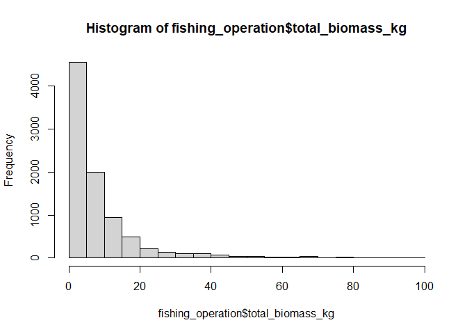

Quality Control of Fishing Landings dataset
================
Author: Emma Strand; <emma_strand@uri.edu>

## Contents

- [**Protocol to run this with a future xlsx file**](#protocol)  
- [**Load all libraries**](#libraries)  
- [**Create dataframe**](#df)  
- [**Quality Control: enumerator**](#Enumerator)  
- [**Quality Control: landing_site and BMU**](#Landing_site)  
- [**Quality Control: fisher information**](#fisher_info)  
- [**Quality Control: trap information**](#trap)  
- [**Quality Control: catch information**](#catch)  
- [**Gear type, and fish numbers/final destination**](#gear)  
- [**Quality Control: final check for notes written by field
  team**](#notes)  
- [**Exporting cleaned dataset**](#export)

## <a name="protocol"></a> **Protocol to run this with a future xlsx file**

1.  In the toolbar above, hit the arrow next to `Knit`. Scroll down to
    `Knit Directory` and select the option `Project Directory`.  
2.  **In `Create dataframe` code chunk**: Replace raw data file name in
    the function that creates the following variables:
    fishing_operation, catch_composition, and validation_lists.  
3.  **In `Enumerator`, `Landing_site`, and `BMU` code chunks**: Run the
    unique() function and double check that this list is the correct
    names.  
4.  **In Trap information**, run code chunk functions for `trap_type`
    and `total_traps_collected` sections and double check the output is
    as expected.  
5.  **In catch information**, run code chunk functions for
    `weight and value measures`, `number of fishers in crew`, and
    `Kiswahili_name` and double check the output is as expected.  
6.  **In Species/Scientific name**, run code chunk functions and check
    output to make sure it is as expected.  
7.  **In length, gear type, number of fish, and desintation sections**,
    run code chunk to double check the output of ranges is as
    expected.  
8.  In the export section, rename the new datafile excel file.

## <a name="libraries"></a> **Load all libraries**

``` r
library(plyr)
library(dplyr)
library(tidyverse)
library(ggplot2)
library(readxl)
library(lubridate)
library(Hmisc)
library(writexl)
library(naniar)
```

## <a name="df"></a> **Create dataframe**

**Load in raw data files.**

Most updated file: `Fishlandings-data-FEB 2023 JMCC`.

Previously used this df
`Fishlandings-data- CC-JM-Clay-IW updated 04-09-2022`: The date is
formatted DD-MM-YYYY. This file is from September.

[Reading in an excel datafile instead of a
csv](http://www.sthda.com/english/wiki/reading-data-from-excel-files-xls-xlsx-into-r).
This requires the `readxl` package listed in load all libraries step.

``` r
## when running future iterations of raw data file, replace the file name below 
fishing_operation <- read_excel("data/Fishlandings-data-FEB 2023 JMCC.xlsx", sheet = "fishing_operation",
                                col_types = c("date", "text", "text", "text", "text", "text", "text", 
                                              "text", "numeric", "date", "text", "date", "text", "numeric", 
                                              "numeric", "numeric", "numeric", "numeric", "numeric","text")) %>%
  rename(Operation_date = date_dd_mm_yyyy)

nrow(fishing_operation) 
```

    ## [1] 8851

``` r
# 10,670 July updated file; fishing operations (keep this # in mind for sanity check at the end)
# 8,463 September updated file
# 8,851 February updated file

## when running future iterations of raw data file, replace the file name below 
catch_composition <- read_excel("data/Fishlandings-data-FEB 2023 JMCC.xlsx", 
                                sheet = "catch_composition",
                                col_types = c("date", "text", "text", "text", "text", 
                                              "text", "numeric", "text", "text")) %>%
  rename(Operation_date = Date)

nrow(catch_composition) 
```

    ## [1] 47070

``` r
# 58,441 July updated file; fish observations (keep this # in mind for sanity check at the end)
# 65,357 September updated file
# 47,070 February updated file

## when running future iterations of raw data file, replace the file name below 
validation_lists <- read_excel("data/Fishlandings-data-FEB 2023 JMCC.xlsx", sheet = "validation_lists")

# read in enumerator names file 
enumerator_list <- read_excel("data/enumerator_list.xlsx")
```

Errors found in fisher_id column are mostly capitalization errors.

``` r
fishing_operation$fisher_id <- toupper(fishing_operation$fisher_id)
catch_composition$fisher_id <- toupper(catch_composition$fisher_id)
```

## Quality Control

### Operation_date

In the above chunk, these dates are automatically read in as *dttm*
format (date and time).

### <a name="Landing_site"></a> **Landing_site and BMU**

### Landing site

``` r
fishing_operation$landing_site <- toupper(fishing_operation$landing_site)
enumerator_list$landing_site <- toupper(enumerator_list$landing_site)

fishing_operation$landing_site <- gsub("KIRKLAND", "KARKLAND", fishing_operation$landing_site)
fishing_operation$landing_site <- gsub("KITANGONI", "KITANGANI", fishing_operation$landing_site)
fishing_operation$landing_site <- gsub("KIUKONI", "KIVUKONI", fishing_operation$landing_site)
fishing_operation$landing_site <- gsub("KIVUKANI", "KIVUKONI", fishing_operation$landing_site)
fishing_operation$landing_site <- gsub("KIVUKUNI", "KIVUKONI", fishing_operation$landing_site)

# compare fishing_operation list to the enumerator list 
# result is those that appear in the fishing_operation but not validated enumerator list
setdiff(fishing_operation$landing_site, enumerator_list$landing_site)
```

    ## [1] "WHISPERING" "TAKAUNGU"

``` r
unique(sort(fishing_operation$landing_site))
```

    ##  [1] "BURENI"          "CHAUREMBO"       "KANAMAI"         "KARKLAND"       
    ##  [5] "KIJANGWANI"      "KITANGANI"       "KIVUKONI"        "KIVULINI"       
    ##  [9] "KURUWITU"        "MAWE YA KATI"    "MAYUNGU"         "MWANAMIA"       
    ## [13] "MWENDO WA PANYA" "NGOLOKO"         "SUN N SAND"      "TAKAUNGU"       
    ## [17] "UYOMBO"          "VIPINGO"         "VUMA"            "WHISPERING"

``` r
## Step #3 in protocol to double check this output list is all the correct site names 
## (if the only output from setdiff() is NA then this list is correct)
```

### <a name="Enumerator"></a> **Enumerator**

[Replace character string with another in
R](https://stackoverflow.com/questions/11936339/replace-specific-characters-within-strings)

A lot of errors occur with different lower and upper case iterations of
names. I replaced this information with all upper case to collapse this
information. For example, “kadzo baya” and “Kadzo baya” are the same
fisherman but were reading as different categories.

Kadzo Baya and Kadzo Kazungu refer to the same person.

``` r
# change all lower case to upper case
fishing_operation$enumerator <- toupper(fishing_operation$enumerator)
enumerator_list$enumerator <- toupper(enumerator_list$enumerator)

# replace incorrect spellings 
fishing_operation$enumerator <- gsub("CELESTINER N ALI", "CELESTINE N. ALI", fishing_operation$enumerator)
fishing_operation$enumerator <- gsub("CELESTINAR.N.ALI", "CELESTINE N. ALI", fishing_operation$enumerator)
fishing_operation$enumerator <- gsub("^CELESTINAR$", "CELESTINE N. ALI", fishing_operation$enumerator)
fishing_operation$enumerator <- gsub("CELESTINAR NALI", "CELESTINE N. ALI", fishing_operation$enumerator)
fishing_operation$enumerator <- gsub("CELESTINER NALI", "CELESTINE N. ALI", fishing_operation$enumerator)
fishing_operation$enumerator <- gsub("^CLAPERTON$", "CLAPERTON KAZUNGU", fishing_operation$enumerator)
fishing_operation$enumerator <- gsub("MACKSON KAZUNGU", "MAXSON KAZUNGU", fishing_operation$enumerator)
fishing_operation$enumerator <- gsub("BIDALA RASHID", "BIDALLA RASHID", fishing_operation$enumerator)
fishing_operation$enumerator <- gsub("GARAMA YERI", "GARAMA K. YERI", fishing_operation$enumerator)
fishing_operation$enumerator <- gsub("GARAMA K YERI", "GARAMA K. YERI", fishing_operation$enumerator)
fishing_operation$enumerator <- gsub("BRUNO MUYE", "BRUNO MOYE", fishing_operation$enumerator)
fishing_operation$enumerator <- gsub("^ALI$", "CELESTINE N. ALI", fishing_operation$enumerator) #^ and $ indicate start and end of phrase
fishing_operation$enumerator <- gsub("KADZO KAZUNGU", "KADZO BAYA", fishing_operation$enumerator)
fishing_operation$enumerator <- gsub("KADZU BAYA", "KADZO BAYA", fishing_operation$enumerator)
fishing_operation$enumerator <- gsub("ANTONY JUMA", "ANTHONY JUMA", fishing_operation$enumerator)
fishing_operation$enumerator <- gsub("CLAPETRON", "CLAPERTON KAZUNGU", fishing_operation$enumerator)
fishing_operation$enumerator <- gsub("KARIM NYINGE", "KARIMA NYINGE", fishing_operation$enumerator)
fishing_operation$enumerator <- gsub("KARIMA NYINGEE", "KARIMA NYINGE", fishing_operation$enumerator)
fishing_operation$enumerator <- gsub("^BRUNO$", "BRUNO MOYE", fishing_operation$enumerator)
fishing_operation$enumerator <- gsub("MARKSON KAZUNGU", "MAXSON KAZUNGU", fishing_operation$enumerator)
fishing_operation$enumerator <- gsub("BIDAKA RASHID", "BIDALLA RASHID", fishing_operation$enumerator)

# compare fishing_operation list to the enumerator list 
# result is those that appear in the fishing_operation but not validated enumerator list
setdiff(fishing_operation$enumerator, enumerator_list$enumerator)
```

    ## [1] "SAIDI MKALI" "MWANAPILI"

``` r
## Step #2 in protocol at the top of this script 
unique(sort(fishing_operation$enumerator)) # at this point, double check that this list are all individual fishermen 
```

    ##  [1] "ANTHONY JUMA"      "BASHIR SAID"       "BIDALLA RASHID"   
    ##  [4] "BRUNO MOYE"        "CELESTINE N. ALI"  "CLAPERTON KAZUNGU"
    ##  [7] "FRANKLINE KAZUNGU" "GARAMA K. YERI"    "GILBERT NZAI"     
    ## [10] "KADZO BAYA"        "KARIMA NYINGE"     "KITSAO KARISA"    
    ## [13] "MAXSON KAZUNGU"    "MWANAPILI"         "NGALA"            
    ## [16] "OMAR ALI"          "SAIDI MKALI"

### BMU

``` r
fishing_operation$BMU <- toupper(fishing_operation$BMU)
enumerator_list$BMU <- toupper(enumerator_list$BMU)

# compare fishing_operation list to the enumerator list 
# result is those that appear in the fishing_operation but not validated enumerator list
setdiff(fishing_operation$BMU, enumerator_list$BMU)
```

    ## character(0)

``` r
unique(sort(fishing_operation$BMU))
```

    ## [1] "KANAMAI"  "KURUWITU" "MAYUNGU"  "TAKAUNGU" "UYOMBO"

``` r
## Step #4 in protocol to double check this output list is all the correct BMU names 
## (if the only output from setdiff() is NA then this list is correct)
```

### <a name="Fisher_info"></a> **Fisher information**

We don’t have a current need to correct fisher phone number right now.

### household_id

The only issue I can detect here is some lower case vs upper case.

It would be nice to have a list of expected household and fisher ID’s.

Some IDs only have 2 digits at the end - are these missing an zero in
front of them? I.e. 90 vs 090?

``` r
fishing_operation$household_id <- toupper(fishing_operation$household_id)
unique(fishing_operation$household_id)
```

    ##   [1] "SS/UYO/SB/091"  "SS/UYO/SB/085"  "SS/UYO/SB/089"  "SS/UYO/SB/088" 
    ##   [5] "SS/UYO/SB/090"  "SS/UYO/SB/092"  "SS/UYO/SB/094"  "SS/UYO/SB/095" 
    ##   [9] "SS/UYO/SB/100"  "SS/UYO/SB/099"  "SS/MAY/SB/002"  "SS/MAY/SB/001" 
    ##  [13] "SS/MAY/SB/013"  "SS/MAY/SB/018"  "SS/MAY/SB/021"  "SS/MAY/SB/049" 
    ##  [17] "SS/MAY/SB/033"  "SS/MAY/SB/032"  "SS/MAY/SB/011"  "SS/MAY/SB/003" 
    ##  [21] "SS/MAY/SB/006"  "SS/MAY/SB/041"  "SS/MAY/SB/074"  "SS/MAY/SB/030" 
    ##  [25] "SS/MAY/SB/077"  "SS/MAY/SB/010"  "SS/MAY/SB/043"  "SS/MAY/SB/042" 
    ##  [29] "SS/MAY/SB/083"  "SS/MAY/SB/052"  "SS/MAY/SB/028"  "SS/MAY/SB/082" 
    ##  [33] "SS/MAY/SB/047"  "SS/MAY/SB/046"  "SS/MAY/SB/048"  "SS/MAY/SB/044" 
    ##  [37] "SS/MAY/SB/036"  "SS/UYO/SB/096"  "SS/MAY/SB/034"  "SS/MAY/SB/038" 
    ##  [41] "SS/MAY/SB/058"  "SS/MAY/SB/017"  "SS/MAY/SB/081"  "SS/MAY/SB/029" 
    ##  [45] "SS/MAY/SB/014"  "SS/MAY/SB/015"  "SS/MAY/SB/053"  "SS/UYO/SB/086" 
    ##  [49] "SS/UYO/SB/097"  "SS/MAY/SB/064"  "SS/MAY/SB/063"  "SS/MAY/SB/076" 
    ##  [53] "SS/UYO/SB/082"  "SS/UYO/SB/079"  "SS/UYO/SB/071"  "SS/UYO/SB/039" 
    ##  [57] "SS/MAY/SB/012"  "SS/MAY/SB/031"  "SS/MAY/SB/070"  "SS/UYO/SB/020" 
    ##  [61] "SS/UYO/SB/093"  "SS/MAY/SB/045"  "SS/MAY/SB/022"  "SS/MAY/SB/078" 
    ##  [65] "SS/MAY/SB/009"  "SS/MAY/SB/065"  "SS/MAY/SB/027"  "SS/MAY/SB/026" 
    ##  [69] "SS/MAY/SB/066"  "SS/MAY/SB/025"  "SS/MAY/SB/068"  "SS/KUR/SG/092" 
    ##  [73] "SS/KUR/SG/020"  "SS/KUR/SG/081"  "SS/KUR/SG/086"  "SS/KUR/SG/029" 
    ##  [77] "SS/KUR/SG/090"  "SS/KUR/SG/087"  "SS/KUR/SG/030"  "SS/KUR/SG/077" 
    ##  [81] "SS/KUR/SG/060"  "SS/KUR/SG/073"  "SS/KUR/SG/075"  "SS/KUR/SG/069" 
    ##  [85] "SS/KUR/SG/064"  "SS/KUR/SG/068"  "SS/KUR/SG/061"  "SS/KUR/SG/071" 
    ##  [89] "SS/KUR/SG/072"  "SS/KUR/SG/010"  "SS/KUR/SG/095"  "SS/KUR/SG/046" 
    ##  [93] "SS/KUR/SG/018"  "SS/KUR/SG/011"  "SS/KUR/SG/021"  "SS/KUR/SG/016" 
    ##  [97] "SS/KUR/SG/038"  "SS/KUR/SG/034"  "SS/KUR/SG/035"  "SS/KUR/SG/048" 
    ## [101] "SS/KUR/SG/096"  "SS/KUR/SG/037"  "SS/KUR/SG/097"  "SS/KUR/SG/040" 
    ## [105] "SS/KUR/SG/098"  "SS/KUR/SG/047"  "SS/KUR/SG/050"  "SS/KUR/SG/091" 
    ## [109] "SS/KUR/SG/070"  "SS/KUR/SG/008"  "SS/KUR/SG/007"  "SS/KUR/SG/022" 
    ## [113] "SS/KUR/SG/083"  "SS/KUR/SG/027"  "SS/KUR/SG/001"  "SS/MAY/SB/020" 
    ## [117] "SS/MAY/SB/059"  "SS/KUR/SG/094"  "SS/KUR/SG/039"  "SS/KUR/SG/036" 
    ## [121] "SS/KUR/SG/033"  "SS/KUR/SG/049"  "SS/KUR/SG/065"  "SS/KUR/SG/099" 
    ## [125] "SS/KUR/SG/054"  "SS/KUR/SG/043"  "SS/KUR/SG/100"  "SS/KUR/SG/082" 
    ## [129] "SS/KUR/SG/002"  "SS/KUR/SG/005"  "SS/KUR/SG/009"  "SS/KUR/SG/013" 
    ## [133] "SS/KUR/SG/004"  "SS/KUR/SG/015"  "SS/KUR/SG/078"  "SS/KUR/SG/032" 
    ## [137] "SS/KUR/SG/006"  "SS/KUR/SG/084"  "SS/KUR/SG/012"  "SS/KUR/SG/024" 
    ## [141] "SS/KUR/SG/026"  "SS/KUR/SG/017"  "SS/KUR/SG/014"  "SS/KUR/SG/028" 
    ## [145] "SS/KUR/SG/062"  "SS/KUR/SG/074"  "SS/KAN/CO/038"  "SS/KAN/CO/042" 
    ## [149] "SS/KAN/CO/043"  "SS/KAN/CO/041"  "SS/KAN/CO/040"  "SS/KAN/CO/039" 
    ## [153] "SS/KAN/CO/117"  "SS/KAN/CO/137"  "SS/KAN/CO/044"  "SS/KAN/CO/113" 
    ## [157] "SS/KAN/CO/024"  "SS/KAN/CO/030"  "SS/KAN/CO/135"  "SS/KAN/CO/088" 
    ## [161] "SS/KAN/CO/036"  "SS/KAN/CO/035"  "SS/KAN/CO/031"  "SS/KAN/CO/025" 
    ## [165] "SS/KAN/CO/026"  "SS/KAN/CO/023"  "SS/KAN/CO/047"  "SS/KAN/CO/022" 
    ## [169] "SS/KAN/CO/020"  "SS/TAK/CO/192"  "SS/TAK/CO/147"  "SS/TAK/CO/157" 
    ## [173] "SS/TAK/CO/164"  "SS/TAK/CO/151"  "SS/TAK/CO/153"  "SS/TAK/CO/152" 
    ## [177] "SS/TAK/CO/146"  "SS/TAK/CO/159"  "SS/TAK/CO/166"  "SS/TAK/CO/160" 
    ## [181] "SS/TAK/CO/150"  "SS/KAN/CO/001"  "SS/KAN/CO/054"  "SS/KAN/CO/076" 
    ## [185] "SS/KAN/CO/051"  "SS/KAN/CO/091"  "SS/KAN/CO/093"  "SS/KAN/CO/075" 
    ## [189] "SS/KAN/CO/092"  "SS/KAN/CO/057"  "SS/KAN/CO/065"  "SS/KAN/CO/090" 
    ## [193] "SS/KAN/CO/060"  "SS/TAK/CO/173"  "SS/TAK/CO/172"  "SS/TAK/CO/167" 
    ## [197] "SS/TAK/CO/168"  "SS/TAK/CO/199"  "SS/TAK/CO/182"  "SS/TAK/CO/183" 
    ## [201] "SS/TAK/CO/143"  "SS/TAK/CO/171"  "SS/TAK/CO/169"  "SS/TAK/CO/201" 
    ## [205] "SS/TAK/CO/191"  "SS/TAK/CO/170"  "SS/TAK/CO/120"  "SS/UYO/SB/084" 
    ## [209] "SS/KUR/SG/041"  "SS/KAN/CO/012"  "SS/KAN/CO/013"  "SS/KAN/CO/014" 
    ## [213] "SS/KAN/CO/016"  "SS/KAN/CO/017"  "SS/KAN/CO/082"  "SS/KAN/CO/083" 
    ## [217] "SS/KAN/CO/084"  "SS/KAN/CO/086"  "SS/KAN/CO/136"  "SS/KAN/CO/067" 
    ## [221] "SS/KAN/CO/106"  "SS/KAN/CO/127"  "SS/KAN/CO/071"  "SS/KAN/CO/107" 
    ## [225] "SS/TAK/CO/149"  "SS/TAK/CO/206"  "SS/TAK/CO/165"  "SS/TAK/CO/158" 
    ## [229] "SS/TAK/CO/163"  "SS/TAK/CO/155"  "SS/KAN/CO/018"  "SS/TAK/CO/145" 
    ## [233] "SS/TAK/CO/154"  "SS/TAK/CO/148"  "SS/KAN/CO/077"  "SS/KAN/CO/072" 
    ## [237] "SS/KAN/CO/172"  "SS/KAN/CO/183"  "SS/KAN/CO/171"  "SS/KAN/CO/167" 
    ## [241] "SS/KAN/CO/173"  "SS/TAK/CO/205"  "SS/TAK/CO/161"  "SS/TAK/CO/067" 
    ## [245] "SS/TAK/CO/162"  "SS/TAK/CO/174"  "SS/TAK/CO/038"  "SS/KAN/CO/034" 
    ## [249] "SS/KAN/CO/085"  "SS/KAN/CO/133"  "SS/KAN/CO/078"  "SS/KAN/CO/140" 
    ## [253] "SS/TAK/CO/195"  "SS/TAK/CO/144"  "SS/TAK/CO/142"  "SS/TAK/CO/176" 
    ## [257] "SS/TAK/CO/198"  "SS/TAK/CO/179"  "SS/KUR/SG/133"  "SS/TAK/CO/197" 
    ## [261] "SS/TAK/CO/194"  "SS/TAK/CO/175"  "SS/TAK/CO/178"  "SS/KAN/CO/073" 
    ## [265] "SS/KUR/SG/042"  "SS/KUR/SG/076"  "SS/KAN/CO/099"  "SS/KAN/CO/074" 
    ## [269] "SS/TAK/CO/177"  "SS/KAN/CO/015"  "SS/KUR/SG/069F" "SS/TAK/CO/203" 
    ## [273] "SS/TAK/CO/117"  "SS/KAN/CO/102"  "SS/TAK/CO/180"  "SS/TAK/CO/181" 
    ## [277] "SS/KUR/SG/057"  "SS/KAN/CO/011"  "SS/TAK/CO/196"  "SS/TAK/CO/135" 
    ## [281] "SS/TAK/CO/036"  "SS/TAK/CO/035"  "SS/TAK/CO/031"  "SS/TAK/CO/023" 
    ## [285] "SS/TAK/CO/026"  "SS/TAK/CO/030"  "SS/TAK/CO/088"  "SS/TAK/CO/024" 
    ## [289] "SS/MAY/SB/035"  "SS/MAY/SB/039"  "SS/MAY/SB/071"  "SS/MAY/SB/084" 
    ## [293] "SS/MAY/SB/090"  "SS/MAY/SB/096"  "SS/MAY/SB/019"  "SS/MAY/SB/072" 
    ## [297] "SS/MAY/SB/004"  "SS/UYO/SB/021"  "SS/MAY/SB/005"

``` r
fishing_operation$household_id <- gsub("/FF", "", fishing_operation$household_id)
```

### <a name="trap"></a> **Trap information**

### trap_type

The only issue I can detect here is some lower case vs upper case.

``` r
fishing_operation$trap_type <- toupper(fishing_operation$trap_type)
unique(sort(fishing_operation$trap_type))
```

    ##  [1] "CASTNET"                "GILLNET"                "HANDLINE"              
    ##  [4] "MODIFIED TRAP"          "MONOFILAMENT"           "OCTOPUS HOOK"          
    ##  [7] "SEINE NET"              "SPEARGUN"               "SPEARGUN AND SEINE NET"
    ## [10] "UNMODIFIED"

### total_traps_collected

View the values put in the fishing_operation here to double check all
values make sense.

``` r
total_traps_collected <- fishing_operation %>% select(total_traps_collected) %>% na.omit()
range(total_traps_collected)
```

    ## [1]  1 48

``` r
## filtering traps to below 40
fishing_operation$total_traps_collected <- ifelse(fishing_operation$total_traps_collected > 16, NA, fishing_operation$total_traps_collected)

## Protocol with new fishing_operation: double check the below range is expected 
hist(fishing_operation$total_traps_collected)
```

<!-- -->

### Date and time set; date and time collected

In the first chunk of code, these dates are automatically read in as
*dttm* format (date and time). This new columns will be more useful for
data analysis later.

``` r
# making new columns for date and time 
fishing_operation$date_time_set <- paste(fishing_operation$date_set_dd_mm_yyyy, fishing_operation$`time_set_24hh:mm`, sep = " ")
fishing_operation$date_time_collected <- paste(fishing_operation$date_collected_dd_mm_yyyy, fishing_operation$`time_collected_24hh:mm`, sep = " ")

# removing the 'hrs' from observations in this column
fishing_operation$date_time_set <- gsub("hrs", "", fishing_operation$date_time_set)
fishing_operation$date_time_collected <- gsub("hrs", "", fishing_operation$date_time_collected)

# converting to date and time format 
fishing_operation$date_time_set <- parse_date_time(fishing_operation$date_time_set, orders = "ymdHM")
fishing_operation$date_time_collected <- parse_date_time(fishing_operation$date_time_collected, orders = "ymdHM")

## any failed to parse error messages will be from rows that do not have a date and time
```

### <a name="catch"></a> **Catch information**

### Biomass and value measures

Step \#4 from protocol: Double check the below values are in the correct
ranges

``` r
##### TOTAL BIOMASS 
### PRE FILTER = 8,851
### POST FILTER = 8,800
total_biomass_kg <- fishing_operation %>% select(total_weight_kg) %>% na.omit()
range(total_biomass_kg)
```

    ## [1]   0.125 490.000

``` r
## 0.125 490.000

# filtering biomass kg to under 100 kg 
#df$total_biomass_kg <- ifelse(df$total_biomass_kg > 100, NA, df$total_biomass_kg)
fishing_operation <- fishing_operation %>%
  filter(total_weight_kg < 100) %>%
  dplyr::rename(total_biomass_kg = total_weight_kg)

hist(fishing_operation$total_biomass_kg)
```

<!-- -->

``` r
##### TAKE HOME BIOMASS 
### PRE FILTER = 8,800
### POST FILTER = 8,793

# filtering take home weight to be under 10kg 
take_home_weight_kg <- fishing_operation %>% select(take_home_weight_kg) %>% na.omit()
range(take_home_weight_kg)
```

    ## [1]   0 700

``` r
## 0 700
#df$take_home_weight_kg <- ifelse(df$take_home_weight_kg > 10, NA, df$take_home_weight_kg)

fishing_operation <- fishing_operation %>%
  filter(take_home_weight_kg < 10 | is.na(take_home_weight_kg))

hist(fishing_operation$take_home_weight_kg)
```

<!-- -->

``` r
##### TOTAL VALUE 
### PRE FILTER = 8,793
### POST FILTER = 8,116

total_value_KES <- fishing_operation %>% select(total_value_KES) %>% na.omit()
range(total_value_KES)
```

    ## [1]    18 22400

``` r
# 18 22400

# filtering to below 5,000 
#df$total_value_KES <- ifelse(df$total_value_KES > 5000, NA, df$total_value_KES)
fishing_operation <- fishing_operation %>%
  filter(total_value_KES < 5000)

hist(fishing_operation$total_value_KES)
```

<!-- -->

``` r
##### TAKE HOME VALUE 
### PRE FILTER = 8,116
### POST FILTER = 8,043

take_home_value_KES <- fishing_operation %>% select(take_home_value_KES) %>% na.omit()
range(take_home_value_KES)
```

    ## [1]    0 1400

``` r
# 0 1400

#df$take_home_value_KES <- ifelse(df$take_home_value_KES > 5000, NA, df$take_home_value_KES)

fishing_operation <- fishing_operation %>%
  filter(take_home_value_KES < 1000 | is.na(take_home_weight_kg))

hist(fishing_operation$take_home_value_KES)
```

<!-- -->

### No. of fishers in crew

Crews above 7 people are unrealistic. I’m changing that data to ‘NA’ for
now.

``` r
# fishermen_no <- fishing_operation %>% 
#   dplyr::select(`No. of fishers in crew`) %>% na.omit()
# 
# hist(fishermen_no)

## Protocol: Double check the below values are in the correct ranges
# range(fishermen_no)
# unique(sort(fishermen_no$`No. of fishers in crew`))

# df %>% filter(`No. of fishers in crew` > 7)
# 
# # df <- df %>%
# #  mutate(crew_size = case_when(
# #     `No. of fishers in crew` > 7 ~ "NA"))
# 
# df$crew_size_corrected <- df$`No. of fishers in crew`
# 
# # replacing values higher than 5 with NA
# fishing_operation <- fishing_operation %>%
#  replace_with_na_at(
#     .vars = 'crew_size_corrected',
#     condition = ~(.x > 7))

fishing_operation <- fishing_operation %>%
  dplyr::filter(`No. of fishers in crew` < 7)

# double checking that the above worked
unique(sort(fishing_operation$`No. of fishers in crew`))
```

    ## [1] 1 2 3 4 5 6

``` r
## PRE FILTER = 8,043
## POST FILTER = 7,813
```

## Quality Control for Catch Composition sheet

### Kiswahili_name

``` r
catch_composition$Kiswahili_name <- toupper(catch_composition$Kiswahili_name)
unique(sort(catch_composition$Kiswahili_name))
```

    ##   [1] "BARAKUDA"                 "BATANI"                  
    ##   [3] "BIRINZI"                  "BOCHO"                   
    ##   [5] "BUA"                      "BUA/MBORO YA MVUA"       
    ##   [7] "BUNDU"                    "BUNJU"                   
    ##   [9] "CHAA"                     "CHALE"                   
    ##  [11] "CHANGU"                   "CHANGU GAMWE"            
    ##  [13] "CHANGU MACHO"             "CHANGU NDOMO"            
    ##  [15] "CHANGU TAWA"              "CHEMBEU"                 
    ##  [17] "CHENA"                    "DOME"                    
    ##  [19] "FUTE"                     "FUTE KUMBI"              
    ##  [21] "FUTE MLEA"                "FUTE MOSHI"              
    ##  [23] "FUTE MRABA"               "FUTE MRAMBA"             
    ##  [25] "GENDA"                    "GONA"                    
    ##  [27] "GONA SHARIFU"             "GONO"                    
    ##  [29] "JAME"                     "JANARE"                  
    ##  [31] "JODARI"                   "KADA"                    
    ##  [33] "KADIFU"                   "KAKURUWENDE"             
    ##  [35] "KAMBA KOLOLO"             "KAMBA SHUARI"            
    ##  [37] "KAMBA SIMBA"              "KAMBA WINDU"             
    ##  [39] "KANGAJA"                  "KANGAJA HEWANI"          
    ##  [41] "KANGAJA HEWENI"           "KANGAJI HEWANI"          
    ##  [43] "KASIKI"                   "KATATANGE"               
    ##  [45] "KERENGE"                  "KHADA"                   
    ##  [47] "KHADA/TEWA"               "KIBAA"                   
    ##  [49] "KIBOMA"                   "KIFUDU"                  
    ##  [51] "KIFUDUU"                  "KIFUVUU"                 
    ##  [53] "KIJAME"                   "KIKANDE"                 
    ##  [55] "KIKOKWE"                  "KINAUCHI"                
    ##  [57] "KINGOE"                   "KINWA UCHI"              
    ##  [59] "KINYWAUCHI"               "KIPEPEO"                 
    ##  [61] "KITATANGE"                "KIUNGA"                  
    ##  [63] "KOLEKOLE"                 "KOPWE"                   
    ##  [65] "KORIS"                    "KORISI"                  
    ##  [67] "KOTWE"                    "KUFI"                    
    ##  [69] "KUFI SAFARI"              "KUFI/KIMBULIMBULI/KUKUSI"
    ##  [71] "KUMBA"                    "KUMBI"                   
    ##  [73] "KUMBI FUTE"               "KUNGU"                   
    ##  [75] "LWAYOO"                   "MABACHO"                 
    ##  [77] "MBININI"                  "MBONO"                   
    ##  [79] "MBORO YA MVUVI"           "MCHAKUFA"                
    ##  [81] "MGENDA"                   "MKIZI"                   
    ##  [83] "MKIZI KOMWE"              "MKORE"                   
    ##  [85] "MKORWE"                   "MKUNDAJI"                
    ##  [87] "MKUNGA"                   "MKUNGA CHAI"             
    ##  [89] "MKUNGA CHUI"              "MKUNGA IBRAHIM"          
    ##  [91] "MKUNGA MBONO"             "MKUNGA SAMAKI"           
    ##  [93] "MKUNGAJI"                 "MLEA"                    
    ##  [95] "MLEYA"                    "MNGENDA"                 
    ##  [97] "MTANI"                    "MTONZI"                  
    ##  [99] "MTUMBO WA DAU"            "MTUMBUA"                 
    ## [101] "MTUMBUA DAU"              "MTUMBUU"                 
    ## [103] "MTUNE"                    "MUGENDA"                 
    ## [105] "NGAGU"                    "NGANGU"                  
    ## [107] "NGINDO"                   "NGISI"                   
    ## [109] "NGOGO"                    "NGURU"                   
    ## [111] "NJANA"                    "NUMBA"                   
    ## [113] "NYAVI"                    "NYENGA"                  
    ## [115] "PAKOE"                    "PAMAMBA"                 
    ## [117] "PANDU"                    "PANGA"                   
    ## [119] "PANGA SAMAKI"             "PAPA"                    
    ## [121] "PAROTI"                   "PONO"                    
    ## [123] "PONO  MWANI"              "PONO BLUE"               
    ## [125] "PONO BLUE FISH"           "PONO CHANI"              
    ## [127] "PONO DASI"                "PONO DATSI"              
    ## [129] "PONO KABANGI"             "PONO KADIFI"             
    ## [131] "PONO KADIFU"              "PONO KASIKI"             
    ## [133] "PONO KIDIFU"              "PONO MWANI"              
    ## [135] "PONO SUNGURA"             "PUJI"                    
    ## [137] "PUJI PEMBE"               "PUJU"                    
    ## [139] "PUJU PEMBE"               "PUNDU"                   
    ## [141] "PWEZA"                    "SANGE"                   
    ## [143] "SENDENGOMANI"             "SHANA"                   
    ## [145] "SHANA/TUGUU"              "SHARIFU"                 
    ## [147] "SIMU"                     "SITEFUE"                 
    ## [149] "STEFUE"                   "SULISULI"                
    ## [151] "TAA"                      "TAA YEDA"                
    ## [153] "TAF KITUMBO"              "TAFI"                    
    ## [155] "TAFI KITUMBO"             "TAFI MAENGA"             
    ## [157] "TAFI MAENGE"              "TAFI MANGA"              
    ## [159] "TAFI MIMBA"               "TAFI MWAMBA"             
    ## [161] "TAKUANA"                  "TAWE JESHI"              
    ## [163] "TEMBO"                    "TENGESI"                 
    ## [165] "TEWA"                     "TEWA JESHI"              
    ## [167] "TEWA KALESO"              "TEWA KOPE"               
    ## [169] "TEWA KOPWE"               "TEWA LESO"               
    ## [171] "TEWA MOSHI"               "TEWA THARAFA"            
    ## [173] "TEWA WIMBI"               "TEWEJESHI"               
    ## [175] "TOA"                      "TOGOO"                   
    ## [177] "TONDO"                    "TUGUU"                   
    ## [179] "TUKUANA"                  "TUNDU"                   
    ## [181] "UKUZI"                    "UNA"                     
    ## [183] "USENDE NGOMANI"           "VEMBEU"                  
    ## [185] "VUMBAMA"                  "VUMBANA"                 
    ## [187] "WAYO"                     "WAYO ULIMI"              
    ## [189] "WAYO ULIMI NG'OMBE"       "WAYO/ULIMI WA NG'OMBE"   
    ## [191] "WAYOO"

### SPECIES / Scientific name

**This is a hard-coding way to do this.. ideally we could downloand a
dataset from fishbase and create a compare function that could recognize
a name that is a letter or 2 off from a name in fishbase and then create
suggestions…**

We can pull in the validation_lists catch_composition to double check
these spellings.

``` r
catch_composition <- catch_composition %>% dplyr::rename(scientific_name = SPECIES)

# Taking out double spaces in between genus and species 
validation_lists$scientific_name <- gsub("  ", " ", validation_lists$scientific_name)
```

Sorting through catch_composition for errors.

``` r
# create capitalize function for upper case genus and lower case species 
capitalize_fxn <- function(x){
  first <- toupper(substr(x, start=1, stop=1)) ## capitalize first letter
  rest <- tolower(substr(x, start=2, stop=nchar(x)))   ## everything else lowercase
  paste0(first, rest)
}

catch_composition$scientific_name <- capitalize_fxn(catch_composition$scientific_name)
validation_lists$scientific_name <- capitalize_fxn(validation_lists$scientific_name)

# Taking out double spaces in between genus and species 
catch_composition$scientific_name <- gsub("  ", " ", catch_composition$scientific_name)

# Correcting commonly misspelled genus names 

# this chunk is for one genus. This is a data input issue that is difficult to catch and fix in R
catch_composition$scientific_name <- gsub("Acanthrus", "Acanthurus", catch_composition$scientific_name)
catch_composition$scientific_name <- gsub("Acantharus", "Acanthurus", catch_composition$scientific_name)
catch_composition$scientific_name <- gsub("Acantrus", "Acanthurus", catch_composition$scientific_name)
catch_composition$scientific_name <- gsub("Acantarus", "Acanthurus", catch_composition$scientific_name)
catch_composition$scientific_name <- gsub("Acathurus", "Acanthurus", catch_composition$scientific_name)
catch_composition$scientific_name <- gsub("Acronthurus", "Acanthurus", catch_composition$scientific_name)
catch_composition$scientific_name <- gsub("Acanthrurus", "Acanthurus", catch_composition$scientific_name)
catch_composition$scientific_name <- gsub("dossumieri", "dussumieri", catch_composition$scientific_name)
catch_composition$scientific_name <- gsub("dusimieri", "dussumieri", catch_composition$scientific_name)
catch_composition$scientific_name <- gsub("dusimii", "dussumieri", catch_composition$scientific_name)
catch_composition$scientific_name <- gsub("dussimieri", "dussumieri", catch_composition$scientific_name)
catch_composition$scientific_name <- gsub("Abdefduf", "Abudefduf", catch_composition$scientific_name)
catch_composition$scientific_name <- gsub("Cheilo", "Cheilio", catch_composition$scientific_name)
catch_composition$scientific_name <- gsub("inemis", "inermis", catch_composition$scientific_name)
catch_composition$scientific_name <- gsub("argentmaculatus", "argentimaculatus", catch_composition$scientific_name)
catch_composition$scientific_name <- gsub("Cheillinus", "Cheilinus", catch_composition$scientific_name)
catch_composition$scientific_name <- gsub("candiculatus", "canaliculatus", catch_composition$scientific_name)
catch_composition$scientific_name <- gsub("canaliculutus", "canaliculatus", catch_composition$scientific_name)
catch_composition$scientific_name <- gsub("Cholurururs", "Chlorurus", catch_composition$scientific_name)
catch_composition$scientific_name <- gsub("stronycephalus", "strongylocephalus", catch_composition$scientific_name)
catch_composition$scientific_name <- gsub("Gymonthorax", "Gymnothorax", catch_composition$scientific_name)
catch_composition$scientific_name <- gsub("Gymothorax", "Gymnothorax", catch_composition$scientific_name)
catch_composition$scientific_name <- gsub("javanicus", "favagineus", catch_composition$scientific_name)
catch_composition$scientific_name <- gsub("vaiginsis", "vaigiensis", catch_composition$scientific_name)
catch_composition$scientific_name <- gsub("semicirculatus", "semicirculatus", catch_composition$scientific_name)
catch_composition$scientific_name <- gsub("semisulcatus", "semicirculatus", catch_composition$scientific_name)
catch_composition$scientific_name <- gsub("Pomacnathus", "Pomacanthus", catch_composition$scientific_name)
catch_composition$scientific_name <- gsub("granoculis", "grandoculis", catch_composition$scientific_name)
catch_composition$scientific_name <- gsub("malanostigma", "melanostigma", catch_composition$scientific_name)
catch_composition$scientific_name <- gsub("hard", "harid", catch_composition$scientific_name)
catch_composition$scientific_name <- gsub("sexfaciatus", "sexfasciatus", catch_composition$scientific_name)
catch_composition$scientific_name <- gsub("dussumiera", "dussumieri", catch_composition$scientific_name)
catch_composition$scientific_name <- gsub("caeruleopanctatus", "caeruleopunctatus", catch_composition$scientific_name)
catch_composition$scientific_name <- gsub("hebei", "heberi", catch_composition$scientific_name)
catch_composition$scientific_name <- gsub("kippos", "hippos", catch_composition$scientific_name)
catch_composition$scientific_name <- gsub("Carnx", "Caranx", catch_composition$scientific_name)
catch_composition$scientific_name <- gsub("coioidea", "coioides", catch_composition$scientific_name)
catch_composition$scientific_name <- gsub("monochrou", "monochrous", catch_composition$scientific_name)
catch_composition$scientific_name <- gsub("monochrouss", "monochrous", catch_composition$scientific_name)
catch_composition$scientific_name <- gsub("Kyphasus", "Kyphosus", catch_composition$scientific_name)
catch_composition$scientific_name <- gsub("Lenthrinus", "Lethrinus", catch_composition$scientific_name)
catch_composition$scientific_name <- gsub("Leturinus", "Lethrinus", catch_composition$scientific_name)
catch_composition$scientific_name <- gsub("vaiguensis", "vaigiensis", catch_composition$scientific_name)
catch_composition$scientific_name <- gsub("bornonicus", "borbonicus", catch_composition$scientific_name)
catch_composition$scientific_name <- gsub("nebulosis", "nebulosus", catch_composition$scientific_name)
catch_composition$scientific_name <- gsub("nebulous", "nebulosus", catch_composition$scientific_name)
catch_composition$scientific_name <- gsub("Leptoscaus", "Leptoscarus", catch_composition$scientific_name)
catch_composition$scientific_name <- gsub("fluluiflamma", "fulviflamma", catch_composition$scientific_name)
catch_composition$scientific_name <- gsub("flavlineathe", "flavolineatus", catch_composition$scientific_name)
catch_composition$scientific_name <- gsub("taeniourous", "taeniorus", catch_composition$scientific_name)
catch_composition$scientific_name <- gsub("Navaculichthys", "Novaculichthys", catch_composition$scientific_name)
catch_composition$scientific_name <- gsub("taeniorus", "taeniourus", catch_composition$scientific_name)
catch_composition$scientific_name <- gsub("Parupeneus sp nov.", "Parupeneus", catch_composition$scientific_name)
catch_composition$scientific_name <- gsub("Platux", "Platax", catch_composition$scientific_name)
catch_composition$scientific_name <- gsub("platyyuna", "platyura", catch_composition$scientific_name)
catch_composition$scientific_name <- gsub("playfair", "playfairi", catch_composition$scientific_name)
catch_composition$scientific_name <- gsub("Plectorhincus", "Plectorhinchus", catch_composition$scientific_name)
catch_composition$scientific_name <- gsub("Plectorhnichus", "Plectorhinchus", catch_composition$scientific_name)
catch_composition$scientific_name <- gsub("Plotasus", "Plotosus", catch_composition$scientific_name)
catch_composition$scientific_name <- gsub("Pomatonus", "Pomatomus", catch_composition$scientific_name)
catch_composition$scientific_name <- gsub("Rhinecanthurus", "Rhineacanthus", catch_composition$scientific_name)
catch_composition$scientific_name <- gsub("vubroviolaceus", "rubroviolaceus", catch_composition$scientific_name)
catch_composition$scientific_name <- gsub("sirubroviolaceus", "rubroviolaceus", catch_composition$scientific_name)
catch_composition$scientific_name <- gsub("Scromberomorus", "Scomerommorus", catch_composition$scientific_name)
catch_composition$scientific_name <- gsub("Sphraena", "Sphyraena", catch_composition$scientific_name)
catch_composition$scientific_name <- gsub("meyeri", "meyeni", catch_composition$scientific_name)
catch_composition$scientific_name <- gsub("triostregus", "triostegus", catch_composition$scientific_name)
catch_composition$scientific_name <- gsub("Adudefduf", "Abudefduf", catch_composition$scientific_name)
catch_composition$scientific_name <- gsub("scoplas", "scopas", catch_composition$scientific_name)
catch_composition$scientific_name <- gsub("xanthonta", "xanthonota", catch_composition$scientific_name)
catch_composition$scientific_name <- gsub("Carangoifes", "Carangoides", catch_composition$scientific_name)
catch_composition$scientific_name <- gsub("vippos", "hippos", catch_composition$scientific_name)
catch_composition$scientific_name <- gsub("Cephelopholu", "Cephalopholis", catch_composition$scientific_name)
catch_composition$scientific_name <- gsub("Chaetadon", "Chaetodon", catch_composition$scientific_name)
catch_composition$scientific_name <- gsub("auringa", "auriga", catch_composition$scientific_name)
catch_composition$scientific_name <- gsub("selen$", "selene", catch_composition$scientific_name) # $ indicates end of phrase; didnt use ^ because this is species name is the 2nd word 
catch_composition$scientific_name <- gsub("trilohatus", "trilobatus", catch_composition$scientific_name)
catch_composition$scientific_name <- gsub("Cheiellinus", "Cheilinus", catch_composition$scientific_name)
catch_composition$scientific_name <- gsub("Cheillnus", "Cheilinus", catch_composition$scientific_name)
catch_composition$scientific_name <- gsub("inerms", "inermis", catch_composition$scientific_name)
catch_composition$scientific_name <- gsub("piinnulatus", "pinnulatus", catch_composition$scientific_name)
catch_composition$scientific_name <- gsub("pinnulatrus", "pinnulatus", catch_composition$scientific_name)
catch_composition$scientific_name <- gsub("Cirrihitus", "Cirrhitus", catch_composition$scientific_name)
catch_composition$scientific_name <- gsub("farmosa", "formosa", catch_composition$scientific_name)
catch_composition$scientific_name <- gsub("Cymonthorax", "Gymnothorax", catch_composition$scientific_name)
catch_composition$scientific_name <- gsub("Cynoglassus", "Cynoglossus", catch_composition$scientific_name)
catch_composition$scientific_name <- gsub("lachnen", "lachneri", catch_composition$scientific_name)
catch_composition$scientific_name <- gsub("luchneri", "lachneri", catch_composition$scientific_name)
catch_composition$scientific_name <- gsub("Epimephelus", "Epinephelus", catch_composition$scientific_name)
catch_composition$scientific_name <- gsub("colodes", "coioides", catch_composition$scientific_name)
catch_composition$scientific_name <- gsub("coicoides", "coioides", catch_composition$scientific_name)
catch_composition$scientific_name <- gsub("coloides", "coioides", catch_composition$scientific_name)
catch_composition$scientific_name <- gsub("faragineus", "favagineus", catch_composition$scientific_name)
catch_composition$scientific_name <- gsub("favagineous", "favagineus", catch_composition$scientific_name)
catch_composition$scientific_name <- gsub("hortulatus", "hortulanus", catch_composition$scientific_name)
catch_composition$scientific_name <- gsub("Himantur", "Himantura", catch_composition$scientific_name)
catch_composition$scientific_name <- gsub("Himanturaa", "Himantura", catch_composition$scientific_name)
catch_composition$scientific_name <- gsub("Hippscarus", "Hipposcarus", catch_composition$scientific_name)
catch_composition$scientific_name <- gsub("vagiensis", "vaigiensis", catch_composition$scientific_name)
catch_composition$scientific_name <- gsub("vaigienesis", "vaigiensis", catch_composition$scientific_name)
catch_composition$scientific_name <- gsub("fuaviflamma", "fulviflamma", catch_composition$scientific_name)
catch_composition$scientific_name <- gsub("fluliuflamma", "fulviflamma", catch_composition$scientific_name)
catch_composition$scientific_name <- gsub("fuluvifiamma", "fulviflamma", catch_composition$scientific_name)
catch_composition$scientific_name <- gsub("fulvifiamma", "fulviflamma", catch_composition$scientific_name)
catch_composition$scientific_name <- gsub("Latjanus", "Lutjanus", catch_composition$scientific_name)
catch_composition$scientific_name <- gsub("conchiliatus", "conchliatus", catch_composition$scientific_name)
catch_composition$scientific_name <- gsub("conchuliatutus", "conchliatus", catch_composition$scientific_name)
catch_composition$scientific_name <- gsub("conchyliantus", "conchliatus", catch_composition$scientific_name)
catch_composition$scientific_name <- gsub("hara$", "harak", catch_composition$scientific_name)
catch_composition$scientific_name <- gsub("harar$", "harak", catch_composition$scientific_name)
catch_composition$scientific_name <- gsub("letjan$", "lentjan", catch_composition$scientific_name)
catch_composition$scientific_name <- gsub("olivacous$", "olivaceus", catch_composition$scientific_name)
catch_composition$scientific_name <- gsub("Letjanus", "Lutjanus", catch_composition$scientific_name)
catch_composition$scientific_name <- gsub("Liza", "Planiliza", catch_composition$scientific_name)
catch_composition$scientific_name <- gsub("alatar$", "alata", catch_composition$scientific_name)
catch_composition$scientific_name <- gsub("argemtimaculutus", "argentimaculatus", catch_composition$scientific_name)
catch_composition$scientific_name <- gsub("argentinmaculatus", "argentimaculatus", catch_composition$scientific_name)
catch_composition$scientific_name <- gsub("ghibbon$", "gibbus", catch_composition$scientific_name)
catch_composition$scientific_name <- gsub("Lutjan", "Lutjanus", catch_composition$scientific_name)
catch_composition$scientific_name <- gsub("Lutjanusus", "Lutjanus", catch_composition$scientific_name)
catch_composition$scientific_name <- gsub("Migul", "Mugil", catch_composition$scientific_name)
catch_composition$scientific_name <- gsub("Monodactytus", "Monodactylus", catch_composition$scientific_name)
catch_composition$scientific_name <- gsub("bernditi", "berndti", catch_composition$scientific_name)
catch_composition$scientific_name <- gsub("berndt", "berndti", catch_composition$scientific_name)
catch_composition$scientific_name <- gsub("berndtii", "berndti", catch_composition$scientific_name)
catch_composition$scientific_name <- gsub("annalutus", "annulatus", catch_composition$scientific_name)
catch_composition$scientific_name <- gsub("anna$", "annulatus", catch_composition$scientific_name)
catch_composition$scientific_name <- gsub("annaturus", "annulatus", catch_composition$scientific_name)
catch_composition$scientific_name <- gsub("annulator", "annulatus", catch_composition$scientific_name)
catch_composition$scientific_name <- gsub("annulutus", "annulatus", catch_composition$scientific_name)
catch_composition$scientific_name <- gsub("annunthurus$", "annulatus", catch_composition$scientific_name)
catch_composition$scientific_name <- gsub("annuthurus$", "annulatus", catch_composition$scientific_name)
catch_composition$scientific_name <- gsub("brachycentus$", "brachycentron", catch_composition$scientific_name)
catch_composition$scientific_name <- gsub("bracycentron", "brachycentron", catch_composition$scientific_name)
catch_composition$scientific_name <- gsub("branchycentron", "brachycentron", catch_composition$scientific_name)
catch_composition$scientific_name <- gsub("unicaris", "unicornis", catch_composition$scientific_name)
catch_composition$scientific_name <- gsub("oyanea$", "cyanea", catch_composition$scientific_name)
catch_composition$scientific_name <- gsub("Panacirus", "Panulirus", catch_composition$scientific_name)
catch_composition$scientific_name <- gsub("Panilirus", "Panulirus", catch_composition$scientific_name)
catch_composition$scientific_name <- gsub("Panulinus", "Panulirus", catch_composition$scientific_name)
catch_composition$scientific_name <- gsub("homaruis", "homarus", catch_composition$scientific_name)
catch_composition$scientific_name <- gsub("humarus", "homarus", catch_composition$scientific_name)
catch_composition$scientific_name <- gsub("hurmarus", "homarus", catch_composition$scientific_name)
catch_composition$scientific_name <- gsub("pencillatus", "penicillatus", catch_composition$scientific_name)
catch_composition$scientific_name <- gsub("Paraparenus", "Parupeneus", catch_composition$scientific_name)
catch_composition$scientific_name <- gsub("Parapeneneus", "Parupeneus", catch_composition$scientific_name)
catch_composition$scientific_name <- gsub("Parapenenus", "Parupeneus", catch_composition$scientific_name)
catch_composition$scientific_name <- gsub("Parapeneous", "Parupeneus", catch_composition$scientific_name)
catch_composition$scientific_name <- gsub("Parapeneus", "Parupeneus", catch_composition$scientific_name)
catch_composition$scientific_name <- gsub("Parapenious", "Parupeneus", catch_composition$scientific_name)
catch_composition$scientific_name <- gsub("Parapenous", "Parupeneus", catch_composition$scientific_name)
catch_composition$scientific_name <- gsub("Paraperenus", "Parupeneus", catch_composition$scientific_name)
catch_composition$scientific_name <- gsub("Parupenenus", "Parupeneus", catch_composition$scientific_name)
catch_composition$scientific_name <- gsub("Parupeneous", "Parupeneus", catch_composition$scientific_name)
catch_composition$scientific_name <- gsub("Parupenenus", "Parupeneus", catch_composition$scientific_name)
catch_composition$scientific_name <- gsub("Perepeneus", "Parupeneus", catch_composition$scientific_name)
catch_composition$scientific_name <- gsub("baberinus", "barberinus", catch_composition$scientific_name)
catch_composition$scientific_name <- gsub("indica$", "indicus", catch_composition$scientific_name)
catch_composition$scientific_name <- gsub("Plactorhinches", "Plectorhinchus", catch_composition$scientific_name)
catch_composition$scientific_name <- gsub("Plactorhinchus", "Plectorhinchus", catch_composition$scientific_name)
catch_composition$scientific_name <- gsub("Platasus", "Plotosus", catch_composition$scientific_name)
catch_composition$scientific_name <- gsub("Platxbelone", "Platybelone", catch_composition$scientific_name)
catch_composition$scientific_name <- gsub("fiavomaculatus", "flavomaculatus", catch_composition$scientific_name)
catch_composition$scientific_name <- gsub("flavamaculatus", "flavomaculatus", catch_composition$scientific_name)
catch_composition$scientific_name <- gsub("plaxfairi", "playfairi", catch_composition$scientific_name)
catch_composition$scientific_name <- gsub("playfairii", "playfairi", catch_composition$scientific_name)
catch_composition$scientific_name <- gsub("sardidus", "sordidus", catch_composition$scientific_name)
catch_composition$scientific_name <- gsub("Plectorhinechus", "Plectorhinchus", catch_composition$scientific_name)
catch_composition$scientific_name <- gsub("Plectorhines", "Plectorhinchus", catch_composition$scientific_name)
catch_composition$scientific_name <- gsub("Plectorhninus", "Plectorhinchus", catch_composition$scientific_name)
catch_composition$scientific_name <- gsub("Plectorihinchus", "Plectorhinchus", catch_composition$scientific_name)
catch_composition$scientific_name <- gsub("Plectrorchinchw", "Plectorhinchus", catch_composition$scientific_name)
catch_composition$scientific_name <- gsub("Plectrorhinchw", "Plectorhinchus", catch_composition$scientific_name)
catch_composition$scientific_name <- gsub("Priacanthurus", "Priacanthus", catch_composition$scientific_name)
catch_composition$scientific_name <- gsub("Pricanthurus", "Priacanthus", catch_composition$scientific_name)
catch_composition$scientific_name <- gsub("hamsur$", "hamrur", catch_composition$scientific_name)
catch_composition$scientific_name <- gsub("Psedorhombus", "Pseudorhombus", catch_composition$scientific_name)
catch_composition$scientific_name <- gsub("mile$", "miles", catch_composition$scientific_name)
catch_composition$scientific_name <- gsub("Rhineacanthus", "Rhinecanthus", catch_composition$scientific_name)
catch_composition$scientific_name <- gsub("aculateus$", "aculeatus", catch_composition$scientific_name)
catch_composition$scientific_name <- gsub("Sardinelle", "Sardinella", catch_composition$scientific_name)
catch_composition$scientific_name <- gsub("Scarrus", "Scarus", catch_composition$scientific_name)
catch_composition$scientific_name <- gsub("Scarua", "Scarus", catch_composition$scientific_name)
catch_composition$scientific_name <- gsub("Scarus$", "Scarus sp.", catch_composition$scientific_name)
catch_composition$scientific_name <- gsub("ghoban$", "ghobban", catch_composition$scientific_name)
catch_composition$scientific_name <- gsub("ghobbao", "ghobban", catch_composition$scientific_name)
catch_composition$scientific_name <- gsub("nuselii", "russelii", catch_composition$scientific_name)
catch_composition$scientific_name <- gsub("risselii", "russelii", catch_composition$scientific_name)
catch_composition$scientific_name <- gsub("ruselii", "russelii", catch_composition$scientific_name)
catch_composition$scientific_name <- gsub("psittatus", "psittacus", catch_composition$scientific_name)
catch_composition$scientific_name <- gsub("phargonis", "pharaonis", catch_composition$scientific_name)
catch_composition$scientific_name <- gsub("fluscence", "fuscescens", catch_composition$scientific_name)
catch_composition$scientific_name <- gsub("fluscenscens", "fuscescens", catch_composition$scientific_name)
catch_composition$scientific_name <- gsub("fluscescens", "fuscescens", catch_composition$scientific_name)
catch_composition$scientific_name <- gsub("gittatus", "guttatus", catch_composition$scientific_name)
catch_composition$scientific_name <- gsub("guitatus", "guttatus", catch_composition$scientific_name)
catch_composition$scientific_name <- gsub("Signus", "Siganus", catch_composition$scientific_name)
catch_composition$scientific_name <- gsub("Sphyreana", "Sphyraena", catch_composition$scientific_name)
catch_composition$scientific_name <- gsub("Spinephelus", "Epinephelus", catch_composition$scientific_name)
catch_composition$scientific_name <- gsub("iciura$", "leiura", catch_composition$scientific_name)
catch_composition$scientific_name <- gsub("satheta$", "sathete", catch_composition$scientific_name)
catch_composition$scientific_name <- gsub("Strougylura", "Strongylura", catch_composition$scientific_name)
catch_composition$scientific_name <- gsub("Suffiamen", "Sufflamen", catch_composition$scientific_name)
catch_composition$scientific_name <- gsub("Sufiamen", "Sufflamen", catch_composition$scientific_name)
catch_composition$scientific_name <- gsub("bymma", "lymma", catch_composition$scientific_name)
catch_composition$scientific_name <- gsub("chiltanae", "chiltonae", catch_composition$scientific_name)
catch_composition$scientific_name <- gsub("chittonae", "chiltonae", catch_composition$scientific_name)
catch_composition$scientific_name <- gsub("chillonae", "chiltonae", catch_composition$scientific_name)
catch_composition$scientific_name <- gsub("Thysanophys", "Thysanophrys", catch_composition$scientific_name)
catch_composition$scientific_name <- gsub("lepsurus", "lepturus", catch_composition$scientific_name)
catch_composition$scientific_name <- gsub("duaucelii", "duvauceli", catch_composition$scientific_name)
catch_composition$scientific_name <- gsub("duraucelii", "duvauceli", catch_composition$scientific_name)
catch_composition$scientific_name <- gsub("duvaucelii", "duvauceli", catch_composition$scientific_name)
catch_composition$scientific_name <- gsub("nigricaudus", "nigricauda", catch_composition$scientific_name)
catch_composition$scientific_name <- gsub("Ancanthurus", "Acanthurus", catch_composition$scientific_name)
catch_composition$scientific_name <- gsub("Elinephelus", "Epinephelus", catch_composition$scientific_name)
catch_composition$scientific_name <- gsub("Etinephelus", "Epinephelus", catch_composition$scientific_name)
catch_composition$scientific_name <- gsub("Gomphesus", "Gomphosus", catch_composition$scientific_name)
catch_composition$scientific_name <- gsub("Laptoscarus", "Leptoscarus", catch_composition$scientific_name)
catch_composition$scientific_name <- gsub("lebulous", "nebulosus", catch_composition$scientific_name)
catch_composition$scientific_name <- gsub("varigatus", "variegatus", catch_composition$scientific_name)
catch_composition$scientific_name <- gsub("veriegatus", "variegatus", catch_composition$scientific_name)
catch_composition$scientific_name <- gsub("flulviflamma", "fulviflamma", catch_composition$scientific_name)
catch_composition$scientific_name <- gsub("fluviflamma", "fulviflamma", catch_composition$scientific_name)
catch_composition$scientific_name <- gsub("bernati", "berndti", catch_composition$scientific_name)
catch_composition$scientific_name <- gsub("Ovaculichthys", "Novaculichthys", catch_composition$scientific_name)
catch_composition$scientific_name <- gsub("berbarinus", "barberinus", catch_composition$scientific_name)
catch_composition$scientific_name <- gsub("semcirculotus", "semicirculatus", catch_composition$scientific_name)
catch_composition$scientific_name <- gsub("Scolopis", "Scolopsis", catch_composition$scientific_name)
catch_composition$scientific_name <- gsub("Siggg", "Siganus", catch_composition$scientific_name)
catch_composition$scientific_name <- gsub("Sinagus", "Siganus", catch_composition$scientific_name)
catch_composition$scientific_name <- gsub("sandwichlensis", "sandwichiensis", catch_composition$scientific_name)
catch_composition$scientific_name <- gsub("lacheri", "lachneri", catch_composition$scientific_name)
catch_composition$scientific_name <- gsub("Leptoscurus", "Leptoscarus", catch_composition$scientific_name)
catch_composition$scientific_name <- gsub("haak", "harak", catch_composition$scientific_name)
catch_composition$scientific_name <- gsub("Lethritus", "Lethrinus", catch_composition$scientific_name)
catch_composition$scientific_name <- gsub("Luthrinus", "Lethrinus", catch_composition$scientific_name)
catch_composition$scientific_name <- gsub("fulfuiflamma", "fulviflamma", catch_composition$scientific_name)
catch_composition$scientific_name <- gsub("orgentimoeulatus", "argentimaculatus", catch_composition$scientific_name)
catch_composition$scientific_name <- gsub("argentues", "argenteus", catch_composition$scientific_name)
catch_composition$scientific_name <- gsub("orgentues", "argenteus", catch_composition$scientific_name)
catch_composition$scientific_name <- gsub("Parapenes", "Parupeneus", catch_composition$scientific_name)
catch_composition$scientific_name <- gsub("Parapenius", "Parupeneus", catch_composition$scientific_name)
catch_composition$scientific_name <- gsub("Parupeneus", "Parupeneus", catch_composition$scientific_name)
catch_composition$scientific_name <- gsub("barberins", "barberinus", catch_composition$scientific_name)
catch_composition$scientific_name <- gsub("berberinus", "barberinus", catch_composition$scientific_name)
catch_composition$scientific_name <- gsub("Platorhinchus", "Plectorhinchus", catch_composition$scientific_name)
catch_composition$scientific_name <- gsub("Plectorhichus", "Plectorhinchus", catch_composition$scientific_name)
catch_composition$scientific_name <- gsub("Plectohinchus", "Plectorhinchus", catch_composition$scientific_name)
catch_composition$scientific_name <- gsub("Pleitorhinchus", "Plectorhinchus", catch_composition$scientific_name)
catch_composition$scientific_name <- gsub("Platybalone", "Platybelone", catch_composition$scientific_name)
catch_composition$scientific_name <- gsub("Pomacanthurus", "Pomacanthus", catch_composition$scientific_name)
catch_composition$scientific_name <- gsub("Pseudorhombuo", "Pseudorhombus", catch_composition$scientific_name)
catch_composition$scientific_name <- gsub("Scanus", "Scarus", catch_composition$scientific_name)
catch_composition$scientific_name <- gsub("globiseps", "globiceps", catch_composition$scientific_name)
catch_composition$scientific_name <- gsub("acutiplanis", "acutipinnis", catch_composition$scientific_name)
catch_composition$scientific_name <- gsub("Utoreuthis", "Uroteuthis", catch_composition$scientific_name)
catch_composition$scientific_name <- gsub("Scarus tricolo$", "Scarus tricolor", catch_composition$scientific_name)
catch_composition$scientific_name <- gsub("Parupeneous macronema$", "Parupeneus macronemus", catch_composition$scientific_name)
catch_composition$scientific_name <- gsub("Parupeneus macronema$", "Parupeneus macronemus", catch_composition$scientific_name)
catch_composition$scientific_name <- gsub("Scarus russelli$", "Scarus russelii", catch_composition$scientific_name)
catch_composition$scientific_name <- gsub("Acanthurus tennentii", "Acanthurus tennenti", catch_composition$scientific_name)
catch_composition$scientific_name <- gsub("Lethrinus conchliatus", "Lethrinus conchyliatus", catch_composition$scientific_name)
catch_composition$scientific_name <- gsub("Naso brachycention", "Naso brachycentron", catch_composition$scientific_name)
catch_composition$scientific_name <- gsub("Acathopacrus berda", "Acanthopagrus berda", catch_composition$scientific_name)
catch_composition$scientific_name <- gsub("Colotomus carolinus", "Calotomus carolinus", catch_composition$scientific_name)
catch_composition$scientific_name <- gsub("Coranx hippos", "Caranx hippos", catch_composition$scientific_name)
catch_composition$scientific_name <- gsub("Cynoglossus lancheri", "Cynoglossus lachneri", catch_composition$scientific_name)
catch_composition$scientific_name <- gsub("Gomphosus caeruleos", "Gomphosus caeruleus", catch_composition$scientific_name)
catch_composition$scientific_name <- gsub("Gompheus caeruleus", "Gomphosus caeruleus", catch_composition$scientific_name)
catch_composition$scientific_name <- gsub("Gymnothirax favagineus", "Gymnothorax favagineus", catch_composition$scientific_name)
catch_composition$scientific_name <- gsub("Hinecanthurus aculeatus", "Rhinecanthus aculeatus", catch_composition$scientific_name)
catch_composition$scientific_name <- gsub("Hipposcarus globiceps", "Hipposcarus longiceps", catch_composition$scientific_name)
catch_composition$scientific_name <- gsub("Leptoscarus vaigiencies", "Leptoscarus vaigiensis", catch_composition$scientific_name)
catch_composition$scientific_name <- gsub("Lethhrinus lentjan", "Lethrinus lentjan", catch_composition$scientific_name)
catch_composition$scientific_name <- gsub("Lethrinas harak", "Lethrinus harak", catch_composition$scientific_name)
catch_composition$scientific_name <- gsub("Lethrnus nebulosus", "Lethrinus nebulosus", catch_composition$scientific_name)
catch_composition$scientific_name <- gsub("Litjanus argentimaculatus", "Lutjanus argentimaculatus", catch_composition$scientific_name)
catch_composition$scientific_name <- gsub("Litjanus fluiviflamma", "Lutjanus fulviflamma", catch_composition$scientific_name)
catch_composition$scientific_name <- gsub("Litjanus fulviflamma", "Lutjanus fulviflamma", catch_composition$scientific_name)
catch_composition$scientific_name <- gsub("Litjanus gibbus", "Lutjanus gibbus", catch_composition$scientific_name)
catch_composition$scientific_name <- gsub("Lutjanus flaviflammma", "Lutjanus fulviflamma", catch_composition$scientific_name)
catch_composition$scientific_name <- gsub("Ostracion cubicum", "Ostracion cubicus", catch_composition$scientific_name)
catch_composition$scientific_name <- gsub("Ostracion nasus", "Rhynchostracion nasus", catch_composition$scientific_name)
catch_composition$scientific_name <- gsub("Panalirus versicolor", "Panulirus versicolor", catch_composition$scientific_name)
catch_composition$scientific_name <- gsub("Panulirus penicillatus", "Panulirus penicilatus", catch_composition$scientific_name)
catch_composition$scientific_name <- gsub("Parupeneus indius", "Parupeneus indicus", catch_composition$scientific_name)
catch_composition$scientific_name <- gsub("Paruperenus macronemus", "Parupeneus macronemus", catch_composition$scientific_name)
catch_composition$scientific_name <- gsub("Perupeneus macronemus", "Parupeneus macronemus", catch_composition$scientific_name)
catch_composition$scientific_name <- gsub("Priacanthus humrur", "Priacanthus hamrur", catch_composition$scientific_name)
catch_composition$scientific_name <- gsub("Scarius rubroviolaceus", "Scarus rubroviolaceus", catch_composition$scientific_name)
catch_composition$scientific_name <- gsub("Scarus ghobbon", "Scarus ghobban", catch_composition$scientific_name)
catch_composition$scientific_name <- gsub("Siganas guttatus", "Siganus guttatus", catch_composition$scientific_name)
catch_composition$scientific_name <- gsub("Sthrophidon sathete", "Strophidon sathete", catch_composition$scientific_name)
catch_composition$scientific_name <- gsub("Uroteuthis duvaucellii", "Uroteuthis duvauceli", catch_composition$scientific_name)

# correcting spellings in validation list 
validation_lists$scientific_name <- gsub("Gymonthorax", "Gymnothorax", validation_lists$scientific_name)
validation_lists$scientific_name <- gsub("Pomatonus", "Pomatomus", validation_lists$scientific_name)
validation_lists$scientific_name <- gsub("Scarus tricolo$", "Scarus tricolor", validation_lists$scientific_name)
validation_lists$scientific_name <- gsub("Parupeneous macronema$", "Parupeneus macronemus", validation_lists$scientific_name)
validation_lists$scientific_name <- gsub("Parupeneus macronema$", "Parupeneus macronemus", validation_lists$scientific_name)
validation_lists$scientific_name <- gsub("Scarus russelli$", "Scarus russelii", validation_lists$scientific_name)
validation_lists$scientific_name <- gsub("Acanthurus tennentii", "Acanthurus tennenti", validation_lists$scientific_name)
validation_lists$scientific_name <- gsub("Lethrinus conchliatus", "Lethrinus conchyliatus", validation_lists$scientific_name)
validation_lists$scientific_name <- gsub("Naso brachycention", "Naso brachycentron", validation_lists$scientific_name)
```

Double checking our catch_composition against the valid names so we know
what names are typos.

``` r
# making catch_composition of names that are in the catch_composition (catch_composition) but are not in the validation_lists
# these names are typos - fix with gsub functions above 
valid_names <- validation_lists %>% select(scientific_name)
catch_names <- catch_composition %>% select(scientific_name)

unvalidated_names <- setdiff(catch_names, valid_names) %>% 
  filter(!scientific_name == "NANA") %>% filter(!scientific_name == "Nana")

# prints list that appear in survey dataset but don't match the validation list we have 
unique(sort(unvalidated_names$scientific_name))
```

    ##  [1] "Acanthopagrus berda"          "Acanthurus duvauceli"        
    ##  [3] "Aethaloperca rogaa"           "Amanses scopas"              
    ##  [5] "Auxis thazard"                "Carangoides flavimarginatus" 
    ##  [7] "Caranx hippos"                "Cyprichromis leptosoma"      
    ##  [9] "Epinephelus spilotoceps"      "Gymnothorax"                 
    ## [11] "Gymnothorax flavimarginatus"  "Halichoeres hartulanus"      
    ## [13] "Himantura gerrardi"           "Hipposcarus longiceps"       
    ## [15] "Kyphosus bigibbus"            "Leptoscarus triostegus"      
    ## [17] "Lethrinus macronemus"         "Lutjanus canius"             
    ## [19] "Monodactylus argentimailatus" "Monotaxis grandoculis"       
    ## [21] "Mugil cephalus"               "Mulloidichthys pfluegeri"    
    ## [23] "Naso stellatus"               "Panulirus homarus"           
    ## [25] "Panulirus ornatus"            "Panulirus penicilatus"       
    ## [27] "Panulirus versicolor"         "Parupeneus semicirculatus"   
    ## [29] "Planiliza alata"              "Planiliza sp."               
    ## [31] "Platybelone platyura"         "Plectorhinchus"              
    ## [33] "Plectorhinchus plagiodesmus"  "Plectorhinchus playfairi"    
    ## [35] "Plotosus canius"              "Pono"                        
    ## [37] "Rhynchostracion nasus"        "Sardinella melanura"         
    ## [39] "Scarus carolinus"             "Scarus sutor"                
    ## [41] "Scarus vaigiensis"            "Scolopsis bimaculata"        
    ## [43] "Siganus canaliculatus"        "Siganus fuscescens"          
    ## [45] "Siganus guttatus"             "Sphyraena japonica"          
    ## [47] "Sphyraena leiura"             "Taeniura meyeni"             
    ## [49] "Tafi sutor"                   "Terapon theraps"             
    ## [51] "Thunnus albacares"            "Thysanophyrys chiltonae"     
    ## [53] "Uroteuthis cynea"             "Uroteuthis duvauceli"        
    ## [55] "Uroteuthis lineatus"

``` r
# checking to see how many times a particular fish appears in the dataset
filter(catch_composition, scientific_name == "Scylla serrata") %>%
  select(number_of_fish) %>% filter(!is.na(number_of_fish)) %>%
  mutate(count = n(),
         sum = sum(number_of_fish))
```

    ## # A tibble: 0 × 3
    ## # ℹ 3 variables: number_of_fish <dbl>, count <int>, sum <dbl>

1.) In catch composition and in fishbase but not on validation list.
**Suggested fix: address if these are reasonable to find in Ghana and if
they are, keep these entries.**

- Acanthopagrus berda  
- Acanthurus tennenti  
- Aethaloperca rogaa  
- Alepes djedaba  
- Amanses scopas  
- Auxis thazard  
- Caranx hippos  
- Cephalopholis spp.  
- Cyprichromis leptosoma  
- Epinephelus melanostigma  
- Epinephelus spilotoceps  
- Gompheus caeruleus  
- Gymnothorax flavimarginatus  
- Gymnothorax monochrous  
- Himantura gerrardi  
- Hipposcarus longiceps  
- Kyphosus bigibbus  
- Lethrinus conchliatus  
- Lujtanus argentimaculatus  
- Monotaxis grandoculis  
- Mugil cephalus  
- Mulloidichthys pfluegeri  
- Naso brachycentron  
- Naso thynnoides  
- Ostracion nasus  
- Panulirus homarus  
- Panulirus ornatus  
- Panulirus penicillatus  
- Panulirus versicolor  
- Paracanthurus hepatus  
- Planiliza alata  
- Platybelone platyura  
- Plectorhinchus plagiodesmus  
- Plectorhinchus playfairi  
- Plotosus canius  
- Pomacanthus maculosus  
- Pseudorhombus arsius  
- Sardinella melanura  
- Scarus vaigiensis  
- Scolopsis bimaculata  
- Scylla serrata (this is a mud crab..)  
- Sepia pharaonis  
- Siganus canaliculatus  
- Siganus fuscescens  
- Siganus guttatus  
- Sphyraena japonica  
- Taeniura meyeni  
- Terapon theraps  
- Thunnus albacares  
- Thysanophrys chiltonae  
- Uroteuthis duvauceli

2.) In catch composition but not in validation list or on fishbase (not
close to a name we have so unsure what it is supposed to be).
**Suggested fix: if there is not a clear answer to what these are
supposed to be, filter them out.**

- Acanthurus duvauceli  
- Acanthurus harak  
- Carangoides flavimarginatus  
- Carangoides florimaginatus  
- Cirnhitus lentjan  
- Halichoeres hartulanus  
- Hipposcarus scarus  
- Leptoscarus triostegus  
- Lethrinus macronemus  
- Lethrinus sutor  
- Lethrinus vaigiensis  
- Lutjanus canius  
- Monodactylus argentimailatus  
- Naso stellatus  
- Panulirus merra
- Parapenes barberins  
- Parupeneus semicirculatus  
- Platycephalus crocodilas  
- Pono blue fish (probably meant to be a common name..)  
- Scarus carolinus  
- Scarus sutor  
- Sphyraena leiura  
- Tafi sutor  
- Uroteuthis cynea  
- Uroteuthis lineatus

3.) In validation list but is not on fish base. **No fix needed here,
just an FYI.**.

- Acanthurus vaigiensis

#### Filtering out species that may be incorrect or unexpected in our target area.

*Plotosus canius* is a catfish. Austin wanted to ask Chris about this
one but for now it’s removed.

``` r
# list of species to filter out
filter_out_species <- c("Pono blue fish", "Acanthopagrus berda", "Acanthurus duvauceli", "Aethaloperca rogaa", "Alepes djedaba", "Amanses scopas",
                        "Baracuda", "Carangoides flavimarginatus", "Carangoides florimaginatus", "Cirnhitus lentjan", "Cyprichromis leptosoma",
                        "Gompheus caeruleus", "Halichoeres hartulanus", "Leptoscarus triostegus", "Lethrinus macronemus", "Lujtanus argentimaculatus",
                        "Lutjanus canius", "Mulloidichthys pfluegeri", "Naso thynnoides", "Ostracion nasus", "Panulirus merra", "Panulirus ornatus", 
                        "Panulirus versicolor", "Paracanthurus hepatus", "Parupeneus semicirculatus", "Platycephalus crocodilas", "Plectorhinchus plagiodesmus",
                        "Pomacanthus maculosus", "Scarus sutor", "Scarus vaigiensis", "Scolopsis bimaculata", "Scylla serrata", "Taeniura meyeni", "Uroteuthis cynea",
                        "Uroteuthis lineatus", "Sardinella melanura", "Plotosus canius")

filter_sppcatch_composition <- data.frame(filter_out_species) %>%
  rename(scientific_name = filter_out_species)

catch_composition <- catch_composition %>% 
  filter(!scientific_name %in% filter_sppcatch_composition$scientific_name)

# checking this was removed
unique(sort(catch_composition$scientific_name))
```

    ##   [1] "Abudefduf sexfasciatus"        "Acanthurus dussumieri"        
    ##   [3] "Acanthurus lineatus"           "Acanthurus nigricauda"        
    ##   [5] "Acanthurus nigrofuscus"        "Acanthurus tennenti"          
    ##   [7] "Acanthurus triostegus"         "Acanthurus xanthopterus"      
    ##   [9] "Auxis thazard"                 "Balistapus undulatus"         
    ##  [11] "Caesio caerulaurea"            "Caesio xanthonota"            
    ##  [13] "Calotomus carolinus"           "Cantherhines sandwichiensis"  
    ##  [15] "Carangoides ferdau"            "Caranx hippos"                
    ##  [17] "Cephalopholis argus"           "Cephalopholis spiloparaea"    
    ##  [19] "Chaetodon auriga"              "Chaetodon kleinii"            
    ##  [21] "Chaetodon selene"              "Chaetodon trifasciatus"       
    ##  [23] "Cheilinus chlorourus"          "Cheilinus trilobatus"         
    ##  [25] "Cheilio inermis"               "Chlorurus strongylocephalus"  
    ##  [27] "Cirrhitus pinnulatus"          "Coris formosa"                
    ##  [29] "Cynoglossus lachneri"          "Diagramma pictum"             
    ##  [31] "Diodon liturosus"              "Epinephelus coioides"         
    ##  [33] "Epinephelus fasciatus"         "Epinephelus fuscoguttatus"    
    ##  [35] "Epinephelus melanostigma"      "Epinephelus merra"            
    ##  [37] "Epinephelus spilotoceps"       "Gerres oyena"                 
    ##  [39] "Gomphosus caeruleus"           "Gymnothorax"                  
    ##  [41] "Gymnothorax favagineus"        "Gymnothorax flavimarginatus"  
    ##  [43] "Gymnothorax griseus"           "Gymnothorax monochrous"       
    ##  [45] "Halichoeres hortulanus"        "Heniochus acuminatus"         
    ##  [47] "Heniochus monoceros"           "Himantura gerrardi"           
    ##  [49] "Hipposcarus harid"             "Hipposcarus longiceps"        
    ##  [51] "Kyphosus bigibbus"             "Kyphosus vaigiensis"          
    ##  [53] "Leptoscarus vaigiensis"        "Leptoscarus variegatus"       
    ##  [55] "Lethrinus conchyliatus"        "Lethrinus harak"              
    ##  [57] "Lethrinus lentjan"             "Lethrinus mahsena"            
    ##  [59] "Lethrinus nebulosus"           "Lethrinus obsoletus"          
    ##  [61] "Lethrinus olivaceus"           "Lethrinus variegatus"         
    ##  [63] "Lutjanus argentimaculatus"     "Lutjanus fulviflamma"         
    ##  [65] "Lutjanus gibbus"               "Lutjanus johnii"              
    ##  [67] "Lutjanus lentjan"              "Monodactylus argenteus"       
    ##  [69] "Monodactylus argentimailatus"  "Monotaxis grandoculis"        
    ##  [71] "Mugil cephalus"                "Mulloidichthys flavolineatus" 
    ##  [73] "Myripristis berndti"           "NANA"                         
    ##  [75] "Naso annulatus"                "Naso brachycentron"           
    ##  [77] "Naso hexacanthus"              "Naso lituratus"               
    ##  [79] "Naso stellatus"                "Naso unicornis"               
    ##  [81] "Novaculichthys taeniourus"     "Octopus cyanea"               
    ##  [83] "Ostracion cubicus"             "Panulirus homarus"            
    ##  [85] "Panulirus penicilatus"         "Parupeneus barberinus"        
    ##  [87] "Parupeneus indicus"            "Parupeneus macronemus"        
    ##  [89] "Planiliza alata"               "Planiliza sp."                
    ##  [91] "Platax teira"                  "Platybelone platyura"         
    ##  [93] "Plectorhinchus"                "Plectorhinchus flavomaculatus"
    ##  [95] "Plectorhinchus gaterinus"      "Plectorhinchus playfairi"     
    ##  [97] "Plectorhinchus sordidus"       "Plectorhinchus vittatus"      
    ##  [99] "Plotosus lineatus"             "Pomacanthus semicirculatus"   
    ## [101] "Pomadasys argenteus"           "Pomatomus saltatrix"          
    ## [103] "Pono"                          "Priacanthus hamrur"           
    ## [105] "Pseudorhombus arsius"          "Pterois miles"                
    ## [107] "Rhinecanthus aculeatus"        "Rhynchostracion nasus"        
    ## [109] "Scarus carolinus"              "Scarus coeruleus"             
    ## [111] "Scarus frenatus"               "Scarus ghobban"               
    ## [113] "Scarus globiceps"              "Scarus psittacus"             
    ## [115] "Scarus rubroviolaceus"         "Scarus russelii"              
    ## [117] "Scarus sp."                    "Scomberomorus commerson"      
    ## [119] "Sepia pharaonis"               "Siganus argenteus"            
    ## [121] "Siganus canaliculatus"         "Siganus fuscescens"           
    ## [123] "Siganus guttatus"              "Siganus stellatus"            
    ## [125] "Siganus sutor"                 "Sphyraena acutipinnis"        
    ## [127] "Sphyraena barracuda"           "Sphyraena japonica"           
    ## [129] "Sphyraena leiura"              "Strongylura leiura"           
    ## [131] "Strophidon sathete"            "Sufflamen chrysopterum"       
    ## [133] "Taeniura lymma"                "Tafi sutor"                   
    ## [135] "Terapon jarbua"                "Terapon theraps"              
    ## [137] "Thunnus albacares"             "Thysanophrys chiltonae"       
    ## [139] "Thysanophyrys chiltonae"       "Trichiurus lepturus"          
    ## [141] "Upeneus sulphureus"            "Upeneus tragula"              
    ## [143] "Uroteuthis duvauceli"

#### Changing incorrect scientific names

``` r
catch_composition$scientific_name <- gsub("Scarus carolinus", "Calotomus carolinus", catch_composition$scientific_name)
catch_composition$scientific_name <- gsub("Hipposcarus scarus", "Hipposcarus longiceps", catch_composition$scientific_name)
catch_composition$scientific_name <- gsub("Lethrinus vaigiensis", "Kyphosus vaigiensis", catch_composition$scientific_name)
catch_composition$scientific_name <- gsub("Acanthurus harak", "Lethrinus harak", catch_composition$scientific_name)
catch_composition$scientific_name <- gsub("Monodactylus argentimailatus", "Monodactylus argenteus", catch_composition$scientific_name)
catch_composition$scientific_name <- gsub("Lethrinus sutor", "Siganus sutor", catch_composition$scientific_name)
catch_composition$scientific_name <- gsub("Tafi sutor", "Siganus sutor", catch_composition$scientific_name)
catch_composition$scientific_name <- gsub("Sphyraena leiura", "Sphyraena japonica", catch_composition$scientific_name)
```

### Length (cm)

This column is a character for because of the “\<” and “-”.

1.) 3 observations (rows) have 2 length values and multiple fish.
changed these values to NA for now.

- “16-20 ,46-50”  
- “26-30,21- 25”

2.) Many operations by CLAPERTON KAZUNGU include a length value of 4488
which is not realistic so I changed these to NA for now.

3.) Some ranges weren’t correct like “16-25” and only have \<10
observations like that so I changed them to the nearest possible
category. e.g. “16-25” to “16-20”. “21-30” to “21-25”.

``` r
unique(sort(catch_composition$length_cm))
```

    ##   [1] "˂10"                "<10"                "<11"               
    ##   [4] "<12"                "<13"                "<14"               
    ##   [7] "<15"                "<16"                "<17"               
    ##  [10] ">10"                ">50"                ">50 write in:"     
    ##  [13] ">50 write in: 101"  ">50 write in: 102"  ">50 write in: 103" 
    ##  [16] ">50 write in: 104"  ">50 write in: 105"  ">50 write in: 107" 
    ##  [19] ">50 write in: 109"  ">50 write in: 110"  ">50 write in: 111" 
    ##  [22] ">50 write in: 112"  ">50 write in: 118"  ">50 write in: 173" 
    ##  [25] ">50 write in: 176"  ">50 write in: 181"  ">50 write in: 183" 
    ##  [28] ">50 write in: 51"   ">50 write in: 52"   ">50 write in: 53"  
    ##  [31] ">50 write in: 54"   ">50 write in: 55"   ">50 write in: 56.2"
    ##  [34] ">50 write in: 57"   ">50 write in: 58"   ">50 write in: 58.6"
    ##  [37] ">50 write in: 59"   ">50 write in: 60.3" ">50 write in: 62"  
    ##  [40] ">50 write in: 62.9" ">50 write in: 63"   ">50 write in: 64.4"
    ##  [43] ">50 write in: 64.8" ">50 write in: 65"   ">50 write in: 65.1"
    ##  [46] ">50 write in: 66.5" ">50 write in: 67"   ">50 write in: 67.6"
    ##  [49] ">50 write in: 67.7" ">50 write in: 68"   ">50 write in: 68.7"
    ##  [52] ">50 write in: 69"   ">50 write in: 69.5" ">50 write in: 69.8"
    ##  [55] ">50 write in: 70"   ">50 write in: 71.2" ">50 write in: 71.9"
    ##  [58] ">50 write in: 72"   ">50 write in: 72.2" ">50 write in: 72.3"
    ##  [61] ">50 write in: 74.3" ">50 write in: 75"   ">50 write in: 75.5"
    ##  [64] ">50 write in: 79.2" ">50 write in: 80"   ">50 write in: 80.2"
    ##  [67] ">50 write in: 81.2" ">50 write in: 82"   ">50 write in: 85"  
    ##  [70] ">50 write in: 86"   ">50 write in: 87"   ">50 write in: 88"  
    ##  [73] ">50 write in: 89"   ">50 write in: 90"   ">50 write in: 91"  
    ##  [76] ">50 write in: 92"   ">50 write in: 93"   ">50 write in: 94"  
    ##  [79] ">50 write in: 96"   ">50 write in: 97"   ">50 write in: 98"  
    ##  [82] ">50 write in:100"   ">50 write in:101"   ">50 write in:152"  
    ##  [85] ">50 write in:55"    ">50 write in:59"    ">50 write in:61"   
    ##  [88] ">50 write in:65.7"  ">50 write in:68"    ">50 write in:69.3" 
    ##  [91] ">50 write in:72.1"  "1-15"               "102"               
    ##  [94] "103"                "104"                "105"               
    ##  [97] "106"                "107"                "108"               
    ## [100] "109"                "11-15"              "11-16"             
    ## [103] "110"                "111"                "112"               
    ## [106] "114"                "115"                "117"               
    ## [109] "119"                "123"                "128"               
    ## [112] "129"                "16"                 "16-20"             
    ## [115] "17"                 "170"                "173"               
    ## [118] "177"                "181"                "198"               
    ## [121] "21-25"              "21-26"              "25-30"             
    ## [124] "26-20"              "26-25"              "26-30"             
    ## [127] "26-31"              "26-35"              "31-25"             
    ## [130] "31-35"              "36-34"              "36-40"             
    ## [133] "41-45"              "41-50"              "46-50"             
    ## [136] "51"                 "52"                 "54"                
    ## [139] "55"                 "56"                 "58"                
    ## [142] "59"                 "60"                 "60.3"              
    ## [145] "60.4"               "61"                 "62"                
    ## [148] "63"                 "64.8"               "64.9"              
    ## [151] "65"                 "65.6"               "65.8"              
    ## [154] "66"                 "67"                 "67.1"              
    ## [157] "67.7"               "68"                 "68.1"              
    ## [160] "68.2"               "68.4"               "68.5"              
    ## [163] "68.7"               "68.9"               "69"                
    ## [166] "69.7"               "69.8"               "69.9"              
    ## [169] "70"                 "70.5"               "71.8"              
    ## [172] "72"                 "72.2"               "72.3"              
    ## [175] "72.4"               "72.6"               "73"                
    ## [178] "74"                 "74.1"               "74.2"              
    ## [181] "74.3"               "74.5"               "74.7"              
    ## [184] "75"                 "75.5"               "75.6"              
    ## [187] "75.7"               "75.8"               "75.9"              
    ## [190] "76"                 "76.4"               "76.6"              
    ## [193] "76.7"               "76.8"               "76.9"              
    ## [196] "77"                 "77.2"               "77.8"              
    ## [199] "78"                 "78.1"               "78.2"              
    ## [202] "78.4"               "78.5"               "78.6"              
    ## [205] "78.8"               "79"                 "79.1"              
    ## [208] "79.2"               "79.4"               "79.5"              
    ## [211] "79.8"               "80"                 "80.2"              
    ## [214] "80.3"               "81"                 "82"                
    ## [217] "82.1"               "82.2"               "82.3"              
    ## [220] "82.4"               "83"                 "84"                
    ## [223] "85"                 "86"                 "87"                
    ## [226] "88"                 "89"                 "90"                
    ## [229] "91"                 "92"                 "93"                
    ## [232] "94"                 "95"                 "96"                
    ## [235] "97"                 "98"                 "99"

``` r
# replace the write in verbiage with no characters
catch_composition$length_cm <- gsub(">50 write in: ", "", catch_composition$length_cm)
catch_composition$length_cm <- gsub(">50 write in:", "", catch_composition$length_cm)
catch_composition$length_cm <- gsub(">50", "", catch_composition$length_cm)

# replacing values that don't make sense
catch_composition$length_cm <- gsub("269-30", "26-30", catch_composition$length_cm)
catch_composition$length_cm <- gsub("˂10", "<10", catch_composition$length_cm)
catch_composition$length_cm <- gsub(">10", "<10", catch_composition$length_cm)

# correcting incorrect ranges
catch_composition$length_cm <- gsub("31-15", "31-35", catch_composition$length_cm)
catch_composition$length_cm <- gsub("10-15", "11-15", catch_composition$length_cm)
catch_composition$length_cm <- gsub("31-37", "31-35", catch_composition$length_cm)
catch_composition$length_cm <- gsub("31-36", "31-35", catch_composition$length_cm)
catch_composition$length_cm <- gsub("16-25", "16-20", catch_composition$length_cm)
catch_composition$length_cm <- gsub("21-30", "21-25", catch_composition$length_cm)
catch_composition$length_cm <- gsub("26-35", "26-30", catch_composition$length_cm)
catch_composition$length_cm <- gsub("31.-35", "31-35", catch_composition$length_cm)
catch_composition$length_cm <- gsub("36-34", "36-40", catch_composition$length_cm)
catch_composition$length_cm <- gsub("25-30", "26-30", catch_composition$length_cm)
catch_composition$length_cm <- gsub("45-50", "46-50", catch_composition$length_cm)
catch_composition$length_cm <- gsub("31-25", "31-35", catch_composition$length_cm)
catch_composition$length_cm <- gsub("1-15", "11-15", catch_composition$length_cm)
catch_composition$length_cm <- gsub("26-31", "26-30", catch_composition$length_cm)
catch_composition$length_cm <- gsub("26-20", "26-30", catch_composition$length_cm)
catch_composition$length_cm <- gsub("21-26", "21-25", catch_composition$length_cm)
catch_composition$length_cm <- gsub("21-24", "21-25", catch_composition$length_cm)
catch_composition$length_cm <- gsub("16-30", "16-20", catch_composition$length_cm)
catch_composition$length_cm <- gsub("110-15", "11-15", catch_composition$length_cm)
catch_composition$length_cm <- gsub("111-15", "11-15", catch_composition$length_cm)
catch_composition$length_cm <- gsub("11-16", "11-15", catch_composition$length_cm)
catch_composition$length_cm <- gsub("41-46", "41-45", catch_composition$length_cm)
catch_composition$length_cm <- gsub("26-25", "21-25", catch_composition$length_cm)
catch_composition$length_cm <- gsub("41-50", "46-50", catch_composition$length_cm)

# taking out double values 
catch_composition$length_cm <- gsub("21-25 26-30", NA, catch_composition$length_cm)
catch_composition$length_cm <- gsub("21-25 26-31", NA, catch_composition$length_cm)
catch_composition$length_cm <- gsub("21-25, 26-30", NA, catch_composition$length_cm)
catch_composition$length_cm <- gsub("^$", NA, catch_composition$length_cm)

# converting <10 to a range of 0-10 
catch_composition <- catch_composition %>% 
  mutate(length_cm = if_else(length_cm == "<10", "0-10", length_cm),
         length_cm = if_else(length_cm == "<11", "11-15", length_cm),
         length_cm = if_else(length_cm == "<12", "11-15", length_cm),
         length_cm = if_else(length_cm == "<13", "11-15", length_cm),
         length_cm = if_else(length_cm == "<14", "11-15", length_cm),
         length_cm = if_else(length_cm == "<15", "11-15", length_cm),
         length_cm = if_else(length_cm == "<16", "16-20", length_cm),
         length_cm = if_else(length_cm == "<17", "16-20", length_cm))

# converting numerical values to ranges 
catch_composition$length_calc <- ifelse(grepl("-",catch_composition$length_cm), NA, catch_composition$length_cm) # if there is a "-" in the observation, then replace with NA and if not, put that value
catch_composition$length_calc <- as.numeric(catch_composition$length_calc) # converting this to numeric so I can use the next mutate function to change these values to bins

catch_composition <- catch_composition %>%
 mutate(length_calc = case_when(
    length_calc >= 0 & length_calc <= 10.5 ~ "0-10",
    length_calc >= 10.5 & length_calc <= 15.4 ~ "11-15",
    length_calc >= 15.5 & length_calc <= 20.4 ~ "16-20",
    length_calc >= 20.5 & length_calc <= 25.4 ~ "21-25",
    length_calc >= 25.5 & length_calc <= 30.4 ~ "26-30",
    length_calc >= 30.5 & length_calc <= 35.4 ~ "31-35",
    length_calc >= 35.5 & length_calc <= 40.4 ~ "36-40",
    length_calc >= 40.5 & length_calc <= 45.4 ~ "41-45",
    length_calc >= 45.5 & length_calc <= 50.4 ~ "46-50",
    length_calc >= 50.5 & length_calc <= 60.4 ~ "51-60",
    length_calc >= 60.5 & length_calc <= 70.4 ~ "61-70",
    length_calc >= 70.5 & length_calc <= 80.4 ~ "71-80",
    length_calc >= 80.5 & length_calc <= 90.4 ~ "81-90",
    length_calc > 90.5 ~ ">90")) 

catch_composition <- catch_composition %>%
  mutate(length_corrected = if_else(is.na(length_calc), length_cm, length_calc))

# double checking that worked for the corrected column 
unique(sort(catch_composition$length_cm))
```

    ##   [1] "0-10"  "100"   "101"   "102"   "103"   "104"   "105"   "106"   "107"  
    ##  [10] "108"   "109"   "11-15" "110"   "111"   "112"   "114"   "115"   "117"  
    ##  [19] "118"   "119"   "123"   "128"   "129"   "152"   "16"    "16-20" "17"   
    ##  [28] "170"   "173"   "176"   "177"   "181"   "183"   "198"   "21-25" "26-30"
    ##  [37] "31-35" "36-40" "41-45" "46-50" "51"    "52"    "53"    "54"    "55"   
    ##  [46] "56"    "56.2"  "57"    "58"    "58.6"  "59"    "60"    "60.3"  "60.4" 
    ##  [55] "61"    "62"    "62.9"  "63"    "64.4"  "64.8"  "64.9"  "65"    "65.1" 
    ##  [64] "65.6"  "65.7"  "65.8"  "66"    "66.5"  "67"    "67.1"  "67.6"  "67.7" 
    ##  [73] "68"    "68.1"  "68.2"  "68.4"  "68.5"  "68.7"  "68.9"  "69"    "69.3" 
    ##  [82] "69.5"  "69.7"  "69.8"  "69.9"  "70"    "70.5"  "71.2"  "71.8"  "71.9" 
    ##  [91] "72"    "72.1"  "72.2"  "72.3"  "72.4"  "72.6"  "73"    "74"    "74.1" 
    ## [100] "74.2"  "74.3"  "74.5"  "74.7"  "75"    "75.5"  "75.6"  "75.7"  "75.8" 
    ## [109] "75.9"  "76"    "76.4"  "76.6"  "76.7"  "76.8"  "76.9"  "77"    "77.2" 
    ## [118] "77.8"  "78"    "78.1"  "78.2"  "78.4"  "78.5"  "78.6"  "78.8"  "79"   
    ## [127] "79.1"  "79.2"  "79.4"  "79.5"  "79.8"  "80"    "80.2"  "80.3"  "81"   
    ## [136] "81.2"  "82"    "82.1"  "82.2"  "82.3"  "82.4"  "83"    "84"    "85"   
    ## [145] "86"    "87"    "88"    "89"    "90"    "91"    "92"    "93"    "94"   
    ## [154] "95"    "96"    "97"    "98"    "99"

``` r
unique(sort(catch_composition$length_corrected))
```

    ##  [1] ">90"   "0-10"  "11-15" "16-20" "21-25" "26-30" "31-35" "36-40" "41-45"
    ## [10] "46-50" "51-60" "61-70" "71-80" "81-90"

Correct output for length_corrected:
`">90"   "0-10"  "11-15" "16-20" "21-25" "26-30" "31-35" "36-40" "41-45" "46-50" "51-60" "61-70" "71-80" "81-90"`.

### Comparing Lmax to median length caught

Decide if we need to take these out or not.

``` r
fishbase <- read_excel("data/fishbase.xlsx", sheet = "life history") %>% #read in excel file 
  select(scientific_name, Lm, Lm_se_min, Lm_se_max, Lmax)

length_check <- full_join(catch_composition, fishbase, by = "scientific_name") %>%
  select(Operation_date, fisher_id, scientific_name, Lmax, length_corrected) %>%
  mutate(median_length = case_when(
    length_corrected == "0-10" ~ 5,
    length_corrected == "11-15" ~ 13,
    length_corrected == "16-20" ~ 18,
    length_corrected == "21-25" ~ 23,
    length_corrected == "26-30" ~ 28,
    length_corrected == "31-35" ~ 33,
    length_corrected == "36-40" ~ 38,
    length_corrected == "41-45" ~ 43,
    length_corrected == "46-50" ~ 48,
    length_corrected == "51-60" ~ 55.5,
    length_corrected == "61-70" ~ 65.5,
    length_corrected == "71-80" ~ 75.5,
    length_corrected == "81-90" ~ 85.5,
    length_corrected == ">90" ~ 100)) %>% ### circle back to what value to use here
  mutate(length_check = if_else(median_length > Lmax, "over", "under")) %>%
  filter(length_check == "over") %>%
  group_by(length_corrected, scientific_name) %>% 
  mutate(count = n()) %>% select(-Operation_date, -fisher_id) %>% distinct(); length_check
```

    ## # A tibble: 16 × 6
    ## # Groups:   length_corrected, scientific_name [16]
    ##    scientific_name        Lmax length_corrected median_length length_check count
    ##    <chr>                 <dbl> <chr>                    <dbl> <chr>        <int>
    ##  1 Acanthurus nigrofusc…  21   31-35                     33   over            27
    ##  2 Parupeneus macronemus  40   41-45                     43   over             2
    ##  3 Acanthurus nigrofusc…  21   41-45                     43   over             6
    ##  4 Chaetodon selene       16   21-25                     23   over             4
    ##  5 Acanthurus nigrofusc…  21   21-25                     23   over            76
    ##  6 Cephalopholis argus    60   81-90                     85.5 over             2
    ##  7 Acanthurus nigrofusc…  21   36-40                     38   over            18
    ##  8 Leptoscarus vaigiens…  35.2 41-45                     43   over             1
    ##  9 Leptoscarus vaigiens…  35.2 36-40                     38   over             9
    ## 10 Chaetodon selene       16   16-20                     18   over            53
    ## 11 Acanthurus nigrofusc…  21   26-30                     28   over            40
    ## 12 Siganus stellatus      40   41-45                     43   over             2
    ## 13 Gerres oyena           30   31-35                     33   over            16
    ## 14 Leptoscarus vaigiens…  35.2 51-60                     55.5 over             3
    ## 15 Gerres oyena           30   36-40                     38   over             2
    ## 16 Acanthurus triostegus  27   31-35                     33   over             2

#### Correcting those size bin lengths that are over Lmax

``` r
catch_composition$length_corrected[catch_composition$scientific_name == "Acanthurus dussumieri" & catch_composition$length_corrected == "51-60"] <- "46-50"
catch_composition$length_corrected[catch_composition$scientific_name == "Parupeneus macronemus" & catch_composition$length_corrected == "41-45"] <- "36-40"
catch_composition$length_corrected[catch_composition$scientific_name == "Siganus stellatus" & catch_composition$length_corrected == "41-45"] <- "36-40"

catch_composition$length_corrected[catch_composition$scientific_name == "Acanthurus triostegus" & catch_composition$length_corrected == "36-40"] <- "21-25"
catch_composition$length_corrected[catch_composition$scientific_name == "Acanthurus triostegus" & catch_composition$length_corrected == "31-35"] <- "21-25"
catch_composition$length_corrected[catch_composition$scientific_name == "Acanthurus triostegus" & catch_composition$length_corrected == "26-30"] <- "21-25"

catch_composition$length_corrected[catch_composition$scientific_name == "Gerres oyena" & catch_composition$length_corrected == "36-40"] <- "26-30"
catch_composition$length_corrected[catch_composition$scientific_name == "Gerres oyena" & catch_composition$length_corrected == "31-35"] <- "26-30"

catch_composition$length_corrected[catch_composition$scientific_name == "Leptoscarus vaigiensis" & catch_composition$length_corrected == "36-40"] <- "31-35"
catch_composition$length_corrected[catch_composition$scientific_name == "Leptoscarus vaigiensis" & catch_composition$length_corrected == "41-45"] <- "31-35"
catch_composition$length_corrected[catch_composition$scientific_name == "Leptoscarus vaigiensis" & catch_composition$length_corrected == "51-60"] <- "31-35"

catch_composition$length_corrected[catch_composition$scientific_name == "Lutjanus fulviflamma" & catch_composition$length_corrected == "61-70"] <- "31-35"
catch_composition$length_corrected[catch_composition$scientific_name == "Lutjanus fulviflamma" & catch_composition$length_corrected == "51-60"] <- "31-35"

catch_composition$length_corrected[catch_composition$scientific_name == "Acanthurus nigrofuscus" & catch_composition$length_corrected == "31-35"] <- "16-20"
catch_composition$length_corrected[catch_composition$scientific_name == "Acanthurus nigrofuscus" & catch_composition$length_corrected == "41-45"] <- "16-20"
catch_composition$length_corrected[catch_composition$scientific_name == "Acanthurus nigrofuscus" & catch_composition$length_corrected == "21-25"] <- "16-20"
catch_composition$length_corrected[catch_composition$scientific_name == "Acanthurus nigrofuscus" & catch_composition$length_corrected == "36-40"] <- "16-20"
catch_composition$length_corrected[catch_composition$scientific_name == "Acanthurus nigrofuscus" & catch_composition$length_corrected == "26-30"] <- "16-20"

catch_composition$length_corrected[catch_composition$scientific_name == "Parupeneus macronemus" & catch_composition$length_corrected == "41-45"] <- "36-40"
catch_composition$length_corrected[catch_composition$scientific_name == "Chaetodon selene" & catch_composition$length_corrected == "21-25"] <- "11-15"
catch_composition$length_corrected[catch_composition$scientific_name == "Chaetodon selene" & catch_composition$length_corrected == "16-20"] <- "11-15"
catch_composition$length_corrected[catch_composition$scientific_name == "Cephalopholis argus" & catch_composition$length_corrected == "81-90"] <- "51-60"
```

## <a name="gear"></a> **Gear type, and fish numbers/final destination**

### Gear type

Double check that this list looks right. Left off at looking at this
list and then

``` r
catch_composition$`gear type` <- toupper(catch_composition$`gear type`)

catch_composition$`gear type` <- gsub("MONOFILLAMENT", "MONOFILAMENT", catch_composition$`gear type`)
catch_composition$`gear type` <- gsub("MONOFILLAMNET", "MONOFILAMENT", catch_composition$`gear type`)
catch_composition$`gear type` <- gsub("UNMODIFIED TRAP", "UNMODIFIED", catch_composition$`gear type`)
catch_composition$`gear type` <- gsub("MODIFIED TRAP", "MODIFIED", catch_composition$`gear type`)
catch_composition$`gear type` <- gsub("SPEAR GUN", "SPEARGUN", catch_composition$`gear type`)
catch_composition$`gear type` <- gsub("SEINE NETS", "SEINE NET", catch_composition$`gear type`)

unique(sort(catch_composition$`gear type`))
```

    ## [1] "MODIFIED"                 "MONOFILAMENT"            
    ## [3] "OTHER (SPECIFY IN NOTES)" "SPEAR"                   
    ## [5] "UNMODIFIED"

### Number of fish

Doube check this range is what is expected.

``` r
## PRE FILTER = 46,500
## POST FILTER = 42,945

hist(catch_composition$number_of_fish)
```

<!-- -->

``` r
#### filtering out 6,000 and 30,0000 
#catch_composition$number_of_fish <- ifelse(catch_composition$number_of_fish > 20, NA, catch_composition$number_of_fish)

catch_composition <- catch_composition %>%
  filter(number_of_fish < 20)

unique(sort(catch_composition$number_of_fish))
```

    ##  [1]  1  2  3  4  5  6  7  8  9 10 11 12 13 14 15 16 17 18 19

``` r
# 
# df %>% 
#   mutate(crew_size = case_when(trap_type == "MODIFIED TRAP" ~ "MODIFIED")) %>%
#   subset(trap_type == "MODIFIED TRAP" | trap_type == "UNMODIFIED") %>%
#   filter(number_of_fish > 100)
## 103 is highest value for unmodified and modified traps so I am changing the above filter to 150
## large majority is under 50
```

### Destination of fish

``` r
catch_composition$destination <- toupper(catch_composition$destination)

catch_composition$destination <- gsub("OTHER WRITE IN:", "", catch_composition$destination)
catch_composition$destination <- gsub(" LOCAL CONSUMER", "LOCAL CONSUMER", catch_composition$destination)
catch_composition$destination <- gsub("LOCAL CONSUMERS", "LOCAL CONSUMER", catch_composition$destination)
catch_composition$destination <- gsub(" MZUNGU", "MZUNGU", catch_composition$destination)

unique(sort(catch_composition$destination))
```

    ##  [1] " BAR"                 " BAR & RESTAURANT"    "FISH DEALER"         
    ##  [4] "GIFT"                 "HOME"                 "LOCAL CONSUMER"      
    ##  [7] "MAMA KARANGA"         "MZUNGU"               "OTHER"               
    ## [10] "OTHER: TOURIST"       "OTHER:LOCAL CONSUMER"

## Creating new larger dataframe with only surveys that appear in both spreadsheets

``` r
## Removing any entries where the operation date doesn't match the date set
## Removing fisher phone to address any duplicates with different phone numbers 
## Removing any surveys with incorrect time of traps set and collected 
## PRE FILTER = 7,813
## POST FILTER = 4,660 
fishing_operation2 <- fishing_operation %>% 
  dplyr::select(-fisher_phone) %>% distinct() %>%
  mutate(keep_date = if_else(Operation_date == date_set_dd_mm_yyyy | 
                                 Operation_date == date_collected_dd_mm_yyyy, TRUE, FALSE)) %>%
  filter(!keep_date == "FALSE") %>%
  filter(!is.na(date_time_collected))

## At this point, MODIFIED = 509 surveys and UNMODIFIED = 1,685 
## not subsetted to only modified and unmodified yet (larger df # of rows will be bigger than 509 + 1,685)
# subset_fishing_operation2 <- fishing_operation2 %>% subset(trap_type == "MODIFIED")

## Identifying survey ids that are duplicated
## Goal is to get to one survey per fisher per time and date 
## Changing name of modified trap to just modified 
fishing_operation2 <- fishing_operation2 %>%
  mutate(trap_type = gsub("MODIFIED TRAP", "MODIFIED", trap_type)) %>% ## removing "Trap" from trap type column 
  unite(survey_id, date_time_collected, fisher_id, sep = " ", remove = FALSE)

fishing_operation2 <- fishing_operation2 %>%
  mutate(duplicate_surveyid = if_else(duplicated(fishing_operation2$survey_id), TRUE, FALSE))
### in this case, if the duplicate_surveyid column states TRUE, there are 2 rows with the same survey id
### because one row will have info for modified traps used, and one row will have info for unmodified traps used 
### if true, these surveys have mixed modified and unmodified trap sets 

fishing_operation2 <- fishing_operation2 %>% 
  ## remove survey trips that did not write down the total number of traps collected 
## PRE FILTER = 4,660
## POST FILTER = 1,916 
  filter(!is.na(total_traps_collected)) 

fishing_operation2 <- fishing_operation2 %>%
  ## identifying surveys that were entered for each fisherman on the trip (only some were like this)
  mutate(multiple_fishermen = if_else((duplicated(fishing_operation2[c("BMU",
                                                                  "total_traps_collected",
                                                                  "total_biomass_kg",
                                                                  "total_value_KES",
                                                                  "No. of fishers in crew")])), TRUE, FALSE)) %>%
  ## rows with TRUE means that another row is the same survey and we don't need both 
  ## this filtering keeps only FALSE columns, which is whatever row was first of the group (hence the rest being
  ## true duplicates)
  filter(!multiple_fishermen == "TRUE")
## PRE FILTER = 1,916
## POST FILTER = 758 surveys  

### 42,945 rows filtered down to 
## with distinct() 38,494 rows 
catch_composition2 <- catch_composition %>% 
  dplyr::select(-notes_picture) %>% 
  unite(date_id, Operation_date, fisher_id, sep = " ", remove = FALSE) %>% distinct()
  
fishing_operation2 <- fishing_operation2 %>% 
  dplyr::select(-`time_in_water (effort)`, -general_notes,
                -`time_set_24hh:mm`, -`time_collected_24hh:mm`)

## come back to the below, we might not need this 
# ## identifying where trap_type and gear type do not match 
# catch_composition_gear <- catch_composition2 %>% 
#   dplyr::select(Operation_date, fisher_id, `gear type`) %>% distinct() %>%
#   unite(op, Operation_date, fisher_id, sep = " ", remove = TRUE)
# 
# fishing_operation_gear <- fishing_operation2 %>%
#   dplyr::select(Operation_date, fisher_id, trap_type) %>% distinct() %>%
#   unite(op, Operation_date, fisher_id, sep = " ", remove = TRUE)
# 
# # only ids that show up in both, join dfs 
# gear_notmatched <- inner_join(catch_composition_gear, fishing_operation_gear, by = "op") %>%
#   mutate(., traps_match = if_else(`gear type` == trap_type, TRUE, FALSE)) 
# ### identifying those with `gear type` not matching trap_type 
# 
# ## identifying those of the not match with 2 `op` rows meaning one is for unmodified and one is for modified
# ## these are not a mistake and should be kept 
# gear_notmatched <- gear_notmatched %>%
#   mutate(keep_id = if_else(duplicated(gear_notmatched$op), TRUE, FALSE))


## joining so that rows only found in both spreadsheets are kept 
## 758 surveys from fishing_operation2 df with those that match catch_composition2
## 4,539 rows 
df2 <- inner_join(fishing_operation2, catch_composition2, 
                  by = c("Operation_date", "fisher_id")) %>%
  ### remove duplicated rows (likely due to typing errors)
  distinct() %>% 
  ### keeping only those that match gear type and trap type columns 
  ### creating and new column and then filtering out let's me visual check it worked before filtering 
  mutate(keep_traptype = if_else(trap_type == `gear type`, TRUE, FALSE)) %>%
  filter(!keep_traptype == "FALSE")
```

    ## Warning in inner_join(fishing_operation2, catch_composition2, by = c("Operation_date", : Detected an unexpected many-to-many relationship between `x` and `y`.
    ## ℹ Row 1 of `x` matches multiple rows in `y`.
    ## ℹ Row 85 of `y` matches multiple rows in `x`.
    ## ℹ If a many-to-many relationship is expected, set `relationship =
    ##   "many-to-many"` to silence this warning.

## <a name="export"></a> **Exporting cleaned dataset**

``` r
head(df2)
```

    ## # A tibble: 6 × 31
    ##   Operation_date      enumerator        landing_site BMU    survey_id  fisher_id
    ##   <dttm>              <chr>             <chr>        <chr>  <chr>      <chr>    
    ## 1 2021-05-18 00:00:00 CLAPERTON KAZUNGU UYOMBO       UYOMBO 2021-05-1… SS/UYO/S…
    ## 2 2021-05-18 00:00:00 CLAPERTON KAZUNGU UYOMBO       UYOMBO 2021-05-1… SS/UYO/S…
    ## 3 2021-05-18 00:00:00 CLAPERTON KAZUNGU UYOMBO       UYOMBO 2021-05-1… SS/UYO/S…
    ## 4 2021-05-18 00:00:00 CLAPERTON KAZUNGU UYOMBO       UYOMBO 2021-05-1… SS/UYO/S…
    ## 5 2021-05-18 00:00:00 CLAPERTON KAZUNGU UYOMBO       UYOMBO 2021-05-1… SS/UYO/S…
    ## 6 2021-05-18 00:00:00 CLAPERTON KAZUNGU UYOMBO       UYOMBO 2021-05-1… SS/UYO/S…
    ## # ℹ 25 more variables: household_id <chr>, trap_type <chr>,
    ## #   total_traps_collected <dbl>, date_set_dd_mm_yyyy <dttm>,
    ## #   date_collected_dd_mm_yyyy <dttm>, total_biomass_kg <dbl>,
    ## #   take_home_weight_kg <dbl>, total_value_KES <dbl>,
    ## #   take_home_value_KES <dbl>, `No. of fishers in crew` <dbl>,
    ## #   date_time_set <dttm>, date_time_collected <dttm>, keep_date <lgl>,
    ## #   duplicate_surveyid <lgl>, multiple_fishermen <lgl>, date_id <chr>, …

``` r
nrow(df2) ## 4539 rows 
```

    ## [1] 4539

``` r
df2 %>% subset(trap_type == "MODIFIED") %>% select(survey_id) %>% distinct()
```

    ## # A tibble: 150 × 1
    ##    survey_id                           
    ##    <chr>                               
    ##  1 2021-09-06 09:00:00 SS/UYO/SB/085/FF
    ##  2 2021-09-06 09:00:00 SS/UYO/SB/099/FF
    ##  3 2021-09-20 08:30:00 SS/UYO/SB/085/FF
    ##  4 2021-09-20 08:30:00 SS/UYO/SB/088/FF
    ##  5 2021-09-21 09:00:00 SS/UYO/SB/020/FF
    ##  6 2021-09-25 11:00:00 SS/UYO/SB/099/FF
    ##  7 2021-09-28 12:30:00 SS/UYO/SB/090/FF
    ##  8 2021-08-13 12:18:00 SS/MAY/SB/043/FF
    ##  9 2021-08-13 12:44:00 SS/MAY/SB/042/FF
    ## 10 2021-08-13 12:13:00 SS/MAY/SB/026/FF
    ## # ℹ 140 more rows

``` r
## 591 surveys from unmodified 
## 150 surveys from modified 
## 741 surveys total after filtering 

df2export <- df2 %>% select(-keep_traptype, -multiple_fishermen, -duplicate_surveyid, -keep_date,
                            -date_id, -Operation_date, -`gear type`, -length_cm, -length_calc)

write_xlsx(df2export, "data/cleaned-Fishlandings-data-FEB 2023 JMCC.xlsx")
```
